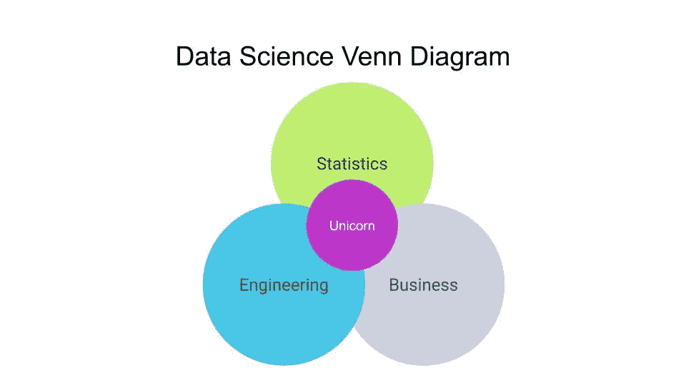
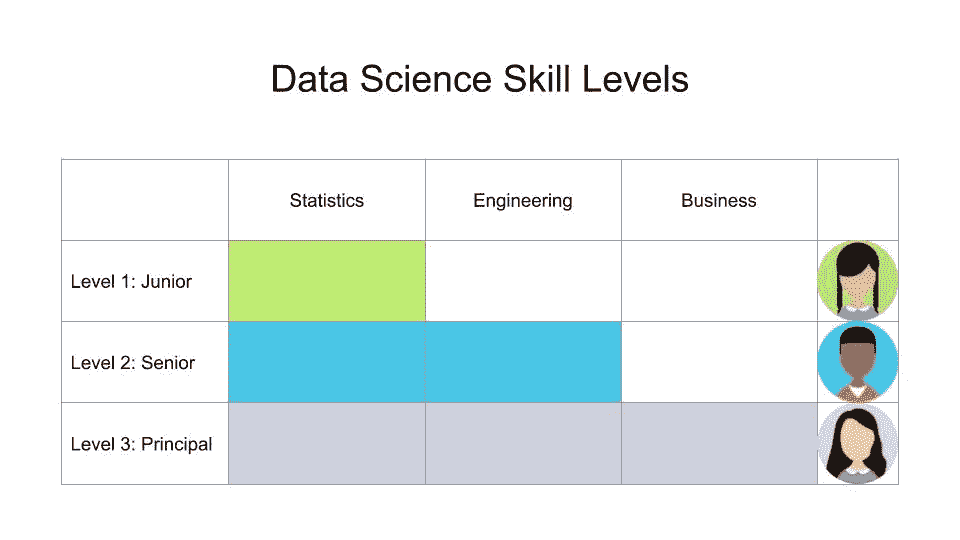
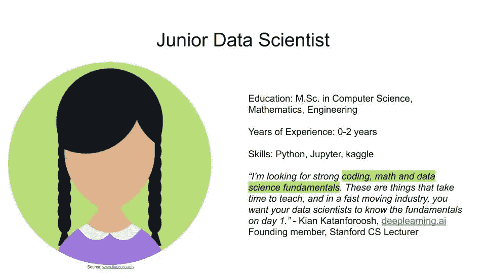
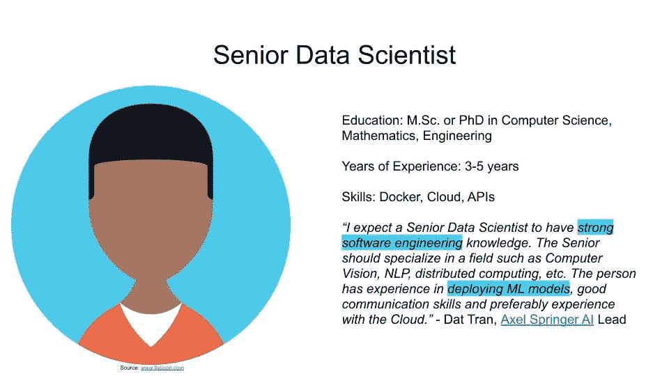
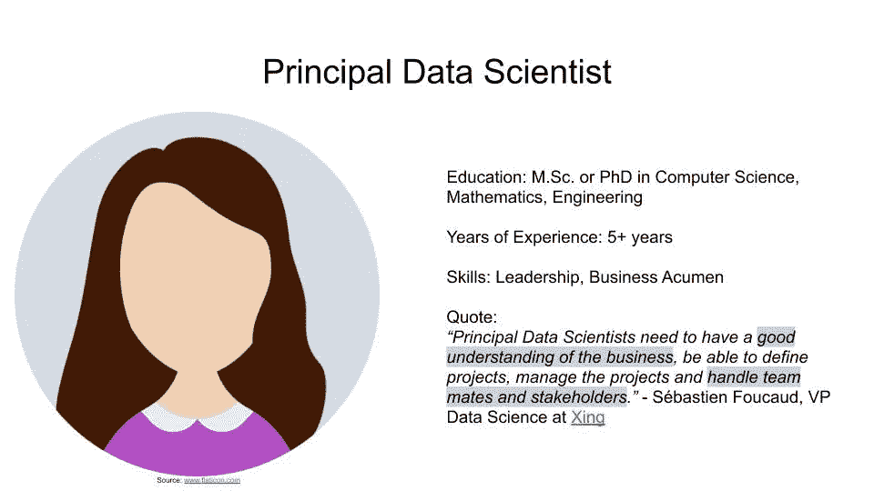

# 成为 3.0 级数据科学家

> 原文：<https://towardsdatascience.com/becoming-a-level-3-0-data-scientist-52641ff73cb3?source=collection_archive---------0----------------------->

## 想成为大三，大四，还是首席数据科学家？了解您需要做些什么来驾驭数据科学职业游戏。

公司正在招聘三个级别的数据科学家:初级、高级或首席。无论您是刚刚开始接触数据科学，还是希望转行，您都不可避免地会发现自己处于这些级别之一。

Photo by [Kelly Sikkema](https://unsplash.com/photos/PgToaHfQjq0?utm_source=unsplash&utm_medium=referral&utm_content=creditCopyText) on [Unsplash](https://unsplash.com/search/photos/high-score?utm_source=unsplash&utm_medium=referral&utm_content=creditCopyText)

这篇文章旨在阐明每个数据科学职业水平范围之外的期望和内容。虽然公司可能有不同的职称，这篇文章提供了一个通用的基线。此外，这篇文章最后给出了一些实用的建议，告诉你如何为进入人工智能或当之无愧的晋升做好准备。

让我们升级吧。🎚

# 数据科学技能矩阵

数据科学家应该具备三个领域的知识:统计、工程和商业。然而，并不期望你一开始就掌握所有这三个领域。在寻求入门级职位时，你应该重点关注哪些技能？随着职业生涯的发展，哪些技能变得越来越重要？

下图显示了从 1.0 到 3.0 的每个数据科学级别的市场预期。这些结果是基于我在该领域的个人经验以及与来自[史丹福](https://profiles.stanford.edu/kian-katanforoosh/)、[、](https://www.productschool.com/blog/product-management-2/ebay-pm-explains-why-you-need-artificial-intelligence-for-product/)、[阿克塞尔·施普林格](https://www.axelspringer.com/en/)和[邢](https://www.xing.com/profile/Sebastien_Foucaud/cv)的专家和有影响力的人的交谈。为避免混淆，我们将这些职位称为 1.0 至 3.0 级。

下面我们就来详细分析一下这些岗位的期望值。

# 初级数据科学家—进入 1.0 级

初级数据科学家的原型是一名年轻的毕业生。热门的研究领域包括计算机科学、数学或工程。初级数据科学家有 0-2 年的工作经验，熟悉用 Python 创建结构化数据集的原型。她参加过 kaggle 比赛，并拥有 GitHub 个人资料。

初级数据科学家可以为公司提供巨大的价值。他们刚刚参加完在线课程，可以立即提供帮助。他们通常是自学的，因为很少有大学提供数据科学学位，因此表现出巨大的承诺和好奇心。他们对自己选择的领域充满热情，渴望了解更多。初级数据科学家擅长构建解决方案的原型，但仍然缺乏对工程和业务思维的熟练程度。

> 初级数据科学家应该对机器学习有强烈的热情。你可以通过参与开源项目或 kaggle 挑战赛来展示你的热情。— [Dat Tran](https://medium.com/u/4ff6d2f67626?source=post_page-----52641ff73cb3--------------------------------) ，Axel Springer AI 领衔

## 他们做什么

如果一家公司正在招聘初级数据科学家，通常数据科学团队已经到位。该公司随后寻求帮助，让更有经验的同事生活得更轻松。这包括快速测试新想法、调试和重构现有模型。你将作为陪练与团队讨论想法。你提出如何把事情做得更好的新想法。您对您的代码负责，不断努力提高代码质量和影响。你是一个优秀的团队成员，总是希望支持你的队友完成构建优秀数据产品的任务。

## 他们不做的事

初级数据科学家没有设计复杂产品解决方案的经验。因此，她在一个团队工作，将数据科学模型投入生产。由于初级数据科学家刚刚加入公司，她并没有沉浸在公司的业务中。因此，预计她不会推出新产品来影响[的基本商业方程式](/business-basics-for-data-scientists-862f116a82da)。但是，一直期待的是学习和提高自己技能的欲望。

> 我对初级数据科学家完成重要项目的能力感兴趣。所谓完成，我的意思是这个项目从头到尾都是由这个人完成的——或者在一个团队中完成的——并最终形成一个完全冲洗出来的产品。我发现这与数据科学家在工作中领导项目的能力相关。—[Kian katanforosh](https://www.linkedin.com/in/kiankatan/)，deeplearning.ai 创始成员，斯坦福 CS 讲师

如果你擅长做一名初级数据科学家，那么你在理解数据科学模型方面有很强的背景。你表现出永不满足的好奇心，想了解工程和公司的业务，以提高自己的技能。

下一关是什么样子的？接下来我们来了解一下资深数据科学家。

# 高级数据科学家—达到 2.0 级

高级数据科学家已经担任初级数据科学家、软件工程师或完成博士学位。他在该领域拥有 3-5 年的相关经验，编写可重用的代码，并在云环境中构建弹性数据管道。

> 高级数据科学家应该能够构建数据科学问题。优秀的候选人从过去的数据科学经验中获得了深刻的见解。我还深入研究了他们编写产品代码的能力。—[Kian katanforosh](https://www.linkedin.com/in/kiankatan/)

公司更愿意雇用高级数据科学家，因为他们以合理的薪水提供巨大的价值。他们比初级数据科学家更有经验，因此省略了代价高昂的[新手错误](/top-5-mistakes-of-greenhorn-data-scientists-90fa26201d51)。他们也不像首席数据科学家那样昂贵，但仍有望在生产中交付数据科学模型。这是一个非常有趣的级别，已经超过了 1.0 级，但仍有增长到 3.0 级的空间。

## 他们做什么

这位资深数据科学家精通将数学模型投入生产的艺术。当首席数据科学家或业务经理分配任务时，高级数据科学家以构建良好架构的产品为荣。他避免模型中的逻辑缺陷，怀疑表现太好的系统，并以正确准备数据为荣。高级数据科学家指导初级数据科学家，并回答管理层的业务问题。

## 他们不做的事

高级数据科学家不需要领导整个团队。高级数据科学家没有责任为新产品出谋划策，因为这些想法是由更有经验的同事和经理提出的。虽然高级数据科学家知道他们构建的产品的细节，但他们并不需要知道所有数据驱动产品的整体架构。与 1.0 级数据科学家相比，2.0 级数据科学家擅长统计，在工程方面也更胜一筹，但却偏离了 3.0 级数据科学家的无趣业务部分。

> 高级数据科学家必须能够将他们的代码投入生产(在数据工程师的支持下)。高年级学生应该能够独立完成交给他们的项目。— [Sébastien Foucaud](https://www.linkedin.com/in/sfoucaud/) ，Xing 数据科学副总裁

高级数据科学家通过他们的模型产生的影响来衡量。他对统计模型的内部运作以及如何实现它们有很好的直觉。他正在更好地了解公司的业务，但预计还不会提供业务问题的解决方案。

Photo by [Carl Raw](https://unsplash.com/photos/8Gdayy2Lhi0?utm_source=unsplash&utm_medium=referral&utm_content=creditCopyText) on [Unsplash](https://unsplash.com/search/photos/game?utm_source=unsplash&utm_medium=referral&utm_content=creditCopyText)

现在我们已经调查了 2.0 级，让我们看看最终的 3.0 级是什么样的。

# 首席数据科学家—残局级别 3.0

首席数据科学家是数据科学团队中最有经验的成员。她拥有 5 年以上的经验，精通各种类型的数据科学模型。她知道将模型投入使用的最佳实践。她知道如何编写计算效率高的代码，并潜伏在周围寻找高影响力的商业项目。

除了她无可挑剔的工程技能和对所使用的科学模型的深刻理解之外，她还非常了解她所在公司的业务。她有利用数据科学影响业务基线的记录。

> 在编写一行代码之前，首席数据科学家需要很好地理解他们正在解决的业务问题。也就是说，他们需要有能力在实施之前验证想法。这种方法提高了数据科学项目的成功率。— [易贝人工智能产品负责人 Adnan Boz](https://www.linkedin.com/in/adnanboz/)

## 他们做什么

首席数据科学家负责创建高影响力的数据科学项目。与利益相关者密切合作，她负责领导一个潜在的跨职能团队，为给定问题提供最佳解决方案。因此，她的领导技能从 1.0 级和 2.0 级开始发展。首席数据科学家充当不同部门产品经理的技术顾问。凭借她在主要数据科学领域的丰富经验和技能，她成为任何项目的宝贵资产。

## 他们不做的事

在引导关于所需技能的讨论时，首席数据科学家不负责招募新的团队成员。尽管她了解自己公司的业务，并建议有影响力的新产品，但产品经理仍然负责市场的采用。她也领导团队，但职业发展决策仍由团队领导做出。

> 首席数据科学家应该独立于数据科学主管指导项目。人们期望这个人获得初步的领导技能，因此，这个人能够清晰地交流、善解人意、善于观察人是很重要的。— [达特兰](https://www.linkedin.com/in/dat-tran-a1602320/)

首席数据科学家已经看到了产品失败的原因，因此她成功地推动了新项目。她是产品讨论的重要贡献者，喜欢在公司开展数据科学教育。凭借其在交付有影响力的数据科学解决方案方面的经验，她是数据科学部门最有价值的资产。

Photo by [Val Vesa](https://unsplash.com/photos/P0F_zH39qhs?utm_source=unsplash&utm_medium=referral&utm_content=creditCopyText) on [Unsplash](https://unsplash.com/search/photos/senior?utm_source=unsplash&utm_medium=referral&utm_content=creditCopyText)

现在，您已经看到了一名数据科学家从 1.0 级到 2.0 级直至 3.0 级的不同期望，让我们看看您如何利用这些知识来推进您的职业生涯。

# 提升您的数据科学职业

无论您是希望进入 1.0 级的数据科学职业游戏，还是希望进入更高的级别，都没有关系。采取以下步骤，开始你的下一次职业生涯。

## 1.评估你的技能

首先，将您的技能与数据科学技能矩阵进行比较。你的统计技能有多扎实？你的工程技术有多好？你有多精通商业？

## 2.计划你的推广

许多公司都有年度晋升周期来提升员工。脸书产品设计副总裁朱莉·卓建议，获得晋升的第一步是实现你的[抱负，提升知名度](https://www.linkedin.com/feed/update/urn%3Ali%3Aactivity%3A6524377847119826944/)。在晋升周期开始时表明，你希望向你的经理推进你的职业发展。询问您的经理，她对您当前的技能组合如何评级，以及您希望达到的下一个数据科学职业水平。

## 3.提高你的技能

一旦你分析了你的技能并宣布了你对升职的渴望，是时候提升你的技能了。

Photo by [Samuel Zeller](https://unsplash.com/photos/rk_Zz3b7G2Y?utm_source=unsplash&utm_medium=referral&utm_content=creditCopyText) on [Unsplash](https://unsplash.com/search/photos/development?utm_source=unsplash&utm_medium=referral&utm_content=creditCopyText)

要不要打入 AI？然后对统计模型了如指掌，并学习如何用结构化数据集解决问题。你希望进入 3.0 级吗？确保你已经掌握了数学、工程和[商业技能](/top-5-business-related-books-every-data-scientist-should-read-6e252a3f2713)。有了这些要点，你就为和你的经理谈判升职做好了充分的准备。

# 关键要点

浏览数据科学职业水平很有趣。请记住以下要点:

*   初级数据科学家拥有良好的统计技能
*   高级数据科学家擅长将模型投入生产
*   首席数据科学家知道如何创造商业价值
*   提升，评估你的技能，宣布你进步的愿望，努力提高你的技能

不同的数据科学职业级别之间存在细微差别。例如，Séb Foucaud 在初级数据科学家中寻找的是强大的工程技术，而不是数学技能。一些高级数据科学家可能会发现他们对构建可伸缩数据管道的热情，并转变为数据工程角色。一些首席数据科学家更喜欢发展技术专长，而其他人则乐于专注于业务技能。无论你走哪条职业道路，围绕数据科学专业知识的三个主要领域发展你的技能都会让你走得更远。

这篇文章是正在进行的教育数据科学家成为商业头脑系列的继续。该系列旨在帮助您完善您的整体数据科学技能。如果你喜欢这种形式，请在 [LinkedIn](https://www.linkedin.com/in/jan-zawadzki/) 或 [Medium](https://medium.com/@janzawadzki) 上**关注**我，了解最新文章。

Photo by [Mirko Blicke](https://unsplash.com/photos/RndRFUz8RS4?utm_source=unsplash&utm_medium=referral&utm_content=creditCopyText) on [Unsplash](https://unsplash.com/search/photos/stairs?utm_source=unsplash&utm_medium=referral&utm_content=creditCopyText)