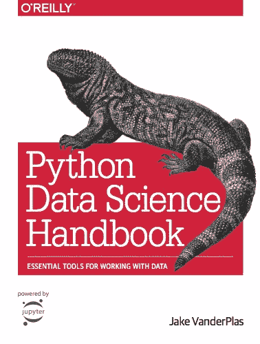
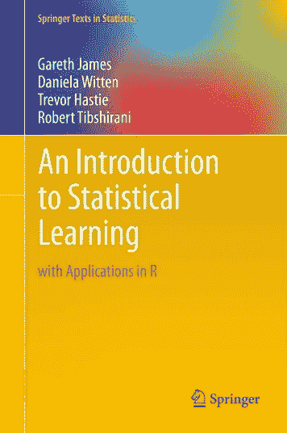
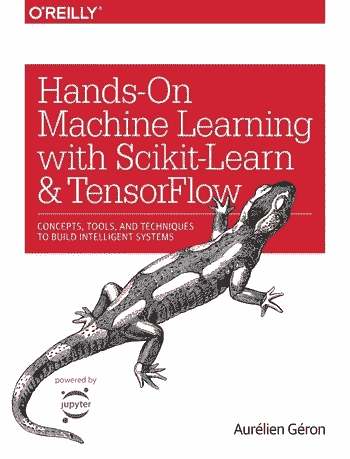

# 成为一名自学成才的数据科学家

> 原文：<https://towardsdatascience.com/becoming-a-self-taught-data-scientist-5563f546bb7b?source=collection_archive---------4----------------------->

数据科学工作被认为是 21 世纪最性感的工作。这是一个大胆的说法，主要是因为我们现在是在 2019 年，所以谁知道就业市场在 50 年后会是什么样子。

Photo by [Alex Radelich](https://unsplash.com/@alexradelich?utm_source=medium&utm_medium=referral) on [Unsplash](https://unsplash.com?utm_source=medium&utm_medium=referral)

然而，如果我们只看过去 15-20 年的职称，那就完全是另一回事了。请继续阅读本文，您将会发现一些进入数据科学领域的最令人惊奇的资源。你是否有其他领域的学位完全无关紧要。

不久前，我发表了一篇关于自学与获得数据科学学位的来龙去脉的文章:

 [## 数据科学:自学与大学

### 哪个选项对你来说是正确的？让我们深入了解一些利弊。

towardsdatascience.com](/data-science-self-taught-vs-college-b5482b68849e) 

那篇文章深入探讨了这两种选择，所以如果您对这个主题感兴趣，可以去看看。然而今天，我想进一步探索**自学路线**，为你提供一些惊人的入门资源。

***这篇文章是写给谁的？***

*   没有任何学位的人
*   那些前一段时间完成大学学业并希望转向数据科学的人

好了，我们不要再在介绍上浪费时间了，现在我们将进入正题。

# 自学是什么意思？

好问题。简而言之，它的意思是，你没有在感兴趣的领域完成任何大学学位(*让我们说数据科学*)，并且你正在感兴趣的领域工作(*再次，数据科学*)，那么你被认为是感兴趣领域的自学者。

你仍然可以自由地完成在线课程和阅读书籍，但是你没有花几年时间在大学课桌后面接受正规教育。

好了，现在，当这个问题解决后，让我们深入了解成为一名自学成才的数据科学家的第一种方式。

# 从 0 路线

如果符合以下条件，您将属于此类别:

*   你没有大学学位
*   你的数据和编程知识水平很低或者根本不存在

Photo by [Annie Spratt](https://unsplash.com/@anniespratt?utm_source=medium&utm_medium=referral) on [Unsplash](https://unsplash.com?utm_source=medium&utm_medium=referral)

***那么应该怎么做呢？这是一个很难回答的问题。开始时，你需要掌握基础知识，也就是数学和统计技能。是的，你需要学习如何编码，最好是用 **Python** 。***

不久前，我写了一篇文章，列出了进入这个领域所需的每一个先决条件的我最喜欢的资源:

 [## 终极数据科学必备学习清单

### 查看学习线性代数、微积分、统计、概率和编程的最佳位置。

towardsdatascience.com](/the-ultimate-data-science-prerequisite-learning-list-348ce89805f9) 

我知道这很难，但没人说这很容易。花些时间了解基本情况。你不必手动进行大量的计算，一个坚实的视觉理解应该绰绰有余。

我不建议用手做大量的计算，原因之一是计算机很容易做到。对于计算机来说，困难的是将问题框定，并知道在哪些情况下该做什么(*不，我不是在说条件语句*)。这就是为什么数学和统计的可视化方法是一座金矿。

如果你花时间深入学习数学、统计和编程，我会说，你和几年前在大学里听过这些话题的人一样，都处于开始学习真正的数据科学的有利位置(*数学大学的学生不包括在内*)——因此**大学毕业的人绝不比你强**——至少在数据科学方面。

所以这是从 0 路线。现在，让我们在深入研究资源之前探索另一条路线。

# 转行路线

转行可能会很艰难。你可能已经在一个领域工作了几年，并认为它不适合你。这很好。也许你厌倦了，也许这份工作不够激励人……原因不胜枚举，我不想讨论。

你想尽快做的是**诚实地评估你的数学和统计技能**。我说真的。承认你对 10 年前听过的话题生疏了并不丢人。

如果您对以下主题的理解没有 100%的把握:

*   线性代数
*   结石
*   可能性
*   统计数字
*   编程；编排

回头参考[这篇文章](/the-ultimate-data-science-prerequisite-learning-list-348ce89805f9)，选择适合你需求的资源——无论是书籍还是在线课程。

***好了，都盖好了吗？*** 您可以进行我个人的资源选择。

# 自学成才的数据科学家的资源

因此，无论出于何种原因，大学都不是一个选项，但你可以每天花一两个小时来探索数据科学世界。下一步将因人而异，这在很大程度上取决于你是一个书人还是一个视频人。我更喜欢看视频——我只是不想在 8 小时轮班后看书。

我将简单地从我个人最喜欢的开始——**我第一次接触数据科学**:

 [## Python 用于数据科学和机器学习训练营

### 您准备好开始成为数据科学家的道路了吗！这门综合课程将成为你学习的指南…

www.udemy.com](https://www.udemy.com/course/python-for-data-science-and-machine-learning-bootcamp/) 

何塞是一个了不起的教练。有一个对基本 Python 库的快速复习，很快你就会用 *Pandas* 和 *Numpy* 进行数据分析，用 *Matplotlib* 和 *Seaborn* 进行一些数据可视化。是的，你会做**机器学习**。不多，也不深入，但足以让你开始。

如果你更喜欢书，那么我推荐这本书:

它叫做 [*Python 数据科学手册*](https://www.amazon.com/Python-Data-Science-Handbook-Essential/dp/1491912057) ，大约 550 页长，涵盖了与视频课程相同的概念——*Numpy*、 *Pandas* 、 *Matplotlib* 和*Scikit-Learn*——所有这些对数据科学都至关重要。

一旦你完成了基础，是时候**深入**机器学习了。我有两本很棒的书推荐，其中一本是免费的。让我们开始吧。

[*统计学习简介*](https://www.ime.unicamp.br/~dias/Intoduction%20to%20Statistical%20Learning.pdf) 很神奇，也是一本更深入学习机器学习的免费书籍。它有时有点数学化，但易于阅读。对于像机器学习这样广泛的领域来说，它在保持 400 页左右的内容简洁方面做得非常好。唯一的缺点是代码是用 **R** 写的，不是 Python。但是，嘿，试着把 R 代码“翻译”成 Python 代码，这肯定会是一个很好的练习。

我推荐的下一本书叫做 [*用 Scikit-Learn 和 Tensorflow*](https://www.amazon.com/Hands-Machine-Learning-Scikit-Learn-TensorFlow/dp/1491962291/) 进行机器实践学习。如果我没记错的话，大约有 700 页，但是这是一本好书。你也将深入学习一些深度学习概念，你也将更深入地研究机器学习算法。

你不会因为选择一个或另一个而出错，它们都会很好地为你服务。

对于在线课程，我不得不推荐唯一的 Coursera 的机器学习课程，先生，如果你不懂也不用担心，吴恩达。已经 10 周多了，如果你的基础不稳固，很快就会变得艰难。但是，嘿，来自 12 万用户的 4.9 分的平均评分确实说明了一些问题。

 [## 机器学习|课程

### 机器学习是让计算机在没有明确编程的情况下行动的科学。在过去的十年里…

www.coursera.org](https://www.coursera.org/learn/machine-learning) 

这些实验不是用 Python 写的，甚至不是用 R 写的，这些实验是用 Matlab 的免费版本写的，叫做 **Octave** ，所以这是需要考虑的事情。

# 后续步骤

你已经浏览了书籍或课程(*或两者都有*)，现在你想知道下一步该做什么。这将根据你的情况而有所不同，但理想情况下，你应该建立一个 **GitHub** 档案。

**找到 5 个好的数据集，尽力而为。做广泛的分析，在 markdown 单元格中写下结论和思考过程，制作一个自述文件，你知道，全身心地投入其中。**

这是必要的，原因有二:

*   你在练习新学到的技能
*   你在向潜在员工展示你产生高质量代码和结论的能力

关于阶梯，**让潜在雇主看到你最好的工作很重要**。你没有大学学位，至少没有相关的学位，所以你需要向他们展示你知道如何完成工作。GitHub 是一条路要走。

花一两个月的时间，做一些让你自豪的事情。

*喜欢这篇文章吗？成为* [*中等会员*](https://medium.com/@radecicdario/membership) *继续无限制学习。如果你使用下面的链接，我会收到你的一部分会员费，不需要你额外付费。*

 [## 通过我的推荐链接加入 Medium-Dario rade ci

### 作为一个媒体会员，你的会员费的一部分会给你阅读的作家，你可以完全接触到每一个故事…

medium.com](https://medium.com/@radecicdario/membership)