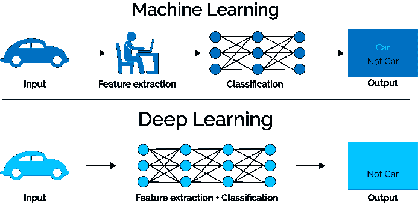
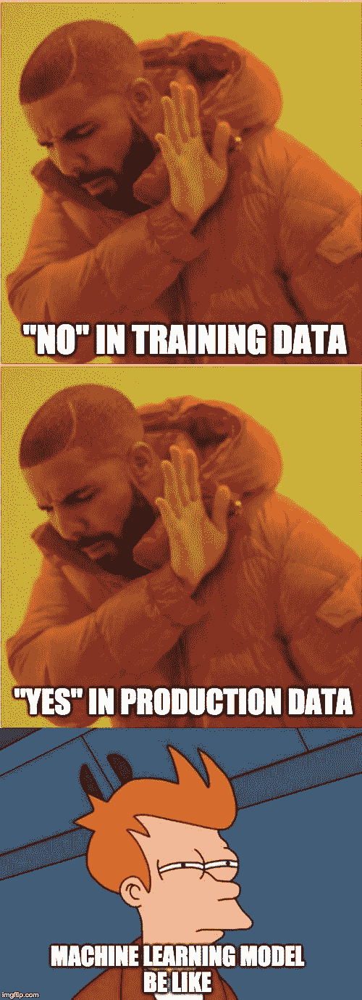
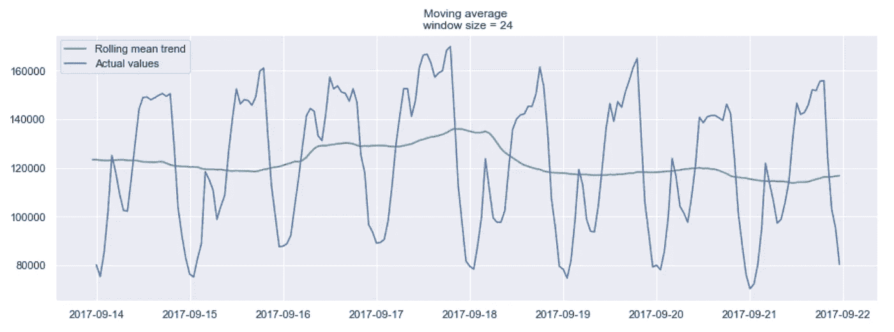

# 机器学习流水线监控初学者指南

> 原文：<https://towardsdatascience.com/beginner-guide-to-machine-learning-pipeline-monitoring-aba2af444155?source=collection_archive---------18----------------------->

## 在机器学习管道的开发中，这是一个讨论较少但很重要的话题

许多公司正在使用 power machine learning 在应用程序的前端和后端提供预测、推荐或分类。来自 [The Verge](https://www.theverge.com/2019/1/28/18197520/ai-artificial-intelligence-machine-learning-computational-science) 的一份报告称，“最终，几乎所有东西都将在内部的某个地方拥有(机器学习)。”然而，将机器学习模型构建和部署到机器学习管道并不是开发周期的结束。机器学习模型需要随着时间的推移进行监控和调整，以确保模型不会遇到意想不到的问题，并且在性能上是有效的。下面的流程图很好地说明了机器学习模型的开发周期，以及性能监控如何融入其中，以及人在回路中如何将强化学习带回模型。一篇关于“什么是机器学习？”可以在这篇牛逼的[文章](/not-yet-another-article-on-machine-learning-e67f8812ba86)上找到。

*Source:* [*http://towardsdatascience.com/not-yet-another-article-on-machine-learning-e67f8812ba86*](/not-yet-another-article-on-machine-learning-e67f8812ba86)

机器学习模型的开发涉及许多步骤，每个步骤都需要不同的技能和知识来执行。本文将关注机器学习开发中一个较少讨论的领域，即机器学习流水线的性能监控。

机器学习管道监控可以分为两个部分:

1.  ETL 监控
2.  分数监控

简而言之，ETL 监控关注的是进入模型之前的数据，而 Score 监控关注的是模型的输出。总之，数据科学家可以看到数据和他们的模型行为之间的相关性。这种理解对于确定需要改进的领域和检测管道中的故障至关重要。本文将关注 ETL 监控。

# 机器学习流水线的 ETL 监控

机器学习管道中要监控的第一个领域是特征提取过程，在此过程中，输入数据在输入到机器学习模型进行分类之前被转换为数字特征。然而，深度学习模型可能不会将特征提取作为一个独立的过程，如下图所示。为了不混淆观众，这一部分将只关注传统的机器学习模型，如随机森林，它将特征提取作为过程中的一个独立步骤。

*Source:* [*https://towardsdatascience.com/cnn-application-on-structured-data-automated-feature-extraction-8f2cd28d9a7e*](/cnn-application-on-structured-data-automated-feature-extraction-8f2cd28d9a7e)

当我们在数据进入模型之前查看数据时，ETL 监控并不是真正的性能监控，而是防止坏数据进入模型的保护措施。损坏的数据或不寻常的模式会扰乱模型，导致混乱的分类。换句话说，“垃圾进，垃圾出。”

一些数据科学项目从他们的内部操作中获取数据，这使得输入变得清晰、结构化和可解释。然而，机器学习项目通常应用于野生数据源，因为简单的基于规则的算法无法用于处理它们。例如，日志文件、用户生成的内容、第三方供应商和开放数据。这些公司对数据如何生成、何时可用以及模式会发生什么变化的控制力度较小。

使用外部数据源的风险在于，数据的模式或模式可能会在没有通知或团队意识到的情况下随时间而改变。例如，有人可能破坏开放的数据，内容生成的方法可能改变，或者供应商可能在没有通知下游用户的情况下改变数据的模式。上述原因可能会威胁到 ML 模型的性能，如果忽视太久，会产生严重的问题。

为了有效地监控 ETL 过程，防止关键数据问题影响模型及其性能；数据的**完整性**、**一致性**和**可用性**是选择 ETL 监控度量时需要考虑的三个方面。

# 完整

有许多原因会危及数据的完整性。其中一些是:

*   数据管道中的错误
*   基础设施中的软件更新
*   数据源的日常维护
*   外部方对数据的破坏
*   数据源中数据模式的变化

通过创建全面的验证规则来捕捉和报告异常，可以监控数据的完整性。验证规则通常在探索性数据分析和模型训练期间制定。例如，可以使用的一些度量是缺失或看不见的特征的数量，或者未通过每个验证规则的数据点的比率。

即使数据科学家会将损坏的数据排除在模型之外，也必须监控数据问题的大小和严重性，以便衡量数据源的可靠性，并开发新的规则来持续验证数据完整性。

# 一致性

ETL 监控指标的第二个原则是数据的一致性。一致性非常重要，因为数据点可能会通过验证规则，但要素中的值可能会与模型的训练历史有很大不同。影响数据完整性的原因也会影响数据的一致性。但在用户生成数据的情况下，由于用户在平台上互动方式的转变，一致性的变化也可能有机地发生。

不一致的数据会影响 ML 模型的性能，因为它会改变为其训练模型的数据模式。下面的可视化说明了为什么数据的不一致性会破坏 ML 模型的性能。

为了监控一致性，可以导出数据的量、变化率或单个值，以便针对将被监控的指标进行汇总。然后，聚合值成为时间序列中的数据点，其中 X 轴是时间，Y 轴是用于聚合每个批次或时间窗口中的数据的测量值(取决于数据是以批次还是以流的形式出现)。

Time Series Data Example

有许多测量变量可用于表示数据的分布和偏斜度，如方差和百分位数。根据我的经验，我发现均值和标准差是最有效的度量组合。该组合配合使用效果最佳，因为平均值显示的是中心点，而标准偏差显示的是分布范围。下图显示了均值和标准差如何表示不同的分布。

Source: [https://www.varsitytutors.com/hotmath/hotmath_help/topics/normal-distribution-of-data](https://www.varsitytutors.com/hotmath/hotmath_help/topics/normal-distribution-of-data)

让我们用一个真实的例子来解释一下。我们建立了一个 ML 模型，根据社会经济数据来预测人口的预期寿命。其中一个特征是收入，我们每年批量获取数据。因此，我们将找到人口收入的均值和标准差，并逐年进行比较，以分析收入分布的一致性。如果 2017 年的收入均值或标准差与 2018 年有很大不同，并且该模型是根据 2017 年的数据训练的，则表明模式已经改变，预测可能不如训练和测试时准确。用 2018 年的数据重新调整模型也是一个好主意，我将在未来的帖子中谈到这个话题。

# 有效性

可以说，数据的可用性是监控管道时要考虑的最重要的方面。当管道从团队无法控制的数据源(如第三方供应商或开放数据)获取数据时，这一点尤其重要。如果没有数据输入，ML 管道就像一条废弃的铁轨，建设管道的投资就会损失。

数据的可用性可能不会影响 ML 模型的精度，但它会影响 ML 管道的整体性能，因为没有数据输入(或延迟输入)就无法实现业务目标。可用于监控数据可用性的 KPI 示例如下:

*   每批数据之间的延迟时间
*   管道中没有数据的总分钟数、小时数或天数
*   数据交付落后于计划的次数

了解上述指标有助于数据科学团队确定需要改进的领域，并在数据不可用时得到通知。如果有多个数据源进入管道，这些指标将帮助团队了解每个数据源的可靠性，以便将问题或顾虑传达给正确的团队。

文章到此结束！我希望您现在知道如何监控数据的完整性、一致性和可用性，以及为什么它们对机器学习管道的性能至关重要。

我将在下一篇文章中继续发布机器学习管道监控的第二部分，也就是分数监控。您可以关注我，获取更多关于性能监控和数据可视化相关主题的文章。谢谢你读到这里，我希望你喜欢这篇文章！