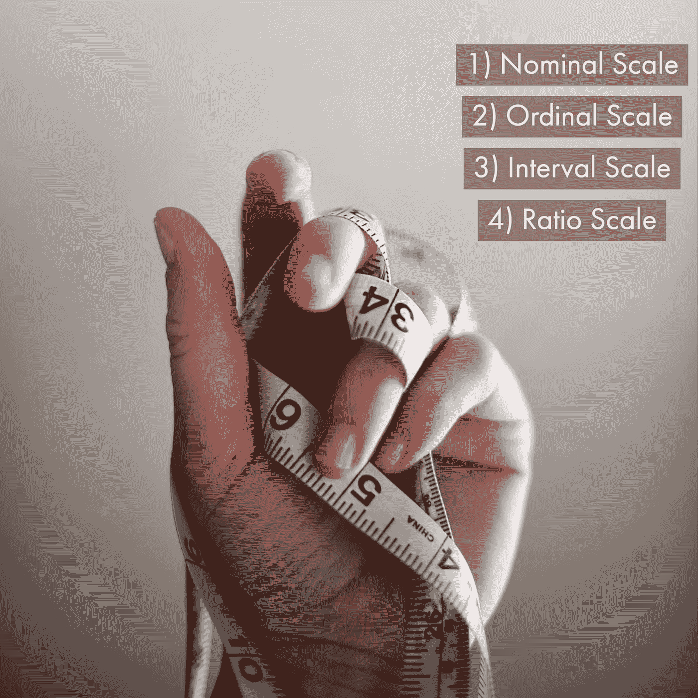

# 初学者指南:数据类型及其度量尺度

> 原文：<https://towardsdatascience.com/beginners-guide-data-types-and-their-measurement-scale-194033b86b6d?source=collection_archive---------17----------------------->

## 数据类型简介

数据有一个重要的故事要讲。他们依靠你给他们发言权。

在你给他们发言权之前，你必须理解不同的数据类型。根据数据的收集方式或结构，有不同的方法对数据进行分类。

基于数据收集:根据数据收集的方式，数据可以分为三种类型。

1.  **横截面数据**:在一个特定的时间段内，在多个变量上捕捉到的任何数据点/值称为横截面数据。例如:员工的属性，如年龄、工资、级别、2019 年的团队。
2.  **时序数据**:单个变量在多个周期内捕获的任何数据点/值称为时序数据。例如:每月、每季度、每年的智能手机销量。
3.  **面板数据**:截面数据和时间序列数据的组合称为面板数据。不同时期不同国家的 GDP。

基于结构。对数据进行分类的另一个重要方法是基于数据的结构。它可以分为两种类型。

1.  **结构化数据**:所有具有特定结构并能以表格形式(也称为矩阵)排列成行和列的数据点称为结构化数据。例如:用员工 id 安排的员工的工资。
2.  **非结构化数据**:所有没有排列成任何表格格式的数据点都是非结构化数据。例如:电子邮件、视频、点击流数据等。

*70%的可用数据是非结构化数据，在分析或构建任何分析模型时，必须将非结构化数据转换为结构化数据。*

*数据分析领域的大多数初学者面临的另一个问题是，即使结构化数据可用，如何处理它，如何使用它，如何测量它，以及如何从中推断出见解。*

*对于所有这些，测量尺度变得很重要。人们必须意识到，如果结构化数据可用，我们如何测量它们，以及如何根据测量来区分它们。*

*根据测量尺度，数据可以分为四个部分。*

**

1.  ***名义规模**:所有定性的数据点都属于这个范畴。这些也被称为分类变量。婚姻状况(单身、已婚等。).不能对这些变量执行任何算术运算(加、减、乘或除)。*
2.  ***有序尺度**:有序集合中的所有数据点都属于这个范畴。例如:1-5 分等级(5 分最高，1 分最低)。这里集合的顺序是固定的，但是不能执行算术运算，例如我们知道，等级 4 比等级 2 好，但是两个等级 2 不能等于等级 4。*
3.  ***区间尺度**:从某个固定区间集合中取出的所有数据点。例如:温度(摄氏度)，智商水平。在这样的变量中，可以执行加法或减法，但是除法没有意义。你可以说孟买比班加罗尔高 10 摄氏度，但你说孟买比班加罗尔热两倍是不对的，因此这里的比率没有意义。*
4.  ***:所有本质上是定量的数据点都属于这一类。产品的销售，员工的工资等。在这里，所有的算术运算都可以执行，并且可以进行比较，因为 Ram 的收入是 Shyam 的两倍，因此比率是有意义的。***

***因此，通过查看数据，可以推断出哪种数据是可用的，如名义数据、序数数据等。这最终有助于数据分析师/科学家构建任何分析模型，以了解不同的变量，进行探索性数据分析，进行数据插补，并执行一次性编码。***

***它不仅在预测分析中变得重要，而且在描述分析中也很有帮助。如果没有关于数据类型的信息，就无法进行探索性数据分析。一旦你确定了数据的类型，然后进行大量的单变量和双变量分析、可视化和计算，如均值、众数、中位数等。可以从数据中推断洞察力。***