# 在 TensorFlow 中构建神经网络的初学者指南

> 原文：<https://towardsdatascience.com/beginners-guide-to-building-neural-networks-in-tensorflow-dab7a09b941d?source=collection_archive---------12----------------------->


## TensorFlow 2.0 初学者笔记本的详细演练

如果你正在阅读这篇文章，你可能已经对神经网络和张量流有所了解，但你可能会对与深度学习相关的各种术语感到有些畏惧，这些术语在许多技术介绍中往往被掩盖或无法解释。本文将通过深入演练 TensorFlow 2.0 的初学者教程来阐明其中的一些主题。

这个指南是基于 TensorFlow 2.0 [初学者笔记本](https://www.tensorflow.org/alpha/tutorials/quickstart/beginner)的，我推荐看一看它并在 Google Colab 中运行它(它只有 16 行代码！)来最大化你对这里所涵盖的材料的理解。

注意:鉴于这是一个初学者指南，这里表达的大多数观点应该有一个较低的入门门槛，但是对什么是神经网络有一些背景知识将是有帮助的。[这篇文章](https://becominghuman.ai/making-a-simple-neural-network-2ea1de81ec20)提供了一个很好的概述，以防你想温习一下。

# 你会学到什么

阅读本文后，您将对一些关键的概念性主题以及这些主题的 TensorFlow/Keras 实现有更好的理解(Keras 是一个基于 TensorFlow 构建的深度学习库)。

**概念性:**

*   神经网络层形状
*   激活功能(如 Relu 和 Softmax)
*   逻辑
*   拒绝传统社会的人
*   优化者
*   失败
*   纪元

**张量流/Keras 函数:**

*   tf.keras.layers.Sequential()
*   tf.keras.layers.Flatten()
*   tf.keras.layers.Dense()
*   模型.编译()
*   model.fit()

# 数据

TensorFlow 2.0 初学者教程使用的数据是 MNIST 数据集，它被认为是一种“你好，世界！”用于神经网络和深度学习，并且可以直接从 Keras 下载。它是一个数据集，充满了从 0 到 9 的手绘数字，并有相应的标签来描述绘图应该描绘的数字。

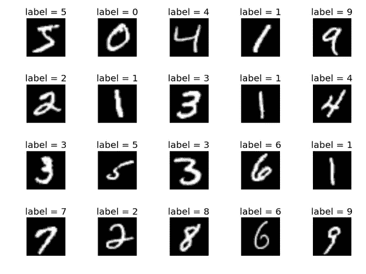

Example observations from MNIST dataset [1]

使用这个数据集背后的想法是，我们希望能够训练一个模型，该模型能够学习哪种形状对应于数字 0-9，并随后能够正确标记它尚未训练过的图像。当将如下图所示的图像传递给模型时，这项任务变得更加复杂。有些人甚至会把这张图误认为是零，尽管它被标为八。

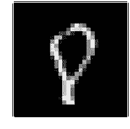

Example an ambiguous image from MNIST (index 3570 of training set)

在高层次上，初学者教程中构建的模型将训练图像作为输入，并尝试将这些图像分类为 0-9 之间的数字。如果它做出了不正确的预测，它将进行数学调整，以更好地预测类似的图像。一旦模型完成训练，它将在没有训练过的图像上进行测试，以获得模型表现如何的最终评估。

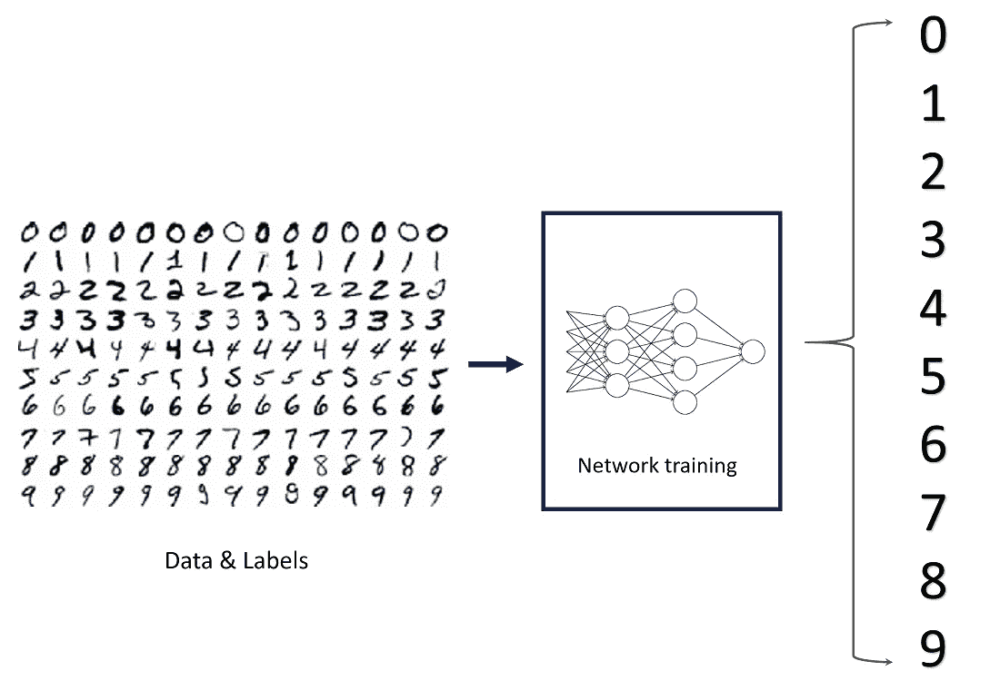

Basic structure of the neural net built in the beginner notebook

# 了解初学者笔记本

现在让我们深入探讨一下 TensorFlow 是如何实现这个基本的神经网络的。

## 加载数据

在第一个单元格中完成一些设置后，笔记本开始使用其`load_data()`函数从 Keras 库中加载 MNIST 数据集，该函数返回两个元组，如代码所示。文档可以在[这里](https://www.tensorflow.org/api_docs/python/tf/keras/datasets/mnist/load_data)找到。

```
mnist = tf.keras.datasets.mnist
(x_train, y_train), (x_test, y_test) = mnist.load_data()
```

当我们探究 TensorFlow 如何处理这些数据时，理解这些数据的实际情况会很有帮助。

```
>>> x_train.shape
(60000, 28, 28)>>> y_train.shape
(60000,)>>> x_test.shape
(10000, 28, 28)>>> y_test.shape
(10000,)
```

查看这些结果，我们可以看到数据集中总共有 70k 个图像，60k 个训练和 10k 个测试。两个 28 表示每个图像是 28 像素乘 28 像素，并且图像被表示为填充有像素值的 28×28 阵列，如在下面的可视化中可以看到的。

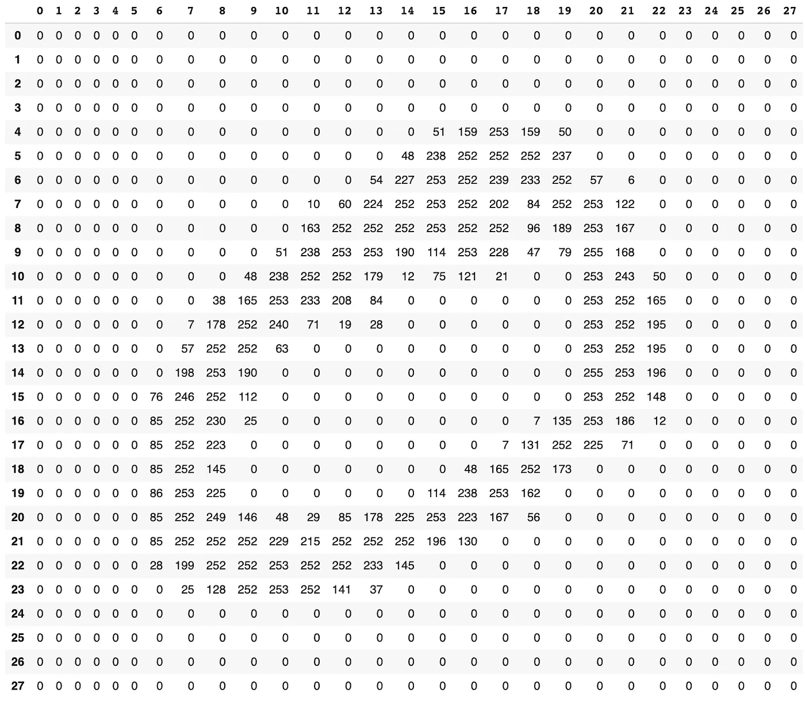

Depiction of how each image is stored in the MNIST dataset

笔记本电脑准备数据的最后一步是将每个图像中的每个像素值转换为 0.0-1.0 之间的浮点数。这样做是为了帮助在为每幅图像生成预测时所涉及的数学比例。

```
x_train, x_test = x_train / 255.0, x_test / 255.0
```

## 构建模型结构

也许这个笔记本最令人困惑的部分是创建模型结构的部分。

```
model = tf.keras.models.Sequential([
  tf.keras.layers.Flatten(input_shape=(28, 28)),
  tf.keras.layers.Dense(128, activation='relu'),
  tf.keras.layers.Dropout(0.2),
  tf.keras.layers.Dense(10, activation='softmax')
])
```

这个代码的目的是指定什么样的层将出现在我们的神经网络中。第一部分是`tf.keras.models.Sequential()`调用。这个函数所做的就是开始创建层的线性(或“顺序”)排列。上述代码片段中的所有其他代码详细说明了模型中的层以及它们的排列方式。

下一行代码`tf.keras.layers.Flatten(input_shape=(28,28))`创建了我们网络的第一层。直观地说，我们希望能够使用图像中的所有信息来预测它是什么数字，因此输入层应该为图像中的每个像素提供一个节点。每个图像有 28*28 =784 个值，因此`Flatten()`创建了一个有 784 个节点的层，包含给定图像的每个像素值。如果我们有每个像素包含 3 个值(RGB 值)的彩色图像，那么`Flatten()`将创建一个 28*28*3 = 2352 个节点的层。

我们在模型中看到的另一种层是使用`tf.keras.layers.Dense()`创建的，它创建了所谓的全连接或密集连接层。这可以与稀疏连接层进行比较，区别在于信息如何在相邻层的节点之间传递。

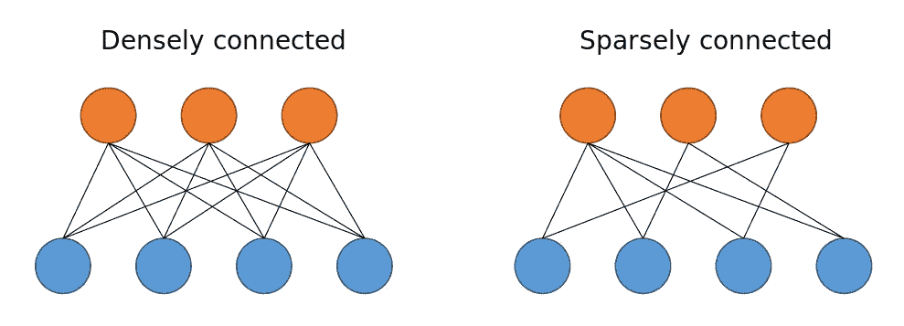

Comparison between dense and sparse connectivity (image from [Amir Alavi’s](https://amiralavi.net/blog/2018/07/29/vnn-implementation) blog)

您可以看到，在密集连接的层中，一层中的每个节点都连接到下一层中的每个节点，而在稀疏连接的层中，情况并非如此。因此`Dense()`所做的是创建一个完全连接到它前面的层的层。第一个参数(第一个实例中为 128)指定层中应该有多少个节点。隐藏层(不是输入或输出层的层)中的节点数量有些随意，但需要注意的一点是，输出层的节点数量等于模型试图预测的类的数量。在这种情况下，模型试图预测 10 个不同的数字，因此模型中的最后一层有 10 个节点。这是至关重要的，因为最终层的每个节点的输出将是给定图像是特定数字的概率。

为了理解这个片段中的其余代码，我们需要理解激活函数和 dropout。

**激活功能**

尽管神经网络的布局和结构很重要，但最好记住，在一天结束时，神经网络所做的是大量的数学运算。每个节点获取前一层中节点的值，并计算它们的加权和，产生一个称为 logit 的标量值。就像人类大脑中的神经元在受到某些输入的刺激时如何“激发”,我们必须指定网络中的每个节点(有时也称为神经元)在受到某些输入时如何“激发”。这就是激活函数的作用。它们取 logits，即上述加权和的结果，并根据正在使用的功能将它们转换为“激活”。

一个常见的激活函数，也是我们网络中第一个`Dense()`层使用的激活函数，称为“ReLU”，是整流线性单元的缩写。

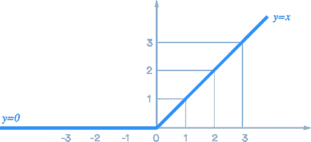

ReLU activation function

ReLU 所做的是激活任何负逻辑 0(节点不触发)，同时保持任何正逻辑不变(节点触发的强度与输入的强度成线性比例)。要了解更多关于 ReLU 的能力以及它为什么有用的信息，请查看本文。

另一个常见的激活函数，也是在`Dense(),`的第二个实例中使用的函数，称为“softmax”。

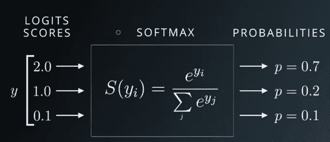

Udacity Deep Learning slide on softmax

如上图所示，softmax 采用前一层激活的加权和计算出的逻辑值，并将它们转换为总和为 1.0 的概率。这使得它成为在我们的输出层中使用的一个非常有用的激活函数，因为它为图像是特定数字的可能性提供了易于解释的结果。

有许多其他的激活功能，决定使用哪一个通常是一个实验或启发式判断(或两者兼有)的问题。其他一些激活功能的概述可以在[这里](https://medium.com/the-theory-of-everything/understanding-activation-functions-in-neural-networks-9491262884e0)找到(如果你不理解为什么激活功能首先是必要的，我推荐你读一读)。

**辍学**

到目前为止，我们检查的代码片段中最后一个无法解释的部分是对`tf.keras.layers.Dropout()`的调用。dropout 的概念可以追溯到之前对层的连通性的讨论，并且与密集连接的层的一些缺点有关。密集连接层的一个缺点是，它可能导致计算非常昂贵的神经网络。随着每个节点向下一层中的每个其他节点发送信息，在每个节点中计算的加权和的复杂度随着每层中节点的数量而指数增加。另一个缺点是，随着如此多的信息从一层传递到另一层，模型可能会过度适应训练数据，最终影响性能。

这就是辍学的原因。Dropout 使得给定层中的一些节点不会将其信息传递给下一层。这有助于计算时间和过度拟合。所以在初学者笔记本中，两个`Dense()`层之间的`Dropout(0.2)`调用使得第一个`Dense()`层中的每个节点有 0.2 的概率从下一层的激活计算中被丢弃。您可能已经意识到，这实际上使模型中的输出层成为了一个稀疏连接的层。

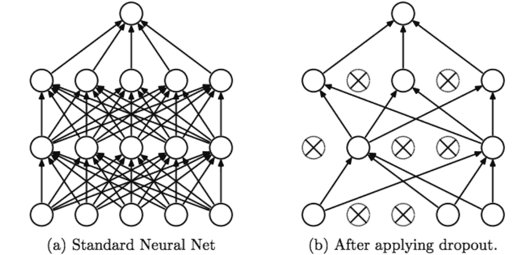

Srivastava, Nitish, et al. ”Dropout: a simple way to prevent neural networks from
overfitting”, JMLR 2014

既然我们已经理解了模型的所有组件，让我们利用`model.summary()`函数，对我们的网络结构进行一次健全性检查。

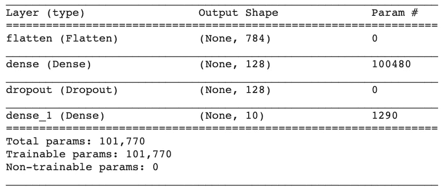

在仔细检查了输出形状之后，一切看起来都很好，所以现在让我们继续编译、训练和运行模型吧！

## 编译、训练和运行神经网络

现在我们已经指定了我们的神经网络的样子，下一步是告诉 Tensorflow 如何训练它。

**编译模型**

我们将在本节中检查的代码片段如下:

```
model.compile(optimizer='adam',
              loss='sparse_categorical_crossentropy',
              metrics=['accuracy'])
```

在一个预先构建的模型上调用`model.compile()`函数，它指定了*损失函数、优化器和度量标准，*每一个都将被解释。这些是神经网络如何产生其最终预测的重要特征。

**损失函数** 在本指南的开头，提到了在一个高层次上，初学者笔记本中建立的模型将学习如何将某些图像分类为数字，它通过进行预测来做到这一点，查看其预测与正确答案的差距，然后更新自身以更好地预测这些类型的数字。损失函数是模型的一部分，用于量化预测与正确答案的差距。不同类型的模型需要不同类型的损失函数。例如，像这样一个问题的损失函数，其中我们的模型的输出是概率，必须与试图预测美元价格的模型的损失函数非常不同。这个特定模型的损失函数是“稀疏分类交叉熵”,这对于像这样的多类分类问题是很好的。在我们的例子中，如果模型预测一个图像只有很小的概率成为它的实际标签，这将导致很高的损失。

**优化器**

另一种表达训练一个模型实际意义的方式是，它寻求*最小化损失。*如果损失是预测与正确答案相差多远的度量，并且更高的损失意味着更不正确的预测，则寻求最小化损失是确定模型表现如何的可量化方式。如前所述，训练神经网络的一个关键部分是根据这些参数在图像分类中的有效性来修改网络节点的数学参数。在称为*反向传播的过程中，*神经网络使用称为*梯度下降*的数学工具来更新参数以改进模型。这些术语的细节在一定程度上超出了本指南的范围，但是为了理解初学者笔记本正在做什么，函数`model.compile()`的优化器参数指定了一种使反向传播过程更快更有效的方法。“adam”优化器是一种常用的优化器，可以很好地解决这个问题。

**指标**

`model.compile()`函数的最后一部分是指定在评估模型时应该使用的指标。准确性是一个有用的，但不完美的度量标准，用于衡量模型性能，它本身应该谨慎使用(关于为什么是这样以及其他一些潜在的度量标准，您可以看看[这篇文章](/hackcvilleds-4636c6c1ba53))。

## 训练模型

最后是实际训练模型，使用 TensorFlow 2.0，这很容易做到。

```
model.fit(x_train, y_train, epochs=5)
```

这行代码非常直观，传递训练数据和该数据的正确标签。`model.fit()`函数中的 epoch 参数是模型看到所有训练数据*的次数。我们希望模型多次查看所有定型数据的原因是，在计算加权和以显著提高预测能力时，一次遍历可能不足以让模型充分更新其权重。*

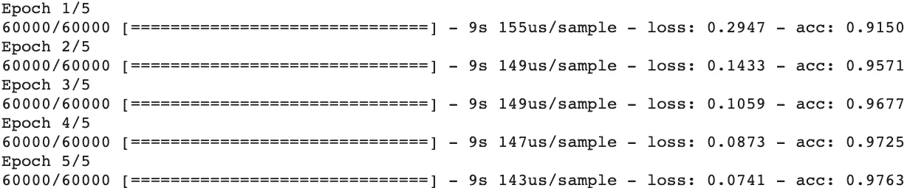

Results from training the model with 5 epochs

运行这段代码，您可以看到在每个时期，模型都遍历了训练集中的所有 60k 个图像。您还可以看到，随着每个时期，损失会减少，准确性会提高，这意味着该模型在每个时期对数字进行分类的能力会越来越强。

## 评估模型

最后，使用`model.evaluate(x_test, y_test)`，我们可以预测我们的测试集的类，看看我们的模型表现如何。

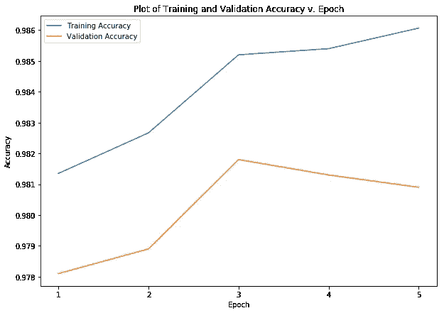

该图显示，尽管训练准确度随着我们训练的时期越多而不断上升，但验证准确度开始趋于平稳或下降，这表明我们可能不需要训练超过 5 个时期。

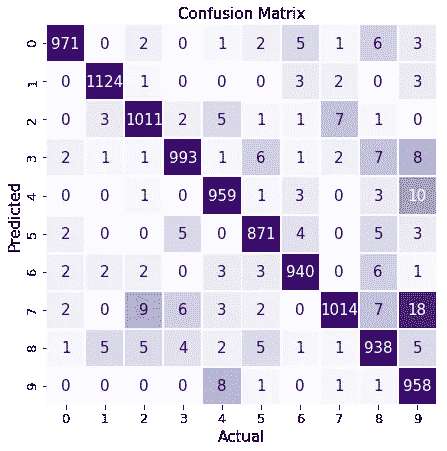

Confusion matrix for our neural net

为了更详细地评估模型的表现，我们可以构建一个混淆矩阵。从这个混淆矩阵中我们可以看出，我们的模型最难处理 9，并且容易将它们与 7、4 或 3 混淆。

# 结论

恭喜你！您已经完成了 TensorFlow 2.0 初学者笔记本指南，现在对神经网络层、激活函数、逻辑、下降、优化、损失函数和损失以及纪元的形状有了更好的理解。您还熟悉了如何使用 TensorFlow/Keras 实现这些概念！对于更多的实践，我建议尝试本指南中讨论的不同参数，看看它们对模型性能有什么影响。快乐造型！