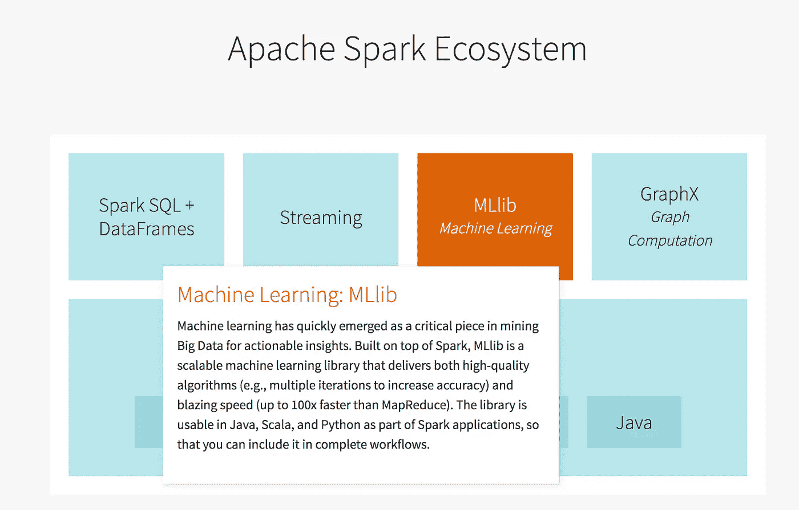

# 在 PySpark 中创建端到端机器学习管道的初学者指南

> 原文：<https://towardsdatascience.com/beginners-guide-to-create-first-end-to-end-machine-learning-pipeline-in-pyspark-d3df25a08dfd?source=collection_archive---------12----------------------->

## 数据科学家在 Spark 中构建第一个端到端机器学习管道的有用资源、概念和经验

Photo by [AbsolutVision](https://unsplash.com/@freegraphictoday?utm_source=medium&utm_medium=referral) on [Unsplash](https://unsplash.com?utm_source=medium&utm_medium=referral)

当我意识到我的训练集包括每天超过 1000 万行时，我首先想到的是子采样。然而，当我开始二次采样时，我发现在这个过程中很难不产生任何偏差。这时候我想到了用 Spark 建立一个没有二次采样的模型。

我以为 spark 里不会有太多建模选择，Spark 机器学习包也不会像 sklearn 那么强大和用户友好。然而令我惊讶的是，我很容易就在 Spark 中找到了我需要的一切。我在[mmlspark](https://github.com/Azure/mmlspark)(micro fot 开发的 spark 开源包)里找到了我想用的模型 lightgbm 我从 spark MLlib 包中找到了非常详细的[特性工程和管道函数](https://spark.apache.org/docs/latest/ml-pipeline.html)。

然而，建立我的第一个端到端培训渠道并不容易。Spark 还没有像 Python 那样广泛用于机器学习，因此它的社区支持有时是有限的，有用的信息非常分散，并且没有好的初学者指南来帮助澄清常见的困惑。因此，在这篇文章中，我将列出一些基本概念，分享我在旅途中学到的经验，并列出一些我认为有用的资源。

# 基本概念

## **PySpark vs Python**

***Python 代码与函数:*** Python 代码与 Python 对象(列表、字典、pandas 数据类型、numpy 数据类型等)一起工作。)在 PySpark 中是可执行的，但是他们根本不会从 Spark 中受益(即分布式计算)。

Python 代码不能应用于 Spark 对象(RDD、Spark 数据集、Spark 数据帧等)。)虽然直接。如果需要，这样的代码可以变成 UDF(用户定义函数)应用于每一行 Spark 对象(就像`pandas`中的`map`)。[这篇博客](https://changhsinlee.com/pyspark-udf/)很好地解释了 UDF，还有来自[这本数据手册](https://docs.databricks.com/spark/latest/spark-sql/udf-python.html)的代码示例。

***PySpark 代码及功能:*** PySpark 代码只能应用于 spark 对象。它们在应用于 Python 对象时不起作用。

***python 和 PySpark 对象转换:*** 当 Python 对象足够小以适合驱动程序的内存时，可以将一些(但不是全部)Python 对象(例如熊猫数据帧)转换成 Spark 对象(例如 spark 数据帧)，反之亦然。

## **spark.mllib vs spark.ml**

起初让我非常困惑的是，当检查[文档](https://spark.apache.org/docs/latest/ml-guide.html)时，你会看到 MLlib 被用作机器学习库的名称，但所有的代码示例都是从`pyspark.ml`导入的。事实上，spark.mllib 和 spark.ml 都是 spark 的机器学习库:spark.mllib 是与 RDD 一起工作的旧库，而 spark.ml 是围绕 spark 数据框架构建的新 API。根据 [spark 的公告](https://spark.apache.org/docs/latest/ml-guide.html)，位于 RDD 的 API 从 Spark 2.0.0 开始进入维护模式。这意味着不会有新的特性添加到`pyspark.mllib`中，在达到特性对等之后，基于 RDD 的 API 将被弃用；`pyspark.mllib`预计将在 Spark 3.0 中移除。简而言之，尽可能使用`pyspark.ml`，不要使用`pyspark.mllib`。

# **吸取的经验教训**

## **算法选择**

spark 的机器学习库包含了很多业界广泛使用的算法，如广义线性模型、随机森林、梯度提升树等。支持算法的完整列表可以在[这里](https://spark.apache.org/docs/latest/ml-classification-regression.html)找到。

还有开源库[mmspark](https://github.com/Azure/mmlspark)。它提供了 Spark 机器学习管道与微软认知工具包(CNTK)、LightGBM 和 OpenCV 的无缝集成。不幸的是，PySpark 不支持另一个非常流行的培训框架 xgboost。即使有 XGBoost4J-Spark 在 Spark 上集成了 xgboost frame，但是还没有开发出 Python API。

如前所述，从技术上来说，如果训练数据适合驱动程序内存，可以导入 python xgboost 或 lightgbm 模块，并在 PySpark 中的 pandas 数据帧上应用训练函数。然而，这种方法根本不会从 Spark 中受益(即训练将在单台机器上进行，而不是像没有 Spark 一样分布在多台机器上)。

## ***没有超深的树木***

令我惊讶的是，随机森林和梯度增强树的集合模型不能为 max_depth 参数取超过 30 的值。随着 max_depth 的增加，训练时间也呈指数增长。用我的训练集，训练一个 20 深度的随机森林需要 1 个小时，一个 30 深度的需要 8 个小时。在我看来，随机森林的浅树是一个问题，因为当训练数据很大时，深的个体树能够找到不同的“规则”，这种多样性应该有助于性能。

## ***调资源分配***

在训练期间为执行者分配足够的内存是很重要的，花时间调优核心数、执行者数和执行者内存也是值得的。我的一次训练运行在 10 分钟内完成，资源分配正确，而我第一次开始调优资源分配时需要 2 个小时。

## ***合奏*** 特色

大多数(如果不是全部的话)spark 模型都将由两列组成的数据框架(特征和标签)作为输入。特征列是所有串联的特征值的列表。 [VecorAssembler](https://spark.apache.org/docs/latest/ml-features.html#vectorassembler) 就是做这件事的函数，应该始终作为特征工程的最后一步。这里有一个在建模管道[中使用它的例子](https://docs.databricks.com/spark/latest/mllib/binary-classification-mllib-pipelines.html)。

# 一些有用的资源

## 搜索函数:文档

当搜索你需要的东西时，谷歌当然是第一选择，但是我发现浏览 [Spark 文档](https://spark.apache.org/docs/latest/index.html)寻找功能也很有帮助。重要的是要参考正确的 Spark 版本(上面的链接是版本 2.4.3)。

## 机器学习管道代码示例:数据块的笔记本文档

Spark MLlib 文档已经有很多代码示例，但是我发现 [Databrick 的用于机器学习的笔记本文档](https://docs.databricks.com/spark/latest/mllib/index.html#apache-spark-mllib)甚至更好。[这个笔记本](https://docs.databricks.com/spark/latest/mllib/binary-classification-mllib-pipelines.html)走过一个分类训练管道，[这个笔记本](https://docs.databricks.com/spark/latest/mllib/mllib-mlflow-integration.html)演示参数调整和 mlflow 进行跟踪。创建这些笔记本是为了解释如何在数据块中使用各种 Spark MLlib 功能，但这些笔记本中展示的许多功能并不是专门针对数据块的。

## Spark 整体理解:维基百科和 Spark 介绍页面

[Apache Spark 维基百科](https://en.wikipedia.org/wiki/Apache_Spark)非常好地总结了重要的 Spark 模块。当我第一次阅读它的时候，我并没有得到太多的东西，但是在对 spark 有了一些了解之后，我逐渐喜欢上了这个页面，因为它提供了对 Apache Spark 非常好的全面介绍。

我也非常喜欢 DataBrick 的 Spark 介绍页面上的“Apache Spark 生态系统”部分。这和维基百科页面上的信息很像。阅读这两本书让我对 Spark 生态系统有了更深入的了解。

Spache Spark Ecosystem

# 结论

与 python 相比，pyspark 的社区支持较少，尤其是在机器学习任务方面。除了 mmlspark，我也没有找到多少 pyspark 的开源开发。然而，谈到大数据，spark 是一个非常强大的工具:我能够在 Spark 中训练一个 lightgbm 模型，在 10 分钟内有大约 20 万行和大约 100 个特征。当然，运行时在很大程度上取决于模型参数，但是它展示了 Spark 的强大功能。