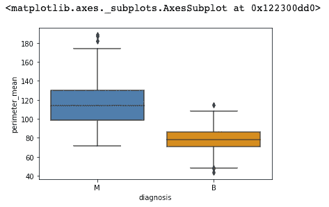

# Jupyter 笔记本初学者指南

> 原文：<https://towardsdatascience.com/beginners-guide-to-jupyter-notebook-8bb85b85085?source=collection_archive---------13----------------------->

## 数据科学

## 设置和执行描述性统计


Photo by [Evgeni Tcherkasski](https://unsplash.com/@evgenit?utm_source=unsplash&utm_medium=referral&utm_content=creditCopyText) on [Unsplash](https://unsplash.com/@evgenit?utm_source=unsplash&utm_medium=referral&utm_content=creditCopyText)

```
**Table of Contents**[**Introduction**](#bdcf)1\. [Installing Anaconda](#f76d)
2\. [Jupyter Notebook help and shortcuts](#3210)
3\. [Python libraries](#6b76)
4\. [Finding data](#f10a)
5\. [Importing data](#a663)
6\. [Data attributes](#6916)
7\. [Missing Value](#8204)
8\. [Dealing with NaN values](#6778)
9\. [How to deal categorical data](#9d1c)
10\. [Descriptive statistics](#985d)
11\. [Basic plotting](#0a81)
12\. [Matplotlib](#e08b)
13\. [Seaborn](#3885)
14\. [What’s next?](#8243)
```

# 介绍

欢迎来到这个 Jupyter 笔记本初学者指南！在本教程中，我们将介绍使用 Jupyter Notebook 执行描述性统计的基础知识，重点是帮助刚接触编码的高中(或以上)学生。

Jupyter Notebook 是一个强大的数据科学工具，允许您创建和共享包含实时代码、等式、可视化和叙述性文本的文档。它是一个开源的 web 应用程序，支持 100 多种编程语言，包括在数据科学中广泛使用的流行语言 Python。

> Jupyter Notebook 是一个开源的 web 应用程序，允许您创建和共享包含实时代码、公式、可视化和叙述性文本的文档。—来自[项目 Jupyter](https://jupyter.org/)

在本教程中，我们将使用 Python 来演示如何使用 Jupyter Notebook 进行描述性统计。如果您是 Python 新手，请不要担心！我们将提供所有必要的解释和示例来帮助您开始。在本教程结束时，您将对如何使用 Jupyter Notebook 有更好的理解，并在成为一名熟练的数据科学家的道路上前进。


这里可以看到[的原图。](https://trends.google.com/trends/explore?date=today%205-y&q=python%20data%20science,R%20data%20science)

我制作了一个 Jupyer 幻灯片，你可以在这里下载。你需要安装 [RISE](https://rise.readthedocs.io/en/maint-5.6/) 才能使用这个幻灯片。

我们要用 Python 库， [Numpy](https://numpy.org/devdocs/index.html) ， [Pandas](https://pandas.pydata.org/) ， [Matplotlib](https://matplotlib.org/) 和 [Seaborn](https://seaborn.pydata.org/) 。Python 库是函数和方法的集合，允许您在不编写代码的情况下执行许多操作。

# 安装 Anaconda

我们将安装 Anaconda。Anaconda 是 Python 数据科学的标准平台。Anaconda 将为我们安装所有必需的[包](https://docs.anaconda.com/anaconda/packages/old-pkg-lists/4.3.1/py35/)。

从[https://www.anaconda.com/distribution/](https://www.anaconda.com/distribution/)，下载 3.7 版本并安装。


安装 Anaconda 之后，启动 Anaconda-Navigator。


新闻发布 Jupyter 笔记本。它将启动一个终端并打开一个浏览器。


要创建文件夹，请单击右上角的“新建”按钮。然后单击文件夹。


您需要将文件夹重命名为 Statistics。


创建一个名为 Data 的文件夹，我们将把所有数据存储在这个文件夹中。


在 Data 文件夹中，创建一个名为 mydata1.csv 的文本文件。


在浏览器中打开[http://bit.ly/2M1yrW7](http://bit.ly/2M1yrW7)。Command(或 windows 中的 ctrl)+A 选择全部，Command + C 复制。Command + V 将其粘贴到 mydata1.csv，Command + S 保存该文件。

在 Statistics 文件夹中，创建名为 Test by New > Python 3 的文件。


这就是全部的设置。让我们开始写一些代码。

[](/stepping-into-intermediate-with-jupyter-f6647aeb1184) [## Jupyter 用户的生产力提示

### 使用 Jupyter 笔记本和 JupyterLab 让您的工作流程更加高效

towardsdatascience.com](/stepping-into-intermediate-with-jupyter-f6647aeb1184) 

# Jupyter 笔记本帮助和快捷方式

按下`h`切换键盘快捷键屏幕。你可以通过按⌘⇧f.看到所有的命令。我经常使用下面的快捷键，如果你能记住它们会很有用。


# Python 库

Numpy 和 [Pandas](https://pandas.pydata.org/pandas-docs/stable/index.html) 是科学计算、数据科学和机器学习中使用最多的两个库。熊猫建在 Numpy 的上面。两者都提供相似的功能。Numpy 为多维数组提供了对象，Pandas 提供了内存中的 2D 表对象 DataFrame。

Python 提供了各种用于绘制数据的包。Seaborn 和 Matplotlib 是 Python 最强大的两个可视化库。

使用`import ... as ...`导入一个库。我们使用`%matplotlib inline`来内联显示图形。请在我们的测试文件中写入/复制以下内容。

```
import numpy as np
import pandas as pd
import seaborn as sns
import matplotlib.pyplot as plt
%matplotlib inline
```

键入以上内容后，按 SHIFT + RETURN。这将运行您编写的代码。如果你写对了，什么都不会发生。但是如果你拼错了，它会返回一个错误。请阅读错误的最后一行并解决问题。

# 查找数据

你可以在网上找到很多资源。这是[数据源](https://medium.com/@shinichiokada/list-of-data-sources-de586e4fdd7)的集合。CSV 文件是逗号分隔值文件，是最容易处理的文件。大多数数据源都提供了一个 CSV 文件。从列表中找出几个你感兴趣的数据。把它们下载到你的硬盘上。

# 导入数据

我们将读取 CSV 文件并将数据存储在一个名为 df 的变量中。请在下一个单元格中写下以下内容。

```
df = pd.read_csv('data/mydata1.csv')
```

请不要忘记按 SHIFT + RETURN。

# 数据属性

我们将使用`shape`、`info()`、`head()`、`tail()`、`describe()`来查看我们的数据概览。

我们使用`shape`来打印我们数据的尺寸。`info()`打印数据的简明摘要。按 SHIFT + RETURN 运行程序。

```
df.shape
```

它打印出(569，33)。

```
df.info()
```


`head()`默认打印前 5 行数据。如果想返回前 10 行，使用`head(10)`。

```
df.head()
```


`tail()`默认打印最后 5 行数据。可以使用任意数字作为`tail(10)`。

```
df.tail()
```


对于统计概览，`describe()`打印平均值、标准差、最小值等。

```
df.describe()
```


# 漏测值


首先，我们导入样本数据。、不适用、不适用和无数据。我们使用“isnull()”检查数据帧是否有任何空值。` any()`如果有任何空值，则按列输出。


请注意，NaN 将替换没有数据的数据项。
比较前两个表，？和 na 不被识别为空。因此，我们需要使用“na_values”来将它们识别为空值。这就要换 NAN 了。

[](/hands-on-jupyter-notebook-hacks-f59f313df12b) [## 手把手的 Jupyter 笔记本黑客

### 您应该使用的技巧、提示和快捷方式

towardsdatascience.com](/hands-on-jupyter-notebook-hacks-f59f313df12b) 

# 处理 NaN 值

## 丢弃 NaN 值

处理空值的一种方法是删除行或列。`dropna()`的默认值为`axis=0`。所以`dropna()`和`dropna(axis=0)`输出同一个表。这将删除所有包含空值的行。


` axis=1 '将删除列中有 NaN 的列。


## 填充 NaN

我们可以用列平均值来填充 NaN 值。下面在每一列中填入 NaN 及其列平均值。


你可以用中间值来填充。


或者任何你认为合适的值。


# 如何处理分类数据

我们的数据在 col3 下面有一只猫、一只狗和一只狐狸。我们使用“get_dummies()”将分类变量转换为虚拟/指示变量。这将创建包含所有类别的列，并添加 0 或 1。


我们把这些假人和我们的数据连接起来。


我们不再需要 col3，所以我们放弃它。

[](/version-control-with-jupyter-notebook-b9630bc5996e) [## 使用 Jupyter 笔记本进行版本控制

### Jupytext 循序渐进指南

towardsdatascience.com](/version-control-with-jupyter-notebook-b9630bc5996e) 

# 描述统计学

除非指定列，`mean`，`max`，`min`等。返回所有列的结果。这里我们将只打印`all_mean`。

```
df=pd.read_csv('[http://bit.ly/2vmLyvU'](http://bit.ly/2vmLyvU'))
all_mean = df.mean()
all_max = df.max()
all_min = df.min()
all_median = df.median()
all_std = df.std()
all_25_quantile = df.quantile(0.25)

print('The means of all data.')
print(all_mean)
```


作为练习，可以打印`all_median`、`all_max`吗？

让我们关注数据中的`radius_mean`。我们设置了一个名为`target`的变量。

```
df=pd.read_csv('[http://bit.ly/2vmLyvU'](http://bit.ly/2vmLyvU'))
target = 'radius_mean'
```

我们找到`radius_mean`的最大值、最小值和范围。

```
max = df[target].max()
min = df[target].min()
range =  max - min
print('The max is %.1f, the min is %.1f and the range is %.1f' % (max, min, range))
```

print 命令在括号内打印输出。三个`%.1`打印一个小数位，将替换为最大、最小和范围。你可以在这篇[文章](https://www.python-course.eu/python3_formatted_output.php)中找到更多细节。

让我们找出平均值、中间值和众数。

```
mean = df[target].mean()
median = df[target].median()
mode = df[target].mode()
print('The mean is %.1f, the median is %.1f and the mode is %.1f.' % (mean, median, mode))
```

`quartile`的默认值为 0.5，与中值或 50%平铺相同。您可以指定百分位数，`quantile(0.25)`。

```
q1 = df[target].quantile(0.25)
q3 = df[target].quantile(0.75)
iqr = q3-q1
print('The lower quartile is %.1f, the upper quartile is %.1f and the interquartile range is %.1f' % (q1, q3, iqr))
```

# 基本绘图

熊猫的`plot()`默认画线图。可以用条形图、历史图、方框图、饼图等设置`kind`参数。

```
df[target].plot()
```


上图是`radius_mean`的线图。

通过将`kind='hist'`加到`plot()`上，可以绘制直方图。

```
df[target].plot(kind='hist')
```


通过在`plot`后添加`hist()`也可以打印直方图。

```
df[target].plot.hist()
```


您可以添加`bins=100`以使用 100 个直方图仓。

```
df[target].plot.hist(bins=100)
```


`plot(kind='box')`或`plot.box()`显示了一个盒须图。

```
df[target].plot(kind='box')
```


# Matplotlib

Matplotlib 有很大的灵活性。在这里，您可以更改异常值的颜色和符号，并一起显示三个方框图。

```
data =[df['radius_mean'],df['texture_mean'],df['texture_worst']]
green_diamond = dict(markerfacecolor='g', marker='D')fig7, ax7 = plt.subplots()
ax7.set_title('Multiple Samples with Different sizes')
ax7.boxplot(data,flierprops=green_diamond)plt.show()
```


Matplotlib 的[直方图](https://matplotlib.org/api/_as_gen/matplotlib.pyplot.hist.html?highlight=hist)有很大的灵活性。您可以添加不同的参数。

```
plt.hist([df['radius_mean'], 
          df['texture_mean']], 
         histtype='barstacked',
         orientation='horizontal',bins=20)
plt.show()
```


# 海生的

Seaborn 构建在 Matplotlib 之上，并引入了额外的绘图类型。这也让你的传统 Matplotlib 图看起来更漂亮。(来自 [Quora](https://www.quora.com/What-is-the-difference-between-Matplotlib-and-Seaborn-Which-one-should-I-learn-for-studying-data-science) )

```
sns.boxplot(x='diagnosis', y='perimeter_mean', data=df)
```



**通过** [**成为**](https://blog.codewithshin.com/membership) **会员，获得媒体上所有故事的访问权限。**


[https://blog.codewithshin.com/subscribe](https://blog.codewithshin.com/subscribe)

# 下一步是什么？

[](/7-essential-tips-for-writing-with-jupyter-notebook-60972a1a8901) [## 用 Jupyter 笔记本写作的 7 个基本技巧

### 第一篇数据科学文章指南

towardsdatascience.com](/7-essential-tips-for-writing-with-jupyter-notebook-60972a1a8901) [](/modeling-functions-78704936477a) [## 建模功能

### 从线性回归到逻辑回归

towardsdatascience.com](/modeling-functions-78704936477a) 

# 参考

 [## Jupyter 的教与学

### 这本手册是为任何教育工作者教学的主题，包括数据分析或计算，以支持…

jupyter4edu.github.io](https://jupyter4edu.github.io/jupyter-edu-book/) [](https://matplotlib.org/3.1.1/gallery/pyplots/boxplot_demo_pyplot.html#sphx-glr-gallery-pyplots-boxplot-demo-pyplot-py) [## Boxplot 演示- Matplotlib 3.1.1 文档

### 示例 boxplot 代码伪造了更多的数据，使得二维数组只有在所有列长度相同的情况下才有效。如果…

matplotlib.org](https://matplotlib.org/3.1.1/gallery/pyplots/boxplot_demo_pyplot.html#sphx-glr-gallery-pyplots-boxplot-demo-pyplot-py) [](https://medium.com/series/jupyter-hacks-and-tips-1b1a3a10bc79) [## Jupyter 的技巧和窍门

### Jupyter 技巧和提示的集合

medium.com](https://medium.com/series/jupyter-hacks-and-tips-1b1a3a10bc79)