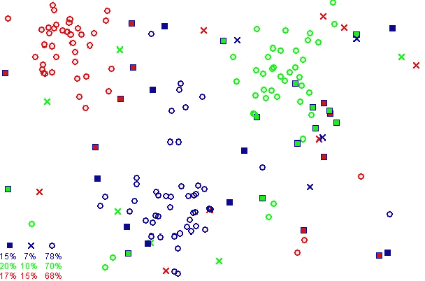
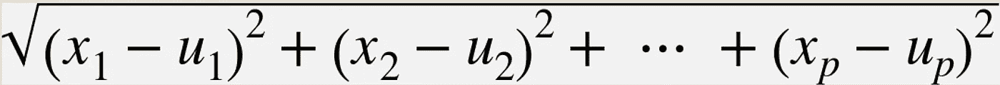
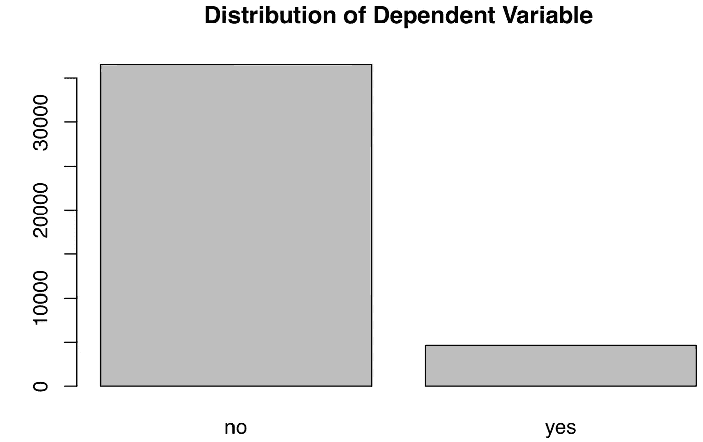
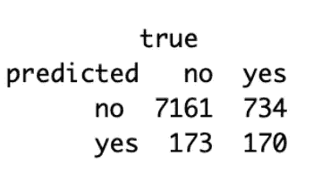
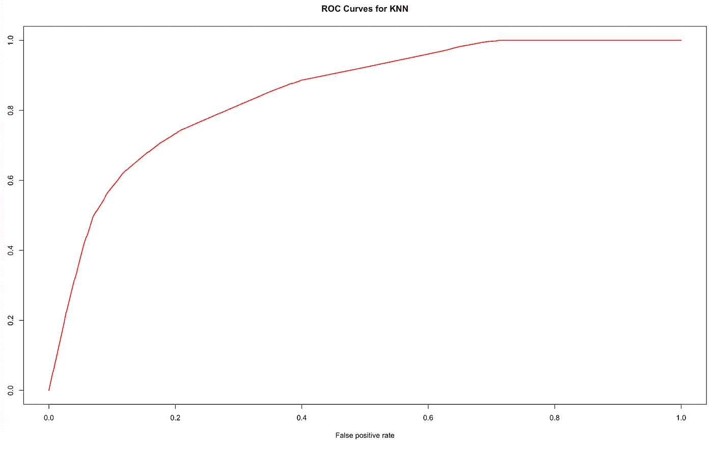

# R 中 K-最近邻初学者指南:从零到英雄

> 原文：<https://towardsdatascience.com/beginners-guide-to-k-nearest-neighbors-in-r-from-zero-to-hero-d92cd4074bdb?source=collection_archive---------2----------------------->

## 机器学习:监督学习

## 在 R 中建立具有各种性能指标的 KNN 模型的管道


Photo by [Mathyas Kurmann](https://unsplash.com/@mathyaskurmann?utm_source=unsplash&utm_medium=referral&utm_content=creditCopyText) on [Unsplash](https://unsplash.com/s/photos/neighbors?utm_source=unsplash&utm_medium=referral&utm_content=creditCopyText)

***2021 年 1 月 10 日更新***

KNN in audio

> "如果你住的地方离比尔·盖茨只有 5 分钟的路程，我敢打赌你一定很有钱."

# 介绍

在机器学习领域，K 近邻 KNN 最直观，因此很容易被希望进入该领域的数据科学爱好者所接受。为了决定观察的分类标签，KNN 会查看其邻居并将邻居的标签分配给感兴趣的观察。这是 KNN 方法的基本思想，就像一开始用的比尔游戏的比喻一样。不需要更高维度的计算来理解算法是如何工作的。

但是有一个问题。查看一个邻居可能会给模型带来偏差和不准确性，我们必须为该方法设置几个“参与规则”。例如，顾名思义，KNN 可以采用其“k”个邻居的多数情况。



A quick look at how KNN works, by [Agor153](https://en.m.wikipedia.org/wiki/File:ReducedDataSet.png)

> 为了决定新观察的标签，我们查看最近的邻居。

# **测量距离**

为了选择邻居的数量，我们需要采用一个数字来量化邻居之间的相似性或不相似性([数据科学家实用统计](https://www.amazon.com/Practical-Statistics-Data-Scientists-Essential/dp/1491952962/ref=sr_1_2?crid=2DHSXJNLD87ON&dchild=1&keywords=practical+statistics+for+data+scientists&qid=1610331584&sprefix=practical+statistics%2Caps%2C110&sr=8-2))。为此，KNN 根据数据类型有两套距离度量标准。

对于离散变量，KNN 采用海明距离。它测量使两个字符串相似所需的最少替换数( [Wikipedia](https://en.m.wikipedia.org/wiki/Hamming_distance) )。

对于连续变量，我们使用欧几里德距离。为了计算两个向量 *(x1，x2，…，xp)* 和 *(μ1，μ2，…，μp)* 之间的距离，我们取它们的个体差，平方，求和，然后平方根，如下所示:



screenshot of [Practical Statistics for Data Scientists](https://www.amazon.com/Practical-Statistics-Data-Scientists-Essential/dp/1491952962/ref=sr_1_2?crid=2DHSXJNLD87ON&dchild=1&keywords=practical+statistics+for+data+scientists&qid=1610331584&sprefix=practical+statistics%2Caps%2C110&sr=8-2)

顺便提一下，在数据科学访谈中，为 KNN 选择距离指标是一个备受考验的话题。他们通常会询问选择一个指标的理由，以及他们的权衡。我在一篇相关的文章中阐述了如何处理这类问题:

[](/crack-data-science-interviews-essential-machine-learning-concepts-afd6a0a6d1aa) [## 破解数据科学访谈:基本的机器学习概念

### 赢在 2021 年:数据科学家/工程师的必读之作，第 1 部分

towardsdatascience.com](/crack-data-science-interviews-essential-machine-learning-concepts-afd6a0a6d1aa) 

# **什么是 K 倍交叉验证？**

如上所述，KNN 的关键是设置邻居的数量，我们求助于交叉验证(CV)来决定额外的 K 个邻居。

交叉验证可以简要描述为以下步骤:

1.  *将数据分成 K 个均匀分布的块/折叠*
2.  *选择 1 个组块/折叠作为测试集，其余 K-1 个作为训练集*
3.  *基于训练集开发 KNN 模型*
4.  *仅比较测试集上的预测值和实际值*
5.  *将 ML 模型应用于测试集，并使用每个组块重复 K 次*
6.  *将模型的指标分数相加，并在 K 倍上求平均值*

# 怎么选 K？

从技术上讲，我们可以将 K 设置为 1 和样本大小 n 之间的任何值。设置 K = n，CV 将 1 个观察值作为训练集，其余 n-1 个案例作为测试集，并对整个数据集重复该过程。这种简历被称为**“留一法交叉验证”(LOOCV)** 。

然而，LOOCV 有直观的意义，但需要大量的计算能力。对于非常大的数据集，它会永远运行。

为了选择最佳的 K 倍，我们必须在偏差和方差之间进行权衡。对于一个小的 K，该模型有一个高偏差，但估计测试误差的方差低。对于一个大 K，我们有一个低偏差但高方差(**破解数据科学访谈**)。


Photo by [Jon Tyson](https://unsplash.com/@jontyson?utm_source=unsplash&utm_medium=referral&utm_content=creditCopyText) on [Unsplash](https://unsplash.com/s/photos/neighbors?utm_source=unsplash&utm_medium=referral&utm_content=creditCopyText)

# R 中的代码实现

## 1.软件准备

```
*# install.packages(“ISLR”)
# install.packages(“ggplot2”) # install.packages(“plyr”)
# install.packages(“dplyr”) # install.packages(“class”)**# Load libraries* **library**(ISLR) 
**library**(ggplot2) 
**library**(reshape2) 
**library**(plyr) 
**library**(dplyr) 
**library**(class)# load data and clean the dataset
banking=read.csv(“bank-additional-full.csv”,sep =”;”,header=T)##check for missing data and make sure no missing data
banking[!complete.cases(banking),]#re-code qualitative (factor) variables into numeric
banking$job= recode(banking$job, “‘admin.’=1;’blue-collar’=2;’entrepreneur’=3;’housemaid’=4;’management’=5;’retired’=6;’self-employed’=7;’services’=8;’student’=9;’technician’=10;’unemployed’=11;’unknown’=12”)#recode variable again
banking$marital = recode(banking$marital, “‘divorced’=1;’married’=2;’single’=3;’unknown’=4”)banking$education = recode(banking$education, “‘basic.4y’=1;’basic.6y’=2;’basic.9y’=3;’high.school’=4;’illiterate’=5;’professional.course’=6;’university.degree’=7;’unknown’=8”)banking$default = recode(banking$default, “‘no’=1;’yes’=2;’unknown’=3”)banking$housing = recode(banking$housing, “‘no’=1;’yes’=2;’unknown’=3”)banking$loan = recode(banking$loan, “‘no’=1;’yes’=2;’unknown’=3”)banking$contact = recode(banking$loan, “‘cellular’=1;’telephone’=2;”)banking$month = recode(banking$month, “‘mar’=1;’apr’=2;’may’=3;’jun’=4;’jul’=5;’aug’=6;’sep’=7;’oct’=8;’nov’=9;’dec’=10”)banking$day_of_week = recode(banking$day_of_week, “‘mon’=1;’tue’=2;’wed’=3;’thu’=4;’fri’=5;”)banking$poutcome = recode(banking$poutcome, “‘failure’=1;’nonexistent’=2;’success’=3;”)#remove variable “pdays”, b/c it has no variation
banking$pdays=NULL #remove variable “duration”, b/c itis collinear with the DV
banking$duration=NULL
```

加载和清理原始数据集后，通常的做法是直观地检查变量的分布，检查季节性、模式、异常值等。

```
#EDA of the DV
plot(banking$y,main="Plot 1: Distribution of Dependent Variable")
```



可以看出，结果变量(*银行服务订阅*)并不是均衡分布的，“否”比“是”多得多，这给机器学习分类问题带来不便。假阳性率很高，因为许多少数病例会被归类为多数病例。对于这种分布不均匀的罕见事件，非参数分类方法是首选方法。

[](/classifying-rare-events-using-five-machine-learning-techniques-fab464573233) [## 使用 5 种机器学习算法对罕见事件进行分类

### 哪一种最适合不平衡数据？有什么权衡吗？

towardsdatascience.com](/classifying-rare-events-using-five-machine-learning-techniques-fab464573233) 

## **2。数据分割**

我们将数据集分为训练集和测试集。根据经验，我们坚持“80–20”划分，即 80%的数据作为训练集，20%作为测试集。

```
#split the dataset into training and test sets randomly, but we need to set seed so as to generate the same value each time we run the codeset.seed(1)**#create an index to split the data: 80% training and 20% test** index = round(nrow(banking)*0.2,digits=0)#sample randomly throughout the dataset and keep the total number equal to the value of index
test.indices = sample(1:nrow(banking), index)#80% training set
banking.train=banking[-test.indices,] #20% test set
banking.test=banking[test.indices,] #Select the training set except the DV
YTrain = banking.train$y
XTrain = banking.train %>% select(-y)# Select the test set except the DV
YTest = banking.test$y
XTest = banking.test %>% select(-y)
```

## 3.**火车模型**

让我们创建一个新函数(" **calc_error_rate** ")来记录错误分类率。当使用训练模型预测的标签与实际结果标签不匹配时，该函数计算比率。它衡量分类的准确性。

```
#define an error rate function and apply it to obtain test/training errorscalc_error_rate <- function(predicted.value, true.value){
 return(mean(true.value!=predicted.value)) 
}
```

然后，我们需要另一个函数“ *do.chunk()* ”，来做 k 重交叉验证。该函数返回可能折叠值的数据框。

该步骤的主要目的是为 KNN 选择最佳 K 值。

```
nfold = 10
set.seed(1)# cut() divides the range into several intervals
folds = seq.int(nrow(banking.train)) %>%
     cut(breaks = nfold, labels=FALSE) %>%  
     sampledo.chunk <- function(chunkid, folddef, Xdat, Ydat, k){ 
     train = (folddef!=chunkid)# training indexXtr = Xdat[train,] # training set by the indexYtr = Ydat[train] # true label in training setXvl = Xdat[!train,] # test setYvl = Ydat[!train] # true label in test setpredYtr = knn(train = Xtr, test = Xtr, cl = Ytr, k = k) # predict training labelspredYvl = knn(train = Xtr, test = Xvl, cl = Ytr, k = k) # predict test labelsdata.frame(fold =chunkid, # k folds 
train.error = calc_error_rate(predYtr, Ytr),#training error per fold 
 val.error = calc_error_rate(predYvl, Yvl)) # test error per fold
 }# set error.folds to save validation errors
error.folds=NULL# create a sequence of data with an interval of 10
kvec = c(1, seq(10, 50, length.out=5))set.seed(1)for (j in kvec){
 tmp = ldply(1:nfold, do.chunk, # apply do.function to each fold
 folddef=folds, Xdat=XTrain, Ydat=YTrain, k=j) # required arguments
 tmp$neighbors = j # track each value of neighbors
 error.folds = rbind(error.folds, tmp) # combine the results 
 }**#melt() in the package reshape2 melts wide-format data into long-format data** errors = melt(error.folds, id.vars=c(“fold”,”neighbors”), value.name= “error”)
```

接下来的步骤是找到最小化验证误差的 k 的数量

```
val.error.means = errors %>%
    #select all rows of validation errors
    filter(variable== “val.error” ) %>% 
    #group the selected data by neighbors
    group_by(neighbors, variable) %>%
    #cacluate CV error for each k
    summarise_each(funs(mean), error) %>%
    #remove existing grouping
    ungroup() %>% 
    filter(error==min(error))*# Best number of neighbors*
*# if there is a tie, pick larger number of neighbors for simpler model*
numneighbor = max(val.error.means$neighbors)
numneighbor## [20]
```

因此，在使用 10 重交叉验证后，最佳邻居数为 20。

## 4.一些模型指标

```
#training error
set.seed(20)
pred.YTtrain = knn(train=XTrain, test=XTrain, cl=YTrain, k=20)knn_traing_error <- calc_error_rate(predicted.value=pred.YTtrain, true.value=YTrain)
knn_traing_error[1] 0.101214
```

训练误差为 0.10。

```
#test error
set.seed(20)
pred.YTest = knn(train=XTrain, test=XTest, cl=YTrain, k=20)knn_test_error <- calc_error_rate(predicted.value=pred.YTest, true.value=YTest)
knn_test_error[1] 0.1100995
```

测试误差为 0.11。

```
#confusion matrixconf.matrix = **table**(predicted=pred.YTest, true=YTest)
```



根据上面的混淆矩阵，我们可以计算出下面的数值，为绘制 ROC 曲线做准备。

**准确度=** (TP +TN)/(TP+FP+FN+TN)

**TPR/召回/灵敏度** = TP/(TP+FN)

**精度** = TP/(TP+FP)

**特异性** = TN/(TN+FP)

**FPR** = 1 —特异性= FP/(TN+FP)

**F1 得分** = 2*TP/(2*TP+FP+FN) =精度*召回/(精度+召回)

```
# Test accuracy ratesum(diag(conf.matrix)/sum(conf.matrix))[1] 0.8899005*# Test error rate*1 - sum(drag(conf.matrix)/sum(conf.matrix))[1] 0.1100995
```

正如您可能注意到的，测试准确率+测试错误率= 1，我提供了计算每个值的多种方法。

```
# ROC and AUC
knn_model = knn(train=XTrain, test=XTrain, cl=YTrain, k=20,prob=TRUE)prob <- attr(knn_model, “prob”)prob <- 2*ifelse(knn_model == “-1”, prob,1-prob) — 1pred_knn <- prediction(prob, YTrain)performance_knn <- performance(pred_knn, “tpr”, “fpr”)# AUCauc_knn <- performance(pred_knn,”auc”)[@y](http://twitter.com/y).valuesauc_knn[1] 0.8470583plot(performance_knn,col=2,lwd=2,main=”ROC Curves for KNN”)
```



总之，我们已经了解了什么是 KNN，以及在 r 中构建 KNN 模型的流程。此外，我们还掌握了进行 K-Fold 交叉验证的技巧，以及如何在 r 中实现代码

*我的*[*Github*](https://github.com/LeihuaYe/Machine-Learning-Rare-Event-Classification)*上有完整的 Python 代码。*

*Medium 最近进化出了它的* [*作家伙伴计划*](https://blog.medium.com/evolving-the-partner-program-2613708f9f3c) *，支持像我这样的普通作家。如果你还不是订户，通过下面的链接注册，我会收到一部分会员费。*

[](https://leihua-ye.medium.com/membership) [## 阅读叶雷华博士研究员(以及其他成千上万的媒体作家)的每一个故事

### 作为一个媒体会员，你的会员费的一部分会给你阅读的作家，你可以完全接触到每一个故事…

leihua-ye.medium.com](https://leihua-ye.medium.com/membership) 

# 我的数据科学面试序列

[](/essential-sql-skills-for-data-scientists-in-2021-8eb14a38b97f) [## 2021 年数据科学家必备的 SQL 技能

### 数据科学家/工程师的四项 SQL 技能

towardsdatascience.com](/essential-sql-skills-for-data-scientists-in-2021-8eb14a38b97f) [](/5-python-coding-questions-asked-at-faang-59e6cf5ba2a0) [## FAANG 在 2021 年提出这 5 个 Python 问题

### 数据科学家和数据工程师的必读！

towardsdatascience.com](/5-python-coding-questions-asked-at-faang-59e6cf5ba2a0) [](/statistical-simulation-in-python-part-2-91f71f474f77) [## FAANG 在 2021 年询问这些 Python 模拟

### 数据科学和数据工程面试的必读材料，第 2 部分

towardsdatascience.com](/statistical-simulation-in-python-part-2-91f71f474f77) 

# 喜欢读这本书吗？

> 请在 [LinkedIn](https://www.linkedin.com/in/leihuaye/) 和 [Youtube](https://www.youtube.com/channel/UCBBu2nqs6iZPyNSgMjXUGPg) 上找到我。
> 
> 还有，看看我其他关于人工智能和机器学习的帖子。