# 语音分析入门指南

> 原文：<https://towardsdatascience.com/beginners-guide-to-speech-analysis-4690ca7a7c05?source=collection_archive---------5----------------------->

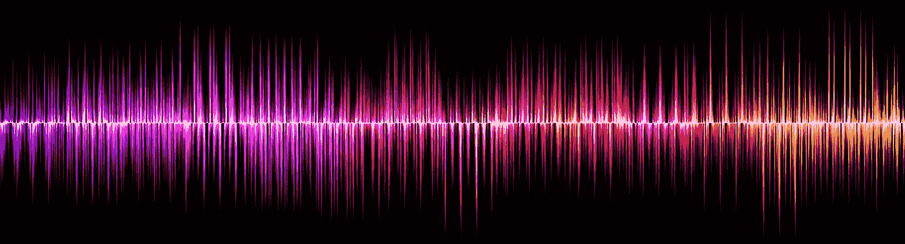

Speech signal from [Pixabay](https://pixabay.com/en/sound-wave-voice-listen-856771/)

本文介绍了语音信号及其分析。此外，我还与文本分析进行了比较，看它与演讲有何不同。

**作为交流媒介的语音与文本的对比**

语音被定义为通过发音来表达思想和感情。言语是人类最自然、最直观、最喜欢的交流方式。言语的感知可变性以各种语言、方言、口音的形式存在，而言语的词汇也日益增长。在语音信号级别，更复杂的可变性以变化的振幅、持续时间、音调、音色和说话者可变性的形式存在。

文本作为一种通信手段，已经发展到可以远距离存储和传递信息。它是任何言语交流的书面表达。这是一种更简单的交流方式，没有前面提到的言语中复杂多变的现象。

语音中错综复杂的变化使得分析变得更加复杂，但是使用音调和振幅变化提供了额外的信息。

**语音和文本的表示**

语音和文本分析在当今世界有着广泛的应用。他们有不同的表现，在他们的分析中遇到许多不同和挑战。

让我们看一个取自 [CMU 美国 RMS 北极](http://festvox.org/cmu_arctic/dbs_rms.html) 语音数据库的一个话语的语音信号。每个话语以 16 kHz 的采样频率被记录为 16 位信号，这意味着信号的每秒有 16000 个样本，每个样本的分辨率为 16 位。音频信号的采样频率决定了音频样本的分辨率，采样率越高，信号的分辨率越高。语音信号从语音数据库中的*‘arctic _ a 0005 . wav’*文件中读取，该文件持续时间约为 1.4 秒，相当于 22640 个样本的序列，每个样本为 16 位数。下面的语音表示是来自*‘arctic _ a 0005 . wav’*的语音信号的图，其等效文本是*“我们会不会忘记它”*:

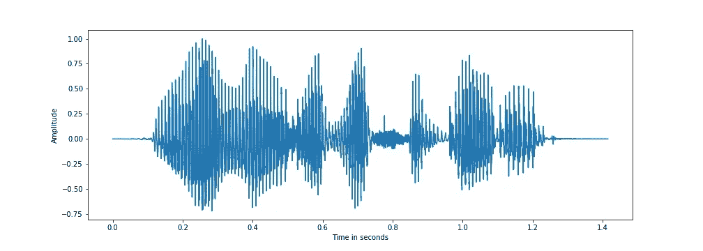

Speech signal, s[n] for the utterance “will we ever forget it”

从上图可以看出，语音可以表示为振幅随时间的变化。振幅被归一化，使得最大值为 *1* 。语音基本上是一系列发音单位，如“w”、“ih”，称为音素。语音信号可以被分割成一系列音素和无声/非语音段。

该数据库还包含每个波形文件在句子和音素级别的语音信号的相应文本转录。下面是上述语音信号的一部分的表示，示出了音素及其相应的时间跨度。

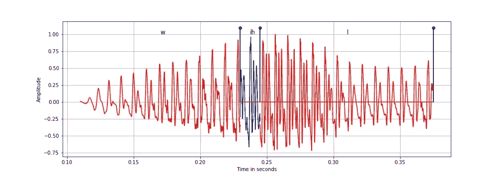

Phoneme level segments of the signal for ‘will’ as ‘w’, ‘ih’ and ‘l’

从上图可以看出，音素‘w’、‘ih’和‘l’本质上是准周期性的，并且由于它们是由声带的周期性振动产生的，因此被归类为浊音音素。此外，“ih”是元音，而“w”和“l”是半元音。浊音和清音类别是基于声带振动的语音的宽泛分类。对不同音位的研究和分类被称为语音学。

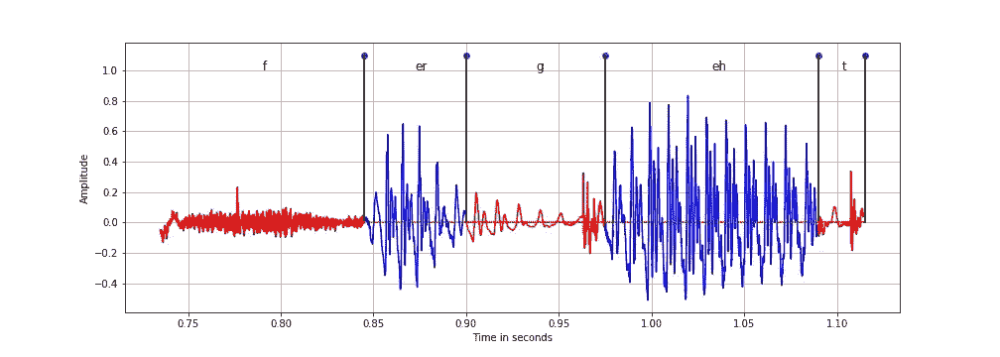

Phoneme level segments of the signal for ‘forget’ as ‘f, ‘er’, ‘g’, ‘eh’ and ‘t’

在上图中，我们有像‘f’、‘g’和‘t’这样的清音音素和像‘er’和‘eh’这样的浊音音素。音位‘g’和‘t’被进一步分类为停顿，即沉默之后是突然的脉冲。可以观察到，浊音分量是准周期性的，而清音分量是有噪声的，因为它们不是由声带的周期性振动产生的。

可以使用音素到字形的映射将音素映射到语音的书面形式。下面是文本和相应音素之间的映射:

*正文:*“我们会忘记吗”

*音序:'* w '，' ih '，' l '，' w '，' iy '，' eh '，' v '，' er '，' f '，' er '，' g '，' eh '，' t '，' ih '，' t '

从上面的映射可以看出，单词“will”映射到了音素 *'* w '，‘ih '，‘l '。

此外，我们将研究语音的帧级频域表示，在语音研究领域也称为**短时傅立叶变换(STFT)** 。**声谱图**是声音频域表示的直观表示。

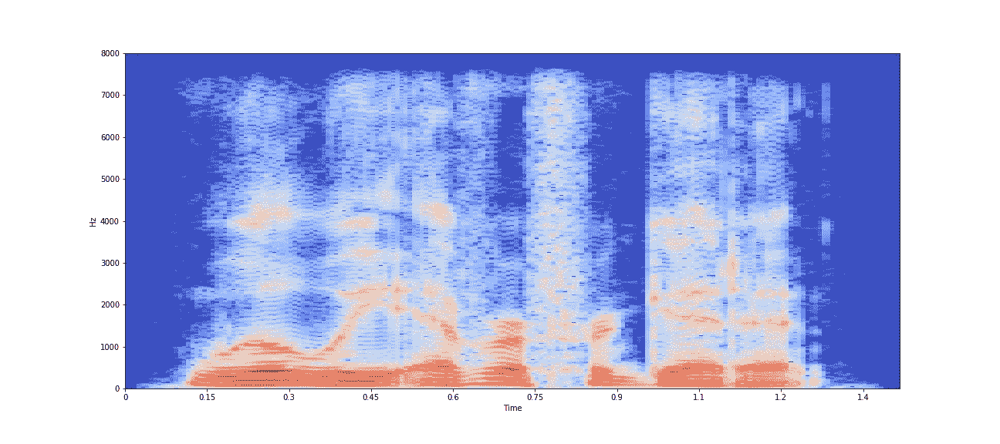

Log scaled spectrogram of the speech signal using a window size of 30 ms and hop size of 7.5 ms

上面绘制的对数标度谱图是 STFT 在对数标度中的振幅。选择 30 ms 的帧大小，这相当于 30 ms×16k Hz = 480 个语音信号样本，而 7.5 ms 的帧移位相当于 120 个样本。将语音信号分成小持续时间的帧的原因是语音信号是非平稳的，并且其时间特性变化非常快。因此，通过采用小的帧尺寸，我们假设语音信号将是稳定的，并且其特征在帧内不会变化太多。此外，选择较短的帧偏移来跟踪语音信号的连续性，并且不会遗漏帧边缘的任何突变。从上图可以看出，每帧的频域表示有助于我们更好地分析语音信号；因为我们可以很容易地看到谐波在浊音区域中是平行的红色段，以及幅度如何针对每个频率和帧索引而变化。因此，语音信号的大部分分析是在频域中完成的。但是时间信息的提取，如信号中的突然变化(突发的开始，如“t”)在时域中被更好地捕获，因为将语音信号分成帧丢弃了信号中的瞬时变化。

我们可以说，通过采用较小的帧尺寸，我们可以在频域中获得更好的时间分辨率。但是在时域和频域的分辨率之间有一个折衷。采用非常小的帧尺寸将在时间上给出更高的分辨率，但是在单个帧中将给出很少的样本，并且相应的傅立叶分量将具有很少的频率分量。并且由于更大数量的样本，采用更大的帧尺寸将给出更低的时间分辨率但是更高的频率分辨率。因此，同时获得时间和频率的高分辨率是不可能的。

可以观察到，对于 16 kHz 的采样频率，对数频谱图中的 y 轴具有高达 8 kHz 的频率。这是因为，根据奈奎斯特-香农采样定理，在离散信号中可以观察到的最大频率最多是采样频率(8 kHz)的一半。

虽然言语有很多可变性，取决于环境、说话者、说话者的情绪和语气，但文本没有所有这些可变性。

等效的文本被表示为字母、符号和空格的序列，如“我们会不会忘记它”。

**语音分析的应用**

*语音活动检测:*识别音频波形中仅存在语音的片段，忽略非语音和无声片段

*语音增强:*通过过滤和分离语音片段中的噪声来提高语音信号的质量

语音识别:将语音信号转换成文本仍然是一个挑战。在不同的条件下，识别可以是词汇相关的，也可以是独立的

文本到语音:从文本中合成自然语音，使语音听起来非常自然并带有情感是一项挑战

*说话人二元化和说话人识别:*二元化是将语音信号分割成属于不同说话人的片段，而说话人识别是识别在特定时间谁在说话

*音频源分离:*分离混合语音信号，如与来自不同说话者的语音或噪声重叠的语音

*语音修改:*修改语音，如改变其情感、音调，转换成不同说话者所说的语音

*情感语音分类:*识别语音的情感，如高兴、愤怒、悲伤和焦虑

*关键词识别:*识别整个语音话语中的特定关键词

**文本分析的应用:**

*文本分类:*将整个文本文档分类成各种类别，或者将单词序列分类成不同的类别

*命名实体识别:*识别人、组织、地名、某些缩写和其他实体

*文本摘要:*从文档生成摘要

*文档聚类:*基于相似内容识别相似文本文档

*情感分析:*从文本中识别情绪、情感、情感和观点

**语音和噪声分析的挑战:**

所有上述语音和噪声分析的应用都很难解决。使语音和噪声分析进一步复杂化的外部因素是伴随语音和文本产生的各种噪声。探索各种信号处理、基于神经科学的方法、有监督和无监督的机器学习技术来解决同样的问题。由于语音信号的非结构化性质，基于深度学习的方法已经在各种应用中显示出成功。

## 语音和文本中的噪音:

噪声是任何使原始信号失真的无用信号。向语音添加噪声和向文本添加噪声是非常不同的。

给定幅度为*s【n】*的语音信号，其中 *n* 为样本索引，噪声为干扰语音的任何其他信号*w【n】*。噪声语音信号 *u[n]* 可以被看作:

*u[n]=s[n] + w[n]*

在上述情况下，噪声本质上是加性的，这是最简单的情况。噪声也可能以卷积形式出现，例如混响、幅度削波和语音信号的其他非线性失真。

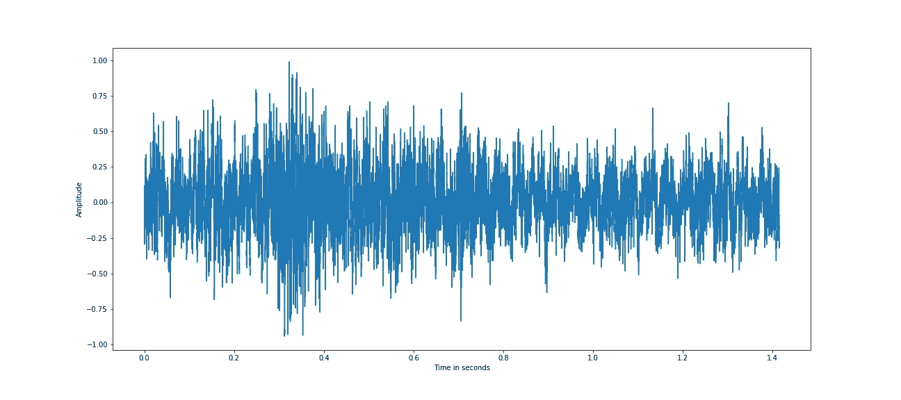

factory1 noise, w[n] from NOISEX92 database

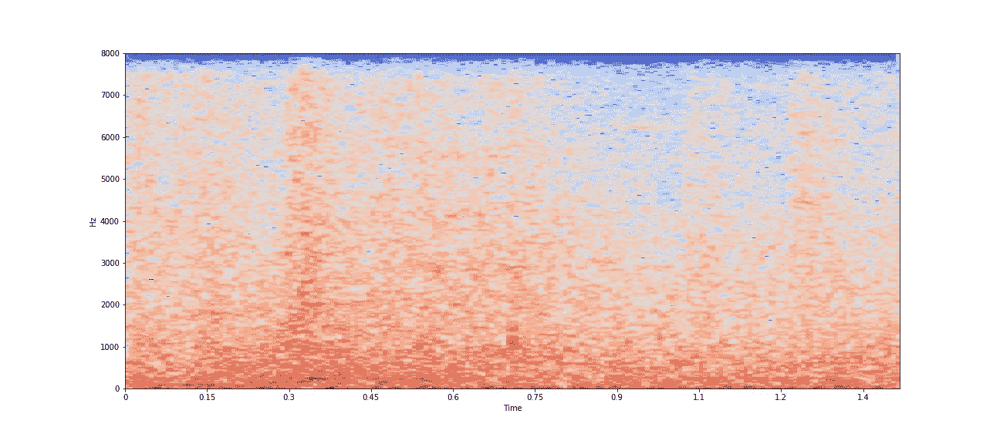

Log scaled spectrogram of the factory1 noise using a window size of 30 ms and hop size of 7.5 ms

上图是取自 [NOISEX92](http://www.speech.cs.cmu.edu/comp.speech/Section1/Data/noisex.html) 数据库的时域和频域的因子 1 噪声。上述噪声样本被重新采样到与语音样本相同的采样速率，16 kHz，因为我们将语音添加到噪声中，两者应该具有相同的采样速率。

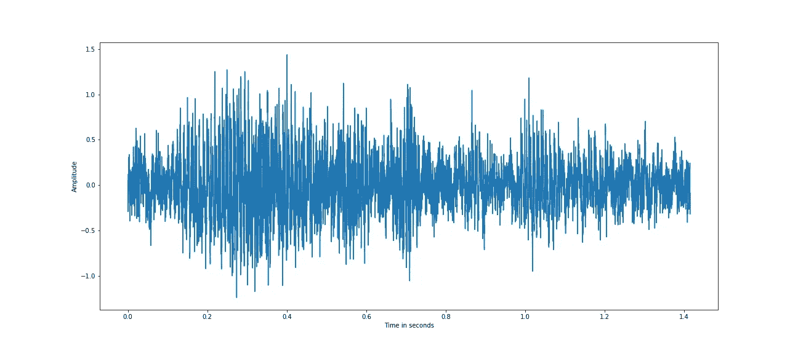

Noisy speech, u[n] at an SNR of 0dB

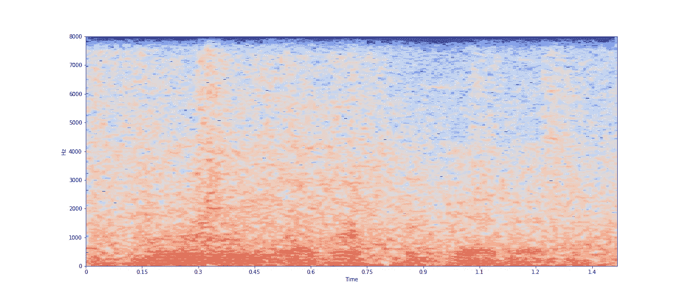

Log scaled spectrogram of noisy speech using a window size of 30 ms and hop size of 7.5 ms

上面的图是在时域和频域中的噪声语音。语音信号中的噪声会改变整个信号，并且很难分析和提取语音片段。存在各种语音增强算法来减少噪声分量并提高语音的可懂度。

对于给定的文本句子，噪声可能以拼写错误和遗漏单词的形式出现，这可能会改变句子的意思或创建一个无意义的句子。例如:

*‘我们会忘记它吗’*

嘈杂的文字句子:*《我们永远不会忘记它》*

在上面的嘈杂文本中，noise 以单词' *ever'* 的形式出现，改为 *'never '，*，从而改变了句子的意思。

另一种形式的嘈杂文字:*‘我们永远不会忘记它吗’*

在上面有噪声的文本中，噪声以单词' *forget'* 变为 *'forggt '，*的形式出现，由于单词 *'forggt'* 拼写错误，使得句子没有意义。

因此，可以看出，在语音中添加噪声会使整个信号失真，而在文本中，失真是离散的，就像丢失一个字符/单词或拼写错误。

***言语分析的例证***

我们现在将说明一种重要的语音分析技术。任何音频信号的记录通常包含许多无声区域，我们可能只对存在语音的片段感兴趣。这对于从包含长静默区域的信号中自动提取语音片段是有用的，因为静默区域不传达任何信息。这些语音片段可以被进一步分析用于各种应用，如语音识别、说话者和情感分类。

因此，在大多数语音应用中，静音检测是一个重要的预处理步骤。

给定语音信号*s【n】*，可以通过比较短持续时间内的片段的相对能量来检测无声区域。我们取 20 ms 的帧大小，并将短期能量信号 *e[n]* 计算为 *s[m]* 的平方和，其中 *m* 在 *n* *的+/-10 ms(在样本中)内。*根据我们想要检测的语音信号能量的时间变化量来选择帧大小。短帧大小能够检测能量的突然变化，但是由于某些音素中固有的无声部分，如突发和单词之间的无声部分，可能给出许多交替的无声段帧。

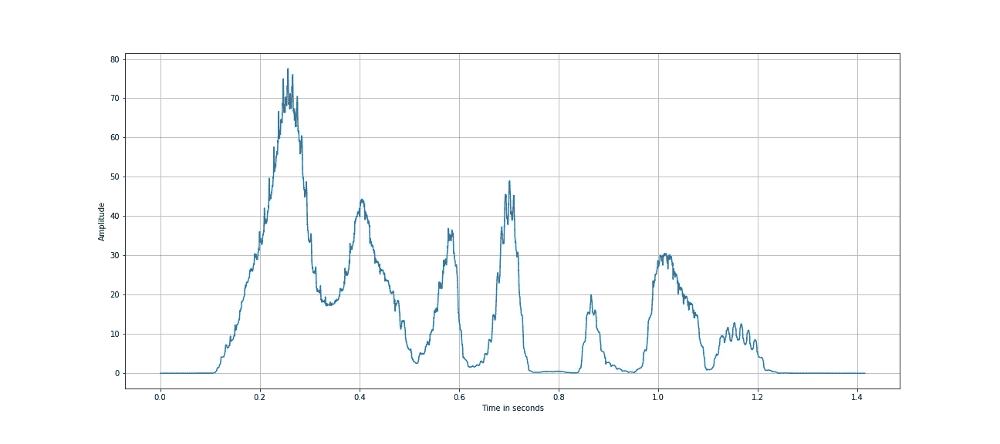

Short term energy, e[n]of speech signal

从上面的图中可以看出，语音信号的短期能量突然变化，并且可以使用相对阈值来检测静默区域。

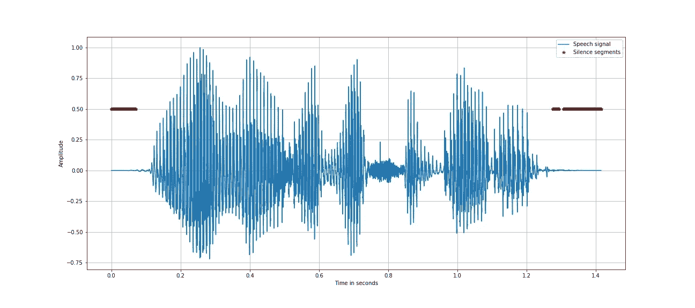

Silence detection in speech signal

上图显示了通过使用语音信号的平均短期能量的 0.01%的阈值以红色突出显示的静默区域。基于对语音信号中短期能量变化的观察来选择阈值。

无声检测中的一个挑战是在语音信号有噪声的情况下，语音的无声区域中的相对能量也会很高。在噪声主要具有高频分量的情况下，这可以通过观察低通滤波语音信号的短期能量的变化来解决。

**本文中所做的模拟演示可以在**[**Github**](https://github.com/vijaygirish2001/speech_analysis)**和**[**nb viewer**](https://nbviewer.jupyter.org/github/vijaygirish2001/speech_analysis/blob/master/speech_analysis.ipynb)**找到。**

希望这篇文章和演示对你有用。在接下来的文章中，我将尝试添加更多关于语音信号分析的见解。

***关于作者***

*我是 Belong.co***的一名数据科学家，在印度班加罗尔的印度科学研究所完成了博士学位。**