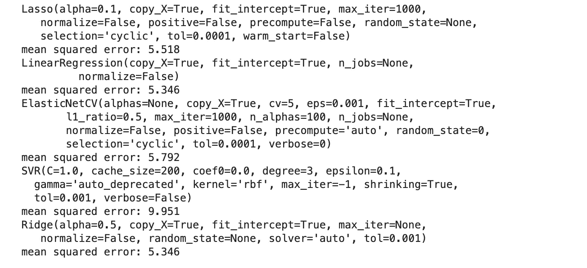

# 三种机器学习的初学者指南

> 原文：<https://towardsdatascience.com/beginners-guide-to-the-three-types-of-machine-learning-3141730ef45d?source=collection_archive---------5----------------------->


Visualising KMeans performance with [Yellowbrick](https://www.scikit-yb.org/en/latest/)

## python 中的分类、回归和无监督学习

机器学习问题一般可以分为三种。分类和回归，被称为监督学习，以及无监督学习，在机器学习应用的环境中通常指聚类。

在接下来的文章中，我将简要介绍这三个问题中的每一个，并将包括流行的 python 库 [scikit-learn](https://scikit-learn.org/stable/index.html) 中的一个演练。

在开始之前，我将简要解释一下监督学习和非监督学习这两个术语背后的含义。

**监督学习:** *在监督学习中，你有一组已知的输入(特征)和一组已知的输出(标签)。传统上，它们被称为 X 和 y。该算法的目标是学习将输入映射到输出的映射函数。以便当给定 X 的新例子时，机器可以正确地预测相应的 y 标签。*

**无监督学习:** *在无监督学习中，你只有一组输入(X)，没有对应的标签(y)。该算法的目标是在数据中找到以前未知的模式。这些算法经常被用来寻找 X 的相似样本的有意义的聚类，因此实际上找到了数据固有的类别。*

## 分类

在分类中，输出(y)是类别。这些可以是二进制的，例如，如果我们对垃圾邮件和非垃圾邮件进行分类。它们也可以是多个类别，如对[花](https://archive.ics.uci.edu/ml/datasets/iris)的种类进行分类，这就是所谓的多类分类。

让我们使用 scikit-learn 完成一个简单的分类示例。如果您尚未安装，可以通过 pip 或 conda 安装，如这里的[所述](https://scikit-learn.org/stable/install.html)。

Scikit-learn 有许多可以通过图书馆直接访问的数据集。为了方便起见，在本文中，我将通篇使用这些示例数据集。为了说明分类，我将使用葡萄酒数据集，这是一个多类分类问题。在数据集中，输入(X)由与每种葡萄酒的各种属性相关的 13 个特征组成。已知的输出(y)是葡萄酒类型，在数据集中，这些类型被赋予数字 0、1 或 2。

我在本文中使用的所有代码的导入如下所示。

```
import pandas as pd
import numpy as npfrom sklearn.datasets import load_wine
from sklearn.datasets import load_bostonfrom sklearn.model_selection import train_test_split
from sklearn import preprocessingfrom sklearn.metrics import f1_score
from sklearn.metrics import mean_squared_error
from math import sqrtfrom sklearn.neighbors import KNeighborsClassifier
from sklearn.svm import SVC, LinearSVC, NuSVC
from sklearn.tree import DecisionTreeClassifier
from sklearn.ensemble import RandomForestClassifier, AdaBoostClassifier, GradientBoostingClassifier
from sklearn.discriminant_analysis import LinearDiscriminantAnalysis
from sklearn.discriminant_analysis import QuadraticDiscriminantAnalysis
from sklearn import linear_model
from sklearn.linear_model import ElasticNetCV
from sklearn.svm import SVRfrom sklearn.cluster import KMeans
from yellowbrick.cluster import KElbowVisualizer
from yellowbrick.cluster import SilhouetteVisualizer
```

在下面的代码中，我正在下载数据并转换成熊猫数据框。

```
wine = load_wine()
wine_df = pd.DataFrame(wine.data, columns=wine.feature_names)
wine_df['TARGET'] = pd.Series(wine.target)
```

监督学习问题的下一步是将数据分成测试集和训练集。算法可以使用训练集来学习输入和输出之间的映射，然后可以使用保留的测试集来评估模型学习该映射的程度。在下面的代码中，我使用 scikit-learn model_selection 函数`train_test_split`来做这件事。

```
X_w = wine_df.drop(['TARGET'], axis=1)
y_w = wine_df['TARGET']
X_train_w, X_test_w, y_train_w, y_test_w = train_test_split(X_w, y_w, test_size=0.2)
```

在下一步中，我们需要选择最适合学习所选数据集中的映射的算法。在 scikit-learn 中有许多不同的算法可供选择，它们都使用不同的函数和方法来学习映射，您可以在这里查看完整列表[。](https://scikit-learn.org/stable/supervised_learning.html#supervised-learning)

为了确定最佳模型，我运行以下代码。我正在使用一系列算法来训练这个模型，并获得每一个算法的 F1 分数。F1 分数是分类器整体准确性的良好指标。我已经详细描述了可以用来评估分类器的各种指标[这里是](/understanding-the-confusion-matrix-and-its-business-applications-c4e8aaf37f42)。

```
classifiers = [
    KNeighborsClassifier(3),
    SVC(kernel="rbf", C=0.025, probability=True),
    NuSVC(probability=True),
    DecisionTreeClassifier(),
    RandomForestClassifier(),
    AdaBoostClassifier(),
    GradientBoostingClassifier()
    ]
for classifier in classifiers:
    model = classifier
    model.fit(X_train_w, y_train_w)  
    y_pred_w = model.predict(X_test_w)
    print(classifier)
    print("model score: %.3f" % f1_score(y_test_w, y_pred_w, average='weighted'))
```


完美的 F1 分数应该是 1.0，因此，数字越接近 1.0，模型性能越好。上述结果表明，随机森林分类器是该数据集的最佳模型。

## 回归

在回归中，输出(y)是连续值而不是类别。回归的一个例子是预测一个商店下个月的销售额，或者你房子的未来价格。

为了再次说明回归，我将使用 scikit-learn 的数据集，即波士顿住房数据集。这由 13 个特征(X)组成，这些特征是房子的各种属性，例如房间数量、年龄和该位置的犯罪率。输出(y)是房子的价格。

我使用下面的代码加载数据，并使用与葡萄酒数据集相同的方法将数据分成测试集和训练集。

```
boston = load_boston()
boston_df = pd.DataFrame(boston.data, columns=boston.feature_names)
boston_df['TARGET'] = pd.Series(boston.target)X_b = boston_df.drop(['TARGET'], axis=1)
y_b = boston_df['TARGET']
X_train_b, X_test_b, y_train_b, y_test_b = train_test_split(X_b, y_b, test_size=0.2)
```

我们可以使用这个[备忘单](https://scikit-learn.org/stable/tutorial/machine_learning_map/index.html)来查看 scikit-learn 中适用于回归问题的可用算法。我们将使用与分类问题类似的代码来循环选择并打印出每个选项的分数。

有许多不同的指标用于评估回归模型。这些本质上都是误差度量，并测量模型实现的实际值和预测值之间的差异。我使用了均方根误差(RMSE)。对于此指标，该值越接近零，模型的性能越好。这篇[文章](https://www.dataquest.io/blog/understanding-regression-error-metrics/)对回归问题的误差度量给出了很好的解释。

```
regressors = [
    linear_model.Lasso(alpha=0.1),
    linear_model.LinearRegression(),
    ElasticNetCV(alphas=None, copy_X=True, cv=5, eps=0.001, fit_intercept=True,
       l1_ratio=0.5, max_iter=1000, n_alphas=100, n_jobs=None,
       normalize=False, positive=False, precompute='auto', random_state=0,
       selection='cyclic', tol=0.0001, verbose=0),
    SVR(C=1.0, cache_size=200, coef0=0.0, degree=3, epsilon=0.1,
    gamma='auto_deprecated', kernel='rbf', max_iter=-1, shrinking=True,
    tol=0.001, verbose=False),
    linear_model.Ridge(alpha=.5)                
    ]for regressor in regressors:
    model = regressor
    model.fit(X_train_b, y_train_b)  
    y_pred_b = model.predict(X_test_b)
    print(regressor)
    print("mean squared error: %.3f" % sqrt(mean_squared_error(y_test_b, y_pred_b)))
```



RMSE 分数表明，线性回归和岭回归算法对该数据集的性能最好。

## 无监督学习

有许多不同类型的无监督学习，但为了简单起见，这里我将集中讨论[聚类方法](https://en.wikipedia.org/wiki/Cluster_analysis)。有许多不同的聚类算法，所有这些算法都使用略有不同的技术来查找输入的聚类。

可能最广泛使用的方法之一是 Kmeans。该算法执行迭代过程，由此启动指定数量的随机生成均值。距离度量[计算每个数据点到质心的欧几里德](https://en.wikipedia.org/wiki/Euclidean_distance)距离，从而创建相似值的聚类。然后，每个聚类的质心成为新的平均值，并且重复该过程，直到获得最佳结果。

让我们使用在分类任务中使用的葡萄酒数据集，去掉 y 标签，看看 k-means 算法从输入中识别葡萄酒类型的能力如何。

因为我们只使用这个模型的输入，所以我使用稍微不同的方法将数据分为测试和训练。

```
np.random.seed(0)
msk = np.random.rand(len(X_w)) < 0.8
train_w = X_w[msk]
test_w = X_w[~msk]
```

由于 Kmeans 依赖于距离度量来确定聚类，因此通常有必要在训练模型之前执行特征缩放(确保所有特征具有相同的比例)。在下面的代码中，我使用 MinMaxScaler 来缩放特征，使所有的值都在 0 和 1 之间。

```
x = train_w.values
min_max_scaler = preprocessing.MinMaxScaler()
x_scaled = min_max_scaler.fit_transform(x)
X_scaled = pd.DataFrame(x_scaled,columns=train_w.columns)
```

使用 K-means，您必须指定算法应该使用的聚类数。因此，第一步是确定最佳聚类数。这是通过迭代多个 k 值并将结果绘制在图表上来实现的。这就是所谓的肘方法，因为它通常会生成一个曲线，看起来有点像你的肘曲线。yellowbrick [库](https://www.scikit-yb.org/en/latest/quickstart.html)(这是一个可视化 scikit-learn 模型的伟大库，可以 pip 安装)对此有一个非常好的规划。下面的代码产生了这种可视化效果。

```
model = KMeans()
visualizer = KElbowVisualizer(model, k=(1,8))
visualizer.fit(X_scaled)       
visualizer.show()
```


通常，在使用聚类技术的情况下，我们不会知道数据集中有多少个类别。然而，在这种情况下，我们知道数据中有三种葡萄酒类型—曲线正确地选择了三种作为模型中使用的最佳分类数。

下一步是初始化 K-means 算法，使模型适合训练数据，并评估该算法对数据进行聚类的有效性。

用于此的一种方法被称为[轮廓评分](https://en.wikipedia.org/wiki/Silhouette_(clustering))。这度量了分类中值的一致性。或者换句话说，每个分类中的值彼此有多相似，以及分类之间有多大的间隔。将为每个值计算轮廓分数，范围从-1 到+1。然后将这些值绘制成轮廓图。同样，yellowbrick 提供了一种简单的方法来构建这种类型的地块。下面的代码创建了葡萄酒数据集的可视化。

```
model = KMeans(3, random_state=42)
visualizer = SilhouetteVisualizer(model, colors='yellowbrick')visualizer.fit(X_scaled)      
visualizer.show()
```


侧影图可以用以下方式解释:

*   平均分数(上面的红色虚线)越接近+1，聚类中的数据点就越匹配。
*   得分为 0 的数据点非常接近另一个聚类的判定边界(因此分离度很低)。
*   负值表示数据点可能被分配到了错误的聚类。
*   每个聚类的宽度应该相当一致，如果不一致，则可能使用了不正确的 k 值。

上面的葡萄酒数据集的图显示，聚类 0 可能不如其他聚类一致，因为大多数数据点低于平均分数，少数数据点的分数低于 0。

轮廓分数在将一种算法与另一种算法或不同的 k 值进行比较时特别有用。

在这篇文章中，我想简单介绍一下这三种类型的机器学习。在所有这些过程中还涉及许多其他步骤，包括特征工程、数据处理和超参数优化，以确定最佳数据预处理技术和最佳使用模型。

感谢阅读！