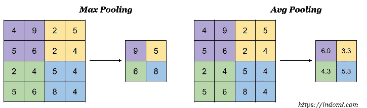

# 卷积神经网络初学者指南

> 原文：<https://towardsdatascience.com/beginners-guide-to-understanding-convolutional-neural-networks-ae9ed58bb17d?source=collection_archive---------3----------------------->

## 了解构成卷积神经网络的重要组件

Camera (Photo by [Dariusz Sankowski](https://unsplash.com/@dariuszsankowski?utm_source=unsplash&utm_medium=referral&utm_content=creditCopyText) on [Unsplash](https://unsplash.com/?utm_source=unsplash&utm_medium=referral&utm_content=creditCopyText))

卷积神经网络(CNN)是一种深度神经网络，已被证明在计算机视觉任务中表现良好，如图像分类、对象检测、对象定位和神经类型转移。在这篇文章中，我将解释构成卷积神经网络的不同层:卷积层、池层和全连接层。

# 卷积层

卷积层对输入图像进行变换，以便从中提取特征。在这个变换中，图像与一个**核(或滤波器)**进行卷积。

Image convolution ([source](http://intellabs.github.io/RiverTrail/tutorial/))

一个**核**是一个小矩阵，其高度和宽度小于要卷积的图像。它也被称为卷积矩阵或卷积掩模。该内核在图像输入的高度和宽度上滑动，并且在每个空间位置计算内核和图像的点积。内核滑动的长度被称为**步幅**长度。**在下图中，输入图像的大小为 5X5，内核的大小为 3X3，步长为 1。**输出图像也被称为卷积特征。

当用通道 3 卷积彩色图像(RGB 图像)时，滤波器的通道也必须是 3。**换句话说，在卷积中，内核中的通道数必须与输入图像中的通道数相同。**

Convolution on RGB image ([source](http://datahacker.rs/006-cnn-convolution-on-rgb-images/))

当我们想使用卷积从一幅图像中提取多个特征时，我们可以使用多个内核，而不是只使用一个。在这种情况下，所有内核的大小必须相同。输入图像和输出图像的卷积特征被一个接一个地堆叠以创建输出，使得通道的数量等于所使用的滤波器的数量。见下图，供参考。

Convolution of RGB image using multiple filters (kernels) ([source](https://indoml.com/2018/03/07/student-notes-convolutional-neural-networks-cnn-introduction/))

**激活函数**是卷积层的最后一个组件，用于增加输出中的非线性。通常，ReLu 函数或 Tanh 函数被用作卷积层中的激活函数。这是一个简单卷积图层的图像，其中 6X6X3 输入图像与大小为 4X4X3 的两个核进行卷积，以获得大小为 3X3X2 的卷积特征，激活函数应用于此以获得输出，这也称为特征图。

A convolution layer ([source](https://indoml.com/2018/03/07/student-notes-convolutional-neural-networks-cnn-introduction/))

# 汇集层

池层用于减小输入图像的大小。在卷积神经网络中，卷积层之后通常是池层。通常添加池层以加快计算速度，并使一些检测到的特征更加健壮。

池操作也使用内核和 stride。在下面的示例图像中，2X2 过滤器用于合并大小为 4X4 的输入图像，跨距为 2。

有不同类型的池。**最大池**和**平均池**是卷积神经网络最常用的池方法。

Max pooling on left, Average pooling on the right ([source](https://indoml.com/2018/03/07/student-notes-convolutional-neural-networks-cnn-introduction/))

**Max Pooling:** 在 Max Pooling 中，从特征图的每个面片中，选择最大值来创建缩小图。

**平均池化:**在平均池化中，从特征图的每个小块中，选择平均值来创建缩减图。

# 全连接层

完全连接的层位于卷积神经网络的末端。先前图层生成的要素地图被展平为矢量。然后，这个向量被馈送到完全连接的层，以便它捕获高级特征之间的复杂关系。这一层的输出是一维特征向量。

A simple architecture of a CNN for binary image classification ([source](https://www.researchgate.net/profile/Michal_Zejmo/publication/318762566/figure/fig3/AS:546467007537152@1507299295287/Architecture-of-sample-CNN-model.png))

以上是用于二值图像分类的卷积神经网络的简单架构。该网络将输入分类为两个不同的类别。该网络接收大小为 32×32×3 的 RBG 图像，输出大小为 2(等于用于分类的类的数量)。该网络的第一层是具有 5×5×3 核的卷积层，第二层是具有 2×2 核大小的最大池层，第三层是具有 5×5×3 核的卷积层，第四层是具有 2×2 核大小的最大池层，输出被平坦化为向量并被馈送到最后两层，这两层都是完全连接的层。

现在，你知道什么是卷积神经网络，以及构成卷积神经网络的不同层，即卷积层、汇集层和全连接层。

***觉得这个帖子有帮助？*** *在下面留下你的想法作为评论。*

[**点击这里**](https://medium.com/@sabinaa.pokhrel) 阅读我其他关于 AI/机器学习的帖子。

[**使用 Py**](/implement-face-detection-in-less-than-3-minutes-using-python-9f6b43bb3160) **thon** 不到 3 分钟实现人脸检测

[**物体检测用不到 10 行代码使用 Python**](/object-detection-with-less-than-10-lines-of-code-using-python-2d28eebc5b11)

[**用不到 10 行代码计算汽车数量使用 Python**](/count-number-of-cars-in-less-than-10-lines-of-code-using-python-40208b173554)

## **参考文献:**

 [## 盘旋

### 卷积是一种数学运算，它对两个函数(信号)的乘积进行积分，其中一个…

Leonardo araujosantos . git books . io](https://leonardoaraujosantos.gitbooks.io/artificial-inteligence/content/convolution.html)  [## # 006 RGB 图像上的 CNN 卷积|主数据科学

### 我们已经看到了 2D 图像上的卷积是如何工作的。现在，让我们看看如何不仅在 2D 上实现卷积…

datahacker.rs](http://datahacker.rs/006-cnn-convolution-on-rgb-images/)  [## 学生笔记:卷积神经网络(CNN)简介

### 这些笔记摘自卷积神经网络课程的前两周(深度学习的一部分…

indoml.com](https://indoml.com/2018/03/07/student-notes-convolutional-neural-networks-cnn-introduction/)  [## 理解神经网络中的激活函数

### 最近，我的一个同事问了我几个类似“为什么我们有这么多激活功能？”，“为什么是…

medium.com](https://medium.com/the-theory-of-everything/understanding-activation-functions-in-neural-networks-9491262884e0)  [## 卷积神经网络池层的简明介绍

### 卷积神经网络中的卷积层总结了输入图像中特征的存在。一个问题…

machinelearningmastery.com](https://machinelearningmastery.com/pooling-layers-for-convolutional-neural-networks/) 

żejmo、米沙&科瓦尔、马雷克&科尔比茨、约瑟夫&蒙扎克、罗曼。(2018).基于卷积神经网络和 Hough 变换的细胞核识别。316–327.10.1007/978–3–319–64474–5_26.