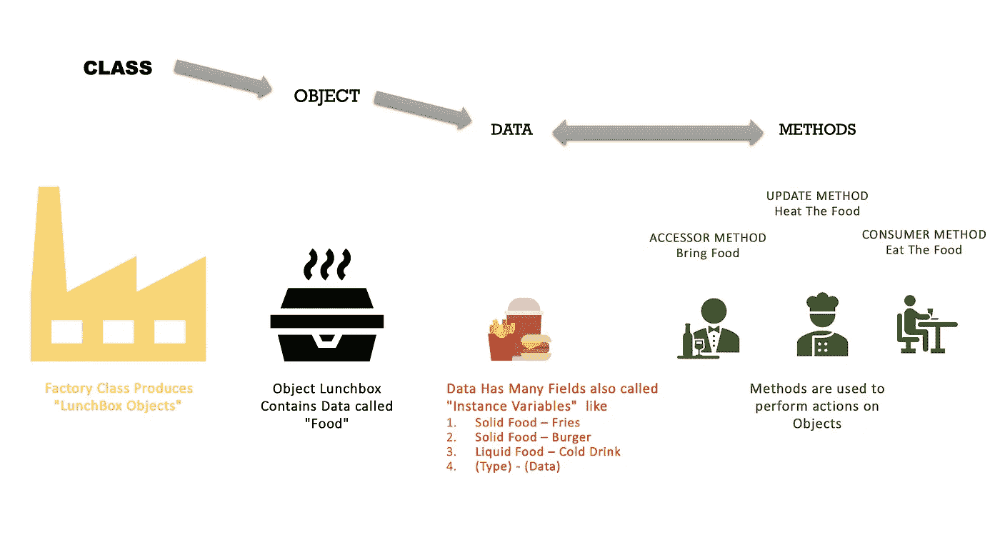
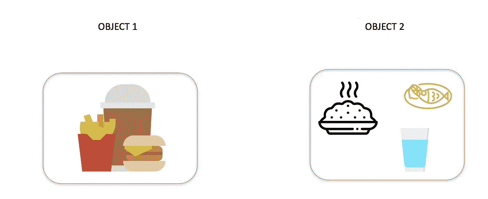

# Java 初学者——面向对象编程入门

> 原文：<https://towardsdatascience.com/beginners-in-java-getting-started-with-oop-6398f0dcdf86?source=collection_archive---------15----------------------->

## Java 是一种面向对象的编程语言——这是什么意思？

每当一种编程方法是基于对象或类，而不仅仅是函数和过程，它就被称为面向对象的**O**O**O**O**P**编程( **OOP** )。

> Java 中的所有代码都必须包含在类中

面向对象语言中的对象被组织成类，或者用更简单的术语来说，一个类产生对象。Java 就是这样一种编程语言。


Photo by [Émile Perron](https://unsplash.com/@emilep?utm_source=medium&utm_medium=referral) on [Unsplash](https://unsplash.com?utm_source=medium&utm_medium=referral)

# 类别和对象

java 程序中的一切都包含在一个类中。一个类可以被认为是一个生产**对象的**工厂**。**对象内部包含数据。它可以有一个或多个数据项。例如，**午餐盒对象**可能包含 3 个数据项

1.  薯条(固体食物**类型**
2.  汉堡(固体食物**型**
3.  冷饮(类型**流食**

我们对象中的这三个不同的项目被称为**字段。每个字段都必须有一个类型。在上面的例子中，我们有 3 个字段，但是其中两个具有相同的类型。同时，我们使用**方法**来处理数据。例如，可以使用方法来查看对象中包含什么数据。这些被称为访问器方法。我们也可以拥有修改对象内部数据的方法。这些被称为更新方法。**

假设我们有一个食品厂(**类**)。它制造饭盒(**物体**)。午餐盒包含 3 种不同的食物(**字段**)。其中两个是同类型(**固体食物**)一个是不同类型(**液体食物**)。我们有 3 个人互动使用这种食物。厨师**(方法 1)** 加热食物，服务员(**方法 2** )上菜，消费者(**方法 3** )吃食物。



How OOP Works

> 在 Java 程序中，主要的“参与者”是 ***对象*** 。每个对象都是一个类的 ***实例*** ，它作为对象的*类型和蓝图，定义了对象存储的数据以及访问和修改这些数据的方法。
> — *迈克尔·t·古德里奇、罗伯托·塔玛西亚、迈克尔·h·戈德瓦瑟(****Java 中的数据结构与算法*** *)**

## *理解对象*

*一个对象是类的一个实例，即一个类可以产生许多对象。例如*

## *对象 1*

1.  *固体食物项目 1——薯条*
2.  *固体食物项目 2——汉堡*
3.  *液体食品项目 1——冷饮*

## *对象 2*

1.  *固体食物项目 1——大米*
2.  *固体食物项目 2——鱼*
3.  *液体食品项目 1 —水*

**

# *该过程*

*让我们试着看看如何构建一个基本的工厂类。让我们先来看看完整的代码。*

## *文件名*

*行 **public class Factory{}** 包含了完整的代码。该文件必须以类名命名。所以文件名也是 Factory.java。*

```
*public class Factory{
   ...
}*
```

## *字段/实例变量*

*现在最上面的 3 行给出了你想要的午餐盒中的 3 个项目(实例变量)。现在你可以看到所有 3 个都有相同的类型= **字符串。** Java 给了你创建自己的**类型**的灵活性，这实质上意味着用那个名字创建一个类。例如，如果你要创建一个 **SolidFood** 类，你就必须编写 **public class SolidFood{}** ，如此而已。*

*现在我们有 3 个 String 类型的实例变量，命名为 SolidFood1、SolidFood2 和 LiquidFood1。*

```
 *private String SolidFood1;    // **Solid Food 1st Instance Variable**
 private String SolidFood2;    // **Solid Food 2nd Instance Variable** 
 private String LiquidFood1;   // **Liquid Food 3rd Instance Variable***
```

## *构造器*

*创建对象的代码位于**构造函数内部。**构造函数可以是空的，也可以接受一些用于定义对象的输入参数。在我们的例子中 **sf1、sf2 和 lf1** 是定义我们的午餐盒中包含哪些项目的参数。*

> *简单地说，构造函数定义了对象的字段是什么样子的。*

```
*public Factory(){}      // **0-arg constructor (Not used)**
// **3-arg constructor**
 public Factory(String sf1, String sf2, String lf1){      
  SolidFood1   = sf1;
  SolidFood2   = sf2;
  LiquidFood1  = lf1;
 }*
```

## *方法*

*方法用于获取或修改对象字段。在我们的例子中，我们只编写了获取项目名称的字段。*

```
*public String getSF1(){return SolidFood1;} // **Method to get the name of 1st Instance Variable**
 public String getSF2(){return SolidFood2;} // **Method to get the name of 2nd Instance Variable**
 public String getLF1(){return LiquidFood1;} // **Method to get the name of 3rd Instance Variable***
```

*main 方法是每个程序中唯一需要的方法。它是 java 编译器唯一运行的东西。在 main 中，你可以创建对象，在这些对象上使用方法并打印东西。*

## *对象创建*

*对象是通过调用构造函数创建的。一旦创建了一个对象，您可以使用各种方法来理解或修改该对象。这里我们只是展示如何访问字段名。*

```
*Factory lunchBox = new Factory("s1","s2", "l1"); // **Object Created Yay!!!***
```

## *怎么跑*

*万一你没有 java，请访问这个页面。*

*[](https://java.com/en/download/help/mac_install.xml) [## 如何为我的 Mac 安装 Java？

### 如果 web 浏览器中禁用了 Java 内容，安装程序会通知您，并提供启用它的说明。如果…

java.com](https://java.com/en/download/help/mac_install.xml) 

假设您的系统中安装了 java，您应该能够使用以下命令运行该程序。

```
> javac Factory.java (**This command compiles your code into Machine Readable Code)**> java Factory (**Running the Program**)
```

您看到的输出如下所示

*

*OOP 中包含了更多的东西。这只是开始。后面的文章将包括更多的面向对象编程的概念。*

## *参考*

1.  *[要点链接](https://gist.github.com/rishisidhu/291f9786e3b7c0b6c9036461b4e3440c)*
2.  *[Java 下载](https://java.com/en/download/help/download_options.xml#mac)*
3.  *[数据结构书](https://www.wiley.com/en-us/Data+Structures+and+Algorithms+in+Java%2C+6th+Edition-p-9781118771334)*