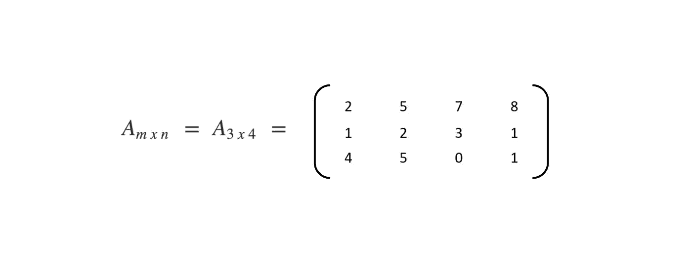

# 矩阵入门

> 原文：<https://towardsdatascience.com/beginners-introduction-to-matrices-bd39289cc66a?source=collection_archive---------15----------------------->

## 从理论物理到神经网络，矩阵运算无处不在。

矩阵是数据科学的基石。他们以不同语言的不同形象出现。从 Python 中的 numpy 数组，到 R 中的 dataframes，再到 MATLAB 中的 matrix。

矩阵最基本的形式是以矩形或类似阵列的方式排列的数的集合。这可以代表一个图像，或者一个网络，甚至一个抽象的结构。

A rectangular array of 3 rows and 4 columns.

矩阵，矩阵的复数形式，比你想象的要普遍得多。

我们所有通过 Adobe Photoshop 制作的迷因都使用矩阵处理线性变换来渲染图像。一个*方阵*可以表示一个几何对象的线性变换。

例如，在笛卡尔 X-Y 平面中，矩阵

Interesting matrix

用于创建对象在垂直 Y 轴上的倒影。在视频游戏中，这将呈现倒映在血泊中的刺客图像。如果视频游戏有弯曲的反射面，比如一间镜子房，矩阵会更复杂，以拉伸或收缩反射。

[xkcd — Rotation](https://xkcd.com/184/)

在应用物理学中，矩阵用于研究电路、量子力学和光学。航天工程、化学工程等。所有这些都需要从矩阵变换中获得完全校准的计算。在医院、医学成像、CAT 扫描和 MRI 中，使用矩阵来生成输出。

Photo by [JESHOOTS.COM](https://unsplash.com/@jeshoots?utm_source=medium&utm_medium=referral) on [Unsplash](https://unsplash.com?utm_source=medium&utm_medium=referral)

在编程中，矩阵和逆矩阵用于编码和加密消息。在机器人和自动化中，矩阵是机器人运动的基本组成部分。基于使用矩阵的计算获得用于控制机器人的输入。

# 他们长什么样？

按照惯例，矩阵中的行数由 **m** 表示，列数由 **n** 表示。由于矩形的面积是*高* x *宽，*我们用***m***x***n .***来表示矩阵的大小，因此该矩阵被称为 **A，**它在符号上可以写成

Matrix notation

这里 m=3，n=4。因此，矩阵 A 中有 12 个元素。方阵是具有 **m=n** 的矩阵。

Square matrix

只有一行的矩阵称为**行矩阵**，只有一列的矩阵称为**列矩阵。**

# 我们能用它们做什么？

矩阵就像数字一样，可以加减乘除。不过，这种划分略有不同。不是所有的矩阵都可以整除。

连加减乘除都有一定的规律。

## **矩阵加法**

两个矩阵 A( *m*n* ) 和B( *m*n* ) 相加得到一个矩阵 C( *m*n* )。C 的元素是 A 和 B 中相应元素的和

减法的工作原理类似。

这里需要注意的是，您只能对具有相同行数和列数的矩阵进行加减运算，即**相同的顺序(*顺序=行 x 列)***

*   A 的行数= B 的行数
*   A 的列数= B 的列数

## 注意事项

*   矩阵的加法是可交换的，这意味着 A+B = B+A
*   矩阵的加法是**结合的**，这意味着 A+(B+C) = (A+B)+C
*   矩阵的减法是**不可交换的**，这意味着 A-B ≠ B-A
*   矩阵的减法是**非关联的**，意思是 A-(B-C)≦(A-B)-C
*   矩阵 A、B、A-B 和 A+B 的顺序总是相同的
*   如果 A 和 B 的顺序不同，A+B，A-B 就无法计算
*   加法/减法运算的复杂度是 O(m*n ),其中 m*n 是矩阵的阶

尽管乘法有点复杂

## 矩阵乘法

两个矩阵 A( *m*n* ) 和*B(n** p*)*相乘得到一个矩阵 C( *m*p* )。请注意，对于乘法运算，您不需要 A 和 B 的行/列相同。你只需要**

*   **A 的列数= B 的行数**
*   **或者，B 的列数= a 的行数。**

**要计算结果矩阵 C 的左上元素，将 A 的第一行元素与 B 的第一列元素相乘并相加**

****

**Multiplication**

## **注意事项**

*   **矩阵的乘法是不可交换的，这意味着 A*B ≠ B*A**
*   **矩阵的乘法是结合律，这意味着 A*(B*C) = (A*B)*C**
*   **A*B 的存在并不意味着 B*A 的存在**
*   **乘法运算(A*B)的复杂度为 O(m*n*p)其中 m*n 和 n*p 分别是 A 和 B 的阶**
*   **作为 A*B 计算的矩阵 C 的阶是 m*p，其中 m*n 和 n*p 分别是 A 和 B 的阶**

**在这篇文章的下一个版本中，我们将看到更多可以在矩阵上执行的操作，例如矩阵的逆矩阵、矩阵的行列式、矩阵的伴随矩阵等等。**

**我们还将看到这些矩阵如何在[神经网络](https://medium.com/x8-the-ai-community/how-to-train-your-d̶r̶a̶g̶o̶neural-net-backpropagation-intiution-3fc575ec7f3d)和图像处理领域发挥作用。**

**从[KNN](/laymans-introduction-to-knn-c793ed392bc2)(K-最近邻算法)到[随机森林](https://medium.com/x8-the-ai-community/building-intuition-for-random-forests-76d36fa28c5e)，矩阵在几乎所有的机器学习算法中都非常重要。**