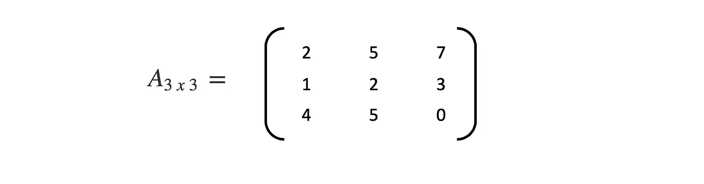
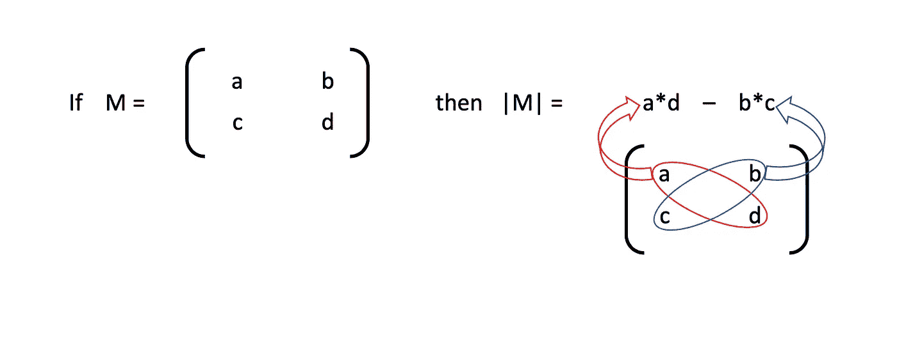
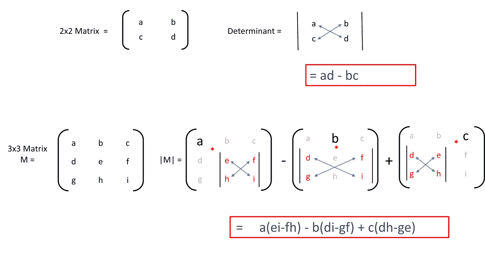
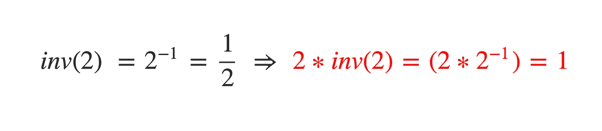
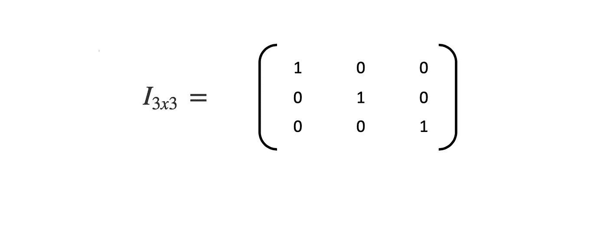
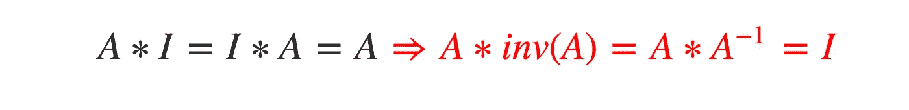

# 矩阵入门—第二部分

> 原文：<https://towardsdatascience.com/beginners-introduction-to-matrices-part-ii-42b86e791b8b?source=collection_archive---------35----------------------->

## 从设计游戏到发射火箭，矩阵运算无处不在

在第一部分中，我们讨论了像加法、减法和乘法这样的基本运算。在这一部分，让我们看看如何计算矩阵的行列式，以及术语**矩阵求逆**是什么意思。

继续前面的例子，让我们看看我们的方阵(*方阵的行数等于列数*

Square matrix with m=3, n=3 | A(*mxn)*

这个矩阵的行列式将是一个单一的数字。它不会是一个矩阵。行列式可以看作是将矩阵转化为数字的函数。矩阵 **A** 的行列式写成 **|A|** 。

determinant of a 2x2 matrix

行列式只存在于方阵中。它是方阵的一个性质。对于一个 3×3 的矩阵，行列式的计算应该是这样的

注意**++**模式(+a…b…+c…d…)。记住这一点很重要。这种模式在 4x4 矩阵和更高矩阵中继续存在。这种计算行列式的方法叫做**拉普拉斯展开。**这决不是唯一的方法，还有其他方法。

行列式不仅用作计算工具(解线性方程，计算面积和体积)，而且在力学中也有重要的应用。它们可以用来计算桁架或其他机械结构的稳定性。

具有讽刺意味的是，行列式的最大用途是它的零。如果一个矩阵的行列式为 0，那么就是需要注意的情况。好坏取决于应用。

## 矩阵的逆

在数学中，数的倒数写为

所以一个数和它的倒数相乘总是得到 1。(除非数字为 0，在这种情况下，不定义逆本身)。

对于矩阵，逻辑是一样的。如果**矩阵的逆矩阵存在**，则将矩阵与其逆矩阵相乘得到**单位矩阵。**这里需要注意两件事

*   如果 1)矩阵是正方形的，2)它的行列式不为零，则存在逆
*   单位矩阵的所有元素除了主对角线都是 0。主对角线元素都是 1。单位矩阵总是用字母 **I.** 表示

这是一个非常特殊的矩阵，因为如果你试图将它与另一个 *mx3* 矩阵相乘，结果将是同一个矩阵。

## 为什么我们需要一个反义词

在矩阵的世界里，没有除法运算。因此，如果你必须在一个方程中求解 **X** ，其中 **A，X 和 B** 都是矩阵

唯一的方法就是取 a 的倒数。

There is no B/A in matrices

反演的最大应用是在电脑游戏中——光线追踪。在游戏世界中，为了实现 3d 效果，需要将鼠标点击转化为游戏的 3d 空间中的实际动作。这个操作和无数其他操作需要矩阵求逆。反演也用于反射。

Photo by [Ales Nesetril](https://unsplash.com/@alesnesetril?utm_source=medium&utm_medium=referral) on [Unsplash](https://unsplash.com?utm_source=medium&utm_medium=referral)

在下一部分，我们将计算一个实际的逆矩阵，并探索矩阵乘法的 python 库。