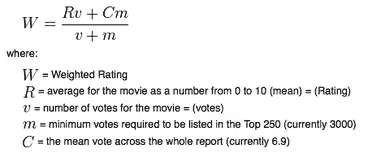
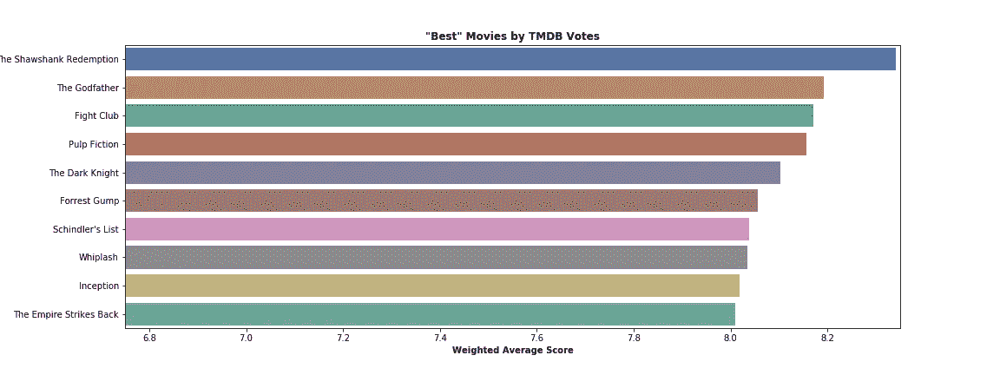
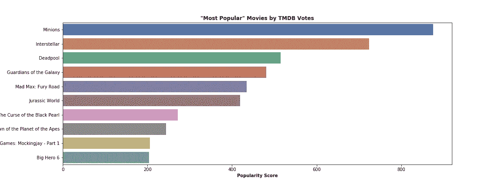
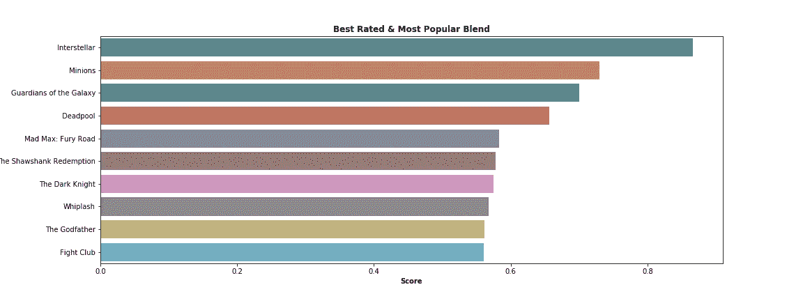
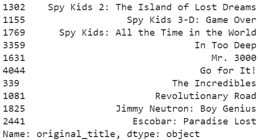

# Python 初学者推荐系统

> 原文：<https://towardsdatascience.com/beginners-recommendation-systems-with-python-ee1b08d2efb6?source=collection_archive---------7----------------------->

## 用 TMDB 5000 电影数据集构建我们自己的推荐系统

Photo by [Myke Simon](https://unsplash.com/@myke_simon?utm_source=medium&utm_medium=referral) on [Unsplash](https://unsplash.com?utm_source=medium&utm_medium=referral)

# 本教程的目标

以下是您的一些目标:

*   了解什么是推荐系统，它们是如何工作的，以及它们的不同风格
*   使用 Python 和 [TMDB 5000 部电影数据集](https://www.kaggle.com/tmdb/tmdb-movie-metadata)实现几个推荐系统

# 什么是推荐系统？

一个**推荐系统**(通常也被称为推荐/推荐引擎/平台)试图预测用户对可用项目(例如 Spotify 上的歌曲)的兴趣，并相应地给出推荐。有两种主要类型的推荐系统:

*   **基于内容的过滤系统**根据项目本身的特点做出推荐。因此，如果网飞用户一直在狂看科幻电影，网飞会更快地推荐另一部科幻电影，而不是浪漫喜剧。我们将用 Python 实现这个推荐系统。
*   **协同过滤系统**基于用户交互做出推荐。假设我们都在亚马逊上买了一把电吉他，我也买了一个功放。然后亚马逊会预测你也会对这款功放感兴趣，并向你推荐。

> Ibtesam Ahmed 在这个数据集上的 [Kaggle 内核值得称赞。这篇文章旨在以中等风格的格式遵循她的教程。](https://www.kaggle.com/ibtesama/getting-started-with-a-movie-recommendation-system)

# 建立一个基本的推荐系统

## 设置

和往常一样，我们将首先导入必要的包和数据集:

Setup for our notebook

这两条打印语句给出了以下输出:

*   *演职员表:(4803，4)*
*   *电影 _ 不完整:(4803，20)*

所以我们正在研究 4803 部电影。请注意，我们的数据现在被分成两个数据帧。参考[本要点](https://gist.github.com/deansublett/06f010a886831f9dac5b1f9bce4f4229)了解如何组合和清理数据帧。在遵循教程的同时保持这个要点是最容易的。

我们将从两个非常基本的推荐系统开始——我们将向用户推荐评分最高的电影列表和另一个最受欢迎的电影列表。但是首先我们要找到每部电影的平均评分的加权平均值( **vote_average** 值)。在 Ibtesam 的带领下，我们将使用 IMDB(以前)用于计算电影加权评分的公式。

[Source](http://trailerpark.weebly.com/imdb-rating.html)

这里有一个如何得到加权平均值的例子:

我选择了 *0.70* 作为我对 *quantile()* 的参数，以表明我只关心那些至少获得了我们的电影数据集中 70%的投票的电影。选择我们的值为 **m** 有点武断，所以在这里做一些实验。

## 推荐者 Mk1:

现在我们已经为我们的第一个推荐系统做好了准备。下面推荐十部**加权平均收视率最高的电影:**

我们得到了这张最受欢迎的照片:

我们看到我们的就职系统推荐了一些经典。但是如果我们想推荐在 TMDB 用户中受欢迎的电影呢？

## 推荐者 Mk2:

我们可以使用我们数据的**流行度**特性来根据流行度推荐电影:

现在，我们可以看到基于受欢迎程度分数的推荐:

啊，正如我们所料:来自*小兵*的出色表现。现在，如果我们想根据电影的加权平均评分*和*受欢迎程度评分来推荐电影，该怎么办呢？

## 推荐者 Mk3:

为了避免*小黄人*的巨大受欢迎度得分扭曲我们的新评分系统，我对**加权平均**和**受欢迎度**列中的值进行了归一化。我决定采用 50/50 的比例加权平均评分和受欢迎程度评分，但同样不要害怕尝试这种分割:

现在我们有了一个新的**评分**栏，它考虑了一部电影的加权平均评分及其受欢迎程度评分，我们可以看到我们的推荐系统将为我们提供哪些电影:

以下是我们基于五五分成的建议:

这些推荐者按预期工作，但我们当然可以改进。现在我们必须转向基于内容的过滤。

# 基于内容的过滤

所以现在我们感兴趣的是使用一部电影的特征来向用户推荐其他电影。再次遵循 Ibtesam 的例子，我们现在将根据**概述**栏中给出的电影情节概要提出建议。因此，如果我们的用户给我们一个电影名称，我们的目标是推荐具有相似情节概要的电影。

## 单词矢量化和 TF-IDF

在我们开始对情节摘要进行任何分析之前，我们必须将**概述**列中的文本转换为单词向量，并且我们还必须在**概述**上安装一个 TF-IDF:

我们会收到以下输出:

*   *(4803，10417)*

所以在情节摘要中使用了大约 10，000 个独特的词来描述我们的 5，000 部电影(注意，这个数字比 Ibtesam 的小，因为我用 *min_df=3* 将最小词频增加到了 3)。如果你有兴趣了解更多，我在[这篇文章](/what-i-learned-from-abhishek-thakur-4b905ac0fd55)中也谈到了 TF-IDF。

## 计算相似性得分

现在我们有了一个单词矩阵，我们可以开始计算相似性得分。这个指标将帮助我们挑选出与用户提交的电影情节概要相似的电影。Ibtesam 选择了线性内核，但是我想尝试一下 sigmoid 内核，以获得乐趣。幸运的是，我得到了相似的结果:

既然我们已经构建了基于内容的过滤系统，让我们用永恒的最爱*间谍小子*来测试一下:

以下是我们对基于内容的过滤系统的建议:

因此，我们的推荐系统给了我们一些与*间谍小子*相关的精选，但也有一些失误，如《太深了中的*和*埃斯科瓦尔:失乐园*。*

## 限制

基于上述结果，我们可以看到我们的基于内容的过滤系统有一些局限性:

1.  我们的推荐者挑选了一些可能被搜索与 *Spy Kids 相关的标题的用户认为不合适的电影。*为了改进我们的系统，我们可以考虑用字数来代替 TF-IDF，我们还可以探索其他相似性得分。
2.  我们的系统只考虑每部电影的情节概要。如果我们像 Ibtesam 一样，考虑其他特征，如演员、导演和类型，我们可能会在找到相关电影方面有所改进。
3.  我们目前的系统只根据特征的相似性来推荐电影。所以我们的推荐器遗漏了用户可能喜欢的其他类型的电影。我们需要尝试协同过滤来解决这个问题，但是我们的数据集不包括用户信息。

# 摘要

总而言之，我们涵盖了以下内容:

*   什么是推荐系统，它们如何工作，以及一些不同的类型
*   如何基于加权平均评分、受欢迎程度以及两者的混合来实现非常基本的推荐系统
*   如何创建基于内容的过滤系统，以及如何认识到基于内容的推荐的局限性

# 附录/进一步阅读

*   [TMDB 5000 部电影数据集](https://www.kaggle.com/tmdb/tmdb-movie-metadata)
*   [本教程归功于 Ibtesam Ahmed 的内核](https://www.kaggle.com/ibtesama/getting-started-with-a-movie-recommendation-system)
*   [我的 Colab 笔记本的要点(包含文章中引用的所有代码)](https://gist.github.com/deansublett/06f010a886831f9dac5b1f9bce4f4229)
*   [介绍 2019 年推荐系统](https://tryolabs.com/blog/introduction-to-recommender-systems/)
*   [第九章:推荐系统](http://infolab.stanford.edu/~ullman/mmds/ch9.pdf)
*   [TF-IDF scikit-learn 文档](https://scikit-learn.org/stable/modules/generated/sklearn.feature_extraction.text.TfidfVectorizer.html)
*   [sci kit-了解 sigmoid-内核用户指南及更多内容](https://scikit-learn.org/stable/modules/metrics.html#sigmoid-kernel)