# 开始实时复制自然对话

> 原文：<https://towardsdatascience.com/beginning-to-replicate-natural-conversation-in-real-time-d4f6b7f62e08?source=collection_archive---------14----------------------->

## 进入文学的第一步

为了开始我的新项目，我首先要做的当然是浏览当前的研究和最先进的模型。

最近我接受了[采访，在采访中我用](https://companyconnecting.com/news/conversational-ai-angus-addlesee-heriot-watt) [Wallscope](https://medium.com/wallscope) 解释了这个新项目，但简而言之(非常短):我的目标是让对话代理人更自然地交谈。

我并没有穷尽这一领域的所有文献，我只是触及了皮毛(如果你知道我必须阅读的相关论文，请在下面链接)。这里是一些研究的概述和走向更自然的对话代理的旅程。在这方面，我将参考以下文件:

[1]

> **马修·罗迪、加布里埃尔·斯坎茨和娜奥米·哈特利用 LSTMs** 研究连续话轮转换预测的语音特征

[2]

> **由 Divesh Lala、Koji Inoue、Pierrick Milhorat 和 Tatsuya Kawahara 开发的用于识别人机交互参与的社交信号检测**

[3]

> **朱利安·霍夫(Julian Hough)和大卫·施朗根(David Schlangen)利用实时、真实世界的基础策略研究人机交互的流畅性**

[4]

> Angelika Maier、Julian Hough 和 David Schlangen 的**走向情景口语对话系统的深层话轮结束预测**

[5]

> **Gabriel skan tze 的《人机对话中的协调》**( 2019 年 3 月 7 日在格拉斯哥的演讲)

# 内容

简介
转弯结束-转弯预测
接合
实施例
流体增量接地策略
结论

# 介绍

如果我们想到两个人进行流畅的对话，这与人类与 Siri、谷歌助手、Alexa 或 Cortana 之间的对话非常不同。

[source](https://homeautotechs.com/siri-vs-google-vs-alexa-vs-cortana-which-one-is-best-voice-assistant/)

流量损失的一个原因是大量的暂停。对于一个会话代理(CA)来说，如果它检测到你已经说完了你正在说的话(完成了你的话轮)，它会等待一段时间的静默。如果它检测到长时间的停顿，它会认为你已经完成了你的话轮，然后处理你的话语。

不同系统之间设置的静默持续时间略有不同。如果它设置得太低，CA 会在中途打断你，因为人类的对话充满了停顿。如果设置的太高，系统会更准确的检测到你的回合结束，但是 CA 会花费很长的时间来响应——扼杀了对话的流畅，让用户感到沮丧。

当两个人说话时，我们倾向于尽量缩小话轮之间的差距，这是跨文化的。在全球范围内，转弯之间的间隔大约为 200 毫秒，接近人类反应时间的极限[1]。因此，在听别人说话时，我们必须预测说话者的话轮结束。

# 转弯-转弯结束预测

要重现这种流畅的对话，在 CAs 中使用快速切换和轻微重叠，我们必须首先了解我们自己是如何做到的。

> 不要脸，但略有关联，自我推销。为了研究计算机视觉，我们必须先了解人类视觉

我们下意识地解读话轮转换的暗示来检测什么时候轮到我们说话，那么我们使用什么暗示呢？类似地，我们在听别人说话时不断地这样做，那么我们能重现这种递增的过程吗？

[4]使用声学和语言学特征训练 LSTM 来标记 10ms 窗口。他们的系统的任务是将这些窗口标记为语音、中途停顿(MTP)或 EOT，但主要焦点当然是标记为 EOT 的序列中的第一点。

LSTM 中使用的**声学特征**是:原始音高、平滑后的 F0、均方根信号能量、对数信号能量、强度、响度以及作为声学特征的每一帧的衍生特征。

除了这些声学特征之外，**语言特征**由单词和称为加权平均对数三字组概率(WML)的增量句法概率的近似值组成。

许多其他的信号被识别来指示说话者是要继续说话还是已经完成了他们的话轮[5]:

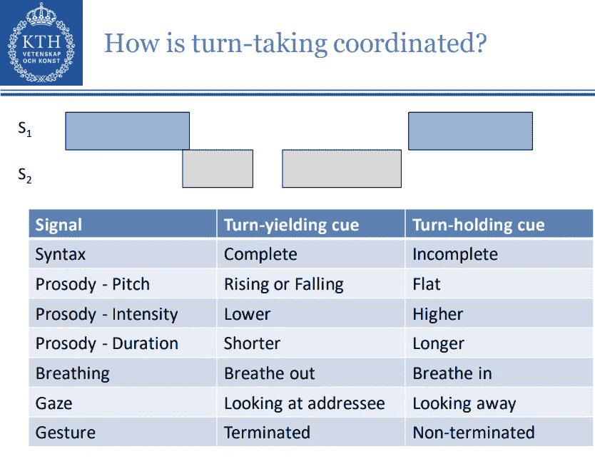

[5]

如前所述，等待 10 秒钟的响应就像 CA 不停地在你中途切入一样令人恼火[4]。因此，在 50 毫秒和 6000 毫秒之间定期考虑多个基线，以确保基线中包含多个权衡。

除了一个案例(只有语言特征，500 毫秒沉默阈值)，每个模型都超过了基线。仅使用语言或声学特征不会产生太大的差异，但是当模型同时使用两组特征时，性能总是最佳的。最好的整体系统的延迟为 1195 毫秒，切入率仅为 18%。

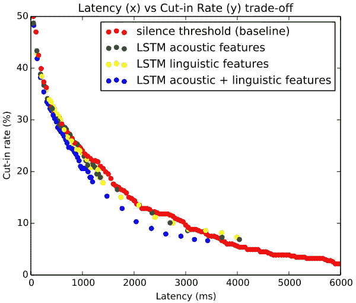

[4]

[1]陈述了我们从多模态信号预测 EOT，多模态信号包括:韵律、语义、句法、手势和眼睛注视。

传统模型不是标记 10ms 窗口(如语音、MTPs 或 EOTs ),而是预测说话者是继续说话(保持)还是完成了他们的话轮(转换),但只有在检测到暂停时才会这样做。这种传统方法的一个主要问题是，反向信道既不是保持也不是转移，而是无论如何都要预测其中之一。

LSTMs 已经被用于以 50 毫秒的间隔连续进行预测，并且当应用于保持/移位预测时，这些模型优于传统的 EOT 模型，甚至优于人类。它们的隐藏层允许它们学习长期相关性，但是不知道哪些特征对性能影响最大。

在[1]中，新系统完成了三个不同的话轮转换预测任务:(1)停顿时的预测，(2)开始时的预测，(3)重叠时的预测。

**暂停时的预测**是在交互中的短暂暂停时发生的标准预测，用于预测是否会有暂停或转换。本质上，当暂停超过阈值时间时，具有最高平均输出概率(得分)的人被预测为下一个发言。这个分类模型用加权 F 分数进行评估。

**开始时的预测**对讲话过程中的话语进行分类，而不是在停顿时。然而，该模型略有不同，因为它预测当前正在进行的话语是短还是长。同样，作为一个分类器，这个模型使用加权 F 值进行评估。

**首次引入重叠预测**。这本质上又是一个保持/移位预测，但是当至少 100 毫秒的重叠周期出现时。当重叠是反向信道时，预测保持(继续讲话)的决定，并且当系统应该停止讲话时，进行转换。这再次使用加权 F 分数进行评估。

下面是一个预测话轮转换的例子:

如上所述，我们并不确切知道我们使用哪些特征来预测何时轮到我们发言。[1]在不同的排列中使用了许多特征来区分哪些是最有用的。所使用的特征如下:

**声学特征**是低级描述符，包括响度、摆振、音调、抖动、频谱通量和 MFCCs。这些是使用 OpenSmile 工具包提取的。

**语言特征**从词性(POS)和词两个层面进行考察。文献通常表明，POS 标签擅长预测转弯开关，但是需要单词(来自 ASR 系统)来提取 POS 标签，因此检查是否需要这种额外的处理是有用的。

> 对于需要实时运行的系统来说，使用单词而不是 POS 将是一个很大的优势。

**语音特征**从对语音进行分类的深度神经网络(DNN)中输出。

**声音活动**包含在他们的转录中，因此也被用作一个特征。

那么根据[1]，什么特征对 EOT 预测最有用呢？

声学特征对于 EOT 预测非常有用，除了一个实验外，所有实验最佳结果都包括声学特征。对于重叠处的预测尤其如此。

除了开始时的预测，单词的表现大多优于词性标签，所以如果你想预测话语长度(如反向通道)，请使用词性标签。

在所有情况下，包括声音活动在内的活动都提高了表现。

在声学特征方面，最重要的特征是响度、F0、低阶 MFCCs 和频谱斜率特征。

总体而言，通过使用声音活动、声学特征和单词获得了最佳性能。

> 如前所述，使用单词而不是 POS 标签会带来更好的性能，这一事实对于更快的处理来说是非常好的。这当然有利于实时增量预测——就像我们人类所做的那样。

所有这些特征不仅用于检测我们下一次说话的时间，甚至用于指导我们说什么。我们将根据对方对我们所说内容的参与程度，扩展我们所说的内容，跳过细节或改变话题。

因此，为了模拟自然的人类对话，CA 测量参与度是很重要的。

# 约会

参与度表示对对话的兴趣和关注，因为我们希望用户保持参与，所以会影响 CA 的对话策略。这种用户体验的优化必须实时完成，以保持流畅的对话。

[2]检测以下信号来衡量参与度:点头、笑声、口头暗道和眼睛凝视。这些信号显示注意力和兴趣的事实相对来说是常识，但却是从大量人机交互中习得的。

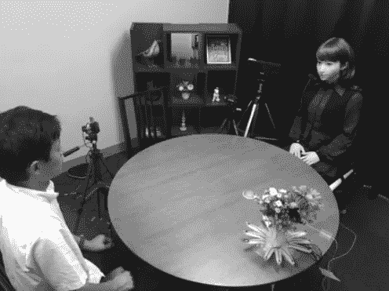

[2]

[2]不仅专注于识别社交信号，还致力于创建参与度识别模型。

这个实验是在日本进行的，在那里点头是非常普遍的。提取了七个特征来检测点头:(每帧)人头部的偏转、滚动和俯仰(每 15 帧)人头部的平均速度、平均速率、平均加速度和范围。

他们的 LSTM 模型在检测点头的所有指标方面都优于其他方法。

微笑经常被用来检测参与度，但为了避免使用相机(他们使用麦克风+ Kinect) **笑声**反而被检测到。每个模型的任务是对声音的间歇期单位(IPU)是否包含笑声进行分类。使用韵律和语言特征来训练两层 DNN 执行得最好，但是使用其他频谱特征而不是语言特征(不一定可从 ASR 获得)可以用于改进模型。

与点头类似，**口头暗语**在日本更为频繁(称为会内)。此外，在日本，口头反馈通常伴随着头部运动，但只有声音提供给模特。类似于笑声检测，该模型对 IPU 是否是一个反向通道或该人是否开始轮到他们进行分类(当闯入时尤其困难)。发现表现最好的模型是随机森林，有 56 个估计器，使用韵律和语言特征。当只给定韵律特征时，该模型仍然合理地执行(再次因为语言特征可能无法从 ASR 获得)。

最后，**的眼神**俗称订婚的明确信号。根据注释者之间的协议，连续注视 Erica 的头部(本实验中的机器人实施例)10 秒钟被视为参与。因此，少于 10 秒是阴性病例。

Erica: [source](https://www.youtube.com/watch?v=TyJ-xLj9SEE)

来自 kinect 传感器的信息用于根据用户的头部方向计算一个向量，如果该向量与 Erica 的头部发生碰撞(加上 30cm 以适应误差)，则用户被视为“在看 Erica”。这种基于几何的模型工作得相对较好，但 Erica 的头部位置是估计的，所以这将影响结果。预计当确切的数值已知时，该模型将得到显著改进。

本文的目的不是创建最佳的单个系统，而是假设这些模型结合起来会比单个模型在检测参与度方面表现得更好。

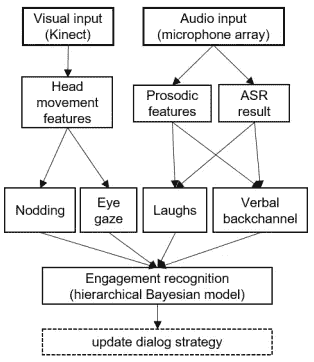

[2]

上述模型的集合被用作二元分类器(一个人是否参与)。特别是，他们建立了一个分层贝叶斯二元分类器，从上述 4 个模型的 16 种可能的输出组合中判断听者是否参与。

从注释器中，构建了一个模型来推断在检测参与时哪些特性更重要或更不重要。例如，一些注释者发现笑声是一个特别重要的因素，而其他人则不这么认为。他们发现输入一个包含三种不同字符类型的字符变量可以提高模型的性能。

此外，包括听众的先前参与也改进了模型。这是有道理的，因为目前不感兴趣的人在你下一轮更有可能保持不感兴趣。

衡量参与度只能在体现 CA 时才能真正做到(例如，与 Siri 的眼神交流是不存在的)。社交机器人越来越多地用于教学、公共场所、医疗保健和制造业等领域。这些都可以包含口语对话系统但是为什么一定要具体化呢？

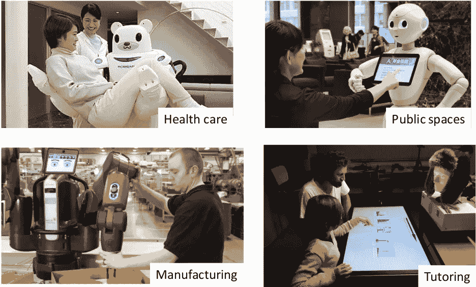

[5]

# 典型，化身

当人们只需打个电话就能进行面对面的交流时，他们会走遍全球。我们不喜欢在看不到对方的情况下互动，因为我们错过了上面谈到的许多信号。在今天的世界里，我们也可以进行视频通话，但出于同样的原因，在可能的情况下还是要避免这样做。电话交谈或面对面交谈的区别类似于与 Siri 和嵌入式对话系统交谈的区别[5]。

目前的语音系统无法显示面部表情，通过眼神交流或移动嘴唇来表示注意。唇读对于听力受损的人来说显然非常有用，但我们在交谈时都会读唇(这就是我们如何知道人们在说什么，即使在非常嘈杂的环境中)。

一张脸不仅可以输出这些信号，它还允许系统检测谁在说话，谁在注意，真实的人是谁(Rory，Jenny 等)，并识别他们的面部表情。

然而，机器人的脸有很多种形式，有些更适合在对话中使用。大多数机器人的脸，如 Nao 的脸，都是非常静态的，因此无法像我们一样通过表情来表达广泛的情感。

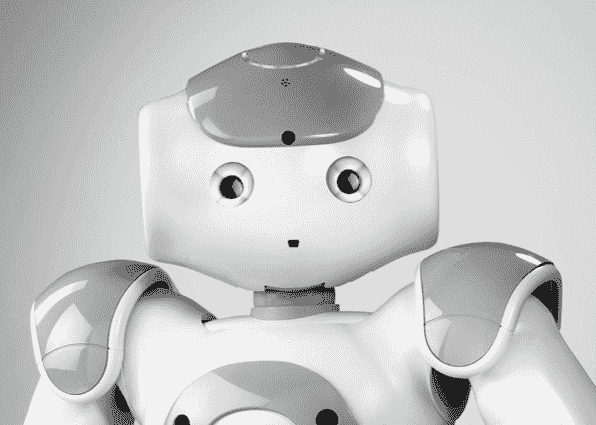

Nao: [source](https://spectrum.ieee.org/automaton/robotics/robotics-software/aldebaran-robotics-to-open-source-nao-robot)

一些更抽象的机器人面部描述，如 Jibo，可以使用形状和颜色来表达情感，但有些表情必须学习。

Jibo: [source](https://www.researchgate.net/figure/MacOS-with-a-bouncing-icon-on-the-left-and-Jibo-is-expressing-an-emotion-with-a-graphic_fig2_326260659)

我们知道如何解读人脸，所以展示人脸是有意义的。超逼真的机器人脸是存在的，但有点令人毛骨悚然，像索菲亚，而且非常昂贵。

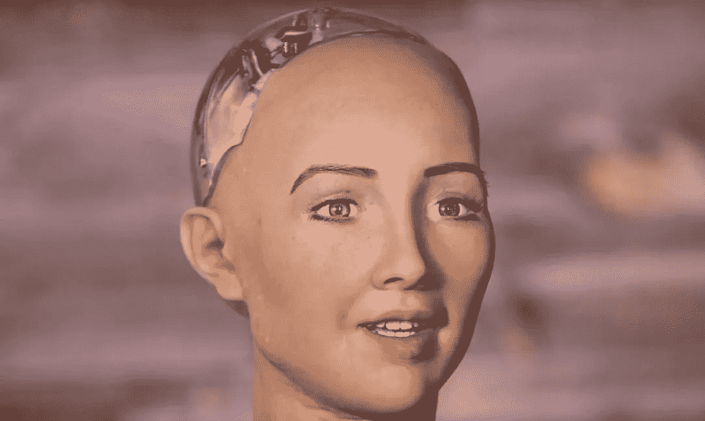

Sophia: [source](https://www.thestar.com/news/world/2017/10/29/sophia-the-robot-is-now-a-citizen-of-saudi-arabia.html)

他们非常现实，但不完全正确，这使得谈话非常不舒服。为了解决这个问题，虚拟人物被设计成可以在屏幕上对话。

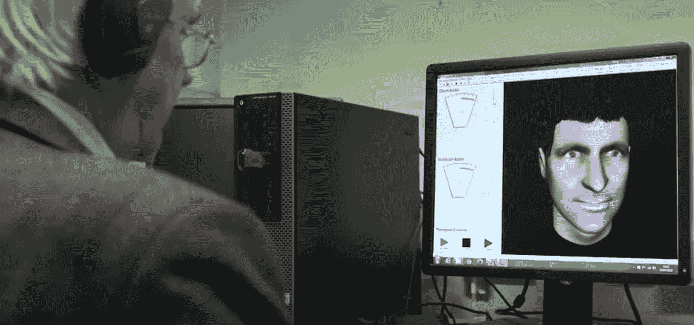

[source](https://secondnexus.com/news/avatar-therapy-schizophrenia/)

这些机器人可以相对接近地模仿人类，而不会令人毛骨悚然，因为它不是一个物理机器人。这几乎和 Skype 一样，但是这种方法有“蒙娜丽莎效应”。在多方对话中，屏幕上的头像不可能只看一个人而不看另一个人。这个化身要么是在看所有的聚会，要么是不看任何人。

gabrial skan tze ([ 5]的演示者)是 Furhat robotics 的联合创始人，他认为 Furhat 是所有这些系统之间的最佳平衡。Furhat 已被开发用于对话应用，如接待员、社会培训师、治疗师、采访者等

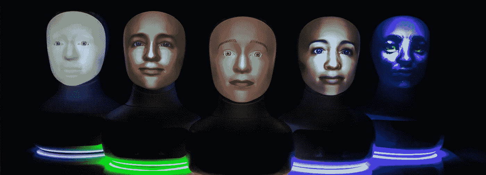

[source](https://www.designboom.com/technology/furhat-face-swapping-robot-11-26-2018/)

Furhat 需要知道它应该看哪里，什么时候应该说话，应该说什么，应该展示什么面部表情[5]。

最后(就目前而言)，一旦具体化，与机器人的对话需要与现实世界实时联系。在[3]中，给出的例子是在工业机器中实现的 CA ,[ 5]指出这变得越来越普遍。

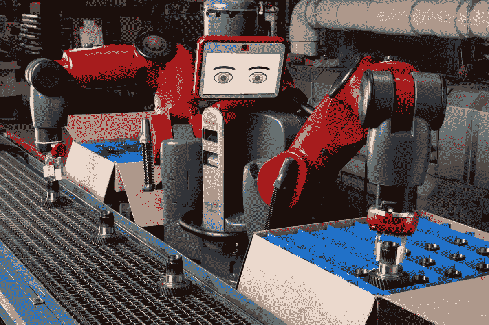

[source](https://www.theverge.com/2018/10/4/17935820/rethink-robotics-shuts-down-baxter-sawyer-robot-cobots)

# 流畅、渐进的接地策略

为了使对话自然，人机对话必须以流畅的方式为基础。

使用**非增量接地**，用户可以给出积极的反馈并进行修复，但只有在机器人完全理解请求之后。例如，如果你让一个机器人移动一个物体到某个地方，你必须等到这个物体被移动后，才能用类似“不，移动那个红色的”这样的话语来纠正它。没有重叠的语音是可能的，所以如果需要修复，动作必须完全颠倒。

使用**增量接地**，重叠仍然是不可能的，但是可以以更有规律的间隔给出反馈。反馈可以在子任务间隔给出，而不是在给出反馈之前完成整个任务。“不，移动红色的那个”可以在机器人捡起一个蓝色物体后说，快速修复。在前面的例子中，蓝色物体被放置在一个给定的位置，然后才能进行修复，这导致了整个任务的逆转！这更有效，但仍然不像人与人之间的互动那样流畅。

**如果重叠被处理，流体增量接地**是可能的。允许并发的言语和动作并进行推理要自然得多。继续我们的修复示例，“不，移动红色的”可以说是机器人一要拿起蓝色物体，就不必完成和反转任何任务，因为并发是允许的。拾取任务可以被中止，红色物体被流畅地拾取，就像你说的那样。

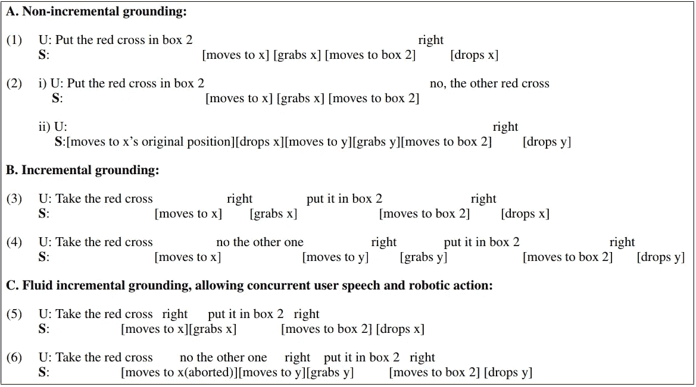

[2]

为了实现这种更加流畅的基础，需要进行实时处理。系统不仅需要一个字一个字地处理话语，还需要监控实时上下文，例如机器人的当前状态和计划的动作(这两者都可以在话语或单词的过程中动态变化)。

机器人必须知道什么时候它已经充分展示了它正在做什么来处理修理和确认。机器人需要知道用户在确认什么，更重要的是，需要修复什么。

# 结论

在这个简短的概述中，我只涉及了当前朝着更自然的对话系统发展的一小部分工作。

即使话轮转换预测、参与度测量、具体化和流体基础都很完善，CAs 也不会像我们人类一样进行对话。我计划在接下来的几年里写更多这样的综述，所以如果感兴趣的话，请留意它们。

与此同时，请对讨论点进行评论，批评我的理解，并提出我(以及任何阅读本文的人)可能会感兴趣的论文。