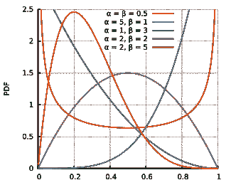
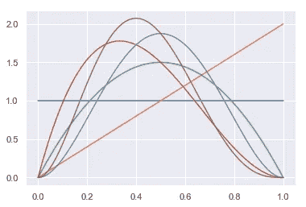
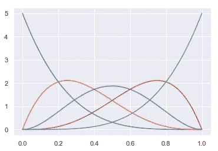
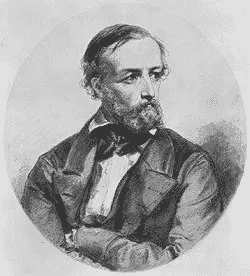
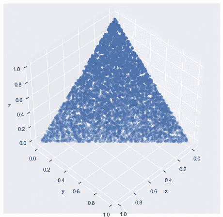
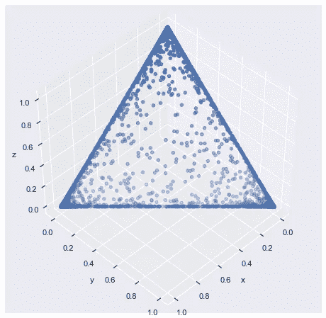
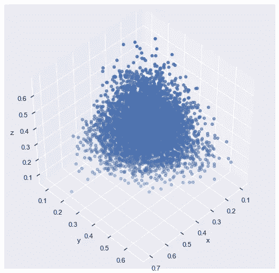
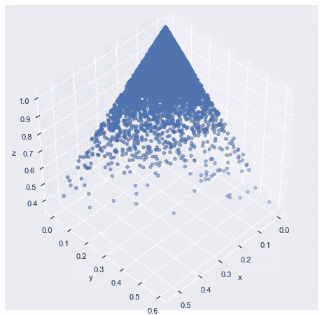
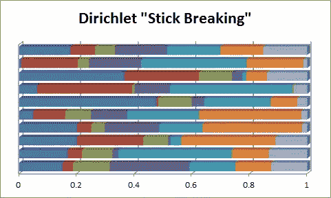

# 模型背后:贝塔、狄利克雷和 GEM 分布

> 原文：<https://towardsdatascience.com/behind-the-models-beta-dirichlet-and-gem-distributions-526b11a24359?source=collection_archive---------10----------------------->

## 非参数贝叶斯模型的构建模块

在未来的帖子中，我想讨论非参数贝叶斯模型——这些模型是无限维的，允许广泛的在线学习。但是首先我想介绍一些构建模块:Beta、Dirichlet 和 GEM 分布。这些分布有几个有用的属性，除了非参数贝叶斯之外，还提供了各种各样的机器学习用途。

**贝塔分布**

Beta Distribution — Wikipedia

贝塔分布有两个参数— *α* 和 *β —* ，取值在 0 和 1 之间。当分析概率或比例时，这个有界区域使贝塔成为一个有用的分布。

事实上，贝塔分布是二项分布的“共轭先验”。共轭先验是贝叶斯推理中使用的术语，回想一下，贝叶斯定理允许我们通过用数据更新先验分布来生成后验预测。共轭先验意味着更新过程背后的数学工作得非常好(简单地说)——后验分布是一个容易更新的参数分布。在没有共轭先验的情况下，我们需要使用更先进的采样方法来描述后验分布。

这种共轭先验性质为 *α* 和 *β* 参数提供了直观的含义。想象一个成功概率未知的重复伯努利试验——我们的目标是在查看重复样本时估计未知的成功概率。起初，我们可能会假设所有的概率都是同样合理的(尽管理想情况下，我们可以通过假设一些概率比其他概率更有可能来让我们的模型领先一步)。Beta 分布将描述我们在每一步成功的更新(“后验”)概率，其中 *α* 参数等于观察到的成功次数，而 *β* 参数等于观察到的失败次数(每个参数加 1，因为它们需要为> 0)。

在下面的模拟中，蓝线 Beta(1，1) pdf 是我们的起点，它赋予所有概率相等的权重。第一次试验是成功的——我们得到了橙色 Beta(2，1)。第二次和第三次试验都失败了——绿色 Beta(2，2)和红色 Beta(2，3)。然后是成功—紫色 Beta(3，3)，最后是失败— Beta(3，4)。

你可以利用这一点获得β的形状——较高的*α’*s 将质量移向右边，而相对较高的*β’*s 将质量移向左边。对于大于 1 的 *α* 和 *β* ，pdf 将概率转移到中间，对于小于 1 的 *α* 和 *β* ，pdf 将概率转移到 0 和 1。

不太直观但非常酷的是，Beta 分布描述了从 0 到 1 的连续均匀分布的顺序统计。具体地，样本大小 n 的第 k 个最小值被分布为β(k，n + 1 — k)。下图显示了 5 样本连续均匀分布的 5 个顺序统计量:最小值(蓝色)、第 25 百分位(橙色)、中值(绿色)、第 75 百分位(红色)和最大值(紫色)。

**狄利克雷分布**

**Johann Peter Gustav Lejeune Dirichlet**

狄利克雷分布以上图中温文尔雅的 19 世纪数学家命名，是贝塔分布的多元推广，事实上它的另一个名字是多元贝塔分布(MBD)。

Dirichlet 接受一个参数向量，每个参数对应一个变量(可以有 2 到无穷大)。分布的输出是这样的，变量的和总是等于 1——例如，在三维狄利克雷中，x + y + z = 1。

类似于贝塔分布，将所有的*α’*设置为 1 给我们一个均匀的分布——这里是 Dir(1，1，1)作为一个 3D 散点图:

*α’*s 小于 1(此处为 0.1)会将概率质量推到分布的边缘。另一种说法是，该分布倾向于三个变量中接近 1 的一个，而以其他两个为代价。

*α'* s 大于 1(此处为 10)将概率质量推向中心，这样它有利于 3 个变量之间的相等(它们都更接近 0.33)。

将一个 *α* 设置得比其他的高会使概率质量向它的方向倾斜。这里是 Dir(1，1，10):

狄利克雷分布是分类分布(即离散多变量分布，其工作方式类似于多值伯努利分布:画一个均匀分布，而不是成功的是/否，找到对应于均匀拉力的变量)和多项式分布(多变量二项式分布)的共轭先验。

狄利克雷中的每个变量都是贝塔分布的，有条件的

**狄利克雷过程&宝石分布**

狄利克雷过程是狄利克雷分布的一种特殊形式。一个常见的例子说明了狄利克雷分布是一个“打破棍子”的过程——回想一下，变量的总和总是 1.0，所以每个贝塔分布变量“打破”1.0 棍子的一部分。在上图中，我们从 Dir(1，1，1，1，1，1)-7 个变量中提取数据。请注意，每个变量都遵循贝塔分布，这里是贝塔(1，6)。

狄利克雷过程是具有无穷多个变量的狄利克雷分布。你可能会问，如何参数化一个有无限多个变量的模型？通过折断棍子的例子，我们可以把狄利克雷看作一个递归过程。对于我的分析，我可能不需要知道 Dirichlet 的整个范围，但可能只需要知道 0.4 的观察值会落入哪个变量:使用上图中的底线，我只需要知道蓝色、红色、绿色和紫色的绘制就可以得到 0.4，而不需要浅蓝色、橙色和紫色的绘制。

拥有无限数量的参数允许你的模型继续在线学习。一个常见的应用是聚类分析:在一个 *k* 均值聚类算法下，需要提前定义聚类的数目。如果数据集是已知的，并且可以使用肘方法或其他标准来调整 *k* ，则这是可行的，但是在在线学习应用程序中，我们可能无法在获得每个数据点时可靠地调整 *k* 。Dirichlet 过程允许我们在数据进入时将新的数据点动态地放入新的聚类中。使用折断棒的例子，仅当观察到~0.25 以上的观测值时，才需要添加绿色“簇”，仅在观察到~0.35 之后才添加紫色，等等。

GEM 分布是狄利克雷过程的一个特例。GEM 分布以 Griffiths、Engen 和 McCloskey 在这一领域的早期工作命名，是一个带有一个参数的 Dirichlet 过程，我们可以将上面的 Dir(1，1，1，1，1，1，1)写成 GEM(1)。这种表征有统计学意义，但实际上，如果参数之间没有已知的变化，为了简单起见，将分布限制在一个参数是有帮助的。

**结论**

这篇文章理论性很强，我们讨论了贝塔分布、狄利克雷分布和 GEM 分布的有用性质，因为它们与贝叶斯分析有关，建立了非参数贝叶斯。在以后的文章中，我将在应用程序中使用这些模型。