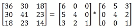
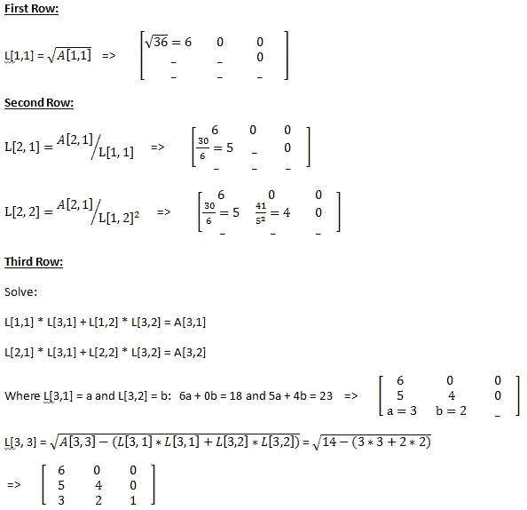
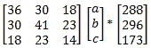
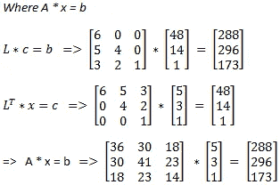
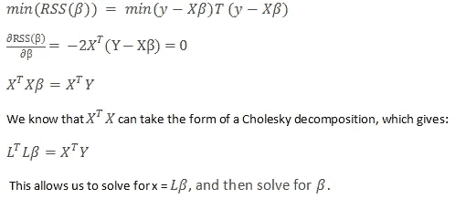
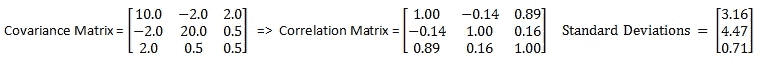
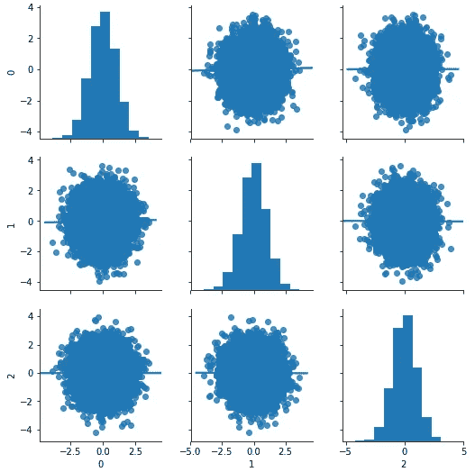
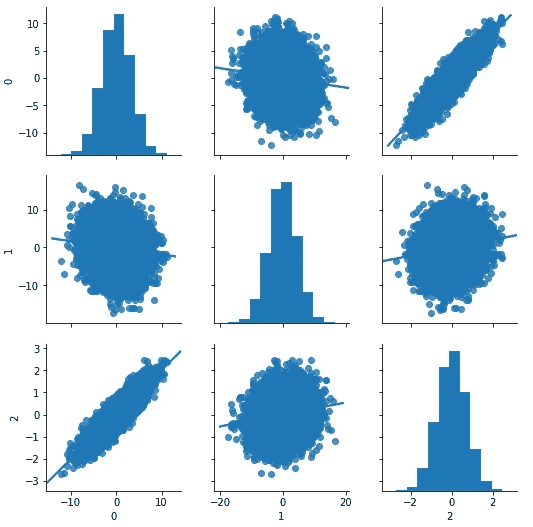
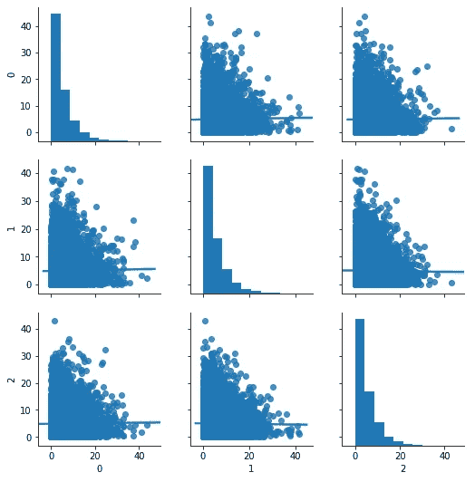
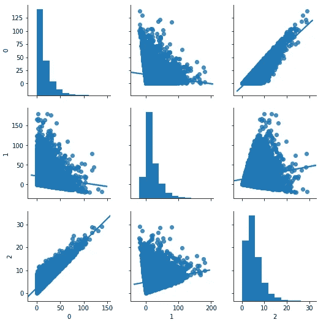

# 模型背后:乔莱斯基分解

> 原文：<https://towardsdatascience.com/behind-the-models-cholesky-decomposition-b61ef17a65fb?source=collection_archive---------3----------------------->

## 运行今天的线性模型和蒙特卡洛模拟的 19 世纪地图制作者的诡计


安德烈-路易·乔莱斯基在数学家中是一个有点奇怪的人:他的工作是在他死于第一次世界大战的一场战斗后死后出版的。他发现了线性代数方法，这种方法以他的名字命名，贯穿了他作为 19 世纪后期地图制作者的工作，但它仍然是一种有效的技巧，为许多机器学习模型提供了燃料。本文将讨论该方法的数学基础，并展示线性回归和蒙特卡罗模拟的两个应用。

## 它是如何工作的

我会尽量让线性代数简短，但这是不可避免的:要理解线性代数只是一种高效求解方程组的方法，也要理解高级线性代数方法是机器学习的核心。先不说道歉，我们开始吧。

乔莱斯基分解将对称矩阵简化为下三角矩阵，当乘以它的转置矩阵时，产生原始的对称矩阵。如果这毫无意义，这就是它看起来的样子:



Cholesky decomposition takes the form: A = L x L*

```
from numpy import array
from numpy.linalg import cholesky# define a 3x3 matrix
A = array([[36, 30, 18], [30, 41, 23], [18, 23, 14]])
print(L)# Cholesky decomposition
L = cholesky(A)
print(L)
print(L.T)# reconstruct
B = L.dot(L.T)
print(B)
```

这种方法的内部变得有点棘手——我将在这里展示它，但这将是帖子中跳过的部分，因为这是假装的心脏——有趣的东西(应用程序)在下面。我们将使用[1，1]符号来表示矩阵 A 中的行= 1，列= 1。

乔莱斯基分解是一个迭代的过程。我将坚持下面的方程组符号，但是当我们到第三行的时候，你会发现用线性代数来表示这个会很有意义。这篇[文章](http://www.math.sjsu.edu/~foster/m143m/cholesky.pdf)很好地解释了矩阵代数符号。注意，还有其他方法可以找到乔莱斯基分解——[维基百科](https://en.wikipedia.org/wiki/Cholesky_decomposition)解释了几种。都遵循相似的流程。



好吧，那又怎样？现在最酷的部分是:使用乔莱斯基分解，我们可以两步解决任何规模的方程组。假设我们想要求解 a、b 和 c:记住，这也可以写成一个 3 个方程的系统。



A * x = b => solve for x

通常，我们会将 3 个方程堆叠在一起，求解一个依赖于其他两个变量的变量，将其插入，等等。使用乔莱斯基分解，我们有一个更有效的方法。



Solving for x using Cholesky Decomposition

一个 3x3 的矩阵有点乏味，但是我们已经可以开始欣赏这种方法在一个非常大的矩阵上的效率。

## 应用—最小二乘回归

线性回归的形式为 ***Y = X*** * β，其中 **Y** 是因变量的向量， **X** 是自变量的向量。最小二乘回归指的是找到预测 Y 值和实际 Y 值之间的平方差最小的向量β(即 RSS =“残差平方和”或“误差平方和”)。



如果这没有意义，那么关注这一点:乔莱斯基分解的效率大约是求解线性方程组的其他方法的两倍。

## 应用—蒙特卡罗模拟

我把最酷的应用程序留到了最后。假设您想要生成许多相关的正态随机变量，但不想处理大量的多变量正态。乔莱斯基分解允许你模拟不相关的正态变量，并将它们转换成相关的正态变量——酷！

假设 3 个正态(0，1)随机变量，我们希望遵循下面的协方差矩阵，表示基本的相关性和标准差矩阵:



我们找到协方差矩阵的乔莱斯基分解，并将其乘以不相关随机变量的矩阵，以创建相关变量。

```
import numpy as np
import pandas as pd
import seaborn as sns
import matplotlib.pyplot as pltx_uncor = np.random.normal(0, 1, (3, 10000))cov = np.array([[ 10.0, -2.00,  2.00], 
                [-2.00, 20.00,  0.50],
                [ 2.00,  0.50,  0.50]])L = np.linalg.cholesky(cov)x_cor = np.dot(L, x_uncor)
corr_simulated = pd.DataFrame(x_cor).T.corr()std_ = np.sqrt(np.diag(cov))
corr_empirical = cov / np.outer(std_, std_)x_uncor = pd.DataFrame(x_uncor.T)
x_cor = pd.DataFrame(x_cor.T)sns.pairplot(x_uncor, kind="reg")
sns.pairplot(x_cor, kind="reg")
```

瞧啊。我们从不相关的:



要关联:



与上面给出的相关性和标准偏差矩阵一致，列 0 和 2 具有强正相关性，0 和 1 稍微负相关，1 和 2 稍微正相关。包含变量 2 的标准差，而 0 和 1 的标准差要宽得多。

请注意，对于非正态随机变量，这并不以同样的方式工作。在上面的例子中，我们的相关变量保持正态分布。如果我们将这种方法应用于伽玛生成的随机变量，我们会发现这一过程并不成立。

不相关伽玛(1，5)-一切看起来都很好。



并关联:



在这里，我们看到变量不再是伽玛分布，这是最明显的线索，变量 1 呈现负值，而伽玛分布严格为正。有一个简单的后门近似法，它包括模拟相关随机变量，找到它们的倒数，然后使用逆相关正态值从期望的分布中提取。这不确切，但可以完成工作。确切的方法往往相当奇特。

## 结论

乔莱斯基分解是许多机器学习应用程序的基础，这里介绍了其中的两个:最小二乘回归和使用相关正态变量的蒙特卡罗模拟。虽然线性代数可能有点可怕，但重要的是要记住，它只是一种标记线性方程组的有效方法，并且对线性代数方法的高层次理解对于理解当前的机器学习算法至关重要。