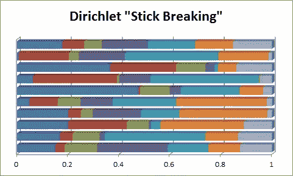
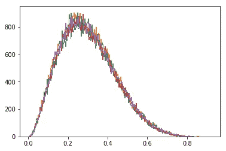
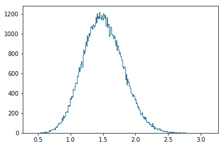
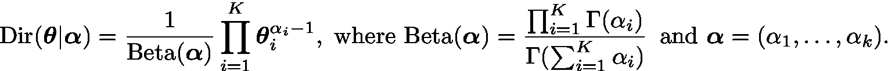
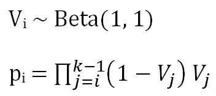
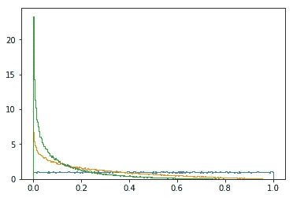
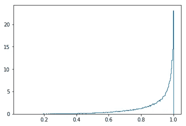
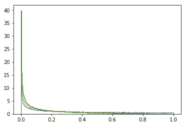
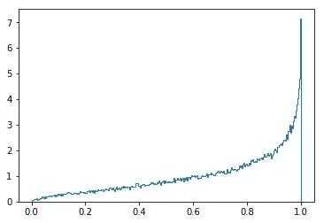

# 模型背后:狄利克雷——它如何加到 1？

> 原文：<https://towardsdatascience.com/behind-the-models-dirichlet-how-does-it-add-to-1-b268f0c70afe?source=collection_archive---------23----------------------->

## 非参数贝叶斯模型的构建模块

在[之前的文章](/behind-the-models-beta-dirichlet-and-gem-distributions-526b11a24359)中，我将狄利克雷分布表示为许多β分布变量的组合，这些变量加起来等于 1.0——这对于需要“随机”分类器的应用程序来说是有用的，这是一篇仍在撰写中的文章的主题。 [Sebastian Bruijns](https://medium.com/u/92bb2136ae3c?source=post_page-----b268f0c70afe--------------------------------) 问了我在原文中回避的一个明显的问题:

> **非常好且易懂的文章。我只是不明白狄利克雷和贝塔之间的联系，你写了狄利克雷的变量遵循贝塔分布。，但这是怎么做到的，怎么保证加起来就是 1 呢？**

事实是这样的:

## **背景**

这一部分主要是对[上一篇文章](/behind-the-models-beta-dirichlet-and-gem-distributions-526b11a24359)的回顾——如果你熟悉那些细节，可以跳过它。

狄利克雷分布是贝塔分布的多元推广。输入是两个或更多参数的向量，输出是一种分布，其中变量的总和总是等于 1.0，并且每个单独的变量都是贝塔分布的。下图中的“断棒”将这两个想法统一起来。



看完上面的内容，生成狄利克雷的直观方法是生成随机贝塔并求和，但那显然行不通。在下面的模拟中，我们显示了 5 个 Beta(3，7)的和看起来很正常(它并不完全正常，部分原因是 Beta 的界限在[0，1]，所以和的界限在[0，5])。

```
import numpy as np
from matplotlib import pyplot as pltn = 100000
z = [np.random.beta(3,7,n) for i in range(5)]for i in range(5):
 plt.hist(z[i], histtype = u’step’, bins = 300)

plt.show()z_sum = [sum([z[x][i] for x in range(5)]) for i in range(n)]
plt.hist(z_sum, histtype = u’step’, bins = 300)
plt.show()
```



**Left:** a histogram of 5 Beta(3, 7) variables; **Right:** a histogram of the sum of the 5 Betas

## 那么狄利克雷如何加到 1 上呢

狄利克雷分布的 PDF 如下。这里 ***θ*** 是多项式范畴， ***α*** 是向量或β参数。贝塔系数始终是贝塔系数(α，1)，没有第二个参数。请注意，最终的β分布变量不会遵循β(α，1)—β参数是 ***α*** 向量的函数。这可能会给我们一些直觉，为什么随着阿尔法变大，狄利克雷数会增加到 1。得到的贝塔分布变量遵循贝塔(α，(K-1)*α)，其中 K 是 ***α*** 向量中值的数量。自己试一试:

```
x = np.random.dirichlet((1, 1, 1), 100000)
for n in range(3):
    a, b, l, s = beta.fit(x[:,n], floc = 0, fscale = 1)
    print(a)
    print(b)
```

Dirichlet 的 PDF 格式让我们第一次看到它是如何确保贝塔值等于 1.0 的。这里 ***θ*** 是多项式范畴， ***α*** 是我们一直在研究的向量。



一个实际的实现使用伽马分布(回想一下β/γ:B(α，β)=γ(α)γ(β)/γ(α+β)之间的关系)，并且易于直观地理解。首先为每个狄利克雷变量画一个独立的伽玛(α，1)，然后将它们平均到 1.0，产生狄利克雷分布变量。

```
a = 3
n_ = 5y = [np.random.gamma(a, 1, 100000) for i in range(n_)]
y_sum = [sum([y[x][i] for x in range(n_)]) for i in range(100000)]
x = [[y[x][i] / y_sum[i] for x in range(n_)] for i in range(100000)]
x = [[x[i][n] for i in range(100000)] for n in range(n_)]for i in range(n_):
    plt.hist(x[i], histtype = u'step', bins = 300, normed = True)a, b, l, s = beta.fit(x[0], floc = 0, fscale = 1)
```

顺便说一句，这也提供了一个很好的机会来使用一些强大的列表理解:我对这篇文章已经垂涎三尺大约一个月了。

## 无限情形—狄利克雷过程

在上一篇文章中，我们得到了一个狄利克雷过程，它与狄利克雷分布略有不同。通过狄利克雷过程，狄利克雷分布可以扩展为具有无穷多个变量。这是另一个事实，我挥舞着我的手，可能会冒犯你的直觉。

考虑狄利克雷过程的方式是，来自它的每个拉动本身是狄利克雷分布的(不是贝塔分布的，尽管当然来自狄利克雷分布的拉动是贝塔分布的)。所以不像上面的狄利克雷分布，每个变量

这个过程是可能的，因为我们可以迭代地生成一个新变量，所以我们实际上不会生成无限的变量，但是我们创建了一个框架，如果需要的话，我们总是可以创建更多的变量。在这种情况下，我们不能使用上面的伽马技巧，因为我们不能除以总和，但我们可以确信，如果我们走向无穷大，我们永远不会以变量加起来超过 1 而结束。公式如下所示——p(I)是狄利克雷变量——V(I)是中间变量。



下面我们生成狄利克雷过程中的前 3 个变量:

```
k = 3z = [np.random.beta(1,1,100000) for i in range(k)]
p = [[np.prod([1 - z[x][n] for x in range(i)]) * z[i][n] for i in range(k)] for n in range(100000)]
p = [[p[i][x] for i in range(100000)] for x in range(k)]for i in range(k):
    plt.hist(p[i], histtype = u'step', bins = 300, normed = True)
    a, b, l, s = beta.fit(p[i], floc = 0, fscale = 1)
    print(a)
    print(b)
plt.show()p_sum = [sum([p[x][i] for x in range(k)]) for i in range(100000)]
plt.hist(p_sum, histtype = u'step', bins = 300, normed = True)
plt.show()
```



**Left:** graph of Dirichlet-distributed variates that are components of Dirichlet process; **Right:** sum of Dirichlet-distributed variates

第一个 Beta draw 在左图中用蓝色表示:Beta(1，1)。在 orange 的第二个 draw 中，我们使用 Beta(1，1)，但然后乘以(1-V(1))，因此最终变量是 Beta-looking。绿线是第三个吸引点——随着我们将更多的质量转移到左侧尾部，β继续增加。这具有直观的意义——使用α = 1，我们允许相对较高的值在抽奖的早期出现，因此剩余的抽奖被迫进入较低的数字。右图告诉我们，仅通过三次平局，我们已经非常接近 1.0，因此剩余的平局将具有非常小的余量。

如果我们使用上面的α = 0.5，我们会强制早期的绘制坚持较低的值，因此对以后有更多的自由



**Left:** graph of Dirichlet-distributed variates that are components of Dirichlet process; **Right:** sum of Dirichlet-distributed variates

**结论**

像以前的文章一样，这篇文章是理论性的。希望它有助于填补我在上一篇文章中忽略的一些空白。在以后的文章中，我将在应用程序中使用这些模型。