# 成为数据科学家并不能让你成为软件工程师！

> 原文：<https://towardsdatascience.com/being-a-data-scientist-does-not-make-you-a-software-engineer-c64081526372?source=collection_archive---------3----------------------->

## [现实世界中的数据科学](https://medium.com/towards-data-science/data-science-in-the-real-world/home)

## 如何构建可扩展的 ML 系统—第 1/2 部分

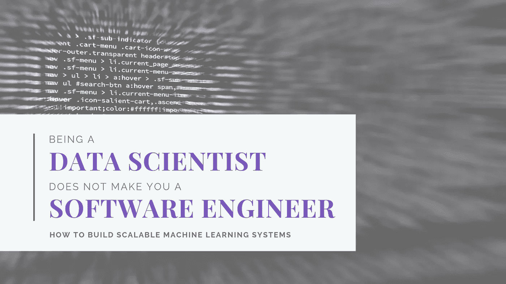

# 放弃

希望我有争议的标题引起了你的注意。太好了！现在请耐心听我说，我将向您展示如何构建一个可扩展的架构来围绕您机智的数据科学解决方案！

我正在开始一个由两篇文章组成的**系列**，它将涵盖关于架构和设计的软件工程基础，以及如何在机器学习管道的每一步应用这些基础:

> [***第一部分***](/being-a-data-scientist-does-not-make-you-a-software-engineer-c64081526372?source=friends_link&sk=fd1e5ace8c5bfdaa6e1b1ace201dbff1) *:问题陈述|架构风格|设计模式|坚实* [***第二部分***](/architecting-a-machine-learning-pipeline-a847f094d1c7?source=friends_link&sk=f934e209896d28b1f3a11f081cb18cb3) *:构建机器学习管道*

# 介绍

[正如我们之前在 Steven Geringer 著名的维恩图中看到的](/not-yet-another-article-on-machine-learning-e67f8812ba86)，数据科学是 3 个学科的交叉:计算机科学、数学/统计和特定的领域知识。

[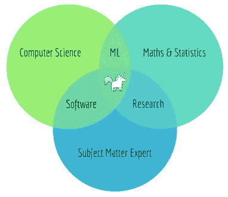](https://towardsdatascience.com/not-yet-another-article-on-machine-learning-e67f8812ba86)

Data Science Venn Diagram [Copyright Steven Geringer]

拥有基本的(甚至是高级的)编程技能是进行端到端实验的关键，但是这并不意味着您已经创建了一个可以投入生产的应用程序。除非你已经从 IT 背景进入数据科学和机器学习(ML)领域，并且在构建企业、分布式、可靠的系统方面有切实的经验，否则你的 Jupyter 笔记本不符合优秀软件的标准，而且很遗憾，也不能让你成为软件工程师！

你已经建立了一个很好的预测产品的原型，但是你仍然需要推动它通过工程路线图。你需要的是一个专业软件工程师团队在你身边，把你的(一次性)概念证明变成一个**高性能**、**可靠**、**松耦合**和**可扩展**的系统！

> 一切都是设计好的；很少有东西是设计好的！

在这个系列中，我们将看到如何实现这一点的一些想法…我们将从第 1 部分的基础开始，并在第 2 部分逐步设计整体架构。建议的架构将与技术无关。ML 管道将被分解为责任划分清晰的层，在每一层，我们都可以从大量技术堆栈中进行选择。

但是让我们从定义一个成功的解决方案开始吧！

# 问题陈述

主要目标是建立一个系统:

> *▸降低* ***潜伏期****；
> ▸与系统的其他部分集成但***松散耦合，例如数据存储、报告、图形用户界面；
> ▸可以***横向和纵向缩放；
> 是* ***消息驱动*** *即系统通过异步、无阻塞的消息传递进行通信；
> 针对* ***工作量管理*** *提供高效的计算；
> ▸是***容错和自愈即故障管理；
> 支持* ***批量*** *和* ***实时*** *加工。****

# **建筑风格**

**我们将首先介绍什么是反应式系统，然后快速浏览一下最流行的架构模式。**

## **反应系统**

**反应式系统设计范例是一种构建更好系统的连贯方法，它是根据[反应宣言](https://www.reactivemanifesto.org)的原则设计的。每个反应原理都映射到一个重要的系统可扩展性维度:
*反应灵敏* →时间
*弹性* →负载
*弹性* →错误
*消息驱动* →通信。**

**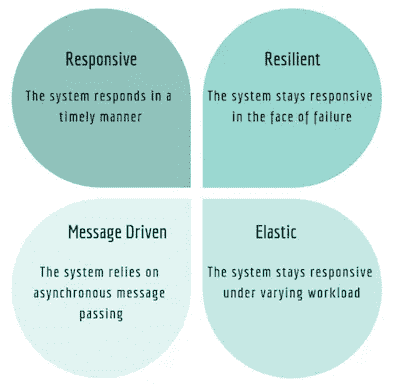**

**Features of Reactive Systems**

## **面向服务的架构(SOA)**

**SOA 以将业务问题分解为服务的概念为中心。这些服务通过网络共享信息，它们还共享代码(即公共组件)以保持一致性并减少开发工作。
服务**提供者**发布一个合同，指定服务的性质和如何使用它。服务**消费者**可以在注册表中定位服务元数据，并开发所需的客户端组件来绑定和使用它。**

**一个 **orchestrator** 是一个复合服务，负责调用和组合其他服务。或者，**编排**为服务组合采用了一种去中心化的方法，即服务与消息/事件的交换进行交互。**

**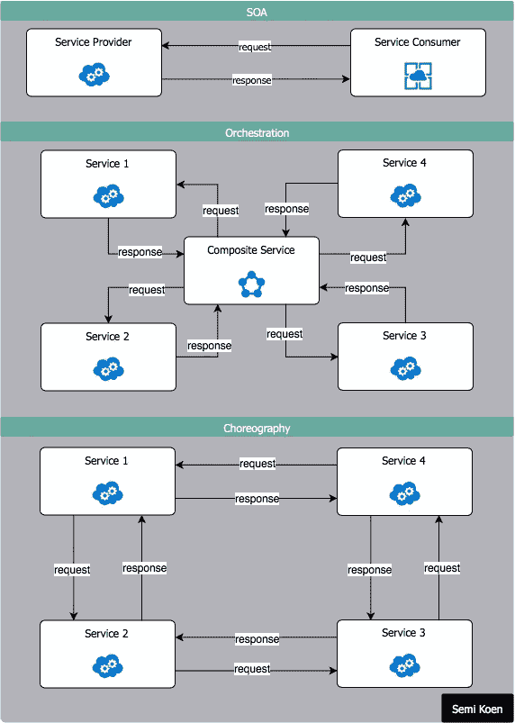**

**SOA**

## **流式架构**

**流式架构由以下组件组成:**

*   ****生产者**:生成和发送消息的应用程序**
*   ****消费者**:订阅和消费消息的应用程序**
*   ****主题**:属于特定类别的记录流，存储为在分布式集群中分区和复制的有序且不可变的记录序列**
*   ****流处理器**:以某种方式处理消息的应用程序(如数据转换、ML 模型等)。**

**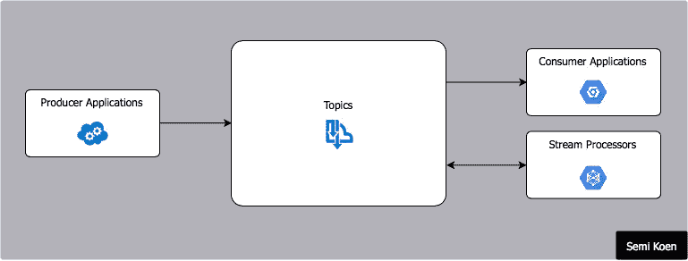**

**Streaming Architecture**

## **λ架构**

**Lambda (λ)架构旨在以集成方式处理**实时**和历史聚合**批量数据**。它分离了实时和批处理的职责，而查询层提供了所有数据的统一视图。
这个概念很简单:当数据生成时，它在存储之前被处理，因此分析可以包括在最后一秒、最后一分钟或最后一个小时生成的数据，只需处理传入的数据，而不是所有的数据。**

**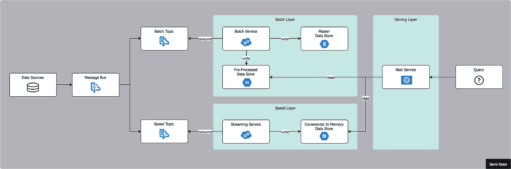**

**Lambda Architecture**

## **微服务架构**

**微服务是一种架构风格，它将应用程序构建为小型、自治、松散耦合和协作服务的集合，围绕业务领域建模。这些服务使用同步协议(如 HTTP/REST)或异步协议(如 AMQP)进行通信。它们可以彼此独立地开发和部署。每个服务都有自己的数据库，以便与其他服务分离。**

**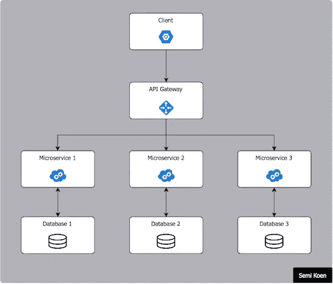**

**Microservices Architecture**

## **表述性状态转移(REST)架构**

**REST 是一种开发 web 服务的架构风格，它建立在互联网 HTTP 的现有特性之上。它允许以无状态的方式传输、访问和操作文本数据表示，即应用程序可以进行不可知的通信。**

**RESTful API 服务通过统一资源定位器(URL)公开，它提供了创建、请求、更新或删除数据(CRUD)的能力。通过将生产和消费的信息从生产和消费信息的技术中分离出来，它最适合用于管理系统！**

**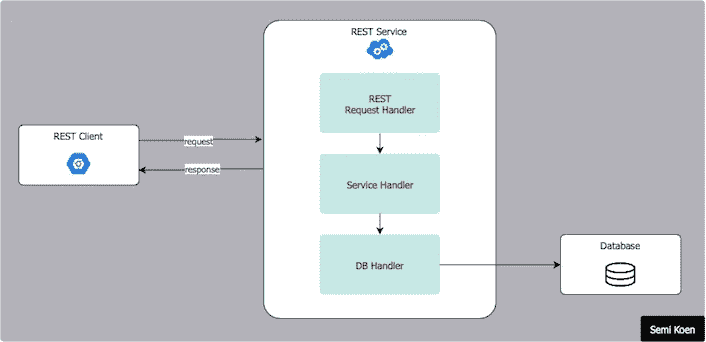**

**REST Architecture**

# **设计模式**

**我们将仅仅触及这个主题的表面，并且将仅仅讨论我可能在本系列的第二部分中提到的那些模式。—[现在还很难知道，但这些是我每天使用的模式]**

> **软件设计模式是对软件工程中常见问题的优化的、可重复的解决方案。这是一个解决问题的模板，可以在许多不同的情况下使用。**

## **战略**

**策略模式定义了一系列算法，将每个算法放在一个单独的类中，并使它们**可互换**。将行为封装在单独的类中，消除了任何条件语句，并在运行时选择正确的算法(即策略)。**

****—用法说明**:一个业务规则有不同的实现，或者需要不同的算法变体。**

**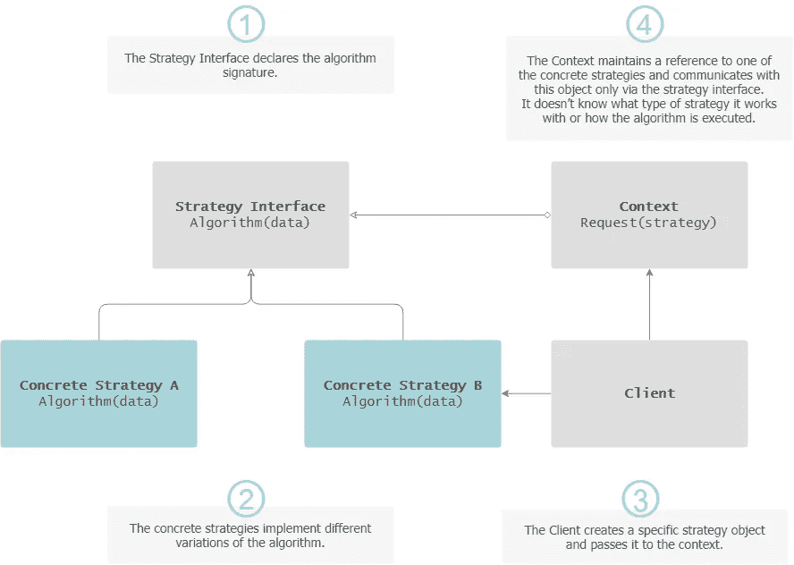**

**Strategy Pattern**

## **模板方法**

**模板方法旨在从不同的过程中抽象出一个共同的过程。它定义了算法的**框架**，将一些步骤推迟到子类。子类可以覆盖一些行为，但不能改变框架。**

****—用法说明**:有一组一致的步骤可以遵循，但各个步骤可能有不同的实现方式。
⭐️ **与策略模式**的差异:
模板:通过**子类**在**编译时**选择算法。策略:由**容器**在**运行时**选择算法。**

**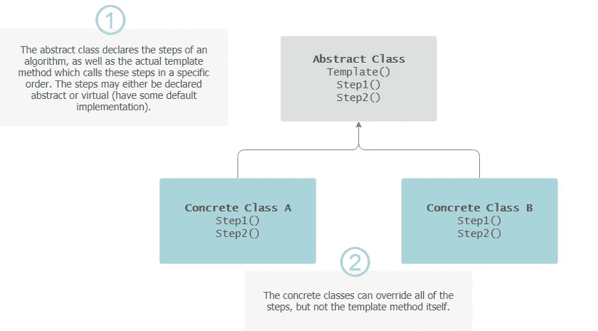**

**Template Method**

## **责任链**

**责任链模式建议通过启用一个或多个**处理程序**来满足请求，从而避免将客户机(请求的发送者)与接收者耦合在一起。这些处理程序链接成一个链，即每个处理程序都有一个对链中下一个处理程序的引用。**

****

****—用法说明**:一个以上的对象可能会处理一个请求，而处理程序(也不是序列)是未知的。**

**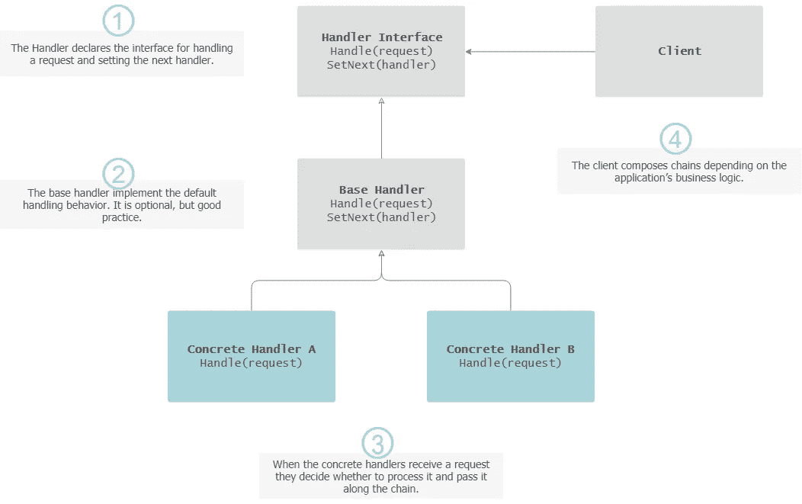**

**Chain of Responsibility**

## **观察者**

**观察者模式(也称为发布/订阅或简称 PubSub)通过定义对象之间的一对多依赖关系，使通信变得容易**广播**，这样当一个对象经历状态变化时，它的所有依赖对象都会得到通知并自动更新。观察者有责任记录他们正在“观察”的事件。**

****—用法说明**:当一个对象的改变需要改变其他对象，而你不知道需要改变多少个对象时。**

**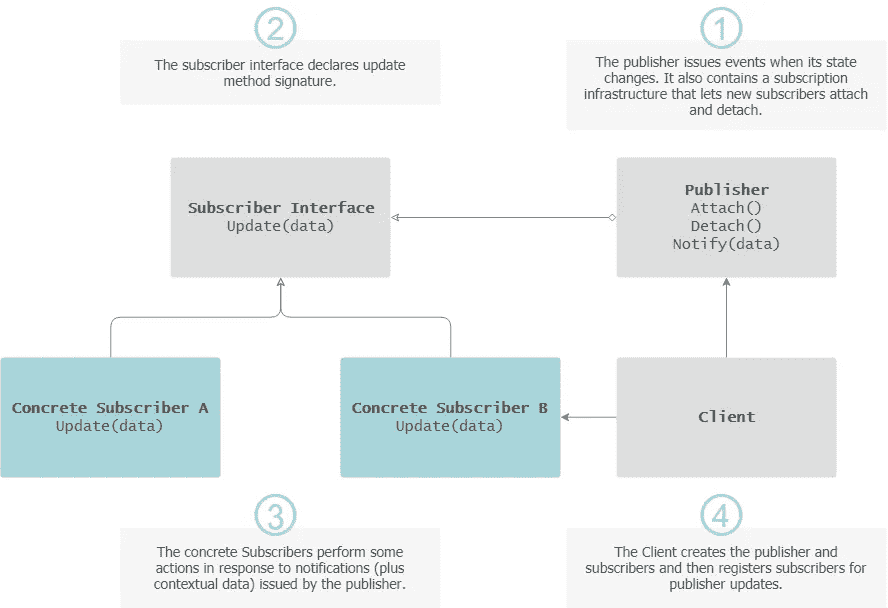**

**Observer Pattern**

## **建设者**

**构建器模式旨在以**一步一步**的方式构建一个复杂的对象，并将构建与其表示分离开来。本质上，它允许使用相同的代码产生不同类型和表示的对象。**

****—用法说明**:几种复杂的物体可以用相同的整体构建过程来构建，尽管各个构建步骤有所不同。**

**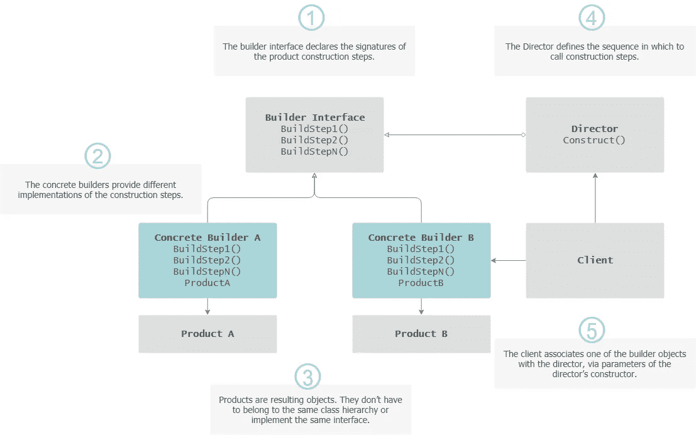**

**Builder Pattern**

## **工厂方法**

**工厂方法为**创建对象**定义了一个接口，但是实例化是由子类完成的。**

****—用法说明**:事先不知道对象的确切类型和依赖关系。**

**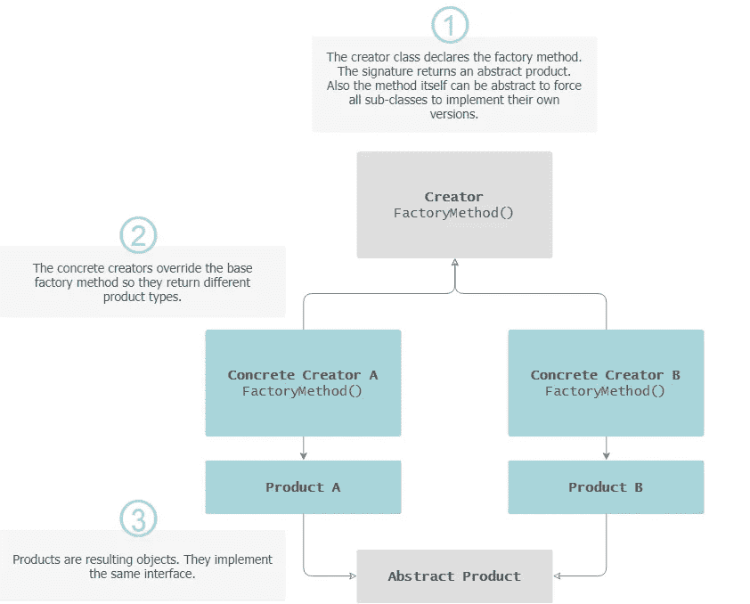**

**Factory Method**

## **抽象工厂**

**抽象工厂捕获了如何创建相关对象的**系列，而无需指定它们的具体类。****

****—用法说明**:存在不同的情况，需要不同的规则集实现，要么事先未知，要么可扩展性是一个问题。
⭐️ **与抽象方法**的区别:
抽象工厂:创建其他工厂，这些工厂又创建从基类派生的对象。【工厂方法:创建从特定基类派生的对象。**

**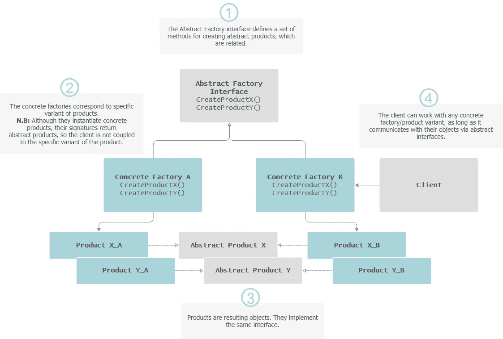**

**Abstract Factory**

## **装饰者**

**装饰模式通过将对象放在包含这些行为的特殊包装类中，动态地将新的责任附加到对象上，因此对原始方法的签名没有影响(组合优于继承)。**

****—用法说明**:在运行时给对象分配额外的行为，而不破坏使用这些对象的代码。**

**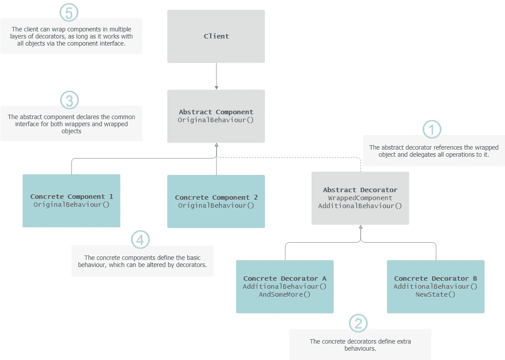**

**Decorator Pattern**

## **贮藏室ˌ仓库**

**存储库模式解决了数据检索和持久化的代码集中化问题，并为数据访问操作提供了一个**抽象，即类似于内存中的域对象集合，允许执行 CRUD 方法，并消除了任何数据库问题。****

****—用法说明**:将业务逻辑与数据访问代码解耦。**

**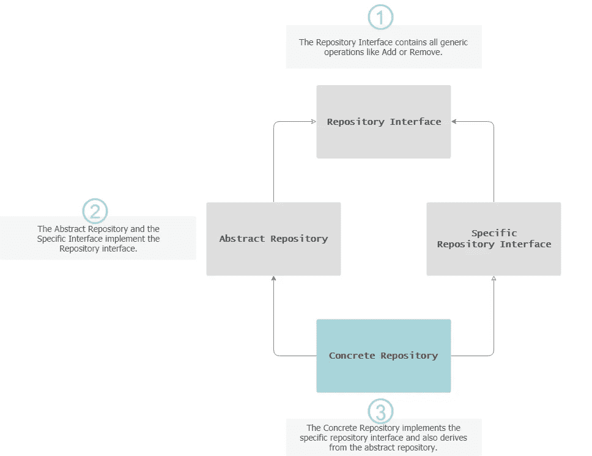**

**Repository Pattern**

## **小奖励**

**想了解更多关于模式的知识吗？从“四人帮”的书开始，即:“[设计模式:可重用面向对象软件的元素](https://www.amazon.co.uk/dp/0201633612)”。下面的模式关系图值得注意— *很漂亮，是吧*？**

**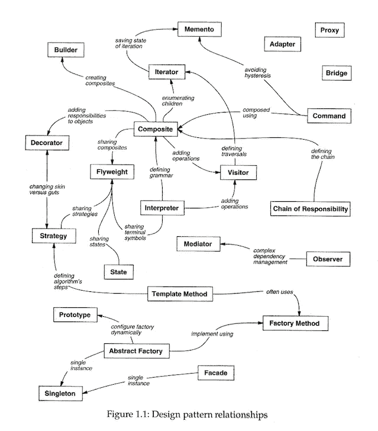**

**Courtesy: [Design Patterns: Elements of Reusable Object-Oriented Software](https://www.amazon.co.uk/dp/0201633612)**

# **固体**

**在这里，我们将只玩弄坚实的原则，因为它们对每个软件开发人员来说都是必不可少的。**

**正如[鲍勃大叔](https://en.wikipedia.org/wiki/Robert_C._Martin)所说:*[*它们不是规律。它们不是完美的真理。这些陈述的顺序是:一天一个苹果，医生远离我。*](https://sites.google.com/site/unclebobconsultingllc/getting-a-solid-start)***

***这意味着它们不是某种“魔法”,不会带来牛奶、蜂蜜和伟大软件的乐土，但是它们仍然是健壮和持久软件的重要贡献者。***

***简而言之，这些原则围绕着两个主要概念，它们是成功的企业应用程序的构建块:**耦合**是一个类了解另一个类并与之交互的程度，而**内聚**表示一个类具有单一目的的程度。换句话说:***

> ***耦合是关于类之间如何交互的，而
> 内聚则关注单个类是如何设计的。***

## ***单一责任原则***

> ******一个类应该有且只有一个改变的理由。******

***这是不言自明的，但是说起来容易做起来难——向现有的类中添加新的行为总是很诱人的，但是这是灾难的一个处方:每个行为都可能是将来改变的原因，所以更少的行为导致在改变期间引入错误的机会更少。***

## ***开闭原理***

> ***你应该能够扩展一个类的行为，而不用修改它。***

***您使用的类应该对扩展开放，但对修改关闭。实现这一点的一种方法是通过继承，即创建一个子类，这样原始类就不会被修改，但自定义代码会被添加到子类中以引入新的行为。***

## ***利斯科夫替代原理***

> ******派生类必须可替换其基类。******

***当将类 A 的行为扩展到子类 B 时，你必须确保你仍然可以在不破坏任何东西的情况下与 B 交换 A。这可能有点吸引人，尤其是当把这一原则与开闭原则结合起来时。***

## ***界面分离原理***

> ******制作客户特定的细粒度接口。******

***接口和类必须尽可能的专门化，这样调用客户端就不会依赖于它们不使用的方法。这与单一责任原则是相辅相成的。***

## ***从属倒置原则***

> *****依赖抽象，不依赖具体。*****

***高级类不应该依赖于低级类。它们都应该依赖于抽象。同样，抽象不应该依赖于细节。细节应该依赖于抽象。***

## ***小奖励***

***我创建了这个快速参考图。如果你想知道我对左边小符号的灵感来自哪里，请看看:' '[坚实的原则，用激励海报解释](https://blogs.msdn.microsoft.com/cdndevs/2009/07/15/the-solid-principles-explained-with-motivational-posters/)' '文章-我喜欢作者如何在原则上添加有趣的转折🐤。***

***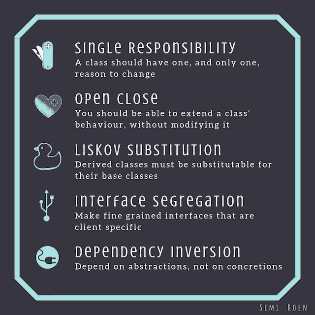***

***SOLID***

# ***脚注***

***这并不是所有软件工程概念的详尽列表，但是它是我们在下一篇文章中将要使用的基础。我希望它能让你对构建可伸缩软件的贡献因素有一个很好的了解。让应用程序设计**对变化有弹性**是构建成功解决方案的关键——如果设计过程仓促，当错误被发现时，项目结束时要支付罚金。***

> ***好的设计显而易见。伟大的设计是透明的。***

***感谢阅读！[第二部](/architecting-a-machine-learning-pipeline-a847f094d1c7?source=friends_link&sk=f934e209896d28b1f3a11f081cb18cb3)快到了…***

****我定期在* [*媒体*](https://medium.com/@semika) *上撰写关于技术的&数据——如果你想阅读我未来的帖子，请“关注”我！****