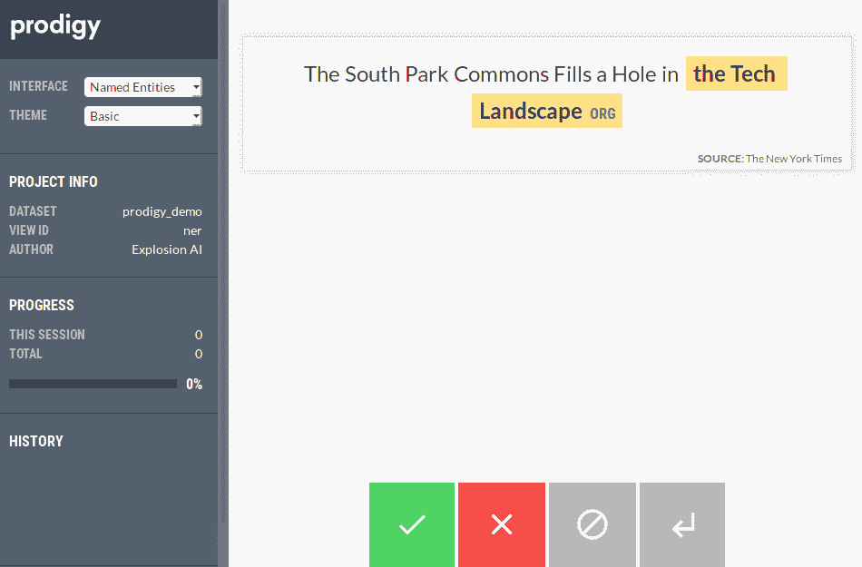
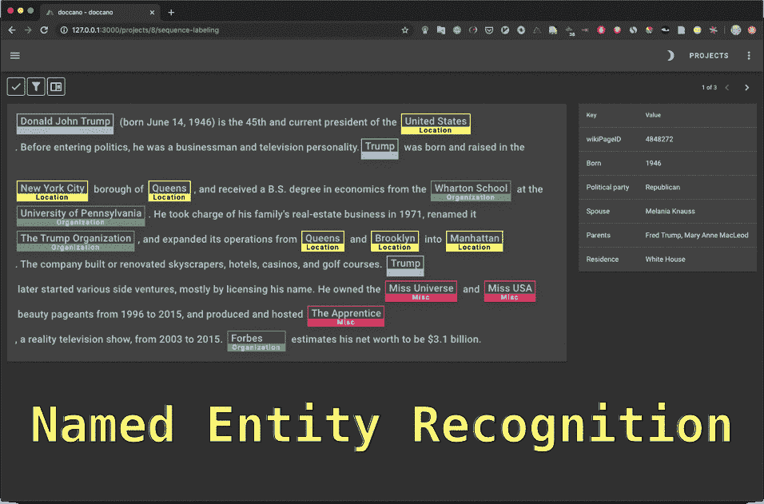
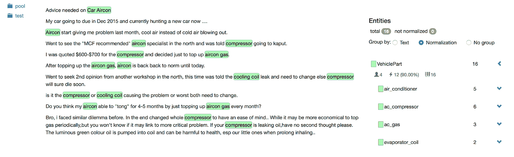
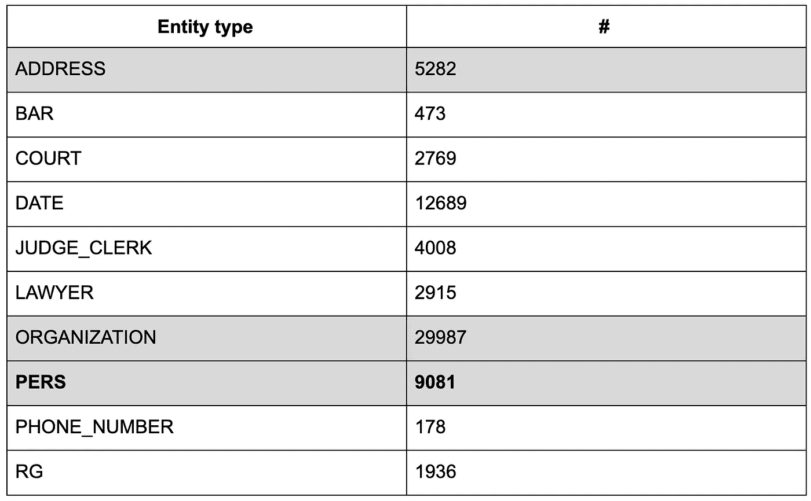
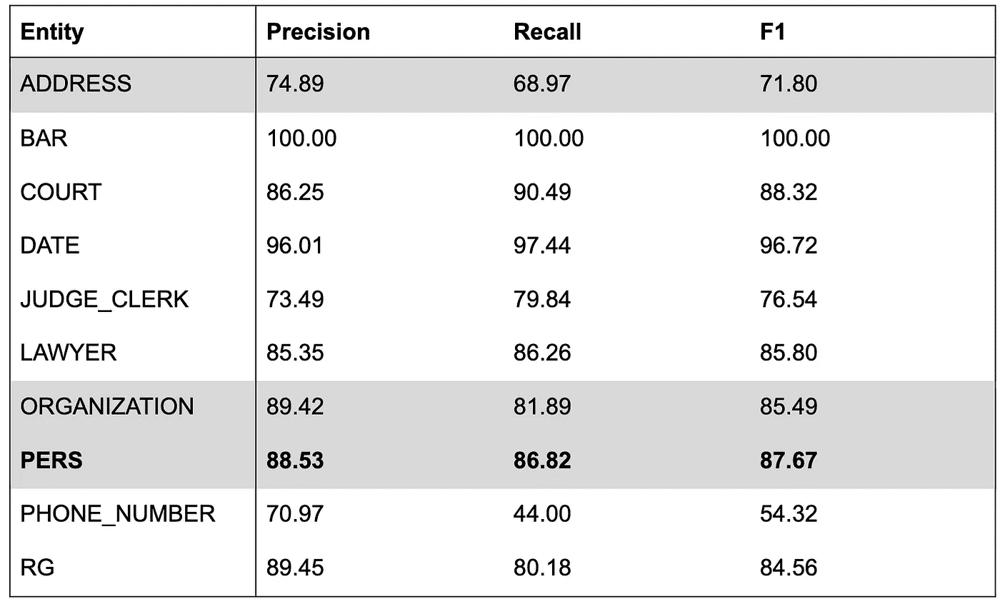
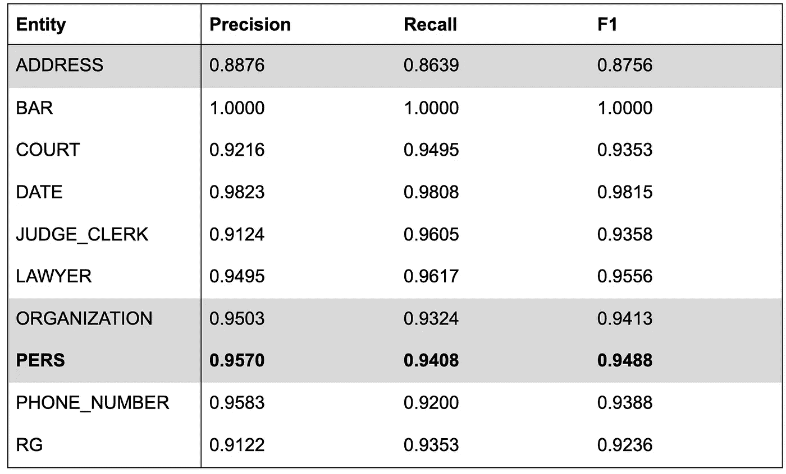
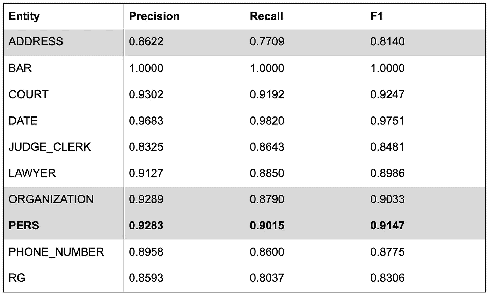
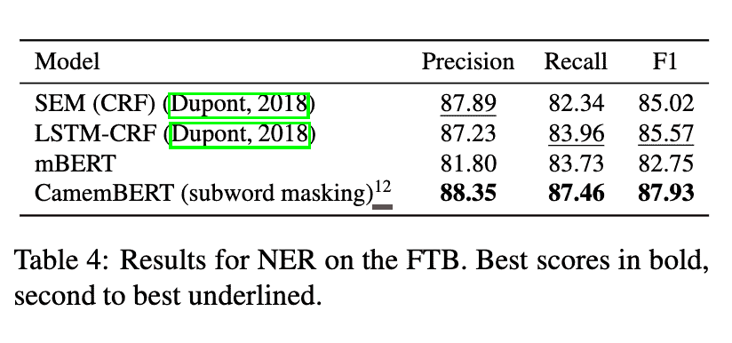
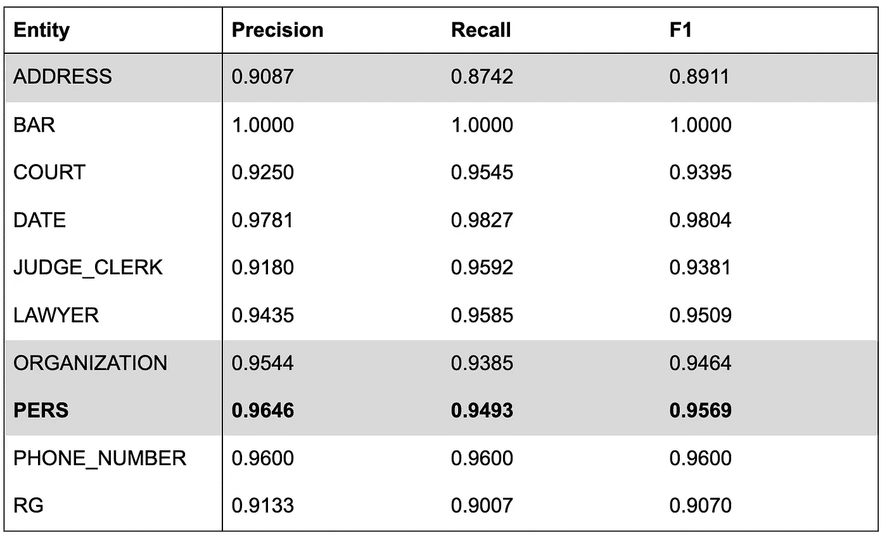

# NER 算法基准:spaCy，Flair，m-BERT 和 camemBERT 关于匿名化法国商业法律案件

> 原文：<https://towardsdatascience.com/benchmark-ner-algorithm-d4ab01b2d4c3?source=collection_archive---------4----------------------->

## (型号)大小重要吗？

Each of them is strong in its own way

*本文是上一篇关于上诉法院判决匿名化的续篇:* [*为什么我们从 Spacy 转向 Flair 来匿名化法国判例法*](/why-we-switched-from-spacy-to-flair-to-anonymize-french-legal-cases-e7588566825f) *。*

[根据几位全球机器学习专家](https://www.kdnuggets.com/2019/12/predictions-ai-machine-learning-data-science-research.html)，如 [Xavier](https://medium.com/u/dfc102dddf47?source=post_page-----d4ab01b2d4c3--------------------------------) (Curai)、[Anima Anand Kumar](https://medium.com/u/865aadbce346?source=post_page-----d4ab01b2d4c3--------------------------------)(Nvidia/Caltech)或 [Pedro Domingos](https://medium.com/u/60fd907d8004?source=post_page-----d4ab01b2d4c3--------------------------------) (华盛顿大学)的说法，2019 年的一个大趋势是使用非常大的预训练语言模型(BERT、Megatron-LM、AlBERT、RoBERT……)来提高大多数 NLP 任务的分数。

我在 Lefebvre Sarrut 出版社工作，这是一家出版公司，是欧洲法律行业的主要参与者。如下所述，我们还在帮助几个欧洲政府匿名化他们的法律决定，以推动司法数据公开。

我们希望衡量这些新的大型预训练模型与应用于现实生活数据和法律决策的命名实体识别(NER)任务的其他选项相比有多好。

我们之前的文章是关于匿名化上诉法院的判决，这次我们对商业法院的判决感兴趣。这是一个重大的变化，因为商业决策更具挑战性(更高的写作风格多样性、纸张扫描噪音、OCR 错误等)。).

在本文中， *(1)* 我们将公开解释我们的**背景**以及为什么一个合法出版商花费时间和精力在法律数据中具体推动数据公开， *(2)* 详细介绍我们如何着手**注释**商业决策，以及 *(3)* 通过一个**基准**来完成 NER 图书馆执行匿名化任务的 4 个主要选项。

我们测试了 4 种算法，2 种基于变压器，1 种基于双 LSTM，1 种具有[原始架构](https://www.kdnuggets.com/2019/12/predictions-ai-machine-learning-data-science-research.html):

*   [spaCy](https://medium.com/u/f6208eb7f56a?source=post_page-----d4ab01b2d4c3--------------------------------) v.2.2，这个版本引入了一个有趣的数据增强机制，类似于我们在[上一篇文章](/why-we-switched-from-spacy-to-flair-to-anonymize-french-legal-cases-e7588566825f)中手动尝试的，效果更好吗？
*   [天赋](https://github.com/zalandoresearch/flair):双 LSTM 角色模型，上次带来了最高分，这次还会重演吗？
*   [多语言 BERT](https://github.com/google-research/bert) (mBERT):著名的支持 104 种语言的 Google 机型，这么大的支持能做好工作吗？
*   camemBERT ，一个新的法语单语 BERT 模型，在 mBERT 已经支持法语的情况下，还有必要投入精力去建立这样的模型吗？

> 我们公布商业决策的 NER 分数。与前一篇文章中的数据集相比，它们应该要小心一些，因为商业法庭的数据集比上诉法庭的数据集更难处理。
> 
> *如果你对这个话题感兴趣，在推特上关注我:*[*https://twitter.com/pommedeterre33*](https://twitter.com/pommedeterre33)

# 为什么一家法律出版商对通过开源其源代码来免费匿名商业法律案件如此感兴趣？

在法国，3 年前投票通过了一项法律，将所有法律案件公开，因此任何公民、诉讼当事人、律师等。可以自由地使用它们，而不需要向任何人支付任何费用。在所有的法律判决中，商事法律判决的情况是特殊的。

商业法律案件是主要涉及公司和商业法律的判决，范围从公司之间简单的商业诉讼到复杂的破产。

这些商业决策的内在价值非常重要；作为一审判决，它们很好地描绘了当今国家的经济形势，包含了上诉法院案件中没有的事实细节，而这些事实细节是律师、大公司、保险、政府感兴趣的(例如，想想破产，你会了解到成千上万家公司日复一日发生的事情的细节，等等)。).

此外，您还可以从匿名化任务中获得附加价值(只有自然人会被匿名化，但许多实体都会被搜索，包括组织名称)，例如，利用每个决策的公司名称信息，您可以轻松地生成公司文件，对所有决策进行分组，这可能有助于监控您的客户、提供商等。

出于当时有意义的历史原因，这些决定，根据定义是公共数据，由商业法庭的书记员组成的财团出售。

在 2019 年读到这样的东西可能会令人惊讶，但外表是骗人的，这种状况是有道理的。简而言之，法国政府目前正在建设的一个名为 *Portalis* 的大型项目旨在集中所有法国法院的法律裁决。这是一个需要几年才能完成的项目。企业家需要访问商业决策，这就是为什么书记员联盟投资了基础设施来扫描、集中和分发所有法律决策的扫描 PDF，这是一项支付成本的付费服务。

> 在许多人看到混乱的地方，机会主义者看到了商机。

一些出版商试图大量购买商业决策(用于在他们的平台上发布)，但没有一家与店员的财团达成普遍协议……直到 2 年前，媒体披露一家初创公司获得了 ***事实上的独家交易*** 以获得数百万份商业决策以及**免费**的流量，使得“独家”公共数据的转售成为他们产品的主要焦点。

对他们来说不幸的是，在围绕他们的**付费锁定公共数据数据库**的规模进行了几个月的沟通后，他们因使用非法手段获得更“独家”的合法 decisions⁴而成为头条新闻，失去了作为 consequences⁵.之一的交易其他试图独家获得法律判决的尝试接踵而至，failed⁶.

很难说今天的情况对每个人(公民、诉讼当事人、律师、出版商、创业公司、政府)有多无效。简而言之，今天，**没有人**能够广泛访问最近的商业决策(更新于 1 年半之前)，它们仅以 PDF 扫描件的形式存在，可以按单位购买或手动免费索取纸质副本，但这根本不可扩展。

在这种情况下，职员协会试图为每个人改善情况。很有可能这些被集中起来并以扫描的 PDF 格式提供的判决将成为第一批被添加到未来由我们的最高 Court⁷.维护的法律案件公开数据数据库中的判决

> 这种情况如此极端，以至于它让我们质疑自己以前没有关注的事情，并迫使我们决定我们要去哪里。

我工作的公司( [Lefebvre Sarrut](https://www.lefebvre-sarrut.eu/) )已经做出了在整个欧洲开放法律数据的坚定承诺(我们正在不同的国家开展几个#openJustice 项目)。我们尽最大努力推动我们自己的生态系统，在这个国家，法律裁决对所有人都是免费的**。通过下面的文章，我们想分享的是，利用当今的技术，法国商业法院判决的法律案件匿名化是可行的。**

我们所有的工作(但不是明显数据隐私 reasons⁸的数据集)都是开源的([存储库](https://github.com/ELS-RD/anonymisation))，任何有权访问原始商业决策的人都可以轻松复制。

以下是对我们所做的端到端的描述，并提供了有关我们所达到的结果的细节。

# 不，ocr 化还没有解决！

对于这个测试，我们的工作是基于商业法庭书记员协会提供的法律判决的扫描 PDF。

我们有两种选择来对它们进行 OCR:使用 SAAS 服务，如亚马逊提供的 [one](https://aws.amazon.com/fr/textract/) ，或者使用开源解决方案，在我们自己的服务器上运行，如 [Tesseract](https://github.com/tesseract-ocr/tesseract) (该任务的主要开源库)，并自己完成所有工作。

我们选择[宇宙魔方](https://github.com/tesseract-ocr/tesseract)，老实说，我们不确定我们做出了正确的决定。取得不错的成绩很容易，但是我们花了很多时间去改进它。

我们面临的主要挑战是，我们自己没有扫描过文档，而且分辨率不是最佳的，无法获得开箱即用的最佳结果。出于这个原因，它需要一个重要的后处理步骤，以清除噪声或执行简单的事情，如识别一些棘手的段落定界或不一致的页眉和页脚。

我们不会提供更多的细节，因为这超出了本文的范围。我们只能说，这是一个**制造或购买的决定**，我们可能已经失败了，我们稍后将回到这一点。

# 无名英雄:注释工具和质量控制

这是这个项目最引人注目的方面，我们在注释质量上的每一项努力都被转化为分数改进，即使是最小的改进。

是的，数据质量很重要，这一点我们都知道，但是到底有多重要呢？

## 我们的不再是秘密酱，数据团队

注释由一个由 5 名法学家组成的团队在 2019 年 7 月至 8 月期间手动执行(任何时候都有 1 至 3 名法学家)。我们设定的目标是注释 500 个或更多的案例(根据我们对其他注释任务的一些观察)。法律判决是一份很长的文件，如下所示， **500 个案例代表了近 60K 个实体提及**。

通过这个项目和其他一些与机器学习相关的项目，数据团队的角色正在演变成一些新的东西:为算法创建数据和审计算法输出(到目前为止，他们的角色更多地是为编辑产品提供支持)。

> 这确实是法律出版业的一个有趣的转变，当周围的每个人都在幻想法律机器人和数字劳动力时，这也许应该得到适当的考虑…

人的部分是项目中较少被记录但仍然是最重要的部分之一。**注释可能很无聊，而且总是要求很高**。为了更好地实现这些观点，所有数据科学家都应该参与注释任务。因此，他们会意识到为什么关注注释者的用户体验如此重要。这意味着仔细选择工具。

## 为 NER 标记任务寻找合适的工具

工具直接影响数据团队的生产力。找到合适的工具首先需要知道你需要什么，然后测试它们。

## 来自[空间](https://medium.com/u/f6208eb7f56a?source=post_page-----d4ab01b2d4c3--------------------------------)作者的作品

对于一些内部项目，我们已经使用了来自 Ines Montani 和 Matthew Honnibal 的 [prodi.gy](https://prodi.gy/) ，这是一个不错的工具，但是，对于这个任务，它不符合我们的需求:

*   UI 不适用于长文档(我们需要显示完整的文档以获得足够的上下文来标记)
*   没有简单的方法来查看文档中的所有实体，
*   没有简单的方法在文档中搜索特定的实体提及，
*   没有针对多个标注器的高级管理和监控，
*   需要时间来设置我们的基础架构(需要召开内部会议来访问服务器等。)

> **勘误表**:为了澄清上面所说的，prodi.gy 能够加载长文档，并在单个文档中管理大量的实体提及，但它的 UI 更适合于具有狭窄上下文的短文本，以帮助注释者专注于任务。

很高兴知道一个解决上面列出的一些问题的工具[即将推出](https://support.prodi.gy/t/prodigy-annotation-manager-update-prodigy-scale-prodigy-teams/805)。

prodi.gy and its unequaled UI

## 多卡诺

我们考虑的另一个选择是[多卡诺](https://github.com/chakki-works/doccano):

*   比[产品](https://prodi.gy/)更好的长文档用户界面/ UX
*   开放源码
*   没有对协同工作的多个标注器进行高级管理和监控
*   需要时间来设置我们的基础架构(需要召开内部会议来访问服务器等。)

doccano interface

## [🍃tagtog](https://medium.com/u/72d1dec46312?source=post_page-----d4ab01b2d4c3--------------------------------)

我们测试了 3 个付费的 SAAS 标签平台，其中 2 个有错误的 API 和一个坏的 UX。

最后，我们用了第三个，[🍃tagtog](https://medium.com/u/72d1dec46312?source=post_page-----d4ab01b2d4c3--------------------------------) 。它不是一个开源的解决方案，费用是每月 147 欧元。它满足了我们的所有需求，没有明显的缺点:

*   成熟的高级多用户模式
*   几个工具，轻松快速地审查和提高注释质量
*   适用于长文档
*   跨多个文档修复特定模式的简单方法
*   零设置、无服务器、无内部会议

[🍃tagtog](https://medium.com/u/72d1dec46312?source=post_page-----d4ab01b2d4c3--------------------------------) tagging interface (there are few other screens)

有一个恼人的错误。它已经被[修复🍃tagtog](https://medium.com/u/72d1dec46312?source=post_page-----d4ab01b2d4c3--------------------------------) 团队，他们似乎对我们的评论反应很大。

> 每月 147 欧元比在我们的基础架构上设置和维护解决方案的工程师的成本要低，而且我们避免了为获得服务器部署权限而召开内部会议。

如果你要选择一个注释工具，我的建议是永远记住，这基本上是一个**制造或购买的决定**，以及其间的所有细微差别。当您可以避免该步骤时，服务器的设置/维护时间是一种“决策”选择(至少是部署)。

因此，要做出决定，你需要知道你需要多少来完全控制你的流量，如果它不完全是你想要的会发生什么，你的数据是敏感的(例如健康)等。？

下面是关于内部注释的一个有趣的相反观点:

## 作为迭代任务的注释

注释的挑战是用尽可能少的资源获得正确的数据质量和数量。

在决定了我们要注释的工具和决策数量之后，许多问题仍然存在:

*   有没有注释方法论可循？
*   如何定义标注计划？
*   如何检查和提高质量？
*   如何知道质量是否可以，何时可以停止？
*   我们如何才能轻松快速地找到改进机会？

我们采用的方法可以描述为以下步骤:

*   决定我们需要哪种类型的实体(在我们的例子中，类似于另一个项目的实体)
*   用相似的实体对不同的数据训练模型
*   将该模型应用于 500 个随机选择的决策，对它们进行预注释
*   将决策及其预注释上传至[🍃tagtog](https://medium.com/u/72d1dec46312?source=post_page-----d4ab01b2d4c3--------------------------------)
*   手动修正[上的注释🍃tagtog](https://medium.com/u/72d1dec46312?source=post_page-----d4ab01b2d4c3--------------------------------)
*   *【循环从此处开始】*下载标注，训练模型，测量
*   生成显示所有错误(标签和模型预测之间的差异)的报告
*   手动识别错误中的模式(一些是注释中的错误，一些是预测中的错误)
*   按照[中手动发现的模式手动修复注释🍃tagtog](https://medium.com/u/72d1dec46312?source=post_page-----d4ab01b2d4c3--------------------------------)
*   *【循环从此处开始】*下载数据，学习模型，测量
*   …

我们坚持**手动分析**的重要性。自动分析类似于应用*主动学习*方法，众所周知，这种方法在许多现实生活的 setups⁹.中有很多局限性

> 只有人工检查标签才能保证避免最大的偏差和最高的最终结果，这很费时间。

在我们的例子中，最困难的是注释中需要更多的同质化。我们做了 6 遍，试图使每个实体类型的注释均匀化。

为了说明同质化点，我们举一个例子，我们要在决策中标记 ORGANIZATION，意思是组织的名称，商业决策中大多是公司。

在法国，将公司形式放在商业名称前面是一种习惯。以“ *SNC 咖啡馆露露*”为例。“*”是一种公司形式(像其他国家的“*”有限合伙)。因此理论上我们不应该在标签中包含“ *SNC* ”，因为我们对这些信息不感兴趣。**

**似乎很大一部分法国企业家在组建公司时会在他们的商业名称中包含公司形式，因为他们错误地认为这样做是强制性的。在这种情况下，如果我们检查法国公司注册处，公司形式将出现在商业名称内的**。当然，另一大部分企业家没有犯这个错误。****

**最后，当你阅读一个决定，公司形式有时出现在一个名字前面，你不能真正知道这是因为它是完整的真实名称还是法官引用这家公司的方式(因为那是用法)。**

**理论上，你可以在标记公司名称之前在法国公司注册处进行检查，但这没关系，因为如果你的标签不是同质的，并且上下文没有告诉你是否必须包含公司表单，那么你的 NER 算法将会失败，无论它有多聪明。**

**因此，出于同质化的原因，我们决定有一个单一的规则，无论真实名称是什么，我们总是在组织标签中包含公司形式。这就是在注释步骤中发现的那种“T4”细节。**

**按照我们在第一个注释步骤中发现的所有注释规则，在第二个步骤中制作了测试集。**

## **足够大的商业决策数据集**

**我们已经注释了来自法国不同商业法庭的 585 个判决(由于我们的两步注释过程，比计划的要多一点)。写作风格是多样的，几乎没有共同的惯例。部分原因是，在法国，商业法官不是专业法官，而是由同行选举出来的商人，他们没有受过几年的普通法律培训(比如上诉法院的法官)。**

**这是一个需要记住的重要事实，与上诉法院相比，这使得 NER 算法的任务更加复杂，因为机器学习模型喜欢识别重复的模式。**

**下面我们将测试 2 个基于 BERT 的算法。BERT 对它接受的数据有一个限制:它被限制为 512 个单词块。它可以很容易地通过分割长句来解决，然而，为了避免死角，我们只是将它们从数据集中删除。当然，所有算法的度量都是在同一个清除的数据集上执行的。**

**我们获得了 69.3K 个实体，分为 10 种类型，组织名称是最具代表性的，这对于商业法律案件是有意义的。**

****

**Entity mentions count**

**在我们的[上一篇文章](/why-we-switched-from-spacy-to-flair-to-anonymize-french-legal-cases-e7588566825f)中，我们已经描述了每种类型实体的本质。如果还没读过，总结一下，PERS 实体提到的是人名和最重要的实体类型(必须匿名)，然后是地址和组织。**

**相比之下，NER 任务的论文中使用的法语树库包含 11636 个实体提及，分布在 7 个不同的类型中。**

# **聚光灯下基于深度学习的命名实体识别**

**所有培训都是在相同的硬件上进行的，12 核 i7，128 GB Ram 和 2080 TI Nvidia GPU。**

**Flair 和 BERT 表示的测试是通过这个[库](https://github.com/zalandoresearch/flair)中的 Flair 库完成的。BERT 表示不是由 Flair 本身生成的，它从[拥抱脸](https://medium.com/u/b1574f0c6c5e?source=post_page-----d4ab01b2d4c3--------------------------------)调用了令人敬畏的[变形金刚](https://github.com/huggingface/transformers)库。**

**这再次表明了开源生态系统的重要性，因为下面所有的测试(除了 [spaCy](https://medium.com/u/f6208eb7f56a?source=post_page-----d4ab01b2d4c3--------------------------------) )都是通过修改一行代码来完成的，所有的库都可以一起交流…太棒了！**

**我们使用了分支*GH-1221-修复-标记化-问题*(提交 [3cea2fa](https://github.com/zalandoresearch/flair/commit/3cea2fa7588d043fb33bb33f50e67dff5cf86c84) )的 Flair v0.4.4，以受益于对 BERT 标记化的修复。**

## **使用[空间](https://medium.com/u/f6208eb7f56a?source=post_page-----d4ab01b2d4c3--------------------------------) 2.2 增加现成的数据**

****

**在这个基准测试中，我们使用了来自[伊内斯·蒙塔尼](https://medium.com/u/c9f5e632b74f?source=post_page-----d4ab01b2d4c3--------------------------------)和[马修·霍尼伯](https://medium.com/u/42936aed59d2?source=post_page-----d4ab01b2d4c3--------------------------------)的[空间](https://medium.com/u/f6208eb7f56a?source=post_page-----d4ab01b2d4c3--------------------------------) v2.2。与以前的版本相比，这个版本带来了一些改进，特别是数据扩充模式。**

**基本上， [spaCy](https://medium.com/u/f6208eb7f56a?source=post_page-----d4ab01b2d4c3--------------------------------) 作者注意到，在 NER，大小写问题是一个常见的挑战，并且容易混淆算法。这在法律判决中是非常真实的。为了帮助算法，他们在外壳中随机产生变化。它应该使模型对这个问题更加稳健。**

**根据我们在[的上一篇文章](/why-we-switched-from-spacy-to-flair-to-anonymize-french-legal-cases-e7588566825f)中描述的经验，数据扩充是提高 NER 分数的好策略。**

**需要强调的是，这个模型没有任何每句话的数量限制。**

**我们在**不到一个小时**(我们测试到的最快速的算法提前停止)的时间内，对一个[空间](https://medium.com/u/f6208eb7f56a?source=post_page-----d4ab01b2d4c3--------------------------------)模型进行了 12 个历元的训练，得到了以下结果:**

****

**[spaCy](https://medium.com/u/f6208eb7f56a?source=post_page-----d4ab01b2d4c3--------------------------------) NER scores**

**这些分数不符合我们的要求(69%的地址召回率有点低)。这对我们来说并不意外，因为我们已经在上诉法院尝试了数据增强策略，我们观察到了真正的分数提高，但不足以达到大型预训练模型的结果。**

## **几乎是经典的人物为基础的双 LSTM 从天赋**

****

**⁰是一个基于双 LSTM 字符的单语模型，在维基百科上训练过。**

**需要强调的是，这个模型没有任何每句话的数量限制。准确地说，它有一些字符长度限制，但它是由 Flair 库内部管理的，用户不必了解它。**

**我们对一个模型进行了 8 小时 40 个纪元的训练，我们的分数如下。**

****

**Flair NER scores**

> **这些结果低于上诉法院的结果。我们认为书写风格的多样性加上 OCR 噪声是主要原因。**

**我们知道，我们可以通过简单地微调我们拥有的大型商业法院判决数据集的模型来轻松提高分数，但该基准的目的是了解我们可以从盒子中得到什么。**

## **多语言 BERT: 1 种表示适合 104 种语言**

****

**如果你不了解伯特，你最好先看看这些优秀的解剖伯特的文章。**

**Google 发布了几个版本的 BERT，主要的有:**

*   **仅英语(有套管和无套管)有不同的尺寸(意味着不同的缓慢风格)，**
*   **仅限中文，**
*   **多语言 BERT(通常称为 mBERT):在同一型号中支持 104 种语言。**

> **mBERT 是一个有趣的选择:BERT 的惊人能力适用于大多数现有的语言……等等，事情没那么简单。**

**训练多语言模型的技巧是首先在语言之间有一个共享的词汇表。一开始没什么意义，每种语言都有自己的词汇。**

**根据自然语言处理中关于 BPE 的文献，他们试图找到共享的子词，而不是整个词。他们使用[句子片段](https://github.com/google/sentencepiece)来分析多语言数据集并找到重要的子词，这意味着一个词可以分成几个子词。有了这些子词，你可以试着为每一个标记学习一个单一的表示，由几种语言共享。**

> **聪明而美丽的想法，但它真的有效吗？**

**在英语任务中，伯特的表现似乎低于英语伯特。到处都可以看到，小语种的开箱即用性能并没有那么高。然后出现了多篇论文《⁴》,表明通过聪明地使用单语模特⁵.，mBERT 的表现可以被显著击败**

**然而，mBERT 的承诺是美好的(一个模型适合几乎所有的语言),因为你需要疯狂的资源来训练一个端到端的基于 transformer 的单语模型，大多数从业者都坚持尝试利用 mBERT。**

**这就是我们最初这样做的原因:我们试图在我们的商业法律案件数据集上利用 mBERT。我们在不到一天的时间里对模型*进行了 78 个纪元的微调。***

**结果如下:**

****

**mBERT NER scores**

**这些结果很低，特别是 77%的地址召回率相当低。此外，该模型要求遵守 512 个令牌的限制，并且在内存占用量很大的情况下训练和推断非常慢。**

## **卡门贝干酪，当权力有了一个有趣的名字**

****

**自从 BERT 第一次发布以来，事情略有变化，很少有非英语的 BERT 模型被发布，其中一个是法语的: [camemBERT](https://camembert-model.fr/) ⁶(以一种令人愉快的奶酪命名)。这种架构的灵感很大程度上来自于 BERT 的一个演变，叫做 [RoBERTa](https://ai.facebook.com/blog/roberta-an-optimized-method-for-pretraining-self-supervised-nlp-systems/) 。**

**有趣的是，这篇论文包括了一个在 NER 的经验，并且报告了一个比适用于法语的 mBERT 大的改进。**

****

**在我们的例子中，数据比来自[法国树库](http://ftb.linguist.univ-paris-diderot.fr/)的更脏，因为它们来自不完善的 OCR 步骤。**

**训练持续 9 小时 30 分(40 个时代)。我们的结果如下:**

****

**camemBERT NER scores**

**它比 mBERT 好得多，并且在某些实体(如 ADDRESS)上比 Flair 稍好。这与[卡门贝干酪](https://camembert-model.fr/)论文的研究结果一致(略好于 2018 年 LSTM-SOTA 通用报告格式)。**

**此外，还有 BERT 的局限性:**

*   **512 令牌限制，**
*   **Flair 的内存占用要低得多，使得在推断过程中有更大的批量成为可能。**

# **结论**

**在该基准测试中，我们在真实数据集上比较了 4 个模型，我们的主要观察结果如下:**

*   **凭借其原始架构， [spaCy](https://medium.com/u/f6208eb7f56a?source=post_page-----d4ab01b2d4c3--------------------------------) 提供了比其他测试模型低得多的性能，数据扩充模式是不够的，**
*   **mBERT 是一个巨大(缓慢)的变压器模型。在我们的 NER 任务中，它并没有转化为高分，这个观察结果与来自[卡门贝干酪](https://camembert-model.fr/)论文的发现一致，**
*   **Flair 和 [camemBERT](https://camembert-model.fr/) 提供了类似的结果(camemBERT[比](https://camembert-model.fr/)稍好一些)，但是 [camemBERT](https://camembert-model.fr/) 在文本大小方面有一个恼人的限制(512 令牌限制)，并且在训练和推理上都比 Flair 慢。**

**我们的结论是，在我们的情况下，对于这个数据集，Flair 仍然是最佳选择。此外，我们认为，如果有更大的数据集用于预训练(或在领域数据中进行微调)，结果可能会更高，正如我们的最高法院在其 [NER 论文](https://arxiv.org/pdf/1909.03453.pdf)中所发现的那样。**

**事实上，与仅依赖于法语维基百科的 Flair 语言模型相比， [camemBERT](https://camembert-model.fr/) 似乎已经在 138 Gb 的未压缩文本上进行了预训练(小了 1 个数量级以上)。**

> **我们想强调的是，以上分数并不是我们能得到的最高分，而是我们现成的分数。决定投资和改进什么算法就够了。**

**真实的生产设置包括例如类似于上面引用的最高法院的工作的后处理步骤，其大幅度降低了错误率。**

**我们不认为我们的发现会推广到其他任务，如分类。基于字符的语言模型非常擅长 NER，因为后缀和前缀是强大的功能，但在分类方面，我们预计 [camemBERT](https://camembert-model.fr/) 会轻松击败 Flair 语言模型。**

**此外，与 Multifit 论文一致，它也表明从业者在与 mBERT 合作之前应该三思。如果存在的话，使用更简单的单语语言模型似乎更明智。**

**如前所示， [spaCy](https://medium.com/u/f6208eb7f56a?source=post_page-----d4ab01b2d4c3--------------------------------) 型号与今天的大型型号性能相比似乎有限。作者们正在研究它。似乎所有的模式都在朝着同一个方向前进，老实说我等不及结果了！**

**A discussion following our [previous article](/why-we-switched-from-spacy-to-flair-to-anonymize-french-legal-cases-e7588566825f) comparing Flair and spaCy**

**最后，我要感谢来自 Lefebvre Sarrut 的 **Sumi** 、 **Jonathan** 、 **Matthieu** (及其整个数据团队)和 **Vincent** 对项目和/或本文评论的贡献:-)**

# **笔记**

**[1]:买下所有这些将花费数百万欧元:每项裁决 4.93 欧元[(https://www . infogreffe . fr/activite-judiciaire/rechercher-une-affaire . html](https://www.infogreffe.fr/activite-judiciaire/rechercher-une-affaire.html))，而商业法院在 2018 年已经发布了 137K 项裁决[(http://www.justice.gouv.fr/art_pix/CC%202019_V8.pdf](http://www.justice.gouv.fr/art_pix/CC%202019_V8.pdf)，第 11 页)**

**[2]:**Tribunaux de commerce:l ' overval cadeau d ' infogreffeàdoctrine . fr**，[https://www . lalettrea . fr/entreprises _ tech-et-telecoms/2018/06/25/Tribunaux-de-commerce-l-overval-cadeau-d-infogreffe-a-doctrinefr，108314593-ge0](https://www.lalettrea.fr/entreprises_tech-et-telecoms/2018/06/25/tribunaux-de-commerce--l-exorbitant-cadeau-d-infogreffe-a-doctrinefr,108314593-ge0)**

**[3]:**Doctrine veut centrazer tout l ' information juridique disp ible pour-les-professionals du droit-0907-1173997 . html****

**[4]:**Piratage massif de données au tribunal**，[https://www . lemonde . fr/economie/article/2018/06/28/Piratage-massif-de-donnes-au-tribunal _ 5322504 _ 3234 . html](https://www.lemonde.fr/economie/article/2018/06/28/piratage-massif-de-donnees-au-tribunal_5322504_3234.html)**

**[5]:**pour quoi doctrine . fr est l chépar les greffes**，[https://www . lalettrea . fr/entreprises _ tech-et-telecoms/2018/09/27/pour quoi-doctrine fr-est-lache-par-les-greffes，108325460-evl](https://www.lalettrea.fr/entreprises_tech-et-telecoms/2018/09/27/pourquoi-doctrinefr-est-lache-par-les-greffes,108325460-evl)**

**[6]:未来的《司法组织法》第 r . 433–3 条明确将商事法院的判决纳入我们最高法院之一将维护的未来开放数据库，[https://www . dalloz-actual ite . fr/flash/open-data-des-decisions-de-justice-projet-de-decret #。XeTUzJNKhaQ](https://www.dalloz-actualite.fr/flash/open-data-des-decisions-de-justice-projet-de-decret#.XeTUzJNKhaQ)**

**[7]: **公开数据和司法裁决的区别**，[https://www . dalloz-actual ite . fr/flash/distinction-entre-l-open-data-et-l-acces-aux-decisions-de-justice](https://www.dalloz-actualite.fr/flash/distinction-entre-l-open-data-et-l-acces-aux-decisions-de-justice)**

**[8]:数据集由原始法律判决组成，所有个人信息都将被删除。它不能被分享，因为它会违反 GDPR 教。**

**[9]: **部署主动学习的实际障碍**，[https://www.aclweb.org/anthology/D19-1003.pdf](https://www.aclweb.org/anthology/D19-1003.pdf)**

**[10]: **用于序列标记的上下文字符串嵌入**，[https://alanakbik.github.io/papers/coling2018.pdf](https://alanakbik.github.io/papers/coling2018.pdf)**

**[11]: **科萨伯特**，[https://medium.com/dissecting-bert](https://medium.com/dissecting-bert)**

**[12]:支持语言列表，[https://github . com/Google-research/Bert/blob/master/multilingual . MD](https://github.com/google-research/bert/blob/master/multilingual.md)**

**[13]: **比如这个 Reddit 线程**，[https://www . Reddit . com/r/language technology/comments/bsfb8s/what _ has _ your _ experience _ using _ multilingual/](https://www.reddit.com/r/LanguageTechnology/comments/bsfb8s/what_has_been_your_experience_using_multilingual/)**

**[14]: MultiFiT:高效的多语言语言模型微调，【https://arxiv.org/abs/1909.04761】T4**

**[15]:准确地说，多语言模型([激光](https://github.com/facebookresearch/LASER)来自脸书)被用来引导事物，但是最终任务是由单语模型执行的。**

**[16]: **卡门贝干酪:一种美味的法语语言模型**，[https://arxiv.org/pdf/1911.03894.pdf](https://arxiv.org/pdf/1911.03894.pdf)**