# 基准分类编码器

> 原文：<https://towardsdatascience.com/benchmarking-categorical-encoders-9c322bd77ee8?source=collection_archive---------4----------------------->


大多数表格数据集包含分类要素。最简单的方法就是用标签编码器对它们进行编码。这很简单，但有时不准确。

在这篇文章中，我想展示可以“开箱即用”的更好的方法(感谢[类别编码器](https://contrib.scikit-learn.org/categorical-encoding/) Python 库)。我将从描述编码分类变量的不同策略开始。然后，我将向您展示如何通过单次和双次验证来改进这些功能。本文的最后部分专门讨论基准测试的结果(这也可以在我的 GitHub repo—[categoricalencoding benchmark](https://github.com/DenisVorotyntsev/CategoricalEncodingBenchmark)中找到)。

以下材料描述了二元分类任务，但所有公式和方法都可以应用于多类分类(只要它可以表示为二元分类)和回归。

# TL；速度三角形定位法(dead reckoning)

1.  [天下没有免费的午餐](https://en.wikipedia.org/wiki/No_free_lunch_theorem)。你必须尝试多种类型的编码器，以找到最适合你的数据；
2.  然而，最稳定和准确的编码器是基于目标的编码器，具有双重验证:Catboost 编码器、James-Stein 编码器和 target 编码器；
3.  *encoder.fit_transform()* 在整个列车上是一条无路可走的路:事实证明，单一验证是比常用的无验证好得多的选择。如果你想获得稳定的高分，双重验证是你的选择，但要记住，这需要更多的时间来训练；
4.  正则化对于基于目标的编码器是必须的。

# 分类编码器

如果你想更好地理解分类编码，我建议你拿起笔和纸，用我下面提供的公式进行计算。这不会花太多时间，但是真的很有帮助。在公式中，我将使用以下参数:

*   *y* 和 *y+* —观察总数和阳性观察总数(*y*= 1)；
*   *、易*——类别和目标的第 *i 个*值；
*   *n* 和 *n+* —一个分类列的给定值的观察数和正观察数(*y*= 1)；
*   *a* —正则化超参数(由用户选择)*，*previous—目标的平均值。

示例训练数据集如下所示:

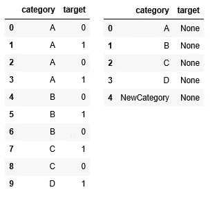

Example train dataset on the left and test dataset on the right

*   *y=10，y+= 5；*
*   *ni="D "，yi* =数据集第 9 行 1(最后一次观察)*；*
*   对于类别 *B* : *n=3，n+= 1；*
*   *先验*=*y+*/*y*= 5/10 = 0.5。

记住这一点，让我们从简单的开始，逐渐增加编码器的复杂性。

## 标签编码器(LE)或顺序编码器(OE)

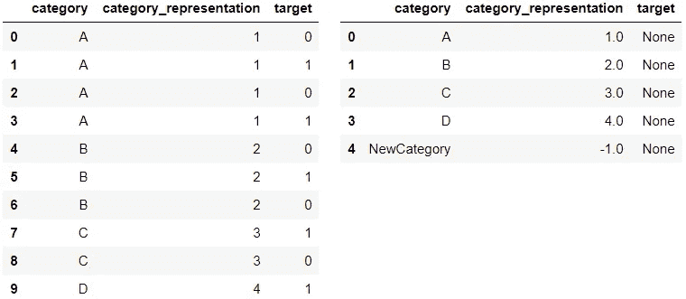

Category representation — Label Encoding

处理类别最常见的方法是简单地用一个数字映射每个类别。通过应用这样的转换，模型会将类别视为有序的整数，这在大多数情况下是错误的。这种转换不应该“按原样”用于几种类型的模型(线性模型、KNN、神经网络等)。).应用梯度增强时，只有当列的类型被指定为 [*【类别】*](https://pandas.pydata.org/pandas-docs/stable/user_guide/categorical.html) 时才能使用:

```
df[“category_representation”] = df[“category_representation”].astype(“category”)
```

标签编码器中的新类别被替换为“-1”或无。如果您正在处理表格数据，并且您的模型是梯度增强的(尤其是 LightGBM 库)，LE 是在内存方面处理类别的最简单有效的方法(python 中的类别类型比对象类型消耗的内存少得多)。

## 一键编码器(OHE)(虚拟编码)

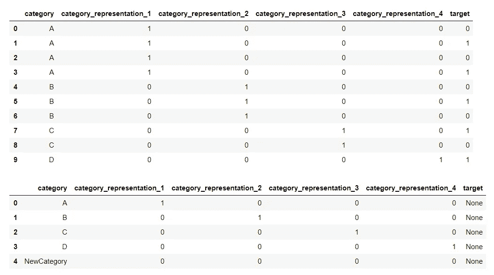

Category representation — One-Hot-Encoding

One Hot 编码是处理分类列的另一种简单方法。它采用标签编码的分类列，然后将该列拆分为多个列。根据哪一列有什么值，数字会被 1 和 0 替换。

OHE 扩展了数据集的大小，这使它成为内存效率低下的编码器。有几种策略可以克服 OHE 的内存问题，其中之一就是使用稀疏而非密集的数据表示。

## 和编码器(偏差编码或 E **效果编码**

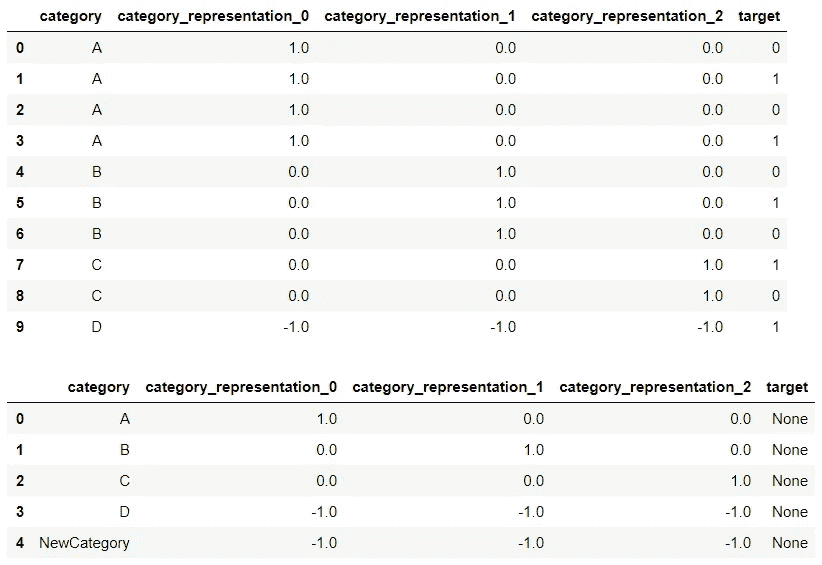

Category representation — Sum Encoding

Sum Encoder 将分类列的给定级别的因变量(目标)的平均值与目标的总体平均值进行比较。求和编码与 OHE 非常相似，两者都常用于线性回归(LR)类型的模型中。

然而，它们之间的区别在于对 LR 系数的解释:在 OHE 模型中，截距代表基线条件的平均值，系数代表简单效应(一个特定条件与基线之间的差异)，而在 Sum 编码器模型中，截距代表大平均值(所有条件)，系数可以直接解释为主要效应。

## 赫尔默特编码器

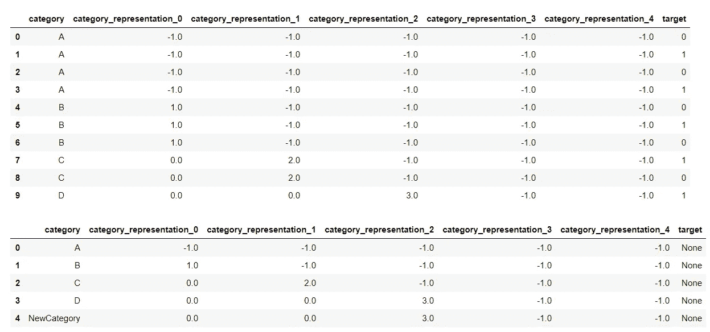

Category representation — Helmert Encoder

赫尔默特编码是用于回归的第三种常用类型的分类编码，另外两种是 OHE 和求和编码。它将分类变量的每个级别与后续级别的平均值进行比较。因此，第一个对比将“A”的因变量的平均值与分类列(“B”、“C”、“D”)的所有后续级别的平均值进行比较，第二个对比将“B”的因变量的平均值与所有后续级别(“C”、“D”)的平均值进行比较，第三个对比将“C”的因变量的平均值与所有后续级别的平均值进行比较(在我们的示例中，只有一个级别—“D”)。

这种类型的编码在某些情况下很有用，例如，分类变量的级别是按从低到高或从最小到最大的顺序排列的。

## 频率编码器

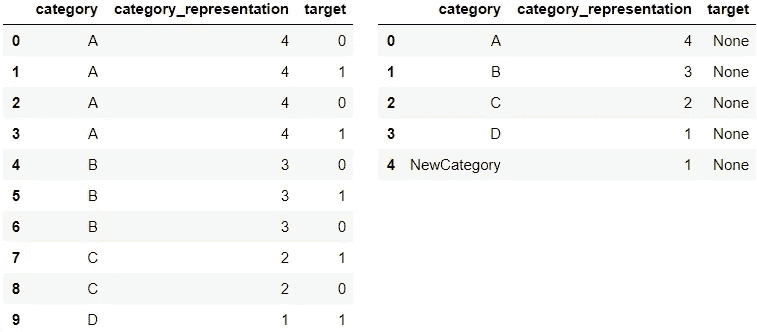

Category representation — Frequency Encoding

频率编码统计类别在数据集中出现的次数。测试数据集中的新类别用“1”或测试数据集中的类别计数进行编码，这使得这个编码器有点棘手:对不同大小的测试批次的编码可能不同。你应该事先想好，把训练的预处理做得尽可能接近测试。

为了避免这种问题，您也可以考虑使用一种频率编码器变体—滚动频率编码器(RFE)。RFE 统计一个类别在给定观察值的最后 *dt* 时间步出现的次数(例如， *dt* = 24 小时)。

然而，当分类列具有“长尾”时，频率编码和 RFE 特别有效，例如，在数据集中有几个频繁值，而其余的值只有几个例子。在这种情况下，频率编码将捕捉稀有列之间的相似性。

## 目标编码器

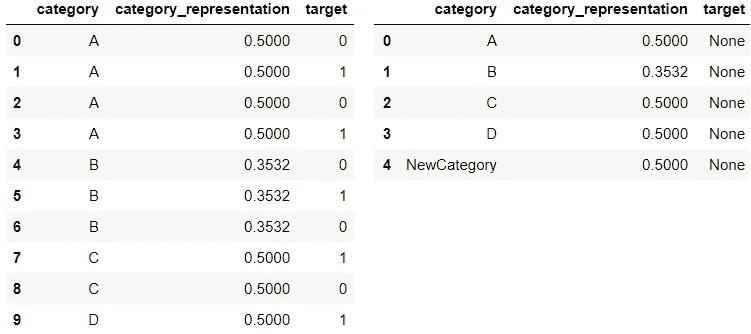

Category representation — Target Encoding

由于 Kaggle 竞争，目标编码可能已经成为最流行的编码类型。它需要关于目标的信息来编码类别，这使得它非常强大。编码类别值根据以下公式计算:

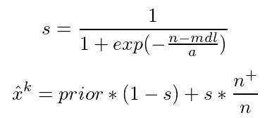

这里，*MDL*—leaf 中的最小数据(样本)， *a* —平滑参数，代表正则化的能力。 *mdl* 和 *a* 的推荐值为 1 到 100 范围内的。类别的新值和在训练数据集中仅出现一次的值被先前的值替换。

目标编码器是一个强大的工具，但是它有一个巨大的缺点——目标泄漏:它使用关于目标的信息。由于目标泄漏，模型过度拟合训练数据，导致不可靠的验证和较低的测试分数。为了减少目标泄漏的影响，我们可以增加正则化(如果没有不可靠的验证，很难调整那些超参数)，将随机噪声添加到训练数据集中的类别表示中(某种增强)，或者使用双重验证。

## m 估计编码器


Category representation — M-Estimate Encoder

M-Estimate 编码器是目标编码器的简化版本。它只有一个超参数——*m*，代表正则化的力量。 *m* 的值越高，收缩越强。 *m* 的推荐值在 1 到 100 的范围内。

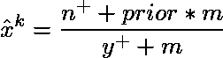

在不同的资料中，你可能会找到 M-估计量的另一个公式。分母中不是 *y+* 而是 *n* 。我发现这样的表现有相似的分数。

**UPD(2019 年 7 月 17 日)**:分类编码器库中的 M 估计编码器公式[包含一个 bug](https://github.com/scikit-learn-contrib/categorical-encoding/issues/200) 。右边的分母应该有 *n* 。然而，这两种方法都显示出很好的成绩。下面的基准测试是通过“错误的”公式完成的。

## 证据权重编码器

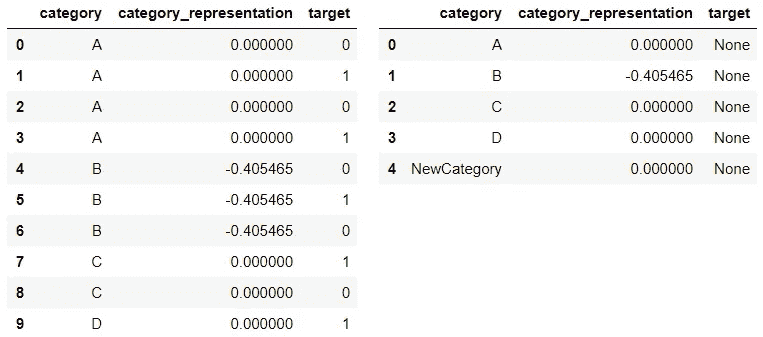

Category representation — Weight Of Evidence Encoder

证据权重是信用评分中常用的基于目标的编码器。它是对一个分组区分好风险和坏风险(违约)的“强度”的度量。它是根据基本比值比计算出来的:

```
*a = Distribution of Good Credit Outcomes
b = Distribution of Bad Credit Outcomes
WoE = ln(a / b)*
```

然而，如果我们按原样使用公式，可能会导致目标泄漏和过度拟合。为了避免这种情况，引入正则化参数 *a* ，并以如下方式计算 WoE:


## 詹姆斯-斯坦编码器

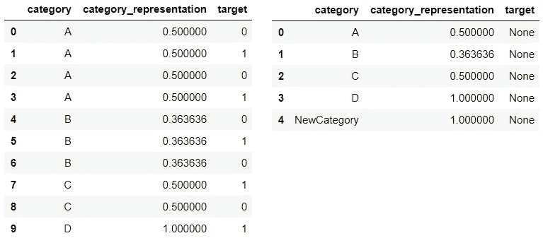

Category representation — James-Stein Encoder Encoder

James-Stein 编码器是一种基于目标的编码器。这种编码器的灵感来自 James–Stein estimator，这种技术以 Charles Stein 和 Willard James 命名，他们简化了 Stein 在 1956 年提出的原始高斯随机向量均值估计方法。Stein 和 James 证明了存在比“完美”(即均值)估计量更好的估计量，这似乎有点自相矛盾。然而，当有几个*未知总体均值——而不是一个时，James-Stein 估计量优于样本均值。*

詹姆斯-斯坦编码器背后的想法很简单。类别 *k* 的平均目标估计值可根据以下公式计算:

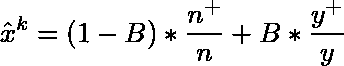

编码旨在通过将类别的平均目标值(金额的第一个成员)向更中心的平均值(金额的第二个成员)收缩，来改进对类别的平均目标值(金额的第一个成员)的估计。公式中唯一的超参数是 *B —* 收缩的力量。可以理解为正则化的力量，即 *B* 的值越大，全局均值的权重越大(欠拟合)，而 *B* 的值越小，条件均值的权重越大(过拟合)。

选择 *B* 的一种方法是通过交叉验证将其调整为超参数，但 Charles Stein 提出了另一种解决问题的方法:

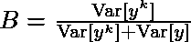

直观地，该公式可以在以下意义上看到:如果我们不能依赖于对目标类别均值的估计(它具有高方差)，这意味着我们应该为全局均值分配更大的权重。

等等，但是如果我们不能依靠均值的估计，我们怎么能相信方差的估计呢？嗯，我们可以说所有类别之间的方差是相同的，等于 *y* 的全局方差(这可能是一个很好的估计，如果我们没有太多独特的分类值；它被称为*混合方差*或*混合模型*，或者用标准差的平方代替方差，这惩罚了小的观察计数(*独立模型*)。

看起来很公平，但是 James-Stein 估计量有一个很大的缺点——它只针对正态分布定义(对于任何分类任务都不是这样)。为了避免这种情况，我们可以像在 WoE Encoder(默认情况下使用，因为它很简单)中那样用对数优势比转换二进制目标，或者使用 beta 分布。

## 留一编码器

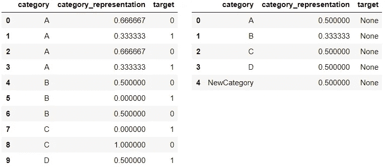

Category representation — Leave-one-out Encoding

留一编码(LOO 或 LOOE)是基于目标的编码器的另一个例子。该方法的名称清楚地表明了这一点:如果从数据集中删除了观察值 *j* ，我们将为观察值 *j* 计算类别 *k* 的平均目标:

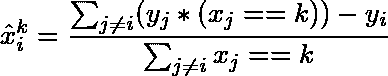

在对测试数据集进行编码时，类别被训练数据集中类别 *k* 的平均目标替换:

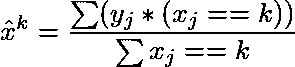

与所有其他基于目标的编码器一样，LOO 的一个问题是目标泄漏。但是当涉及到 LOO 时，这个问题变得非常严重，因为我们可以通过进行单次分割来完美地对训练数据集进行分类:类别 *k* 的最佳阈值可以通过以下公式来计算:

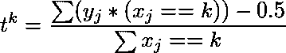

LOO 的另一个问题是训练样本和测试样本中的值之间的偏移。你可以从上面的图片中观察到它。在训练样本中，类别“A”的可能值为 0.67 和 0.33，而在测试样本中为 0.5。这是训练和测试数据集中计数数量不同的结果:对于类别“A ”,分母等于测试的 *n* ,训练数据集的 *n-1* 。这种转变可能会逐渐降低基于树的模型的性能。

## Catboost 编码器

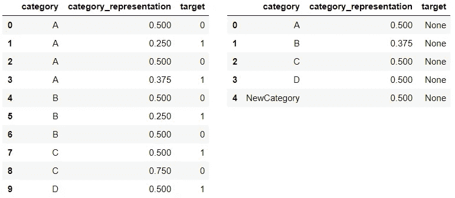

Category representation — CatBoost Encoder

Catboost 是最近创建的基于目标的分类编码器。它旨在克服 LOO 中固有的目标泄漏问题。为了做到这一点，Catboost 的作者引入了“时间”的概念:数据集中观察值的顺序。显然，每个示例的目标统计值只依赖于观察到的历史。为了计算训练数据集中观测值 *j* 的统计量，我们可以只使用观测值，这些观测值是在观测值 *j* 之前收集的，即 *i≤j:*

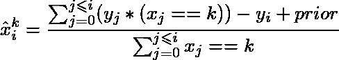

为了防止过度拟合，对训练数据集的目标编码过程在数据集的混洗版本上重复几次，并对结果进行平均。测试数据的编码值的计算方式与 l00 编码器相同:

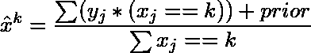

Catboost“动态”编码是 [CatBoost](https://github.com/catboost/catboost) 的核心优势之一，这是一个用于梯度增强的库，当 Yandex 展示它时，它在几个表格数据集上显示了最先进的结果。

# 验证方法

模型验证可能是机器学习最重要的方面。在处理包含分类变量的数据时，我们可能希望使用三种类型的验证之一。无验证是最简单的方法，但也是最不准确的方法。双重验证可以显示很高的分数，但它像乌龟一样慢。单一验证是前两种方法的结合。

这一节将详细讨论每一种验证类型。为了更好地理解，对于每种类型的验证，我添加了管道的框图。

## 无验证

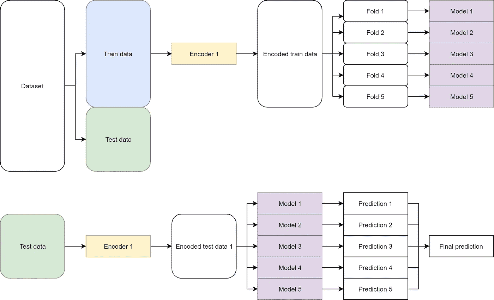

在无验证的情况下，单个编码器适合整个列车数据。数据集的验证和测试部分用同一个编码器处理。作为最简单的一种，这种方法被广泛使用，但它会导致训练过程中的过度拟合和不可靠的验证分数。最明显的原因是:对于目标编码器，无验证导致训练和测试部分之间的转移(参见 LOO 编码器中的例子)；测试数据集可能包含新的分类值，但在训练期间，训练和验证样本都不包含它们，这就是为什么:

*   模型不知道如何处理新的类别；
*   训练样本和测试样本的最佳树数量可能不同。

## 单一验证

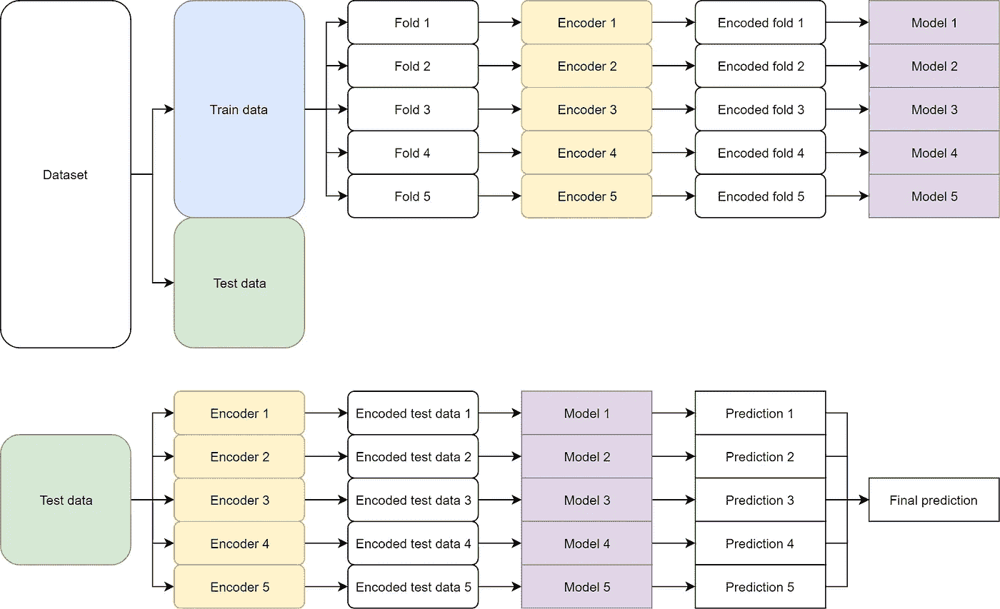

单一验证是执行验证的更好方式。通过使用单一验证，我们克服了无验证的问题之一:验证和测试数据集之间的转换。在这种方法中，我们为训练数据的每个文件夹安装单独的分类编码器。每个折叠的验证部分以与测试数据相同的方式处理，因此变得更加相似，这积极地影响超参数调整。单次验证得到的最优超参数比无验证得到的最优超参数更接近测试数据集的最优超参数。

*注意*:虽然我们正在调整超参数，即一些树，但在数据的验证部分，验证分数无论如何都会稍微偏高。测试分数也是如此，因为编码器的类型也是管道的超参数。我通过加大测试(通常数据的 40%)来减少过度拟合的影响。

单一验证的另一个好处是跨折叠的多样性。通过在数据子集上拟合编码器，我们实现了类别的不同表示，这积极地影响了预测的最终混合。

## 双重验证

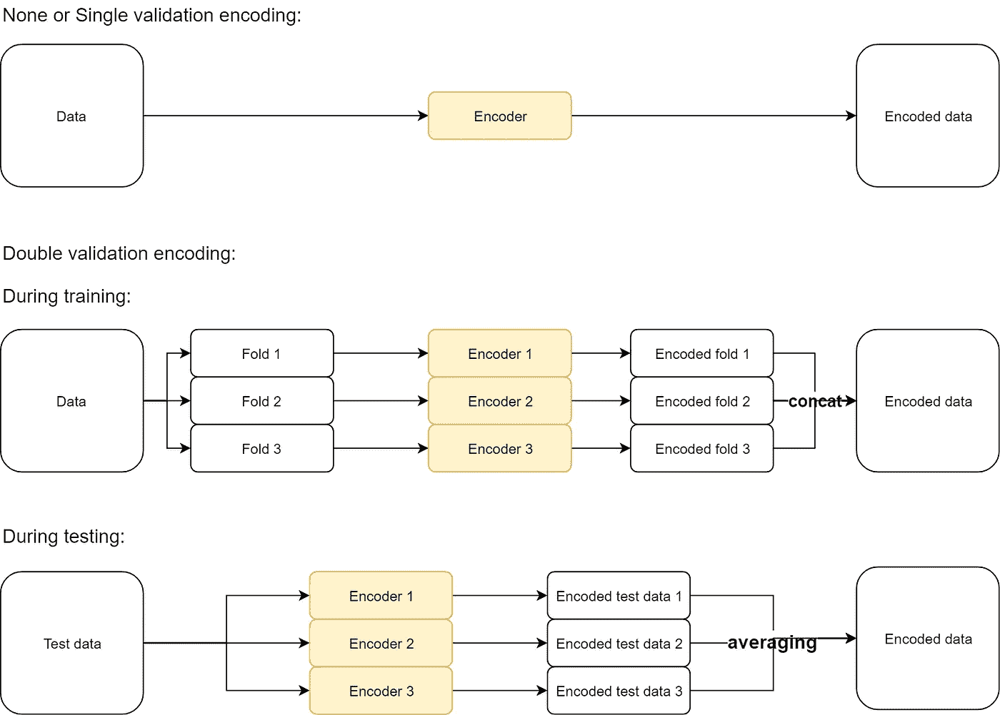

双重验证是单一验证的扩展。双重验证的管道与单一验证的管道完全相同，除了编码器部分:我们将在不同的子集上使用几个编码器，而不是为每个折叠使用一个编码器。

双重验证旨在减少第二个无验证问题——新类别的影响。这是通过将每个折叠拆分成子折叠，为每个子折叠安装单独的编码器，然后连接(在训练部分的情况下)或平均(在验证或测试部分的情况下)结果来实现的。通过应用双重验证，我们在训练数据中引入一个噪声(新的类别),作为数据的扩充。然而，双重验证有两个主要缺点:

*   对于编码器，我们不能“照原样”使用它，它将单个类别表示为多个列(例如，OHE、求和编码器、赫尔默特编码器和后向差分编码器)；
*   双重验证的时间复杂度大约比单一验证大 *k* 倍( *k* —子文件夹数)。

# 基准测试实验设置

我希望你不要被理论部分弄得不知所措，还记得论文的标题。所以，让我们从这一点开始练习吧！在下一节中，我将向您展示我是如何为表格数据确定最佳分类编码器的。

## 数据集

我创建并测试了 [pipeline](https://github.com/DenisVorotyntsev/CategoricalEncodingBenchmark) ,对下表中的数据集进行了类别基准测试。除了 *poverty_A(B，C)* 之外的所有数据集来自不同的域；他们有不同数量的观察，以及分类和数字特征。所有数据集的目标是执行二元分类。预处理非常简单:我从数据集中删除了所有基于时间的列。剩下的不是绝对的就是数字的。

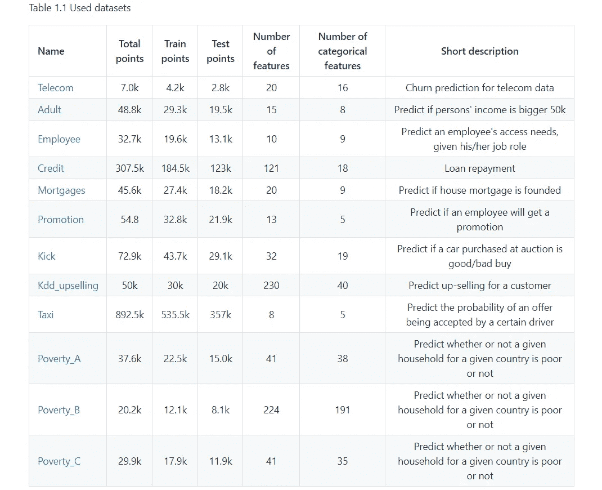

## 管道

整个数据集被分成训练(数据的前 60%)和测试样本(数据的剩余 40%)。测试部分在培训期间不可见，并且只使用一次——用于最终评分(使用的评分标准——*ROC AUC*)。没有对整个数据的编码，没有伪标记，没有 TTA 等。在训练或预测阶段被应用。我希望实验尽可能接近生产环境。

在训练-测试分割之后，训练数据通过混洗和分层被分割成 5 个折叠。之后，其中 4 个用于拟合编码器(对于无验证的情况-如果在分割之前拟合到整个训练数据集，则为编码器)和 LightGBM 模型([LlightGBM](https://lightgbm.readthedocs.io/)-来自微软的用于梯度增强的库)，另外 1 个折叠用于早期停止。这个过程重复了 5 次，最后，我们有了 5 个经过训练的编码器和 5 个 LGB 模型。LightGBM 模型参数如下:

```
"metrics": "AUC", 
"n_estimators": 5000, 
"learning_rate": 0.02, 
"random_state": 42,
"early_stopping_rounds": 100
```

在预测阶段，用每个编码器处理测试数据，并通过每个模型进行预测。然后对预测进行排名和求和( *ROC AUC* metric 不关心预测是平均还是求和；唯一重要的是顺序)。

# 结果

本部分包含实验的处理结果。如果您想查看每个数据集的原始分数，请访问我的 GitHub 存储库—[CategoricalEncodingBenchmark](https://github.com/DenisVorotyntsev/CategoricalEncodingBenchmark)。

为了确定最佳编码器，我对每个数据集的 *ROC AUC* 分数进行了缩放(最小-最大缩放)，然后对编码器的结果进行了平均。获得的结果代表每个编码器的平均性能分数(越高越好)。表 2.1–2.3 显示了每种验证类型的编码器性能分数。

为了确定最佳验证策略，我比较了每种验证类型的每个数据集的最高得分。得分改进(数据集的最高分和编码器的平均分)如下面的表 2.4 和 2.5 所示。


*   每个数据集和每种验证类型的最佳编码器是不同的。然而，在无验证实验中，非目标编码器(头盔编码器和总和编码器)占主导地位。这是一个非常有趣的发现，因为最初这些类型的编码器主要用于线性模型。
*   对于单个验证的情况，最好的编码器是 CatBoost 编码器和序数编码器，这两种编码器在无验证实验中的性能得分相对较低。
*   具有双重验证的基于目标的编码器(James-Stein、Catboost、Target、LOO、WOE)显示了所有类型的验证和编码器的最佳性能分数。我们现在可以称之为处理分类变量的最稳定和最准确的方法。
*   通过在训练数据中引入噪声来提高基于目标的编码器的性能。在 LOO 编码器中可以清楚地看到这一点——它在无验证和单验证中都是最差的编码器，与第二差的编码器差距巨大，但在双重验证中却是最好的编码器之一。双重验证(或正则化的另一种变体)是所有基于目标的编码器所必须的。
*   通过增加验证的复杂性降低了频率编码器的结果。这是因为测试中新类别的频率在整个测试中计算，而在单次验证期间，它在 1/5 的训练数据集(训练数据集中的 5 个折叠)中计算，在双重验证期间，在 1/25 的训练数据集(训练数据集中的 5 个折叠，每个折叠中的 5 个子折叠)中计算。因此，测试数据中的最大频率大于训练和验证数据样本。你记得我告诉过你菲很狡猾吗？这就是原因。

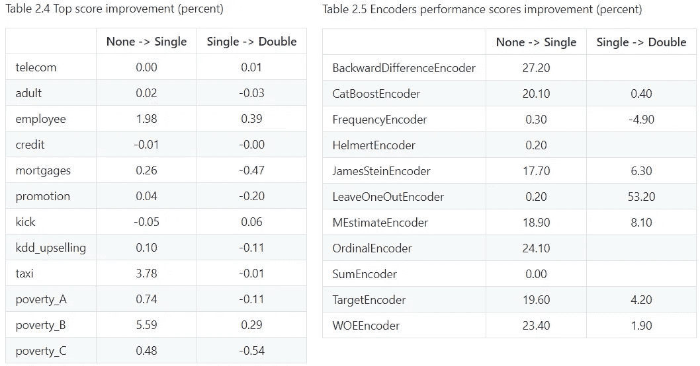

# 感谢

我要感谢安德烈·卢基扬科、安东·比留科夫和丹尼尔·波塔波夫对工作成果进行了富有成效的讨论。

# 参考

1.  [分类变量的 R 库对比编码系统](https://stats.idre.ucla.edu/r/library/r-library-contrast-coding-systems-for-categorical-variables/)
2.  [类别编码器文档](http://contrib.scikit-learn.org/categorical-encoding/index.html)
3.  [分类变量的对比编码系统](http://psych.colorado.edu/~carey/Courses/PSYC5741/handouts/Coding%20Categorical%20Variables%202006-03-03.pdf)
4.  [回归中分类变量的编码方案](http://www.mypolyuweb.hk/~sjpolit/coding_schemes.html)，[回归分析中分类变量的编码系统](https://stats.idre.ucla.edu/spss/faq/coding-systems-for-categorical-variables-in-regression-analysis-2/)
5.  [证据权重(WoE)介绍性概述](http://documentation.statsoft.com/STATISTICAHelp.aspx?path=WeightofEvidence/WeightofEvidenceWoEIntroductoryOverview)
6.  [詹姆斯-斯坦估计量](https://en.wikipedia.org/wiki/James%E2%80%93Stein_estimator)，[詹姆斯-斯坦估计量:定义，公式](https://www.statisticshowto.datasciencecentral.com/james-stein-estimator/)，[统计学中的斯坦悖论](https://www.researchgate.net/publication/247647698_Stein's_Paradox_in_Statistics)
7.  [分类和预测问题中高基数分类属性的预处理方案](http://helios.mm.di.uoa.gr/~rouvas/ssi/sigkdd/sigkdd.vol3.1/barreca.pdf)
8.  [H2O 无人驾驶 AI 的特色工程](https://youtu.be/d6UMEmeXB6o)作者 [Dmitry Larko](https://www.kaggle.com/dmitrylarko)
9.  [CatBoost:带有分类特征的无偏增强](https://arxiv.org/abs/1706.09516)，[在 CatBoost 中将分类特征转换为数字特征](https://catboost.ai/docs/concepts/algorithm-main-stages_cat-to-numberic.html)
10.  双重验证的想法受到了斯坦尼斯拉夫·谢苗诺夫在“法国巴黎银行”上的演讲的启发