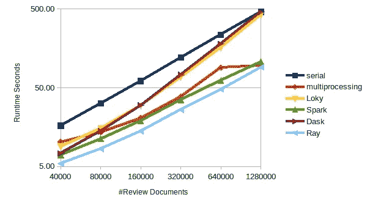
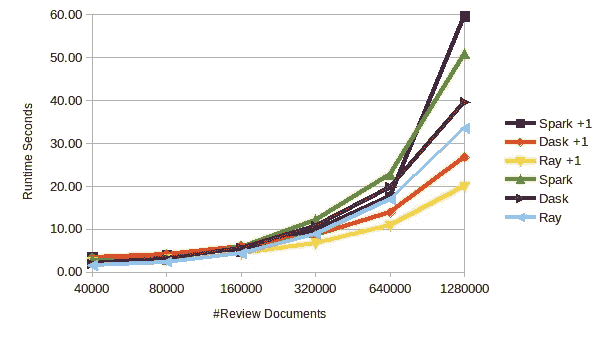
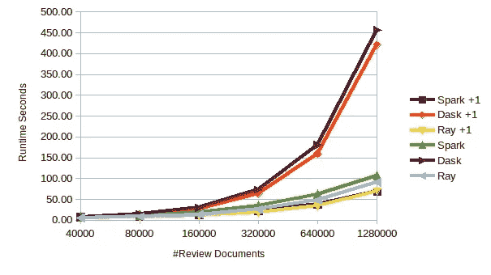

# 用 Wordbatch 测试 Python 分布式人工智能后端

> 原文：<https://towardsdatascience.com/benchmarking-python-distributed-ai-backends-with-wordbatch-9872457b785c?source=collection_archive---------5----------------------->

## 三种主要后端调度程序的比较:Spark、Dask 和 Ray


# 走向分布式人工智能

在过去的几年里，Python 已经成为数据科学和人工智能的通用语言，所有著名的深度学习框架(Keras、Pytorch、MXNet)都使用 Python 作为主要的接口语言。与竞争语言相比，Python 在 DS&AI 的几乎每个方面都达到或超过了对手:最新的机器学习算法及其高效实现(Scikit-Learn、LightGBM、XGBoost)、数据操纵和分析(Pandas、cuDF)、高效的数值计算库(Numpy、PyPy、Numba)、GPU 计算(CuPY)和 web API 编程(Flask、Celery)。

Python 的致命弱点是它在并行多线程和多进程工作负载方面的弱点，这是由于全局解释器锁(GIL)是其核心设计的一部分。这在 Python 阵营中产生了变通解决方案，以及更强调并行性的替代语言，如 GoLang。硬件领域正在进行的军备竞赛加速了对并行性的需求:消费者 CPU 在几年内从 4 核增加到 32 核(AMD 2990WX ),而价格合理的云计算节点现在每个提供 224 核(Amazon u-6tb1.metal)。

对于人工智能来说，并行性的需求不仅仅是单个工作站或计算节点，而是协调分布在潜在的数千个计算节点上的人工智能处理管道。与 CPU 内核的变化类似，本地和云使用的网络传输速度已经从 1 Gb/s 发展到商用 10–100 Gb/s 连接。直到最近，这种类型的大数据技术大多基于 Hadoop 等 Java 框架，但软件和硬件的变化带来了新类型的解决方案，包括三种主要的 Python 分布式人工智能处理框架:PySpark、Dask 和 Ray。

# 分布式批处理框架

Apache Spark 和它的 Python 接口 PySpark 是最老的框架，最初的 GitHub 版本可以追溯到 2010 年 10 月 4 日。Spark 确立了自己作为主要大数据技术之一的地位，在企业领域获得了广泛采用。它提供了 Map-Reduce 编程范式的扩展，通过将一个较大的任务映射到一组分发给工作人员的小批量(Map)来解决批处理任务，并在每个小批量完成后合并结果(Reduce)。Spark 处理 Map-Reduce 计算管道的有向无环图(DAG ),在处理 DAG 的整个过程中保持数据分布在工人之间。任务图是功能性定义的，任务在优化 DAG 计算顺序后被延迟执行。

Dask 和 Ray 都建立在 Spark 对 DAG 进行并发功能评估的中心思想上，数据在整个过程中保持分布。Dask 及其调度程序后端分布式是一个更新的框架，最初的 GitHub 版本是在 2015 年 1 月 29 日发布的。Spark 是为 Java 和 Scala 编写的，而 Dask 是为 Python 编写的，提供了丰富的分布式类。Dask 还提供了更丰富的底层 API，支持对 AI 模型的分布式训练至关重要的 actor 类。

Ray 是最新的框架，最初的 GitHub 版本发布于 2017 年 5 月 21 日。和 Dask 一样，Ray 也有 Python 优先的 API 和对 actors 的支持。它有几个高性能的优化，使其更有效。与 Spark 和 Dask 不同，任务会在每个节点内急切地执行，因此每个工作进程在收到所需数据后会立即启动。worker 节点中的数据使用 Apache Arrow 对象存储，这提供了在节点上工作的所有进程之间的对象零拷贝共享。工作节点有自己的本地调度程序，进一步减少了全局调度程序的开销。

# Wordbatch

这三个框架在它们的调度器引擎的设计和实现上有很大的不同:序列化、传输、调度、配置需求、内存需求等。对于给定的复杂任务，很难说哪种引擎工作得最好，如果不是不可能的话。对于某些任务，特定的框架根本不起作用。Spark 缺少演员，使得模特的大规模训练变得复杂。Dask 不序列化复杂的依赖关系。因此，从性能和可行性来看，测试给定任务的每个框架并选择一个有效的框架是很有用的。

Wordbatch library v. 1.4 使用可切换调度器后端对管道进行批处理。它的 orchestrator 类批处理程序保持对后端句柄的引用，并处理任务到小批处理的映射和减少结果。调度器后端是可交换的，因此如果一个后端不能处理一个处理任务，任何其他后端都可以通过替换批处理程序对象的 backend 和 backend_handle 属性来交换。它支持本地(串行、线程、多处理、韩一菲)和分布式后端(Spark、Dask、Ray)。分布式框架也有类似的叫法，数据尽可能分布在整个管道中。

Wordbatch 还附带了一组管道和类，为基于文本的机器学习提供了全套工具，可以作为其他领域处理的模板。如果需要，Wordbatch 类可以独立调用 Batcher 上的 Map-Reduce 操作，并支持管道中的分布式存储和使用 fit_partial()方法的流处理。

# 基准设置

我们可以使用 Wordbatch 作为中立的基准来测试三个分布式框架，以及作为基线的非分布式后端。为了使比较简单，我们将在两种硬件设置下使用两个基本管道。这两项任务都使用了来自 http://times.cs.uiuc.edu/~wang296/Data/猫途鹰评论数据集[的 128 万条评论。](http://times.cs.uiuc.edu/~wang296/Data/)

基准测试脚本的完整版本可从[https://github . com/anttttti/word batch/blob/master/scripts/backends _ benchmark . py](https://github.com/anttttti/Wordbatch/blob/master/scripts/backends_benchmark.py)获得。对于这两个任务，测试脚本如下初始化批处理程序:

```
*from wordbatch.batcher import Batcher
batcher = Batcher(procs=16, minibatch_size=5000, backend=backend[0], backend_handle=backend[1])*
```

这里“procs”是使用的进程数，“minibatch_size”是每个 mini-batch 中要处理的数据行数，“backend”是后端的名称，“backend_handle”给出了批处理程序进行通信的 API 句柄。

第一个管道 **ApplyBatch** 在每个小批量评论上运行 Scikit-learn 哈希矢量器，并返回哈希特征的简化稀疏矩阵。

```
*from sklearn.feature_extraction.text import HashingVectorizer
from wordbatch.pipelines import ApplyBatch
hv = HashingVectorizer(decode_error=’ignore’, n_features=2 ** 25, preprocessor=normalize_text, ngram_range=(1, 2), norm=’l2')
output = ApplyBatch(hv.transform,batcher=batcher).transform(texts_chunk)*
```

第二个流水线 **WordBatch** 是一个完整的文本处理流水线，执行以下连续步骤:1)文本规范化，2)拼写校正和词干化，3)词典计数，4)词袋特征提取和 TF-IDF 加权。拼写校正和字典计数步骤都执行它们自己的 Map-Reduce 操作来计算词频表，并且拼写校正和特征提取步骤需要向每个工作者发送字典。

```
*from wordbatch.pipelines import WordBatch
from wordbatch.extractors import WordBag
from wordbatch.transformers import Tokenizer, Dictionary
wb = WordBatch(normalize_text=normalize_text,
 dictionary=Dictionary(min_df=10, max_words=1000000),
 tokenizer=Tokenizer(spellcor_count=2, spellcor_dist=2, raw_min_df= 2, stemmer=stemmer),
 extractor=WordBag(hash_ngrams=0, norm= ‘l2’, tf= ‘binary’, idf= 50.0),
 batcher=batcher)
output = wb.fit_transform(texts_chunk)*
```

第一个硬件设置是使用单个 i9–9900k CPU，8 个内核和 64GB DDR4 RAM，可以处理所有涵盖的测试。第二个设置使用直接 10 Gb/s 以太网连接，通过 18 核 i9–7980 xe CPU 连接一个额外的工作节点。使用的操作系统是 Ubuntu 18.04.2 LTS，库版本是 pyspark 2.4.1、ray 0.7.0 和 distributed 1.28.1。

# 结果


Benchmark 1\. Distributing Scikit-Learn HashingVectorizer on a single node

对于在单个节点上并行化哈希矢量器的简单任务，与运行单个串行进程相比，所有并行框架都获得了大致线性的加速。对于最大的 1.28M 文档，串行处理需要 256 秒，而多处理需要 36 秒。有趣的是，Ray 其实比多处理更快，用了 33s，而 Spark 用了 50s。



Benchmark 2\. Distributing the WordBatch feature extraction pipeline on a single node

WordBatch 管道更复杂的任务显示了令人惊讶的结果。Spark、Ray 和 multiprocessing 再次显示，随着数据的增加，线性加速保持不变，但韩一菲和 Dask 在并行化任务方面都有困难。与连续花费 460 秒获取 128 万份文档相比，Ray 再次以 91 秒的速度做到了这一点。韩一菲和 Dask 的时间使用量都在增加，与串行时间使用量大致相同，但随着数据量的增加，时间使用量可能会超过串行时间使用量。这种奇怪行为的可能原因是进程之间缺乏共享，并且在这个任务中需要向每个工作人员发送两次字典。随着数据的增加，字典变得越来越大，并且不能有效地共享辅助数据的开销超过了并行化带来的好处。这是一个令人惊讶的结果，特别是因为向工人发送共享数据是 AI 管道中的一个基本操作。



Benchmark 3\. Distributing HashingVectorizer using an additional node

转到第二个硬件设置，增加了 18 个超过 10 Gb/s 的内核，所有三个分布式系统都从增加的节点中受益。然而，Spark 在处理最大的 1.28M 文档任务时遇到了麻烦，因为它需要更大的内存，并且在接近配置的内存限制的情况下运行。在实践中，Spark 需要对其组件进行大量的配置，这一直是用户感到沮丧的一个原因。在最好的情况下，额外的节点为 Spark 提供了 22%的加速。Dask 和 Ray 的性能要好得多，对于 128 万个文档，Dask 和 Ray 的加速分别为 32%和 41%。与单节点相比，加速也随着数据大小的增加而增加，并且在最大测试大小时似乎远未接近饱和。



Benchmark 4\. Distributing WordBatch pipeline with an additional node

用额外的节点测试 WordBatch 管道，我们看到 Dask 并没有获得多少收益。当使用额外的节点时，其有效处理辅助数据的问题似乎变得更加复杂，因此在最大的 1.28M 文档条件下，我们只能获得从 457 秒到 420 秒的加速，并且加速随着更大的任务而不断降低。Spark 和 Ray 都可以在这个任务中更好地使用额外的节点，在 0.64M 文档时，Spark 和 Ray 的最大加速分别为 38%和 28%。由于更好地利用了额外的节点，Spark 与 Ray 在性能上几乎不相上下，并且很有可能因为更大的数据大小和更复杂的处理管道而超过 Ray。

# 总结想法

这些基本基准演示了分布式调度程序的一些主要属性。所有的调度器对于分布 Python 工作负载都是有用的，但是有些并不适合每个任务。实际应用将涉及大型集群上更复杂的管道，但这将使简单的比较变得复杂，因为:配置调度程序的选择，关于如何实现共享数据和远程类(如 actors)的设计决策，以及如何使用 GPU 和其他非 CPU 处理器。

作为初步结论，Ray 似乎是最有前途的框架。它在单个节点上的工作速度比 Python 标准多处理快 10%左右，并且在所有情况下都能很好地使用额外的节点。与 Spark 不同，集群配置非常少，并且支持参与者。与 Dask 不同，它很好地序列化了嵌套的 Python 对象依赖关系，并在进程之间高效地共享数据，线性扩展复杂的管道。与单个串行进程相比，具有额外节点的 Ray 在分布式哈希矢量器上提供了 12.9 倍的加速，在更复杂的任务上提供了 6.7 倍的加速。

可用的硬件对调度程序的性能也有很大的影响。如果此处使用 1 Gb/s 连接，额外的节点几乎没有任何优势。相比 10 Gb/s，100 Gb/s 将增加额外节点带来的好处，并改变测试后端之间的结果。与 Ray 相比，Dask 尤其会从 100 Gb/s 中获益更多。如果像 Spark 和 Hadoop 一样从分布式存储中获取数据，这将在一定程度上减少对高带宽网络的依赖。然而，大多数实际的管道将进行需要高带宽的数据传输。随着更多节点的出现，这些框架都应该使用 100 Gb/s，并且 AI 管道应该被规划为最小化网络流量并最大化分布式核心的使用。

## 链接

[](https://github.com/apache/spark) [## 阿帕奇/火花

### 阿帕奇火花。在 GitHub 上创建一个帐户，为 apache/spark 开发做出贡献。

github.com](https://github.com/apache/spark) [](https://github.com/dask/dask) [## 达斯克/达斯克

### 带有任务调度的并行计算。在 GitHub 上创建一个帐户，为 dask/dask 开发做贡献。

github.com](https://github.com/dask/dask) [](https://github.com/ray-project/ray) [## 光线-投影/光线

### 用于构建和运行分布式应用程序的快速而简单的框架。-射线-项目/射线

github.com](https://github.com/ray-project/ray) [](https://github.com/anttttti/Wordbatch) [## anttttti/Wordbatch

### 用于分布式人工智能处理管道的 Python 库，使用可切换调度器后端。- anttttti/Wordbatch

github.com](https://github.com/anttttti/Wordbatch)  [## 与 Spark - Dask 1.2.2 文档的比较

### 它们都可以部署在相同的集群上。大多数集群被设计为支持许多不同的分布式系统…

docs.dask.org](http://docs.dask.org/en/stable/spark.html) [](https://github.com/ray-project/ray/issues/642) [## 与 dask 第 642 期射线-项目/射线的比较

### ray 看起来是个有趣的项目！我看到了与 dask (http://dask.pydata.org)的一些相似之处，特别是对于 ad-hoc…

github.com](https://github.com/ray-project/ray/issues/642)