# Python NLP 标记化器的基准测试

> 原文：<https://towardsdatascience.com/benchmarking-python-nlp-tokenizers-3ac4735100c5?source=collection_archive---------6----------------------->

## 让我们为 NLP 任务找到最快的记号赋予器

我喜欢构建和编写关于词袋分类模型的[，但讨厌在我有大量文本要分析时等待分词器执行。记号赋予器是一个简单的函数，它将一个字符串分解成一系列单词(即记号)，如下所示:](/introduction-to-clinical-natural-language-processing-predicting-hospital-readmission-with-1736d52bc709)

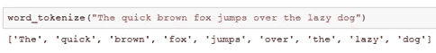

因为我已经在 NLP 领域工作了几年，所以我遇到了一些不同的符号化函数。在这篇博文中，我将对包括 NLTK、spaCy 和 Keras 在内的一些标记化工具进行基准测试(即计时)。

**TL**； **DR:** 不要使用 NLTK 的 word_tokenize，使用 NLTK 的 regexp_tokenize

# 设置

在这篇博文中，我们将对一些不同的记号赋予者进行计时。显然，时间将取决于具体的计算机，但一般来说，我们正在寻找一个表现最好的。让我们从导入几个包开始。

我们将使用 Python 3.6，其他相关包的版本如下所示:

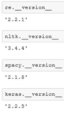

# 数据集

我是一名医疗保健数据科学家，因此在这篇博文中，我将使用公开提供的 MIMIC III 数据集，这是一组在马萨诸塞州波士顿的 Beth Israel Deaconess 医疗中心收集的经过身份验证的医疗数据。如果你想访问这个数据集，你可以遵循我的指示[这里](/getting-access-to-mimic-iii-hospital-database-for-data-science-projects-791813feb735)。让我们将数据加载到熊猫数据框架中。

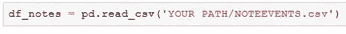

这里我们将使用 MIMIC III 提供的 NOTEEVENTS.csv，它目前拥有超过 200 万条来自一系列临床记录类别的记录，包括出院总结、医生、会诊、药房、社会工作者、放射、护理等。注释包含在“文本”列中。我们可以使用以下公式计算每个音符的字符长度:

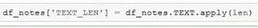

然后我们可以绘制一个直方图，看看我们有一系列不同的长度

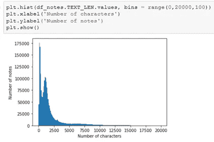

对于这篇文章，我们只需要一个注释列表，所以让我们从熊猫数据帧中提取它们。

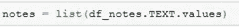

为了让后面的事情变得简单，让我们打乱音符的顺序，以防模拟数据集有顺序。

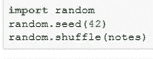

# 干净的文本

在这篇文章中，我们将为每个自定义标记器编写一些遵循这种结构的函数

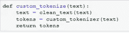

在大多数 NLP 任务中，人们倾向于以某种方式清理数据，所以我们将对每个自定义标记器使用相同的清理功能。

如果我们将所有的标点符号和数字传递给 NLTK 的`word_tokenize`,我们会得到下面的列表

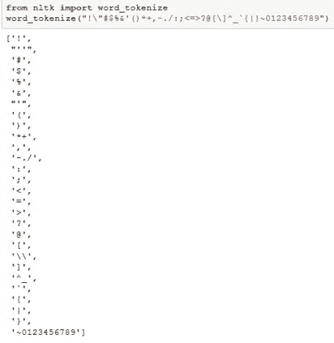

正如我们所看到的，NLTK 在一些标点符号上进行拆分，但并不是所有的标点符号和数字都包括在内。每个自定义记号赋予器在使用标点符号拆分时可能会有略微不同的规则。

对于我的特定 NLP 分类任务，我已经决定所有标点和数字都应该替换为空格，以消除它并防止标点附近的两个单词组合。我还假设单引号倾向于包含在一个缩写中，我想将[can]变成[cant],而不是两个标记[can，t],所以我们将用空字符替换单引号。为了完成这个任务，我创建了下面的`clean_text`函数

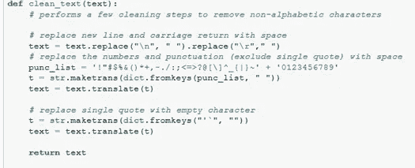

为了演示如何计时一个函数，我现在将计时`clean_text`

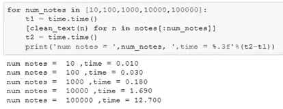

其展示了不同数量的音符以 100000 个音符结束所用的时间为 12.7 秒。请注意，如果你运行几次，你可能会得到稍微不同的数字，这取决于你的计算机的状态，但为了这篇文章的目的，我们将只运行一次。

# NTLK 的 word_tokenize

标准的记号赋予器之一是包含在 NLTK 包中的`word_tokenize`。我们可以让我们的函数使用 clean_text 并计时(节省时间)如下:

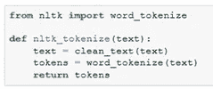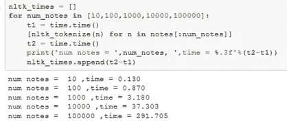

这太令人失望了:仅仅标记 100000 张纸币就需要 5 分钟。如果你在为你的 NLP 单词袋模型使用矢量器的超参数，这有点烦人。请注意，清理功能在这个记号赋予器中起着最小的作用(291 秒中的 12 秒)。让我们看看我们是否能做得更好。

# 正则表达式标记器

标准 python 库中内置了 re 包，它代表正则表达式。该库包含快速搜索文本的功能。下面是我们使用正则表达式的 tokenize 函数:

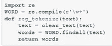

太神奇了，看看正则表达式运行得多快！

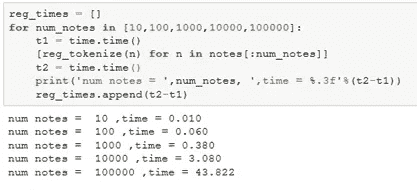

很明显，NLTK `word_tokenize`必须给标记器增加额外的功能。我很好奇它包含了什么，所以我查看了源代码。我只知道它使用了一个树库标记器。然而，通过查看源代码，我发现了 NLTK 中另一个只使用正则表达式的标记器:`regexp_tokenize`。

# NLTK 的 regexp_tokenize

`regexp_tokenize`的功能和时序如下所示

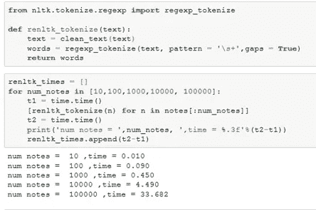

这与正则表达式的实现不相上下，甚至可能略胜一筹！

# 空间记号化器

最近一直在看几个关于 [spaCy](https://spacy.io/) 的教程。这个包的登陆页面上写着“图书馆尊重你的时间，并尽量避免浪费时间”，这让我很受鼓舞。spaCy 非常强大，有很多内置函数来帮助命名实体识别、词性标注、单词向量等等。然而，对于我们的简单任务，我们需要做的只是标记化。

我将加载“en”spaCy 包，并禁用命名实体 region、解析器和标记器。这将删除一些我们最终并不需要的默认选项，如果我们不禁用它们，这将需要时间。

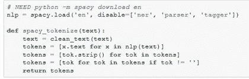

时序如下所示:

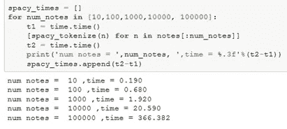

如您所见，这不如 regexp 记号化器快，但至少与 NLTK 的`word_tokenize`相似。显然，在 spaCy 的 tokenizer 中必须有一些额外的缺省选项(稍后将详细介绍)。

# Kera 的文本转单词序列

[Keras](https://keras.io/) 是一个非常流行的用 Python 构建神经网络的库。它还包含一个单词 tokenizer `text_to_word_sequence`(虽然没有那么明显的名字)。功能和时序如下所示:

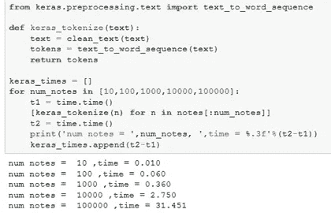

这类似于 regexp 标记化器。如果你仔细观察，你会发现它也在使用正则表达式进行拆分。类似地，它也有过滤字符的选项，这使用了我们在`clean_text`中使用的同样的`text.translate`技术。

我们可以绘制所有这些测试的时间，如下所示

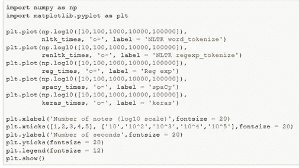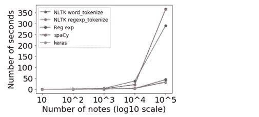

Benchmark of a few tokenizers

# 矢量器

到目前为止，我们一直在分析执行 tokenizer 函数的时间，这表明 reg exp 方法是最好的。然而，我们还没有调查过记号赋予器产生相同的结果！对于词袋分类器，我们倾向于使用带有某种矢量器(将标记转换成数字列的函数)的标记器。这里我将使用 scikit learn 包中的 CountVectorizer 并提取词汇。请注意，我将把 max_features 设置为 None，这样我就可以得到所有可能的 vocab，因为我注意到有一个函数不匹配！

下面是获取一个记号赋予器的 vocab 的代码，并对每个记号赋予器重复。

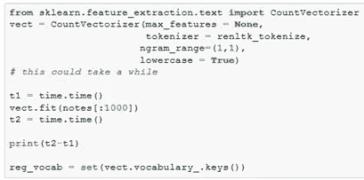

spAcy 是唯一一个和其他人没有相同词汇的记号赋予者。我们可以用下面的例子来看看 spaCy 的集合中缺少的 vocab:

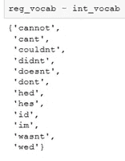

这很有趣，因为它们都是收缩，这可能意味着 spaCy 处理收缩的方式不同。我们可以通过以下内容证实这一点:

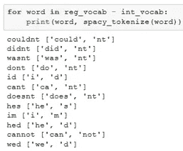

这更好地解释了为什么 spaCy 比 regexp 记号化器耗时更长。

# 结论

在本文中，我们对一些不同的记号赋予者进行了基准测试。我们了解到 NLTK 的 word_tokenize 和 spaCy 在默认情况下内置了额外的功能，这大大增加了执行时间。如果你需要额外的功能，你必须增加执行时间！

正则表达式似乎是当前最快的实现，并且也包含在 NLTK 和 Keras 中。如果你知道更快的解决方案，请告诉我！

因为我已经在大多数项目中安装了 NLTK，所以我将切换到 regexp_tokenize 而不是 word_tokenize！

感谢阅读！