# 根据现代黑盒方法，用特征提取对简单模型进行基准测试

> 原文：<https://towardsdatascience.com/benchmarking-simple-machine-learning-models-with-feature-extraction-against-modern-black-box-80af734b31cc?source=collection_archive---------17----------------------->

Photo by [Austris Augusts](https://unsplash.com/@biosss91?utm_source=unsplash&utm_medium=referral&utm_content=creditCopyText) on [Unsplash](https://unsplash.com/?utm_source=unsplash&utm_medium=referral&utm_content=creditCopyText)

金融行业的人喜欢逻辑回归。似乎他们并不孤单:根据 2017 年 Kaggle 调查[关于人工智能和数据科学的状况](https://www.kaggle.com/surveys/2017)对于问题*“在工作中使用哪些数据科学方法？”最受欢迎的答案*为 *logistic 回归*为 63.5%。在第二个位置，我们找到了拥有 49.9%的*决策树*。这两种方法构成了一类非常容易解释的方法。

然而，要赢得一场 Kaggle 比赛，人们通常需要采用一种更现代的类似黑盒的算法，比如 *boosted trees* 。在 Kaggle 的调查中，被提升的树木以 23.9%的比例仅排在第八位。
(请注意，我们在这里将重点关注结构化数据——类似电子表格的数据。对于音频和图像等非结构化输入，情况将完全不同，很可能由深度学习主导。)

我自己为银行和公司实现了许多逻辑回归，并且知道许多人喜欢简单模型的可解释性。你知道它的内部齿轮和螺栓，因此可以解释模型是如何工作的。当你有模型的用户，他们想了解它是如何工作的，或者当——例如，在金融或制药行业——你与监管者打交道时，这变得特别重要，监管者会仔细检查你的模型和你的整个开发过程。

## 这篇博客试图回答的问题是

在实践中，简单的可解释模型(如逻辑回归)和现代方法(如提升树)之间的性能差异真的那么大吗？之前的基准研究表明确实如此。*参见例如(* [*Lim 等人 2000*](https://link.springer.com/article/10.1023/A:1007608224229) *)、(* [*Caruana 等人 2006*](https://www.cs.cornell.edu/~caruana/ctp/ct.papers/caruana.icml06.pdf) *)、(* [*Caruana 等人 2008*](http://icml2008.cs.helsinki.fi/papers/632.pdf) *)、(*[*bisch al 等人 2014*](https://www.compstat.statistik.uni-muenchen.de/bibrefs/pdfs/benchmarking_classification_algorithms_on_high_performance_computing_clusters.pdf)

然而，这些基准通常是在原始数据集上运行的。在实践中，您通常对较简单的模型所做的是手动特征提取:您合并某些列，移除有噪声或高度相关的特征，并转换某些特征，以尝试使它们相对于您的目标更有用或更线性。

> 与应用于原始和未处理数据的现代机器学习方法相比，手工制作的简单模型之间的差异可能没有人们可能天真地认为的那么大吗？

为了回答这个问题，我们将运行一个基准测试，它将包括可解释模型的特征提取。我们将它们的性能与没有特征提取的不太可解释的现代机器学习模型进行比较。

> 注意，这项工作最初是作为牛津大学的硕士论文完成的。在这篇博文中，我们将集中讨论主要观点和发现。如果你对包括所有细节的更深入的讨论感兴趣，你可以在这里找到论文。

# 基准的设置

在下面的讨论中，我们将所有算法分为两个不同的类别:

1.*白盒模型*:一种统计或机器学习模型，可以以人类可以理解的形式存在，从而可以将经济解释附加到预测过程的内部工作中。

2.*黑盒模型*:任何机器学习模型都无法简单解释其内部工作原理，因此本质上是一个黑盒。

白盒模型类将被允许使用额外的特征提取。为了保持这种比较的客观性，我们不能在其中包含任何手动步骤。相反，我们将依赖某些(无监督的)算法，如主成分分析，希望它们至少近似于人类会做的特征提取。我们将这些算法称为*提取器*。

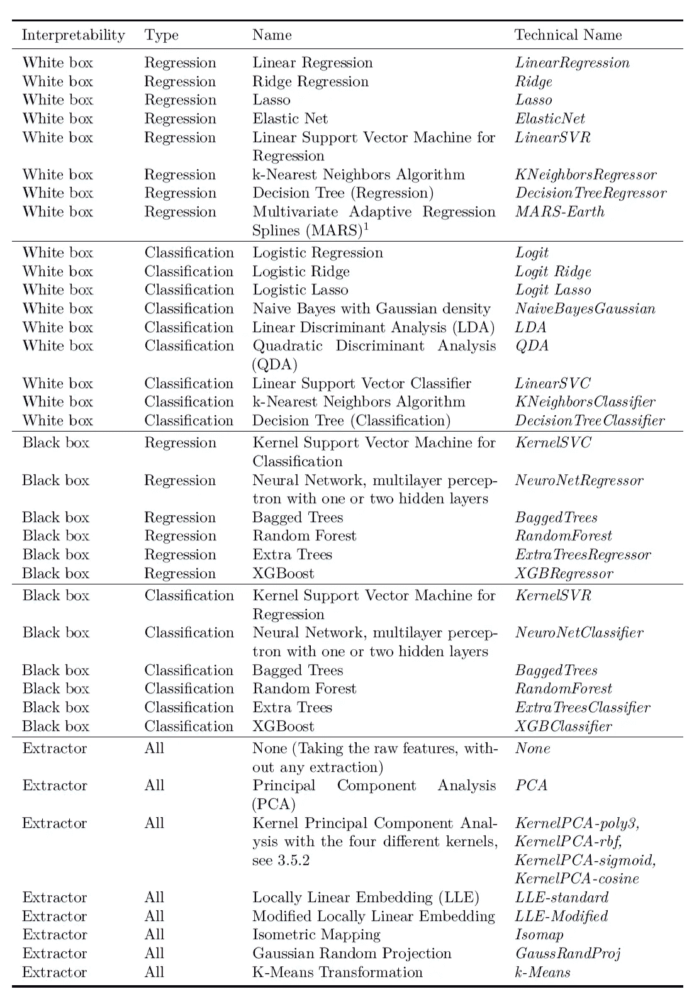

List of all models and algorithms used in this benchmark. The technical name given in this table will be used in the result plots further below. Footnote 1: The MARS model will be considered grey box. We treat it as if it has an inherent extractor and don’t combine it with the other extractors.

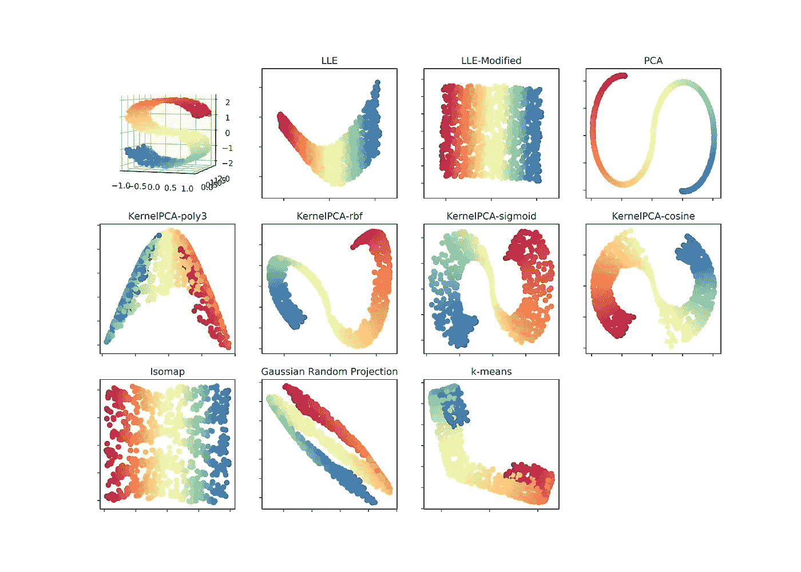

The feature extractors used in this benchmark are applied to a 3-dimensional S-curve. For this example all feature extractors are reconfigured to extract exactly 2 components. The colour coding visualizes the effect of the transformation. This figure was inspired by a similar plot from [Jake Vanderplas](https://scikit-learn.org/stable/auto_examples/manifold/plot_compare_methods.html).

## 数据集

将在 32 个不同的公开可用数据集上进行比较:

*   16 个数据集涉及二元分类，
*   5 是多类分类任务，
*   11 涉及预测连续值的回归任务。

为了使这种比较在计算上可行，我们将把每个大型数据集下采样到 10，000 个观察值，而不进行替换。

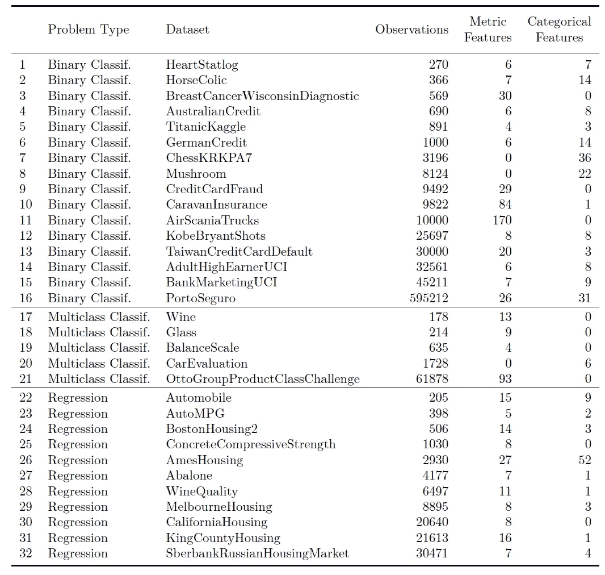

The datasets used in this benchmark. Most of them are from the UCI Machine Learning Repository, some are (training) datasets from Kaggle. The AmesHousing dataset was taken directly from (De Cock 2011). The BostonHousing2, a corrected and amended version of BostonHousing, was taken from StatLib.

## 模型管道

基准测试将在 [*scikit-learn*](https://scikit-learn.org) 中使用其方便的 [*管道*](https://scikit-learn.org/stable/modules/generated/sklearn.pipeline.Pipeline.html) 来完成。对于所有模型，我们将使用一个基本的管道:每个度量特征首先用中位数估算，然后标准化。每个分类特征都是一次性编码，然后标准化，使其与度量特征处于同等地位。然后再次合并度量和分类特征。之后，如果适用于当前设置，可以使用特征提取器，然后将模型拟合到训练数据。

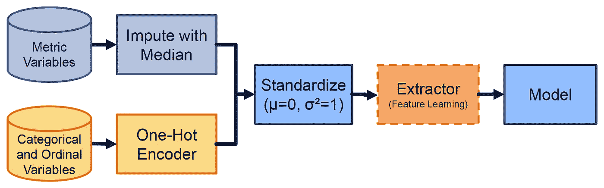

The data processing pipeline

## 衡量标准

用于比较模型的指标有:

*   *解释回归问题的方差*
*   *二元分类问题的 ROC 曲线下面积* (AUROC)，我们将其转换为 *Somers' D*
*   *F1-分数*由每个类别及其对多类别分类问题的计数进行评估和加权。

从 AUROC 到 Somers' D 的转换只需通过以下方式即可完成:

*Somers ' D =*2*AUROC*-1

主要优点是，随机猜测目标的虚拟性能现在是 0%(而不是 AUROC 的 50%)。这将使我们的结果的规范化和聚合更加容易。

## 超参数优化

为了评估每个算法的最优超参数集，我们使用 60 次重复的随机搜索，其中我们从合理的分布中对每个超参数进行采样。我们对少于 2，000 个观察值的数据集进行了 5 重交叉验证，并对较大数据集进行了 80/20 训练测试分割，以此评估随机搜索。超参数优化中使用的指标与比较中使用的指标相同。

# 结果

我们在 10 次重复的 10 重交叉验证中评估每个算法。我们在( [*、莫里纳罗、西蒙和普发 2005*](https://doi.org/10.1093/bioinformatics/bti499) )和( [*金 2009*](https://doi.org/10.1016/j.csda.2009.04.009) )研究的基础上选择了重复交叉验证，两者都比较了不同的模型评估策略。因此，我们获得每个数据集的每个指标的 100 个值。如前所述，每个算法都配置有一组最佳超参数。

为了评估算法的性能，我们使用了两种受先前文献启发的比较方法:首先，我们基于每个数据集的相对排名对所有算法进行比较，这将在下一节中介绍。接下来的部分将根据每个指标的标准化分数进行比较。这种标准化协调了所有数据集的得分，并使汇总和比较成为可能。

## 相对排名比较

为了首先评估算法，我们为每个数据集颁发奖牌给表现最好的模型。在数据集的所有折叠上具有最佳平均性能的模型被授予金奖。第二名和第三名分别获得银牌和铜牌。所有型号的奖牌榜如下所示。这些算法按奖牌数排序，首先是金牌，然后是银牌和铜牌。这类似于奥林匹克运动会等体育赛事中使用的排序。所有赢得至少一枚奖牌的算法都会显示出来。

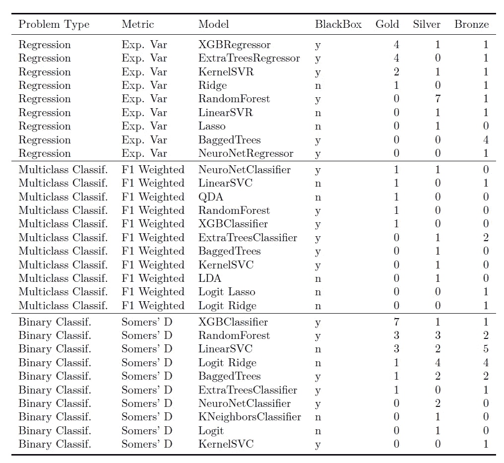

Overall medals

对于**回归问题**XG boost 和 extra trees 分别以 4 枚金牌主导结果。三个白盒模型岭回归、拉索和线性 SVM 能够获得奖牌，其中岭回归甚至获得一枚金牌。随机森林表现非常一致，7 银 1 铜。在授予回归问题的 33 枚奖牌中，5 枚由白盒算法获得，产生率为 15%，28 枚由黑盒方法获得。就奖牌数回归问题而言，黑盒方法明显占主导地位，赢得了所有奖牌的 85%。

对于**多级分类**，15 枚奖牌被授予，其中 6 枚授予白盒方法，获得率为 40%，9 枚授予黑盒方法。两个白盒方法 QDA 和线性 SVC 各获得 1 枚金牌。

在授予**二元分类**的 48 个模型中，21 个被白盒赢得，产生率为 44%，27 个被黑盒模型赢得。线性 SVC 和 logistic ridge 方法表现良好，获得了 21 个可解释模型奖项中的 19 个。因此，对于二元和多元分类，就奖牌数而言，白盒和黑盒方法之间的差距是接近的。

对于多类问题，xgboost 在回归和二元分类中的优势似乎较弱。有趣的是，如果我们根据 F1 的成绩进行二元分类来授予奖牌，xgboost 只获得 2 金 1 铜(查看链接论文的附录中这些补充结果)。因此，这可能(部分)是 F1 指标的影响。然而，如果我们根据度量准确性来分配奖牌，xgboost 再次成为二元分类中排名最高的模型，获得 3 枚金牌、1 枚银牌和 2 枚铜牌。对于多级分类，它再次排在奖牌榜的中间。请注意，在对这里显示的指标执行超参数优化时，应该有所保留地进行这些比较。

## 最佳提取器

我们还为每个数据集的最佳提取者颁发奖牌(仅根据白盒模型评估)，如下表所示。我们看到，除了使用原始特征( *None* )，只有 PCA 和 Kernel-PCA 方法获得了奖牌。

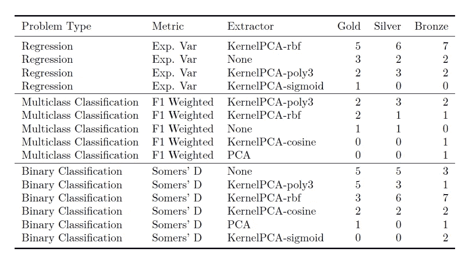

Best extractors medals

## 白盒排名

由于所有的奖牌榜都是由黑盒算法主导的，我们也只对白盒模型进行排名:第一个表显示了在没有使用附加提取器的情况下白盒算法的排名。第二个表显示了如果包括所有具有特征提取器的组合时的相同比较。

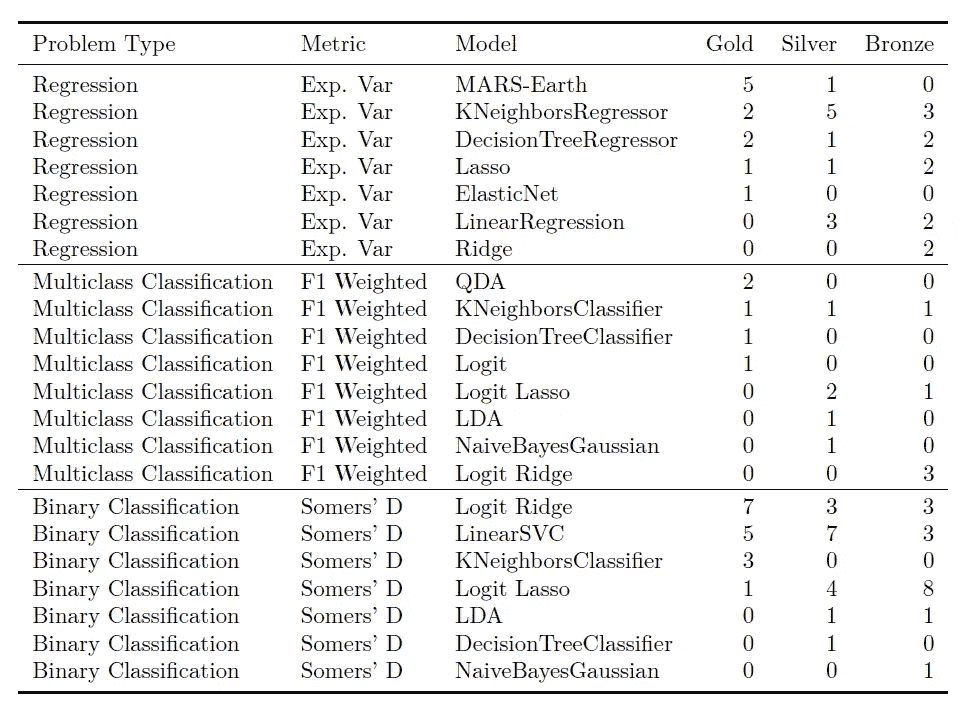

Medal ranking for white box models **without any feature extractor** (*Note that we also list MARS as having no feature extractor, though we consider it to have the equivalent of a feature extractor build into the algorithm itself. This probably explains why MARS is dominating the table when no feature extraction methods are included but ranks lower when the other white box models are allowed to utilize a feature extraction algorithm.)*

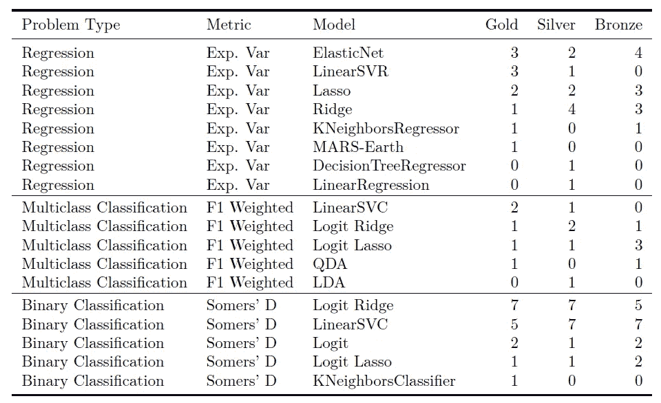

Medal ranking for white box models **including feature extractors**

我们看到，一些算法，如弹性网，单独在白盒模型上表现很好，但在整个表中消失了。这是因为它们在数据集上表现很好，而黑盒算法表现得甚至更好。

对于多类分类，如果没有应用特征提取，线性 SVC 根本不会出现在表中，但是使用提取器方法赢得了大多数奖牌。

## 标准化分数的比较

不同数据集和算法的结果必须归一化，以使它们相互之间具有可比性。为此，我们通过以下三个步骤处理数据:

**1。移除不稳定的算法:**不收敛且产生的结果远低于虚拟性能的算法被排除。一些算法提取器组合仅在一个数据集上不稳定。为了不使结果有偏差，我们删除了每个数据集的中值等于或低于-0.5 的任何算法。

**2。Winsorize 回归问题的最差可能性能:**二元分类问题的度量被限制在从-1.0(通过总是给最佳观察值最差分数的绝对最差性能)到+1.0(完美预测)的范围内。类似地，多类分类的加权 F1 分数范围从 0.0 到 1.0。相反，回归指标可以从负无穷大到+1.0。一些回归算法仅在少数褶皱上不稳定，因此在前面的步骤中没有被去除。为了不允许任何单个异常值显著影响总结果，并使回归和分类之间的比较更加平等，我们通过将较低的每个值设置为等于-1.0 来对回归问题的每个折叠的度量进行 winsorize。

**3。针对特质效应进行归一化:**对于每个数据集，预测新值的难度是不同的。原因在于不同程度的特质效应对每个观察值的影响。为了使每个数据集的分数更具可比性，执行以下归一化:

对于数据集和指标的每个组合，我们确定指标的 95%百分位数，涵盖所有算法和折叠。然后，数据集和指标组合的每个 CV 值通过将其结果除以该百分位进行归一化。

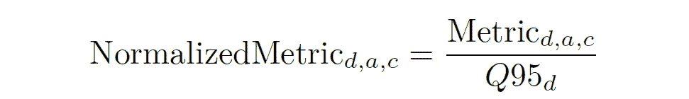

where ‘d’ denotes each dataset, ‘a’ each algorithm extractor pair and ‘c’ stands for a specific CV-fold. The percentile is taken over all algorithms and all folds, per metric and dataset.

在这种标准化之后，每个算法应该在所有数据集上显示相似的结果结构。我们可以用一个简单的箱线图来证实这一点，如下所示。请注意，这种标准化会导致值高于+1.0。

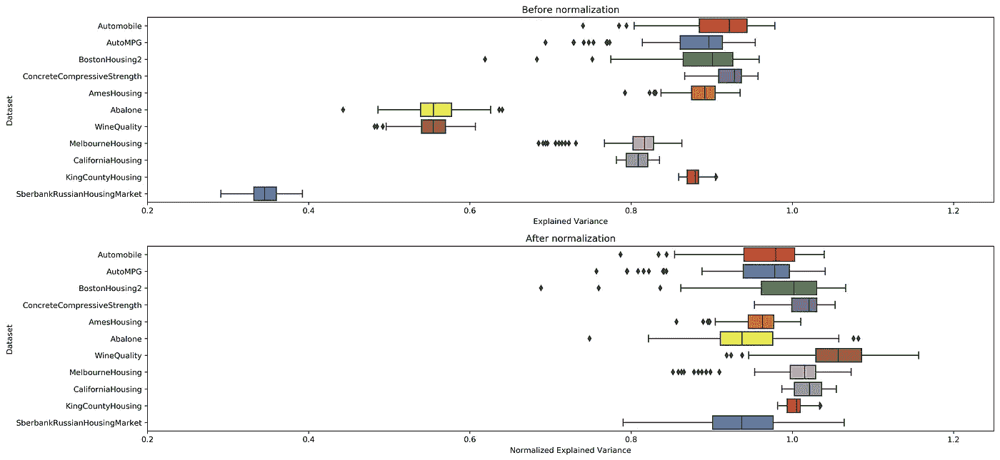

Results for the regression random forest before and after normalization for the metric explained variance by dataset. We see that after the normalization the results are of similar range. An aggregation of the results per algorithm over all datasets is now possible.

接下来，我们汇总所有数据集的所有标准化分数，计算每个算法的平均分数，并相应地对算法进行排序。我们还通过引导标准化分数来确定 95%的置信区间。

在下面的图中，我们将只显示一个模型的最佳白盒提取器。没有任何提取器的方法也将始终包括在内(所有组合的综合图可以在链接的论文中找到)。黑盒算法以深蓝色显示。如果应用于原始数据，白盒算法以青色显示，如果使用了提取器，则以红色显示。置信区间用灰色条表示。

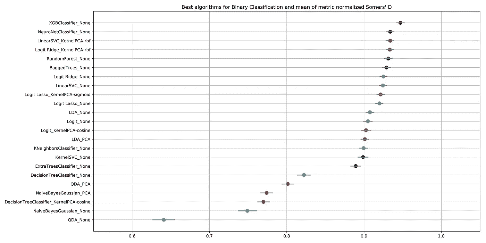

Selection of the best binary classification algorithms in terms of their normalized Somers’ D values.

Selection of the best multiclass classification algorithms in terms of their normalized weighted F1 scores.

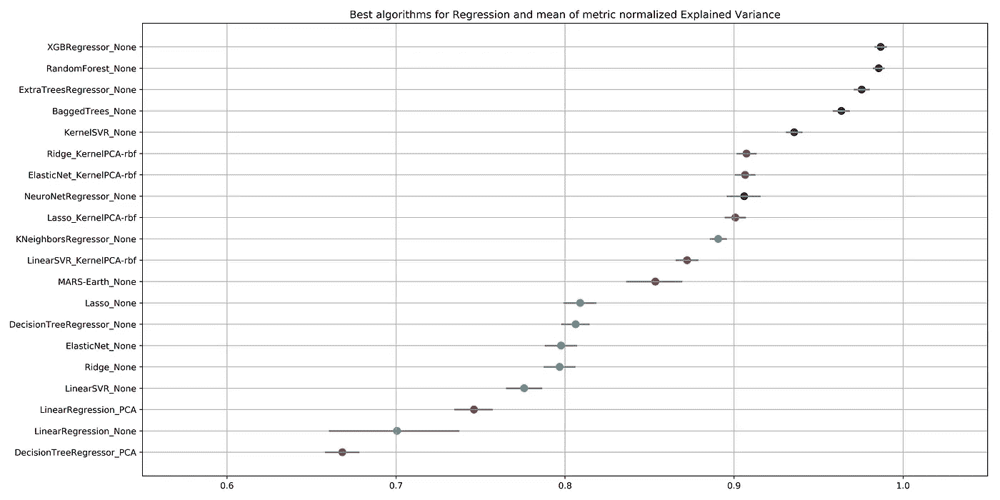

Selection of the best regression algorithms in terms of their normalized explained variance.

**对于回归问题**我们看到，除了神经网络之外，所有黑盒算法的表现都明显优于白盒方法。xgboost 算法是性能最好的算法。它能够解释比最佳白盒模型岭回归多 10%的方差(使用基于 RBF 的核主成分分析作为提取器)。

**对于多类分类**我们看到，没有任何提取器的所有白盒算法的性能明显更差，无法与其他方法竞争。虽然 xgboost 和神经网络具有最高的平均分数，但它们的表现仅比三种最佳白盒算法(逻辑回归、逻辑拉索和线性 SVC)好大约 1%。这三种方法甚至优于三种黑盒方法随机森林、内核 SVC 和袋装树。

**对于二进制分类**xgboost 算法比第二好的模型实现了高 1%的 Somers' D，第二好的模型是使用 RBF 类型的核 PCA 作为提取器的线性 SVC。以下方法似乎在相似的范围内聚类，从线性 SVC 的归一化 Somers ' D 0.93 到具有 0.89 的额外树分类器。它们由其他黑盒方法(除了 xgboost)和许多其他白盒算法组成，都带有提取器。下一个最好的算法(没有任何提取器的决策树)已经显示出性能显著下降到 0.82。

# 结论

从基准测试中，我们可以得出以下三个结论:

> **提取器提高了白盒模型的性能。主成分分析，包括其核变量，是最好的特征提取器:**

对于大多数算法来说，它们的使用导致了性能的显著提高。对于许多数据集，尤其是对于二进制分类，使用不带任何提取器的原始要素也会产生白盒模型的竞争性结果。基于流形方法、k 均值和随机投影的其他方法表现较差。我们推测，流形方法可能在非结构化数据集(文本、图像)上实现更好的提取，这是它们最初开发的目的；似乎在结构化数据上，PCA 的更直接的变换更合适。

> **最好的算法:所有黑盒算法表现都很好，尤其是 xgboost。套索，脊和弹性网通常是最好的白盒模型**

在我们的分析中，boosting 算法 xgboost 表现最好。这可能解释了它在机器学习竞赛中的普遍性。总的来说，所有的黑盒算法都表现良好，并取得了相似的分数。神经网络在分类任务上表现良好，但在回归数据集上表现较低(这可能是由于所选的网络结构和参数，因此不应得出过早的一般性结论)。与大多数其他黑盒算法相比，支持向量机在回归和二元分类问题上表现出较低的性能。对于二元分类问题，额外的树处于类似的较低范围。

线性结构模型，如线性和逻辑回归，在回归和分类任务中表现最好。通常正则化的方法(套索，山脊，弹性网)比非正则化的方法表现更好。线性支持向量机在分类问题上表现良好，但其回归版本表现较差。虽然 LDA 在结构上类似于逻辑回归，但它不能在分类任务上表现出类似的高性能。非线性结构朴素贝叶斯、QDA 和单一树的方法不能竞争，显然不能充分利用提取的特征。

> 具有特征提取的白盒模型能够在分类问题上与黑盒模型竞争；在回归问题上，黑盒算法似乎更胜一筹

虽然典型的黑盒模型表现出最好的性能，但顶级的白盒模型(包括特征提取)的得分仅略低。这对于二进制和多类分类都是显而易见的。

> 我们可以得出结论，对于分类问题，具有适当(理想的是手动)特征提取的简单模型可以与黑盒模型竞争。作为一个实际的建议，我们建议将手工构建的简单模型与黑盒模型进行对比。这可以提供手动特征提取是否足够或者是否可以改进的指示。

一项有趣的后续研究可以验证特征提取器是否也能提高黑盒方法的性能。还可以测试对度量和分类变量应用不同的特征提取器是否会导致不同的结果，因为它可能更好地处理这两种变量类型的不同性质。

我希望您发现这个基准很有趣，并且可以为您的下一个机器学习项目带来一些经验或灵感。如果这也符合你的亲身经历，请在下面的评论中告诉我。也许你们中的一些人已经用自己的基准进行了实验:你从中得出了什么结论？

*免责声明:本文陈述的所有内容均为我个人观点，不代表任何雇主。*