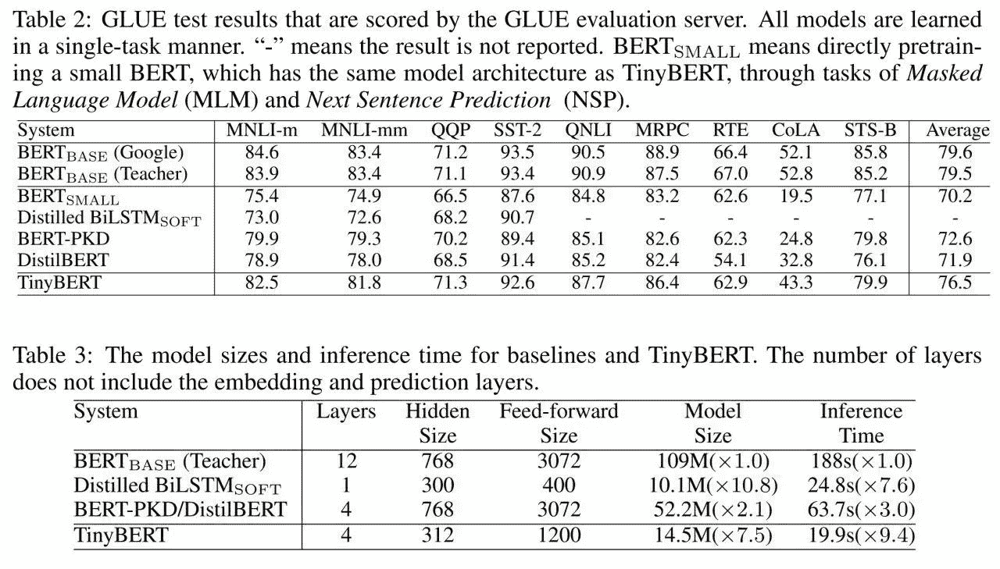

# 伯特在 EMNLP 2019

> 原文：<https://towardsdatascience.com/bert-at-emnlp-2019-46db6c2e59b2?source=collection_archive---------34----------------------->

## ml 评论

## EMNLP 2019 上与 BERT 相关的论文

自然语言处理经验方法会议(EMNLP)于 2019 年 11 月 3 日至 11 月 7 日在香港举行。有很多有趣的论文，但我想强调一下关于伯特的论文。

## 揭露伯特的黑暗秘密

[http://arxiv.org/abs/1908.08593](http://arxiv.org/abs/1908.08593)

在这篇论文中，来自马萨诸塞大学洛厄尔分校的研究人员研究了跨 BERT 层和头部的自我注意机制。为此使用了 GLUE 任务的子集:MRPC、STS-B、SST-2、QQP、RTE、QNLI、MNLI。

实验:

*   BERT 中的特定关系中心。
*   微调后自我注意模式的变化。
*   注意语言特征。
*   象征性的关注。
*   禁用自我关注头。

Typical self-attention classes used for training a neural network. Both axes on every image represent BERT tokens of an input example, and colors denote absolute attention weights (darker colors stand for greater weights). The first three types are most likely associated with language model pre-training, while the last two potentially encode semantic and syntactic information.

有趣的发现:

伯特模型明显参数化过度。不同人的注意力模式是有限的。因此，禁用某些磁头不会导致精度下降，但会提高性能。

很有意思。这就是为什么蒸馏伯特有意义。

## 可视化和理解 BERT 的有效性

http://arxiv.org/abs/1908.05620

微软研究院的另一篇关于用酷炫的可视化理解 BERT 的表现的论文。

Training loss surfaces of training from scratch (top) and fine-tuning BERT (bottom) on four datasets. Pre-training leads to wider optima, and eases optimization compared with random initialization.

上图清楚地展示了这篇论文的主要思想:

*   微调 BERT 的训练损失趋于沿优化方向单调减少，这使得优化变得容易并加速了训练收敛。
*   微调过程对于过拟合是鲁棒的；
*   预训练模型获得更平坦、更宽的最优解；

所以，不要为了你的任务而从零开始训练 BERT。微调比较好。

## 伯特模型压缩的病人知识蒸馏

【http://arxiv.org/abs/1908.09355 

微软的另一篇论文是关于知识提炼的。提出了一种通过病人知识蒸馏将大型 BERT 模型压缩成浅层模型的新方法。这种方法声称是第一次不仅在蒸馏中使用了输出分布，而且还使用了“老师”的隐藏状态。此外,“学生”试图模仿的只是[CLS]表征。与其他蒸馏方法相比，伯特-PKD 法优于蒸馏法，但不如蒂尼伯特法。

## 句子伯特:使用连体伯特网络的句子嵌入

[http://arxiv.org/abs/1908.10084](http://arxiv.org/abs/1908.10084)

代号:[https://github.com/UKPLab/sentence-transformers](https://github.com/UKPLab/sentence-transformers)

问题如下:来自 BERT 的嵌入适合语义相似性搜索吗？本文表明，BERT 开箱即用将句子映射到一个向量空间，该向量空间不太适合用于常见的相似性度量，如余弦相似性。该性能比普通手套嵌入的性能差。为了克服这个缺点，人们提出了句子-BERT (SBERT)。SBERT 在连体或三联体网络架构中微调 BERT。

SBERT architecture with classification objective function, e.g., for fine-tuning on SNLI dataset. The two BERT networks have tied weights (siamese network structure).

## 贝托，本茨，贝卡斯:伯特惊人的跨语言效果

[http://arxiv.org/abs/1904.09077](http://arxiv.org/abs/1904.09077)

本文探讨了多语言 BERT 作为零镜头语言迁移模型的跨语言潜力。

长话短说:BERT 有效地学习了一种良好的多语言表示，在各种任务中具有很强的跨语言零镜头迁移性能。