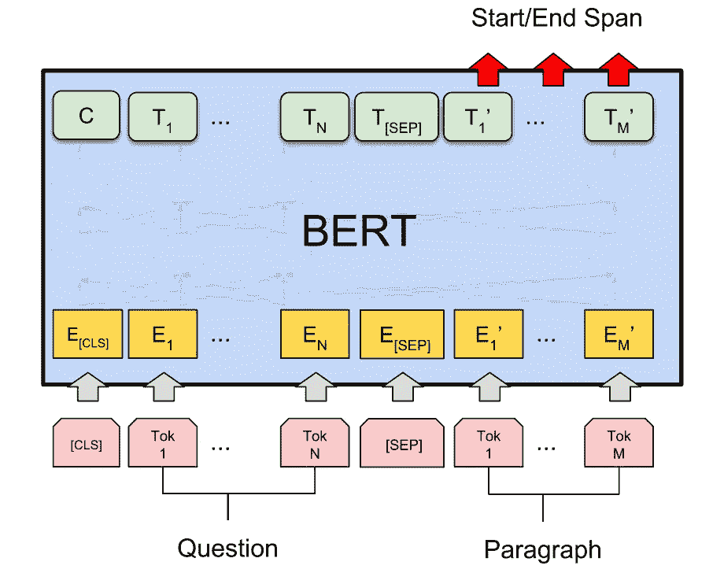

# 基于 BERT 和 DeepPavlov 的跨语言问答

> 原文：<https://towardsdatascience.com/bert-based-cross-lingual-question-answering-with-deeppavlov-704242c2ac6f?source=collection_archive---------9----------------------->

DeepPavlov 是一个对话式人工智能框架，包含了构建聊天机器人所需的所有组件。DeepPavlov 是在开源机器学习框架 [TensorFlow](https://www.tensorflow.org) 和 [Keras](https://keras.io) 之上开发的。它免费且易于使用。本文描述了如何使用 DeepPavlov 的基于 BERT 的问答模型。


基于上下文的阅读理解是在给定的上下文(例如，维基百科中的一段话)中寻找问题答案的任务，其中每个问题的答案都是上下文的一部分。

**问**问题**一个**n wering 系统可以让你的业务中的很多流程实现自动化。例如，它可以帮助你的雇主根据你的公司内部文件得到答案。此外，它还可以帮助您在辅导中检查学生的阅读理解能力。

例如:

**上下文**:

*在气象学中，降水是大气中的水蒸气在重力作用下凝结的产物。降水的主要形式包括毛毛雨、雨、雨夹雪、雪、霰和冰雹。…当较小的水滴通过与云中的其他雨滴或冰晶碰撞而结合在一起时，就形成了降水。分散在各处的短时间的强降雨被称为“阵雨”*

**问题**:

*水滴在哪里与冰晶碰撞形成降水？*

**回答**:

*云内*

近年来，基于上下文的问答任务引起了学术界的广泛关注。这一领域的一个重要里程碑是 tanford Qu estion 的发布。SQuAD 一个新的阅读理解数据集，由一组维基百科文章上的众包工作者提出的问题组成，其中每个问题的答案都是相应阅读文章中的一段文字或跨度。SQuAD 拥有 500+篇文章上的 100，000+个问答对，显著大于之前的阅读理解数据集[1]。

小队数据集提出了无数的问题回答方法。在本文中，我将描述基于 BERT 的解决方案，它在 SQuAD 上的表现优于人类。

# 给伯特

BERT 是一种基于转换器的技术，用于预处理上下文单词表示，能够在各种自然语言处理任务中实现最先进的结果[2]。伯特论文被公认为[最好的长篇论文](https://syncedreview.com/2019/04/11/naacl-2019-google-bert-wins-best-long-paper/?source=post_page---------------------------)👏计算语言学协会北美分会颁发的年度大奖。Google Research】发布了几个预训练的 BERT 模型，包括多语言、中文和英文的 BERT。

我们决定将 BERT 集成到三个流行的 NLP 任务的解决方案中:[、文本分类](/the-bert-based-text-classification-models-of-deeppavlov-a85892f14d61)、[标记](/19-entities-for-104-languages-a-new-era-of-ner-with-the-deeppavlov-multilingual-bert-1bfa6d413ea6)和问题回答。在本文中，我们将详细告诉你如何在 DeepPavlov 中使用基于 BERT 的问答。文章的代码可以在 [Colab 笔记本](https://colab.research.google.com/github/deepmipt/dp_tutorials/blob/master/Tutorial_2_DeepPavlov_BERT_transfer_learning.ipynb#scrollTo=rxw8N0TR4UA1)中找到。

# 如何在 DeepPavlov 中使用基于 BERT 的小队模型

只需对每个子发音的 BERT 输出应用两次线性变换，预训练的 BERT 就可以用于文本上的问题回答。第一/第二线性变换用于预测当前子发音是答案的开始/结束位置的概率。

两个模型都预测给定上下文中答案的开始和结束位置。



Credit: [BERT: Pre-training of Deep Bidirectional Transformers for Language Understanding](https://arxiv.org/pdf/1810.04805.pdf)

正如预期的那样，基于 BERT 的模型优于所有其他模型，并提供了良好的结果，接近人类的表现。

小队任务的 DeepPavlov 模型比较如下表所示(其中 EM 表示完全匹配)。

The results of the DeepPavlov SQuAD models

任何预先训练的模型都可以通过命令行界面(CLI)和 Python 进行推理。在使用模型之前，确保所有必需的包都已安装，然后您可以通过运行 **interact** (-d 表示下载预训练的模型)与模型进行交互:

```
python -m deeppavlov install squad_bert
python -m deeppavlov interact squad_bert -d
```

此外，您可以通过 Python 代码使用模型，如下所示:

# 跨语言零投射迁移

多语言 BERT (M-BERT)模型允许执行从一种语言(源语言)到另一种语言(目标语言)的零转换。英语作为源语言是一个很好的候选语言，因为英语的训练数据很容易获取。作为目标语言，你可以使用来自[列表](https://github.com/google-research/bert/blob/master/multilingual.md#list-of-languages)的 104 种用于训练 M-BERT 的语言中的任何一种。

我们的方法非常简单:我们在一种语言上微调基于 M-BERT 的模型，并在不同语言的测试集上评估该模型，从而允许我们测量该模型跨语言概括信息的程度。

正如您在下面的代码片段中看到的，我们通过提供一批上下文和一批问题来调用模型，作为输出，模型返回从上下文中提取的一批答案及其开始位置。这个代码片段演示了多语言问答模型，虽然是在英语数据集上训练的，但它能够从法语上下文中提取答案，即使问题是用不同的语言(片段中的英语)提出的。

为了衡量可迁移性，我们选择了三种词汇不重叠的语言:英语、俄语、汉语。

对于英语，我们使用众所周知的阵容。对于包含来自 2，108 篇维基百科文章的 10，014 个段落和 40，410 个问答对的中文 DRCD (Delta 阅读理解数据集)[3]。最后，作为一个俄罗斯班，我们使用 RuSQuAD 和 45k 对上下文问题。

实验结果可以在下表中找到。

The SQuAD model performance (F1/EM)

结果表明，M-BERT 创建了多语言表示，这使我们能够在零镜头跨语言模型转换设置中实现有希望的结果。你可以在这里找到更多关于 DeepPavlov 的问题回答模型[。也可以使用我们的](http://docs.deeppavlov.ai/en/master/components/squad.html)[演示](https://demo.ipavlov.ai/#/en/textqa)来测试我们基于 BERT 的模型。此外，我们刚刚为非正式英语发布了 [Conversation BERT](http://docs.deeppavlov.ai/en/master/features/pretrained_vectors.html) ，它在社交网络数据方面的表现优于所有其他模型。

参考资料:

1.  [小队:10 万+机器理解文本的问题](https://arxiv.org/abs/1606.05250)
2.  [BERT:用于语言理解的深度双向转换器的预训练](https://arxiv.org/abs/1810.04805)
3.  DRCD:一个中文机器阅读理解数据集