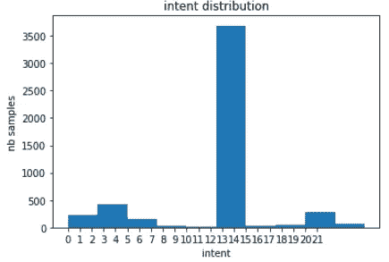
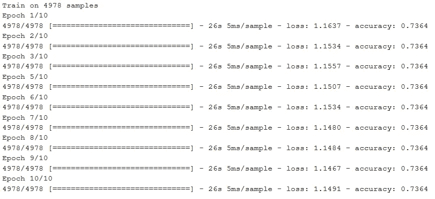
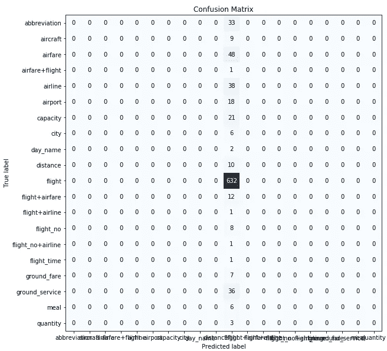
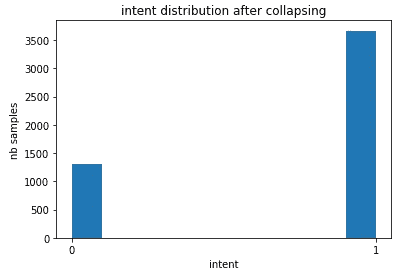
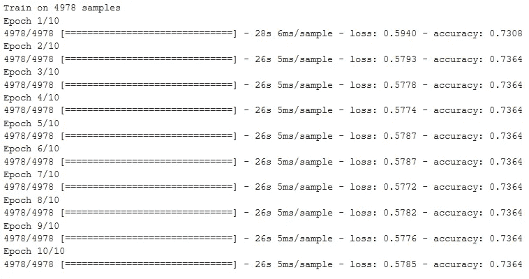
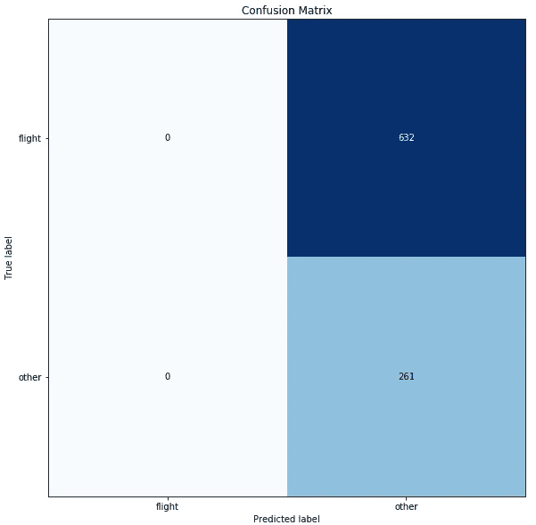
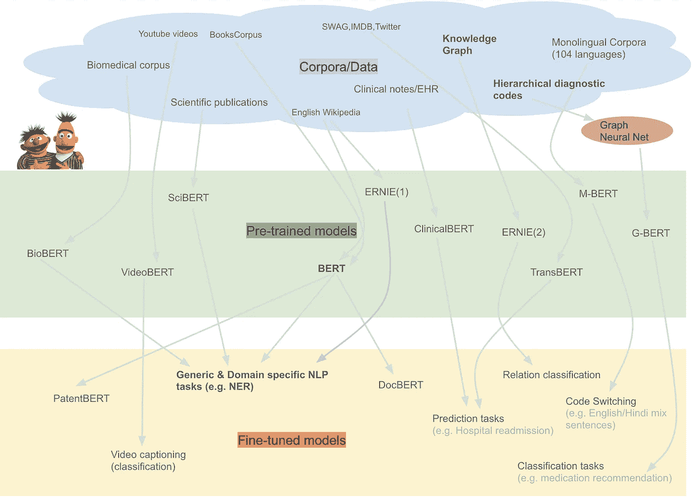
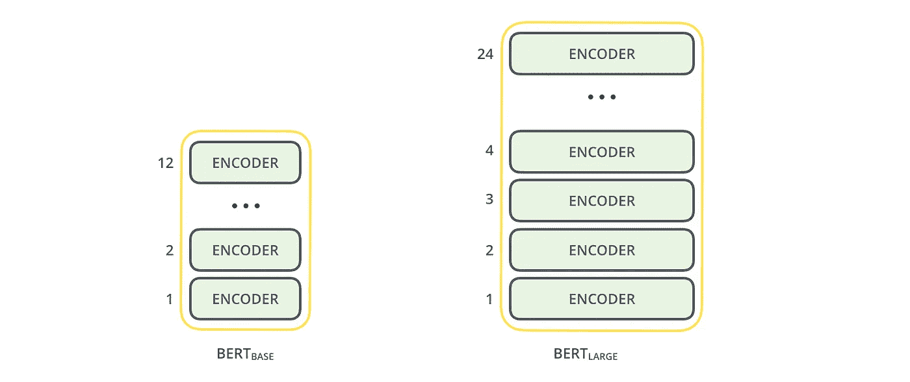
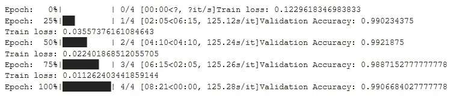
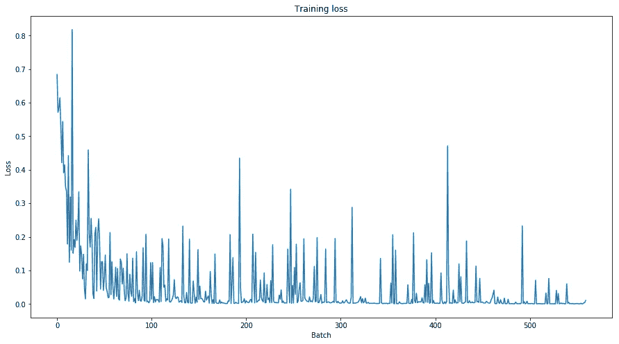

# 伯特为假人-一步一步教程

> 原文：<https://towardsdatascience.com/bert-for-dummies-step-by-step-tutorial-fb90890ffe03?source=collection_archive---------0----------------------->

## 变压器 DIY 实用指南。经过实践检验的 PyTorch 代码，用于 NLU 的意向分类，经过 BERT 微调。

本文介绍了与 BERT 一起起飞所需的一切。我们提供了一个分步指南，介绍如何微调变压器(BERT)的双向编码器表示，以实现自然语言理解，并使用 LSTM 对其进行基准测试。


[source](https://epicmag.org/intention-belief-manifestation/): intention+belief=manifestation

# 动机

聊天机器人、虚拟助理和对话代理通常会将查询分类为特定的意图，以便生成最一致的响应。意图分类是预测任何给定用户查询的意图标签的分类问题。这通常是一个多类分类问题，其中查询被分配一个唯一的标签。例如，查询“匹兹堡内的豪华轿车服务费用是多少”被标记为“地面票价”，而查询“丹佛有什么样的地面交通工具”被标记为“地面服务”。查询“我想上午 8:38 从波士顿起飞，上午 11:10 到达丹佛”是“航班”意图，而“给我看看从旧金山到亚特兰大的航班的费用和时间”是“机票+航班时间”意图。

[](/bert-nlp-how-to-build-a-question-answering-bot-98b1d1594d7b) [## BERT NLP——如何构建问答机器人

### 通过亲自动手的 PyTorch 代码理解直觉，BERT 在 SQuAD 上进行了微调。

towardsdatascience.com](/bert-nlp-how-to-build-a-question-answering-bot-98b1d1594d7b) 

上面的例子显示了意图标签的模糊性。用户可能会添加误导性的词语，导致多个意图出现在同一个查询中。针对意图分类提出了基于注意的学习方法(刘和莱恩，[2016](https://www.groundai.com/project/bert-for-joint-intent-classification-and-slot-filling/#bib.bib10)；咕等， [2018](https://www.groundai.com/project/bert-for-joint-intent-classification-and-slot-filling/#bib.bib4) 。一种精心构建的网络被称为**变压器。It 应用注意力机制来收集关于给定单词的相关上下文的信息，然后将该上下文编码到灵活表示该单词的丰富向量中。**

在本文中，我们将演示 Transformer，特别是它的注意机制如何通过学习上下文关系来帮助解决意图分类任务。在展示了基于 LSTM 的分类器的局限性之后，我们介绍了 [BERT:深度双向转换器](https://arxiv.org/abs/1810.04805)的预训练，这是一种新的转换器方法，在大型语料库上进行预训练并且是开源的。本文的最后一部分展示了对 BERT 进行微调以完成意图分类任务，并在不可见的意图查询上实现最先进的准确性所必需的 Python 代码。我们使用 ATIS(航空旅行信息系统)数据集，这是一个标准的基准数据集，广泛用于识别客户查询背后的意图。

# LSTM 的意向分类

## 数据

在我们之前的一篇文章的[中，你会找到加载 ATIS 数据集的 Python 代码。在 ATIS 训练数据集中，我们有 26 个不同的意向，其分布如下所示。数据集非常不平衡，大多数查询都被标注为“flight”(代码 14)。](/natural-language-understanding-with-sequence-to-sequence-models-e87d41ad258b)



## 多类分类器

在查看 Transformer 之前，我们实现了一个简单的 LSTM 递归网络来解决分类任务。在通常的预处理、标记化和矢量化之后，4978 个样本被送入 Keras 嵌入层，该层将每个单词投影为维数为 256 的 Word2vec 嵌入。结果通过具有 1024 个单元的 LSTM 层。这产生了 1024 个输出，这些输出被提供给具有 26 个节点和 softmax 激活的密集层。使用分类交叉熵将在该管道末端创建的概率与原始标签进行比较。



正如我们在上面的训练输出中看到的，Adam 优化器卡住了，损失和准确性没有提高。该模型似乎预测了多数类在每一步的“飞行”。

当我们使用经过训练的模型来预测未知测试数据集上的意图时，混淆矩阵清楚地显示了模型如何过度适应大多数“飞行”类。



## 数据扩充

在解决分类任务时，处理不平衡数据集是一个常见的挑战。数据扩充是一个很好的解决方法。在这里，遇到 [SMOTE](https://imbalanced-learn.readthedocs.io/en/stable/generated/imblearn.over_sampling.SMOTE.html) 算法并不罕见，这是一种在不偏离预测的情况下增加数据集的流行选择。SMOTE 使用 k-最近邻分类器来创建合成数据点，作为紧密相关的真实数据点组的多维插值。不幸的是，我们在 ATIS 训练数据集中有 25 个少数民族类，留给我们一个过度代表性的类。SMOTE 无法工作，因为它无法找到足够多的邻居(最小值为 2)。替换过采样是 SMOTE 的一种替代方法，也不能提高模型的预测性能。

从 SNIPS 个人语音助手收集的 [SNIPS 数据集](https://snips-nlu.readthedocs.io/en/latest/dataset.html)，是一个用于自然语言理解的更近的数据集，是一个可用于在未来工作中增强 ATIS 数据集的数据集。

## 二元分类器

由于我们在扩充数据集方面不太成功，现在，我们将缩小问题的范围。我们定义了一个二进制分类任务，其中通过将“flight”查询折叠到一个名为“other”的类中，针对剩余的类对其进行评估。这个新数据集中的标签分布如下所示。



我们现在可以使用与之前类似的网络架构。唯一的变化是将密集层中的节点数减少到 1，将激活函数减少到 sigmoid，将损失函数减少到二进制交叉熵。令人惊讶的是，在给定用户查询的情况下，LSTM 模型仍然无法学会预测用户意图，如下所示。



在 10 个时期之后，我们在一个看不见的测试数据集上评估该模型。这一次，我们将所有样本都预测为“其他”，尽管在训练集中，“flight”的样本数是“其他”的两倍多。



# 使用 BERT 进行意图分类

我们现在关注 Transformer 的动机是，当数据集不平衡时，我们目睹了序列到序列模型在意图分类任务中的糟糕分类结果。在本节中，我们将介绍 Transformer 的一个变体，并实现它来解决我们的分类问题。我们将特别关注 2018 年末发布的变形金刚(BERT)双向编码器表示。

## **伯特是什么？**

BERT 基本上是一个训练有素的 Transformer 编码器堆栈，基本版本有 12 个，大型版本有 24 个，相比之下，我们在上一篇文章的[中描述的原始 Transformer 有 6 个编码器层。](/lost-in-translation-found-by-transformer-46a16bf6418f)

[](/lost-in-translation-found-by-transformer-46a16bf6418f) [## 迷失在翻译中。被变形金刚发现。

### 破解 GPT-2 使用的变压器模型之谜，伯特

towardsdatascience.com](/lost-in-translation-found-by-transformer-46a16bf6418f) 

BERT 编码器具有更大的前馈网络(基础和大型分别为 768 和 1024 个节点)和更多的注意力头(分别为 12 和 16)。伯特接受了维基百科和[图书语料库](https://arxiv.org/pdf/1506.06724.pdf)的培训，这是一个包含超过 10，000 本不同流派书籍的数据集。下面你可以看到一个在专业语料库上预先训练的 BERT 的其他变体的图表。



[source](/a-review-of-bert-based-models-4ffdc0f15d58)

伯特被[发布](https://ai.googleblog.com/2018/11/open-sourcing-bert-state-of-art-pre.html)给公众，作为 NLP 的一个新时代。它的开源模型代码打破了几项基于语言的困难任务的记录。大规模数据集上的预训练模型使任何构建自然语言处理的人都可以使用这个免费的发电站。从理论上讲，BERT 允许我们通过最少的特定任务微调来粉碎多个基准测试。



(source: [Jay. Alammar](http://jalammar.github.io/illustrated-bert/), 2018)

BERT 的工作方式类似于 Transformer 编码器堆栈，它将一个单词序列作为输入，在新的序列进入时，该序列不断从一个编码器流向下一个编码器。每个序列的最终输出是一个 728 基数或 1024 大基数的向量。我们将使用这样的向量来解决我们的意图分类问题。

## 我们为什么需要伯特？

正确的语言表示是机器理解通用语言的关键。**上下文无关模型**，如 [word2vec 或 GloVe](/representing-text-in-natural-language-processing-1eead30e57d8) 为词汇表中的每个单词生成单个单词嵌入表示。例如，“银行”一词在“银行存款”和“河岸”中有相同的表示。**上下文模型**根据句子中的其他单词生成每个单词的表示。作为一个语境模型，BERT 以双向的方式捕捉了这些关系。BERT 基于最近的工作和预训练上下文表示中的巧妙想法，包括[半监督序列学习](https://arxiv.org/abs/1511.01432)、[生成式预训练](https://blog.openai.com/language-unsupervised/)、 [ELMo](https://allennlp.org/elmo) 、 [OpenAI Transformer](https://s3-us-west-2.amazonaws.com/openai-assets/research-covers/language-unsupervised/language_understanding_paper.pdf) 、 [ULMFit](http://nlp.fast.ai/classification/2018/05/15/introducting-ulmfit.html) 和[Transformer](https://arxiv.org/pdf/1706.03762.pdf)。虽然这些模型都是单向或浅双向的，但 BERT 是完全双向的。

我们将使用 BERT 从 ATIS 查询文本数据中提取高质量的语言特征，并使用自己的数据在特定任务(分类)上微调 BERT，以产生最先进的预测。

## **准备 BERT 环境**

请随意下载[原版 Jupyter 笔记本](https://colab.research.google.com/drive/1ywsvwO6thOVOrfagjjfuxEf6xVRxbUNO)，我们将根据本节的目标对其进行改编。

至于开发环境，我们推荐 **Google Colab** ，它提供免费的 GPU 和 TPUs，可以通过进入菜单选择:*编辑- >笔记本设置- >添加加速器(GPU)* 来添加。Colab 的一个替代方案是在谷歌云平台上使用一个 **JupyterLab 笔记本实例**，在请求谷歌增加你的 GPU 配额后，选择菜单 *AI 平台- >笔记本- >新实例- > Pytorch 1.1 - >带 1 个 NVIDIA Tesla K80* 。这将花费大约。每小时 0.40 美元(当前价格，可能会改变)。下面是验证您的 GPU 可用性的代码。

我们将通过 Hugging Face 为 BERT 使用 PyTorch 接口，目前，Hugging Face 是最广泛接受和最强大的 PyTorch 接口，用于与 BERT 一起使用。Hugging Face 提供了 [pytorch-transformers](https://github.com/huggingface/pytorch-transformers) 存储库，带有附加库，用于为自然语言处理连接更多预训练的模型:GPT、GPT-2、Transformer-XL、XLNet、XLM。

正如您在下面看到的，为了让 torch 使用 GPU，您必须识别并指定 GPU 作为设备，因为在训练循环的后面，我们将数据加载到该设备上。

现在，我们可以将数据集上传到笔记本实例。在继续之前，请运行我们上一篇文章中[的代码，使用 Python 函数 ***load_atis()*** 对数据集进行预处理。](/natural-language-understanding-with-sequence-to-sequence-models-e87d41ad258b)

BERT 期望输入特定格式的数据，用特殊的标记**来标记句子的开始(【CLS】)和分隔/结束(【SEP】)。此外，我们需要**将**我们的文本标记成与 BERT 的词汇相对应的标记。**

```
'[CLS]  i want to fly from boston at 838 am and arrive in denver at 1110 in the morning  [SEP]'['[CLS]', 'i', 'want', 'to', 'fly', 'from', 'boston', 'at', '83', '##8', 'am', 'and', 'arrive', 'in', 'denver', 'at', '111', '##0', 'in', 'the', 'morning', '[SEP]']
```

对于每个标记化的句子，BERT 需要**输入 id**，这是一个整数序列，用于将每个输入标记标识为其在 BERT 标记化器词汇表中的索引号。

BERT 聪明的语言建模任务屏蔽了输入中 15%的单词，并要求模型预测缺失的单词。为了让 BERT 更好地处理多个句子之间的关系，预训练过程还包括一项额外的任务:给定两个句子(A 和 B)，B 很可能是 A 后面的句子吗？因此，我们需要通过使用注意掩蔽和片段掩蔽的概念来告诉 BERT 我们正在解决什么任务。在我们的例子中，一个查询中的所有单词都将被预测，并且我们不会在每个查询中有多个句子。我们定义下面的面具。

现在是时候使用我们的数据创建微调 BERT 所需的所有张量和迭代器了。

最后，是时候微调 BERT 模型了，这样它就可以输出给定用户查询字符串的 intent 类。为此，我们使用[*BertForSequenceClassification*](https://github.com/huggingface/pytorch-pretrained-BERT/blob/master/pytorch_pretrained_bert/modeling.py#L1129)，这是正常的 BERT 模型，在顶部添加了一个线性层用于分类。下面我们展示了该模型的概要。编码器摘要仅显示一次。相同的摘要通常会重复 12 次。为了简单起见，我们只显示其中一个。我们可以在开头看到 *BertEmbedding* 层，后面是每个编码器层的一个 Transformer 架构: *BertAttention* ， *BertIntermediate* ， *BertOutput* 。最后，我们有了*分类器*层。

当我们输入数据时，整个预训练的 BERT 模型和额外的未训练的分类层在我们的特定任务上被训练。训练分类器相对便宜。底层已经有了很好的英语单词表示，我们只需要训练顶层，在底层进行一些调整来适应我们的任务。这是迁移学习的一种变体。



BERT fine-tuned on the Intent Classification task for Natural Language Understanding

来自变量 *train_loss_set* 的训练损失图看起来棒极了。整个训练循环不到 10 分钟。



现在，是关键时刻了。伯特是否过度适应？还是比我们之前的 LSTM 网络做得更好？我们现在加载测试数据集并准备输入，就像我们对训练集所做的那样。然后，我们创建张量，并在评估模式下对数据集运行模型。


使用 BERT，我们能够在意图分类任务上获得好的分数(95.93%)。这表明，使用预先训练的 BERT 模型，可以使用 PyTorch 界面以最少的工作量和训练时间快速有效地创建高质量的模型。

# 结论

在本文中，我演示了如何在 PyTorch 笔记本中加载预先训练好的 BERT 模型，并在您自己的数据集上对其进行微调，以解决特定的任务。在处理自然语言理解任务时，注意力很重要。当与来自 Transformer 的强大的单词嵌入相结合时，意图分类器可以显著提高其性能，正如我们成功展示的那样。

我的新文章提供了经过实践检验的 PyTorch 代码，用于在小队数据集上对 BERT 进行微调的问题回答。

[](/bert-nlp-how-to-build-a-question-answering-bot-98b1d1594d7b) [## BERT NLP——如何构建问答机器人

### 通过亲自动手的 PyTorch 代码理解直觉，BERT 在 SQuAD 上进行了微调。

towardsdatascience.com](/bert-nlp-how-to-build-a-question-answering-bot-98b1d1594d7b) 

这一领域为未来的工作打开了一扇大门，特别是因为自然语言理解是几项技术的核心，包括对话式人工智能(聊天机器人、个人助理)和即将到来的**增强分析**，这被 Gartner 列为组织很快将面临的首要破坏性挑战。理解自然语言对传统的分析和商业智能产生了影响，因为高管们正在通过文本查询和数据叙述快速采用智能信息检索，而不是带有复杂图表的仪表板。

谢谢你从我这里读到更多。

[](/representing-text-in-natural-language-processing-1eead30e57d8) [## 自然语言处理中的文本表示

### 理解书面单词:温习 Word2vec、GloVe、TF-IDF、单词袋、N-grams、1-hot 编码…

towardsdatascience.com](/representing-text-in-natural-language-processing-1eead30e57d8) [](/generative-adversarial-network-gan-for-dummies-a-step-by-step-tutorial-fdefff170391) [## 虚拟生成对抗网络(GAN)——循序渐进教程

### 用防弹 Python 代码理解、构建和训练 GANs 的终极初学者指南。

towardsdatascience.com](/generative-adversarial-network-gan-for-dummies-a-step-by-step-tutorial-fdefff170391) [](/the-ultimate-beginner-guide-to-tensorflow-af82fd4b8626) [## 张量流初学者终极指南

### 如何从零开始实现线性回归和梯度下降！了解 TensorFlow 的基础知识一次…

towardsdatascience.com](/the-ultimate-beginner-guide-to-tensorflow-af82fd4b8626) [](/my-deep-learning-model-says-sorry-i-dont-know-the-answer-that-s-absolutely-ok-50ffa562cb0b) [## 深度学习的不确定性。如何衡量？

### 使用 Keras 对认知和任意不确定性进行贝叶斯估计的实践教程。走向社会…

towardsdatascience.com](/my-deep-learning-model-says-sorry-i-dont-know-the-answer-that-s-absolutely-ok-50ffa562cb0b)