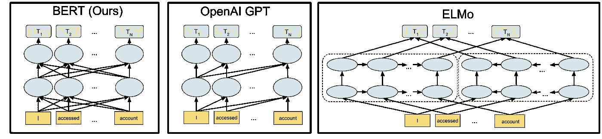
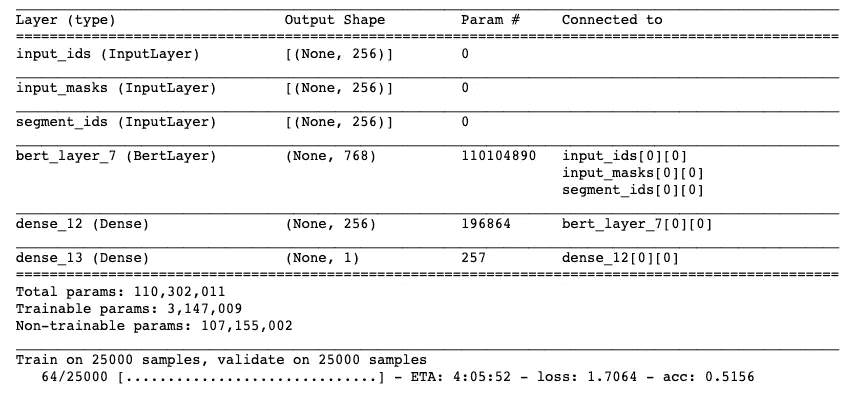

# 带有 Tensorflow hub 的 Keras 中的 BERT

> 原文：<https://towardsdatascience.com/bert-in-keras-with-tensorflow-hub-76bcbc9417b?source=collection_archive---------2----------------------->

在 [Strong Analytics](http://strong.io) ，我们的许多项目都涉及使用深度学习进行自然语言处理。在最近的一个项目中，我们努力鼓励孩子们自由探索在线，同时确保他们免受网络欺凌和在线虐待，而另一个项目涉及预测日历和电子邮件活动的可扣除费用。

任何 NLP 项目的一个关键组成部分是使用技术快速测试和迭代的能力。Keras 提供了一种非常快速的方法来原型化最先进的深度学习模型，因此是我们在工作中使用的重要工具。

在[之前的一篇文章](/elmo-embeddings-in-keras-with-tensorflow-hub-7eb6f0145440)中，我们展示了如何集成 ELMo 嵌入作为定制的 Keras 层，以简化使用 Tensorflow hub 的模型原型。 [BERT](https://arxiv.org/abs/1810.04805) ，谷歌推出的语言模型，使用变形金刚和预训练来实现许多语言任务的最先进水平。它最近被添加到 Tensorflow hub 中，简化了 Keras 模型中的集成。

Deeply bidirectional unsupervised language representations with BERT

让我们开始建造吧！首先，我们加载之前使用的相同 IMDB 数据:

接下来，我们使用 tf-hub 模型对数据进行标记，这简化了预处理:

接下来，我们使用 Keras 构建一个自定义层，集成 tf-hub 的 BERT。模型很大(110，302，011 参数！！！)所以我们微调层的子集。

现在，我们可以使用 BERT 层轻松构建和训练我们的模型:

Using a GPU for large models like BERT is advised!

相当简单！在 Github 上查看[完整的笔记本，并创建很酷的东西！](https://github.com/strongio/keras-bert)

***想和芝加哥的顶级数据科学家团队一起从事各种行业中具有挑战性的 NLP、机器学习和 AI 工作？我们正在招聘有才华的数据科学家和工程师！***

在 [strong.io](http://strong.io) 了解更多信息，并在 [careers.strong.io](https://careers.strong.io/) 申请