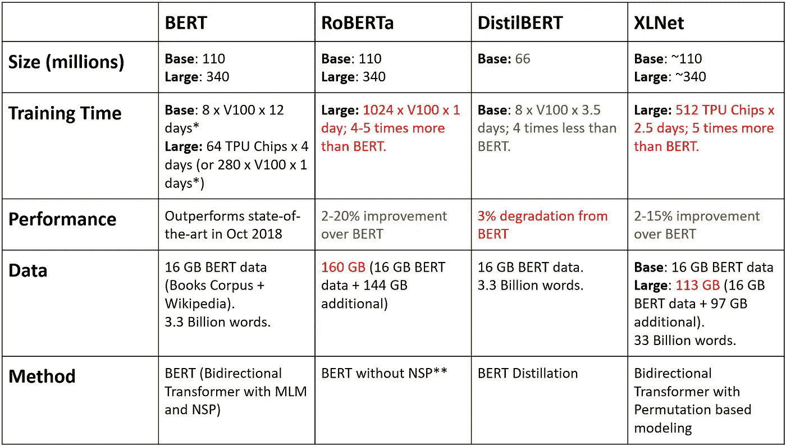
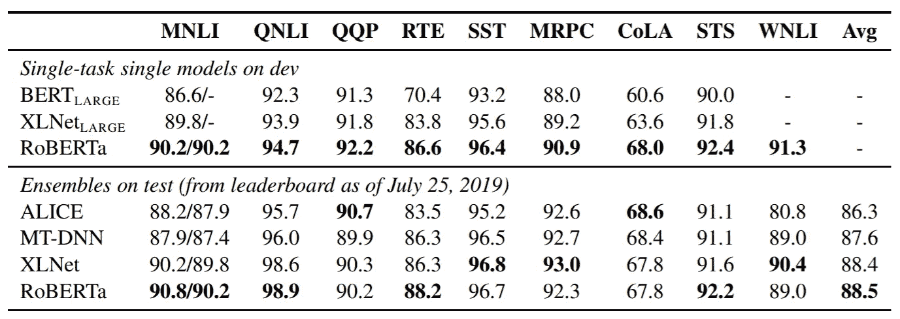

# BERT、RoBERTa、DistilBERT 和 XLNet——使用哪一个？

> 原文：<https://towardsdatascience.com/bert-roberta-distilbert-xlnet-which-one-to-use-3d5ab82ba5f8?source=collection_archive---------1----------------------->

image source ([https://www.maxpixel.net](https://www.maxpixel.net/static/photo/2x/Letters-School-Language-Abc-Learn-Alphabet-3704026.jpg))

oogle 的 BERT 和最近基于 transformer 的方法席卷了 NLP 领域，在几个任务上超过了最先进的技术。最近，人们展示了相对于 BERT 的各种改进——在这里，我将对比主要的相似之处和不同之处，以便您可以选择在您的研究或应用中使用哪一种。

[**BERT**](https://arxiv.org/abs/1810.04805) 是一个双向转换器，用于对大量未标记的文本数据进行预训练，以学习一种语言表示，可用于微调特定的机器学习任务。虽然 BERT 在几个具有挑战性的任务上超过了 NLP 最先进的技术，但其性能的提高可以归功于双向转换器、掩蔽语言模型的新颖预训练任务和 Next 结构预测，以及大量数据和谷歌的计算能力。如果你还不熟悉 BERT 的基本技术，我推荐你快速阅读这篇 [3 分钟](/bert-technology-introduced-in-3-minutes-2c2f9968268c)的博文。

> 最近，出现了几种方法来改善 BERT 的预测指标或计算速度，但不能同时改善两者。

XLNet 和 RoBERTa 提高了性能，而 DistilBERT 提高了推理速度。下表对它们进行了比较！

Comparison of BERT and recent improvements over it

* [预计 GPU 时间](/bert-technology-introduced-in-3-minutes-2c2f9968268c)(使用 4 个 TPU 吊舱的原始训练时间为 4 天)

**使用更大的小批量、学习率和步长进行更长时间的训练，并在掩蔽程序上有所不同。

***原始出版物中给出的数字，除非另有说明。

[**XLNet**](https://arxiv.org/abs/1906.08237) 是一个大型双向转换器，它使用改进的训练方法、更大的数据和更强的计算能力，在 20 个语言任务上实现了优于 BERT 的预测指标。

为了改进训练，XLNet 引入了置换语言建模，其中所有的记号都被预测，但顺序是随机的。这与 BERT 的屏蔽语言模型相反，在该模型中，仅预测屏蔽的(15%)标记。这也与传统的语言模型形成对比，在传统的语言模型中，所有的标记都是以*连续顺序*而不是*随机顺序*预测的。这有助于模型学习双向关系，从而更好地处理单词之间的依赖性和关系。此外，Transformer XL 被用作基础架构，即使在没有基于排列的训练的情况下，它也表现出良好的性能。

XLNet 使用超过 130 GB 的文本数据和运行 2.5 天的 512 个 TPU 芯片进行训练，这两个数据都比 BERT 大得多。

[**罗伯塔**](https://arxiv.org/pdf/1907.11692.pdf) **。【RoBERTa 是脸书大学推出的经过稳健优化的 BERT 方法，它是对 BERT 的再培训，具有改进的培训方法、1000%以上的数据和计算能力。**

为了改进训练过程，RoBERTa 从 BERT 的预训练中移除了下一句预测(NSP)任务，并引入了动态屏蔽，使得屏蔽的令牌在训练时期期间改变。还发现较大的批量训练规模在训练过程中更有用。

重要的是，RoBERTa 使用 160 GB 的文本进行预训练，包括 16GB 的书籍语料库和 BERT 中使用的英语维基百科。附加数据包括 [CommonCrawl 新闻数据集](http://web.archive.org/web/20190904092526/http://commoncrawl.org/2016/10/news-dataset-available/)(6300 万篇文章，76 GB)、网络文本语料库(38 GB)和来自 CommonCrawl 的故事(31 GB)。这加上庞大的 1024 V100 特斯拉 GPU 的运行一天，导致罗伯塔的预训练。

因此，RoBERTa 在 GLUE 基准测试结果上优于 BERT 和 XLNet:

Performance comparison from [RoBERTa](https://arxiv.org/pdf/1907.11692.pdf).

另一方面，为了减少 BERT 或相关模型的计算(训练、预测)次数，自然的选择是使用较小的网络来逼近性能。有许多方法可以用来做到这一点，包括修剪、提取和量化，然而，所有这些都会导致较低的预测度量。

[**DistilBERT**](https://medium.com/huggingface/distilbert-8cf3380435b5) 学习了一个经过提炼的(近似)版本的 BERT，保留了 97%的性能但只使用了一半数量的参数( [paper](https://arxiv.org/abs/1910.01108) )。具体来说，它没有令牌类型的嵌入，pooler，并且只保留了 Google 的 BERT 的一半层。DistilBERT 使用一种称为蒸馏的技术，这种技术近似于谷歌的 BERT，即一个较小的神经网络代替一个较大的神经网络。这个想法是，一旦一个大的神经网络被训练，它的全部输出分布可以用一个较小的网络来近似。这在某种意义上类似于后验近似。贝叶斯统计中用于后验近似的一个关键优化函数是 Kulback Leiber 散度，自然也在这里使用。

***注*** :在贝叶斯统计中，我们是在逼近真实的后验概率(来自数据)，而使用蒸馏，我们只是在逼近由更大的网络学习到的后验概率。

# **那么用哪一个呢？**

> 如果你真的需要一个更快的推理速度，但可以在预测指标上妥协几个百分点，DistilBERT 是一个合理的选择，但是，如果你正在寻找最好的预测指标，你最好使用脸书的 RoBERTa。
> 
> 从理论上讲，XLNet 的基于排列的训练应该能够很好地处理依赖性，并且从长远来看可能会工作得更好。
> 
> 然而，Google 的 BERT 确实提供了一个很好的工作基准，如果你没有上述任何关键需求，你可以用 BERT 保持你的系统运行。

**结论**

大部分性能提升(包括 BERT 本身！)是由于增加的数据、计算能力或训练过程。虽然它们有自己的价值，但它们往往在计算和预测指标之间进行权衡。需要在使用更少数据和计算资源的同时提高性能的根本性改进。

# 更新

讨论 2020 年和 2021 年最新方法的博客第二部分可以在找到[。](https://medium.com/@suleiman.khan/advancing-over-bert-bigbird-convbert-dynabert-bca78a45629c)

作者在@SuleimanAliKhan 发推文。—我们正在招聘—