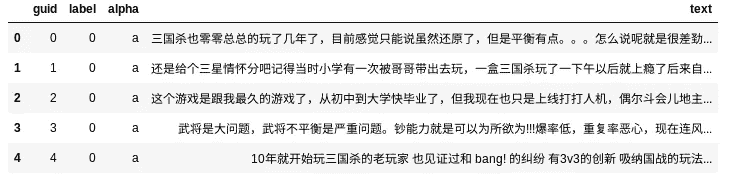
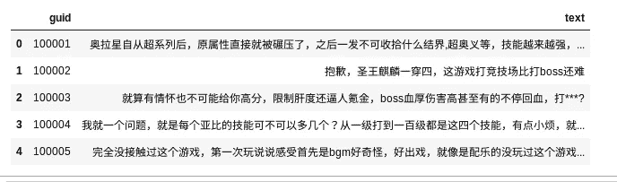
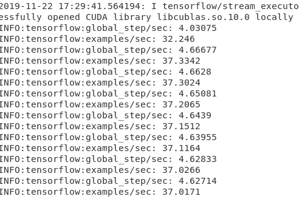
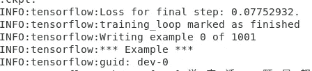
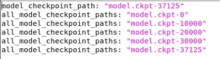
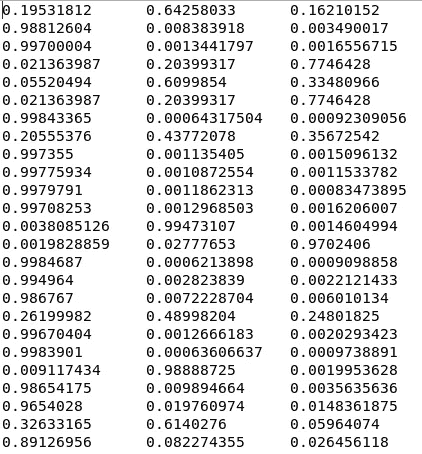
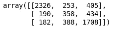

# 伯特:应用商店评论的情感分析

> 原文：<https://towardsdatascience.com/bert-sentiment-analysis-of-app-store-review-db68f7721d94?source=collection_archive---------16----------------------->

利用最先进的模型分析应用商店的用户情绪


Photo by [William Hook](https://unsplash.com/@williamtm?utm_source=unsplash&utm_medium=referral&utm_content=creditCopyText) on [Unsplash](https://unsplash.com/s/photos/app-review?utm_source=unsplash&utm_medium=referral&utm_content=creditCopyText)

本文为您提供了对 app store 公众用户的评论进行情感分析的必要步骤。在本教程中，我将使用基于中文的模型来测试 Bert 应用于英语以外的语言时的性能。无论您使用哪种模型，情感分析的步骤都是一样的。如果您不确定使用哪种模型，请查看下面的[链接](https://github.com/google-research/bert#pre-trained-models)，了解有关 BERT 团队提供的预训练模型的更多信息。如果你是 BERT 的新手，请查看我之前关于使用 BERT 的[多分类任务的教程。本教程有 5 个部分:](/beginners-guide-to-bert-for-multi-classification-task-92f5445c2d7c)

1.  数据集准备
2.  培养
3.  预言；预测；预告
4.  结果
5.  结论

# 1.数据集准备

我将使用来自 Taptap 的评论，这是一个迎合中国市场的游戏应用商店。请随意使用您自己的数据集。你甚至可以在谷歌 Play 商店和苹果商店的评论上测试一下。如果是这种情况，请确保您对 BERT 使用的是英语模型。让我们来看看我们可以从 Taptap 的评论中获得的细节。


Image by Author. Taken from a review in Taptap.

这里有相当多有用的数据:

*   用户发布的评论
*   评分从 1 到 5
*   竖起大拇指
*   数数拇指朝下
*   其他用户对此评论的回复

我们可以很容易地使用可用的数据来标记情感。如果你有时间的话，强烈建议你手工贴标签。在这种情况下，我将使用评级来确定标签。

1.  负:1-3⭐
2.  中立:4 名⭐
3.  阳性:5 ⭐

我设法从几个游戏的用户评论中收集了相当多的数据集。我已经将数据集加载到三个数据帧中。

1.  训练数据集
2.  评估数据集
3.  测试数据集

让我们看看**训练**和**评估**的数据内容。两者结构相同。



Image by Author

*   **Guid** :注释的 id。
*   **标签**:评论的情绪。标签是基于用户的评价。
*   **Alpha** :一次性栏。我刚填了一个。
*   **文本**:用户的实际评论。

如果您在创建上面的数据帧时遇到问题，请随意使用下面的代码(相应地修改):

```
df_bert = pd.DataFrame({'guid': id_list,
    'label': label_list,
    'alpha': ['a']*len(count),
    'text': text_list})
```

测试数据会略有不同，因为它应该只包含 **guid** 和**文本**。



Image by Author

完成后，让我们使用以下代码将其保存为 tsv 文件(相应地修改数据帧的名称):

```
df_bert_train.to_csv('data/train.tsv', sep='\t', index=False, header=False)
df_bert_dev.to_csv('data/dev.tsv', sep='\t', index=False, header=False)
df_bert_test.to_csv('data/test.tsv', sep='\t', index=False, header=True)
```

请注意，文件存储在**数据**文件夹中。您可以根据自己的使用情况随意修改，但文件名必须如下所示:

*   train.tsv
*   开发 tsv
*   test.tsv

此外， **test.tsv** 数据必须有一个不同于 **train.tsv** 和 **dev.tsv** 的头。将 **test.tsv** 的割台设置为 **True** 。

完成数据准备后，让我们进入下一部分。

# 2.培养

我们现在将开始训练和微调模型。确保您已经从官方[站点](https://github.com/google-research/bert)中克隆了存储库。此外，您应该将以下文件和文件夹放在存储库中的某个位置:

*   **数据目录**:存放 train.tsv、dev.tsv、test.tsv 的目录
*   **Vocab 文件**:Vocab . txt 文件。它与您下载的模型一起提供。我创建了一个新的**模型**文件夹，并将文件放入其中。
*   **配置文件**:Config . JSON 文件。它也包含在模型中。同样，我把它放在**模型**文件夹中。
*   **初始模型**:用于训练的模型。您可以使用基于预先训练的模型，或者从您已经微调的现有模型中恢复。我将它存储在**型号**文件夹中
*   **输出目录**:模型将要写入的文件夹。您可以简单地为它创建一个空文件夹。

下一步是确定以下变量:

*   **最大序列长度**:分词后最大总输入序列长度。长于此长度的序列将被截断，短于此长度的序列将被填充。默认值是 128，但在本教程中我将使用 256。
*   **训练批量**:训练的总批量。默认值为 32。我将在本教程中使用 8，因为我只在一个 GeForce RTX 2080 上训练。
*   **学习率**:Adam 的初始学习率。默认为 5e-5。我已经将值设置为 2e-5。
*   **Num train epoch** :要执行的训练总次数。我将只使用默认值 3.0

如果您不确定使用哪种 GPU，请运行以下命令找出答案:

```
nvidia-smi
```

我们需要修改 run_classifier.py 中的代码，因为这个用例有 3 个类。打开 python 文件，在**cola processor(data processor)**类中搜索 **get_labels** ()函数。将其更改为以下内容并保存:

```
def get_labels(self):
    """See base class."""
    return ["0", "1", "2"]
```

完成后，激活虚拟环境，并将目录更改为存储库的根目录。在终端中键入以下命令。

```
CUDA_VISIBLE_DEVICES=0 python run_classifier.py --task_name=cola --do_train=true --do_eval=true --data_dir=./data/ --vocab_file=./model/vocab.txt --bert_config_file=./model/bert_config.json --init_checkpoint=./model/bert_model.ckpt --max_seq_length=256 --train_batch_size=8 --learning_rate=2e-5 --num_train_epochs=3.0 --output_dir=./output/ --do_lower_case=False
```

运行它，您应该会看到以下输出:



Image by Author

它可能需要相当长的时间来训练，这取决于你使用的数据集的大小。一旦训练完成，终端将输出以下内容。



让我们进入下一步。

# 3.预言；预测；预告

将在**输出**文件夹中生成一个模型。请检查最高步骤数，以确定您拥有的最新型号。如果您不确定哪个型号是最新的，请打开**检查点**文件找出答案。在我的例子中，我将 37125 作为模型的最后一步。



Image by Author

在同一个终端中，运行以下代码(确保最大序列长度与您在培训中使用的长度相同):

```
CUDA_VISIBLE_DEVICES=0 python run_classifier.py --task_name=cola --do_predict=true --data_dir=./data/ --vocab_file=./model/vocab.txt --bert_config_file=./model/bert_config.json --init_checkpoint=./output/model.ckpt-37125 --max_seq_length=256 --output_dir=./output/
```

代码将在输出文件夹中生成一个 **test_results.tsv** 文件。在我的例子中，我得到了以下结果。



Image by Author

每列代表预测类别的概率或置信水平，最高的是模型预测的类别。

# 4.结果

是我们分析结果的时候了。第一个任务是加载 test_results.tsv，并根据最高预测概率将其转换为 dataframe。使用以下代码读取文件:

```
df_result = pd.read_csv('output/test_results.tsv', sep='\t', header=None)
df_result.head()
```

您应该有一个包含三列的测试数据的数据框架(我将其命名为 df_test_with_label):

*   全局唯一标识符
*   标签
*   文本

创建一个新的数据帧，并使用 **idxmax** 映射结果。

```
df_predict = pd.DataFrame({'guid':df_test_with_label['guid'],
                            'label':df_result.idxmax(axis=1),
                            'text':df_test_with_label['text'],})
df_predict.head()
```

## 导入

完成后，让我们从 sklearn 导入以下度量函数来计算我们的模型的性能。

```
from sklearn.metrics import accuracy_score, precision_score, recall_score, confusion_matrix
```

## 准确(性)

你可以如下计算模型的精确度。

```
accuracy_score(df_test_with_label['label'], df_predict['label'])
```

结果得到 0.7033952594490711。

## 回忆

基于 sklearn [文档](https://scikit-learn.org/stable/modules/generated/sklearn.metrics.precision_score.html#sklearn.metrics.precision_score)。召回率是比率`tp / (tp + fn)`，其中`tp`是真阳性的数量，`fn`是假阴性的数量。召回直观上是分类器找到所有肯定样本的能力。最佳值为 1，最差值为 0。它还需要一个名为 average 的参数。我正在将它设置为**宏**。

```
recall_score(df_test_with_label['label'], df_predict['label'], average='macro')
```

运行代码的结果是输出 0.6312777479889565。

## 精确

精度是比率`tp / (tp + fp)`，其中`tp`是真阳性的数量，`fp`是假阳性的数量。精确度直观上是分类器不将阴性样品标记为阳性的能力。最佳值为 1，最差值为 0。同样，平均参数被设置为**宏**。

```
precision_score(df_test_with_label['label'], df_predict['label'], average='macro')
```

精度比 recall 低一点，只有 0.6375505256。

## 混淆矩阵

仅仅有回忆和精确是不够好的，因为我们不知道哪个类有最好的预测，哪个类得到最差的结果。我们可以使用混淆矩阵方法来为我们提供这方面的更多见解。

```
confusion_matrix(df_test_with_label['label'], df_predict['label'])
```

我得到了以下输出。



Image by Author

我们可以看到，该模型在预测第二个标签(中性)时有一些困难。在这种情况下，我们可能需要对数据集进行一些修改，并再次尝试重新训练它。

# 5.结论

祝贺您完成本教程。让我们回顾一下今天所学的内容。

首先，我们开始为我们的情感分析项目准备数据集。这包括获取数据并根据提供的详细信息自动标记数据。在我们的例子中，我们使用应用评论等级作为情感的标签。我们把它定为三类，即消极、中立和积极。我们从数据集生成了三个 tsv 文件。

接下来，我们配置了所需的参数，如最大序列长度和批量大小。我们训练该模型，并使用它对测试数据进行预测。

最后，我们将结果加载到一个数据框架中，并使用 sklearn 的度量函数对其进行分析。所提供的见解允许我们确定模型的性能。

感谢阅读，希望你喜欢这篇教程。下一篇文章再见。祝你有美好的一天！❤️

# 参考

1.  [https://towards data science . com/beginners-guide-to-Bert-for-multi-class ification-task-92f 5445 c2d 7 c](/beginners-guide-to-bert-for-multi-classification-task-92f5445c2d7c)
2.  [https://github.com/google-research/bert](https://github.com/google-research/bert)
3.  [https://sci kit-learn . org/stable/modules/classes . html # module-sk learn . metrics](https://scikit-learn.org/stable/modules/classes.html#module-sklearn.metrics)
4.  [https://www.taptap.com/](https://www.taptap.com/)