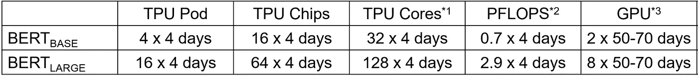
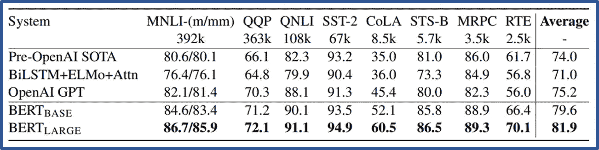

# 3 分钟内介绍 BERT 技术

> 原文：<https://towardsdatascience.com/bert-technology-introduced-in-3-minutes-2c2f9968268c?source=collection_archive---------3----------------------->

oogle BERT 是一种用于自然语言理解的预训练方法，它比以往任何时候都更好地执行各种 NLP 任务。

[**BERT**](https://arxiv.org/abs/1810.04805) 分两步工作，首先，它使用大量未标记数据，以无监督的方式学习一种语言表示，称为**预训练**。然后，预训练模型可以以监督的方式**微调**，使用少量标记的训练数据来执行各种监督任务。预训练机器学习模型已经在包括图像处理和自然语言处理(NLP)在内的各个领域取得了成功。

**BERT** 代表 **B** 方向**E**n 编码器 **R** 代表 **T** 变压器。它基于 transformer 架构(Google 在 [2017](https://arxiv.org/pdf/1706.03762.pdf) 发布)。通用转换器使用编码器和解码器网络，然而，由于 BERT 是预训练模型，它仅使用编码器来学习输入文本的潜在表示。

Photo by [Franki Chamaki](https://unsplash.com/@franki?utm_source=medium&utm_medium=referral) on [Unsplash](https://unsplash.com?utm_source=medium&utm_medium=referral)

## 技术

BERT 将多个变压器[编码器](https://arxiv.org/pdf/1706.03762.pdf)堆叠在一起。transformer 基于著名的多头注意力模块，该模块在视觉和语言任务方面都取得了巨大的成功。有关注意力[的回顾，请参见](http://mlexplained.com/2017/12/29/attention-is-all-you-need-explained/)。

> 伯特的艺术表演基于两点。首先，称为**掩蔽语言模型(MLM)** 和**下一个句子预测(NSP)** 的新颖的预训练任务。第二，大量的数据和计算能力来训练 BERT。

MLM 使得从文本中执行双向学习成为可能，即它允许模型从出现在*之前和之后的单词中学习每个单词的上下文。这在以前是不可能的！之前最先进的方法叫做[生成式预训练](https://s3-us-west-2.amazonaws.com/openai-assets/research-covers/language-unsupervised/language_understanding_paper.pdf)使用的是从左到右训练 [ELMo](https://arxiv.org/abs/1802.05365) 使用的是浅层双向训练。*

MLM 预训练任务将文本转换成记号，并将记号表示用作训练的输入和输出。标记的随机子集(15%)在训练期间被屏蔽，即隐藏，并且目标函数是预测标记的正确身份。这与使用单向预测作为目标或者使用从左到右和从右到左训练来近似双向的传统训练方法形成对比。NSP 任务允许伯特通过预测一对句子中的下一句是否是正确的来学习句子之间的关系。为此，用 50%的随机对补充 50%的正确对，并训练模型。伯特同时训练 MLM 和 NSP 目标。

## 数据和 TPU/GPU 运行时

伯特使用了总共 33 亿个单词进行训练，其中 25 亿个来自维基百科，0.8 亿个来自图书语料库。训练是使用 TPU 完成的，而 GPU 的估计如下所示。

**Training devices and times for BERT; used TPU and estimated for GPU.**

使用 2.5K 至 392K 标记的样品进行微调。重要的是，超过 100K 训练样本的数据集在各种超参数上表现出稳健的性能。每个微调实验在单个云 TPU 上运行 1 小时以内，在 [GPU](https://github.com/google-research/bert) 上运行几个小时。

## 结果

BERT 大大超过了 11 个最先进的 NLP 任务。这些任务分为三个主要类别，文本分类、文本蕴涵和 Q/A。在两个任务 SQUAD 和 SWAG 中，BERT 第一个超越了人类水平的表现！

BERT results from the paper[https://arxiv.org/abs/1810.04805](https://arxiv.org/abs/1810.04805)

## 在你的分析中使用伯特

BERT 可作为开源软件获得:【https://github.com/google-research/bert】T2，并针对 104 种语言进行了预训练，在 TensorFlow 和 Pytorch 中实现。

它可以针对几种类型的任务进行微调，如文本分类、文本相似性、问答、文本标注(如词性)、命名实体识别等。然而，预先训练 BERT 在计算上可能很昂贵，除非你使用 TPU 的或者类似于 Nvidia V100 的 GPU。

BERT 的人还发布了一个单一的多语言模型，该模型基于整个维基百科的 100 种语言。多语种的 BERT 比那些只接受一种语言训练的要低几个百分点。

## 评论

MLM 的 BERT 掩蔽策略使模型偏向实际单词。这种偏差对训练的影响没有显示出来。

## 更新:最近在 BERT-[之上提出了几个新方法，这篇博文讨论了使用哪一个？](https://medium.com/@suleiman.khan/bert-roberta-distilbert-xlnet-which-one-to-use-3d5ab82ba5f8#e18a-828e5fc317c7)

## 参考

[1][https://cloud.google.com/tpu/docs/deciding-pod-versus-tpu](https://cloud.google.com/tpu/docs/deciding-pod-versus-tpu)

[2]假设第二代 TPU，第三代快 8 倍。https://en.wikipedia.org/wiki/Tensor_processing_unit

[3][http://timdettmers . com/2018/10/17/tpus-vs-GPU-for-transformers-Bert/](http://timdettmers.com/2018/10/17/tpus-vs-gpus-for-transformers-bert/)