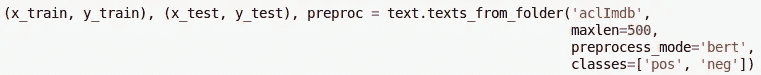
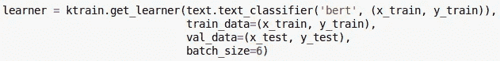
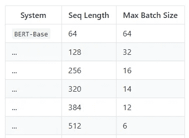
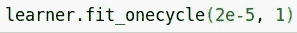
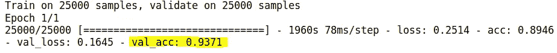

# 使用 Keras 在 3 行代码中实现 BERT 文本分类

> 原文：<https://towardsdatascience.com/bert-text-classification-in-3-lines-of-code-using-keras-264db7e7a358?source=collection_archive---------3----------------------->

**2019–08–17:**文章[中的代码演示已经分享到 Google Colab](https://colab.research.google.com/drive/18SVeIFXWCiA9HL4WVCAFxlfH59ez6atc) 上。


BERT ( [来自变形金刚](https://arxiv.org/abs/1810.04805)的双向编码器表示)是谷歌开发的深度学习模型。它代表了今年机器学习的重大突破之一，因为它在 11 个不同的自然语言处理(NLP)任务中取得了最先进的结果。此外，谷歌开源了代码，并提供了类似于 ImageNet 上预训练的计算机视觉模型的预训练模型供下载。由于这些原因，人们对 BERT 仍有很大的兴趣(尽管其他车型略微超过了它)。

虽然 BERT 打破了许多不同任务的记录，从问答(SQuAD v1.1)到自然语言推理，**文本分类**仍然是最实用和广泛适用的 NLP 任务之一。在本文中，我们将展示如何用少至 **3 行代码**将 BERT 应用于文本分类问题。为了实现这一点，我们将使用 [*ktrain*](https://github.com/amaiya/ktrain/tree/master/ktrain) ，一个类似 **fastai** 的接口到 **Keras。** *ktrain* 是开源的，在这里[可以获得](https://github.com/amaiya/ktrain)。

要安装 *ktrain* ，只需输入以下命令:

```
pip3 install ktrain
```

为了在 *ktrain* 和 Keras 中演示 BERT 文本分类，我们将使用在许多学术论文中使用的 [IMDb 电影评论数据集](https://ai.stanford.edu/~amaas/data/sentiment/)对电影评论进行情感分析。目标是正确地将验证集中的每个电影评论分类为正面或负面。你可以从[这里](https://ai.stanford.edu/~amaas/data/sentiment/)下载数据集，然后解压。首先，让我们导入 *ktrain* 和 *ktrain.text* 模块:

```
import ktrain
from ktrain import text
```

导入了 *ktrain* 之后，我们开始吧。

# 步骤 1:加载数据

我们将首先使用`texts_from_folder`函数从上面提取的文件夹中加载数据。



第一个参数应该是提取 Imdb 数据集的文件夹的路径。`maxlen`参数指定每个电影评论中要考虑的最大字数(较长的评论被截断到这个长度)。BERT 可以处理的最大长度为 512，但是如果可以的话，您会希望使用更少的长度来减少内存并提高速度。必须以特定的方式对文本进行预处理，以便在 BERT 中使用。这通过将`preprocess_mode`设置为‘Bert’来实现。如果需要的话，BERT 模型和词汇表将被自动下载。最后，`texts_from_folder`函数需要以下目录结构，aclImdb 文件夹已经符合该结构:

```
├── folder
    │   ├── train
    │   │   ├── class0       # folder for class 0 documents
    │   │   ├── class1       # folder for class 1 documents
    │   │   ├── class2       # folder for class 2 documents
    │   │   └── classN       # folder for class N documents
    │   └── test 
    │       ├── class0       # folder for class 0 documents
    │       ├── class1       # folder for class 1 documents
    │       ├── class2       # folder for class 2 documents
    │       └── classN       # folder for class N documents
```

# 步骤 2:加载 BERT 并将其包装在一个学习者对象中



`get_learner`的第一个参数使用 *ktrain* `text_classifier`函数来用随机初始化的最终密集层加载预训练的 BERT 模型。第二个和第三个参数分别是定型数据和验证数据。`get_learner`的最后一个参数是批量大小。我们基于谷歌对**12GB**GPU 的以下建议，使用 6 个小批量:



**Seq Length** corresponds to the **maxlen** argument from **STEP 1**.

# 第三步:训练模型

为了训练模型，我们使用了 *ktrain* 的`fit_onecycle`方法，该方法采用了[1 周期学习率策略](https://arxiv.org/pdf/1803.09820.pdf)，该策略在训练的前半段线性增加学习率，然后在后半段降低学习率:



有关调整学习率的更多详情，请参见 *ktrain* 上的[这篇文章](/ktrain-a-lightweight-wrapper-for-keras-to-help-train-neural-networks-82851ba889c)。根据论文中的建议使用最大学习率 **2e-5** (并通过执行 [*ktrain* 学习率查找器](https://github.com/amaiya/ktrain/blob/master/tutorial-02-tuning-learning-rates.ipynb)确认)。

从 **Keras** 输出可以看出，这在单个历元中实现了 **93.71%** 的精度:



由于我们似乎没有过度拟合，如果需要的话，该模型可以针对更多的时期进行训练，以产生甚至更高的精度。例如，在这个数据集上，三个时期的训练可以产生超过 **94%** 的准确度。

# 关于伯特实践的几点思考

***速度:*** 虽然 BERT 的表现令人印象深刻，但在训练和推理(即对新数据的预测)方面都相对较慢。试图通过压缩来提高 BERT 的速度似乎并不成功。出于这些原因，如果训练超过一个历元，您可能希望省略`get_learner`中的`val_data`参数，并且仅在训练结束时进行验证。这可以在 *ktrain* 中用`learner.validate`的方法完成，如[这个 Google Colab 笔记本](https://colab.research.google.com/drive/1ixOZTKLz4aAa-MtC6dy_sAvc9HujQmHN)所示。鉴于 BERT 的缓慢，您还应该考虑更简单和更快的模型作为替代方案，以决定 BERT 提高的准确性是否值得。在某些情况下，你会惊讶地发现事实并非如此。

**更新 2020-01–14:【蒸馏】可用于** [**加速变压器型号**](https://arxiv.org/abs/1910.01108) **。关于在 *ktrain* 中使用 DistilBERT 模型的教程，请参见** [**我们的新媒体帖子**](https://medium.com/@asmaiya/text-classification-with-hugging-face-transformers-in-tensorflow-2-without-tears-ee50e4f3e7ed) **。**

***内存:*** BERT 可能相当占用内存。如果您遇到可能表明您超出 GPU 内存限制的错误(例如`Blas GEMM launch failed`、`CUDA_ERROR_OUT_OF_MEMORY`，您可以尝试减少**步骤 2** 中使用的`batch_size`参数或**步骤 1** 中使用的`maxlen`参数。

***保存 BERT 模型:*** 在数据集上训练 BERT 后，可能需要将其保存到磁盘上，以便以后对新数据进行预测。如您所知，您可以分别使用`model.save`方法和 Keras 内置的`load_model`函数在 Keras 中保存和加载模型。然而，Keras `load_model`函数在这里不会像预期的那样工作，因为 BERT 使用了自定义层。在重新执行上述步骤 1 和 2 后，您可以使用 *ktrain* 中的`learner.load_model`方法加载模型，而不是使用 Keras 的内置`load_model`函数。这将正确工作，因为 *ktrain* 将自定义 BERT 层传递给 Keras 的`load_model`函数。或者，您可以使用对`model.save_weights`和`model.load_weights`的标准调用来保存和加载权重。(在这两种情况下，Keras 模型总是可以作为`learner.model`直接访问。)

**文章源代码:**这篇文章的[源代码](https://github.com/amaiya/ktrain/blob/master/examples/text/IMDb-BERT.ipynb)以下面这个 Jupyter 笔记本的形式提供:[IMDb-伯特. ipynb](https://github.com/amaiya/ktrain/blob/master/examples/text/IMDb-BERT.ipynb) 。笔记本包括估计好的学习率和对新数据进行预测的例子。请随意在您自己的数据集上进行尝试。

**更多信息:**有关 *ktrain、*的更多信息，请参见关于 ktrain 的[教程笔记本和我们之前的 TDS 媒体出版物:](https://github.com/amaiya/ktrain)

> k Train:Keras 的一个轻量级包装器，用于帮助训练神经网络

在 **Google Colab** 上使用 *ktrain* ？另请参见[BERT 在多分类设置中的演示](https://colab.research.google.com/drive/1AH3fkKiEqBpVpO5ua00scp7zcHs5IDLK)。

# 参考

*   *ktrain* 通过 [keras_bert](https://github.com/CyberZHG/keras-bert/tree/master/keras_bert) 包由**赵 HG** 支持 BERT 文本分类。