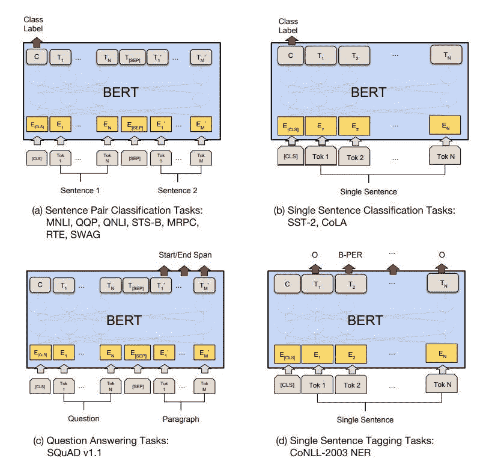

# 伯特来救援了。

> 原文：<https://towardsdatascience.com/bert-to-the-rescue-17671379687f?source=collection_archive---------3----------------------->


在这篇文章中，我想展示如何将 BERT 应用于一个简单的文本分类问题。我假设您或多或少地熟悉 BERT 在高层次上是什么，并通过向您展示如何在您的工作中利用它来更加关注实践方面。粗略来说，BERT 是一个知道表示文本的模型。你给它一些序列作为输入，然后它左看右看几次，产生每个单词的向量表示作为输出。在他们的论文中，作者描述了两种使用 BERT 的方法，一种是“特征提取”机制。也就是说，我们使用 BERT 的最终输出作为另一个模型的输入。通过这种方式，我们使用 BERT 从文本中“提取”特征，然后在一个单独的模型中用于手头的实际任务。另一种方法是“微调”伯特。也就是说，我们在 BERT 上添加额外的层，然后一起训练整个东西。通过这种方式，我们可以训练我们的附加层，还可以改变(微调)层的权重。在这里，我想展示第二种方法，并介绍一个非常简单和流行的文本分类任务的分步解决方案——IMDB 电影评论情感分类。这个任务可能不是最难解决的任务，将 BERT 应用于它可能有点矫枉过正，但是这里显示的大多数步骤对于几乎每个任务都是相同的，不管它有多复杂。

在深入实际代码之前，让我们了解一下 BERT 的一般结构，以及在分类任务中使用它需要做些什么。如前所述，一般来说，BERT 的输入是一个单词序列，输出是一个向量序列。BERT 允许我们根据它的输出执行不同的任务。因此，对于不同的任务类型，我们需要稍微改变输入和/或输出。在下图中，您可以看到 4 种不同的任务类型，对于每种任务类型，我们可以看到模型的输入和输出应该是什么。



您可以看到，对于输入，在每个序列的开头总是有一个特殊的`[CLS]`标记(代表分类),还有一个特殊的`[SEP]`标记将输入分成两部分。

对于输出，如果我们对分类感兴趣，我们需要使用第一个令牌(`[CLS]`令牌)的输出。对于更复杂的输出，我们可以使用所有其他的令牌输出。

我们对“单句分类”感兴趣(右上)，所以我们将添加特殊的`[CLS]`标记，并将其输出作为线性层的输入，然后激活`sigmoid`，执行实际的分类。

现在让我们来理解手头的任务:给定一个电影评论，预测它是正面的还是负面的。我们使用的数据集是 PyTorch-NLP 库中的 50，000 条 IMDB 评论(25，000 条用于训练，25，000 条用于测试)。每个评论都被标记为`pos`或`neg`。在训练集和测试集中，正面评价和负面评价各占 50%。

你可以在这个笔记本里找到所有的代码。

# 1.准备数据

我们使用`pytorch-nlp`库加载数据:

```
train_data, test_data = imdb_dataset(train=True, test=True)
```

这个数据集中的每个实例都是一个字典，包含两个字段:`text`和`sentimet`

```
{
    'sentiment': 'pos',  
    'text': 'Having enjoyed Joyces complex nove...'
}
```

我们为每个集合创建两个变量，一个用于文本，一个用于标签:

```
train_texts, train_labels = list(zip(*map(lambda d: (d['text'], d['sentiment']), train_data)))test_texts, test_labels = list(zip(*map(lambda d: (d['text'], d['sentiment']), test_data)))
```

接下来，我们需要标记我们的文本。伯特是用词块符号化来训练的。这意味着一个单词可以分解成多个子单词。例如，如果我对句子“嗨，我的名字是马頔”进行分词，我会得到:

```
tokenizer.tokenize('Hi my name is Dima')# OUTPUT
['hi', 'my', 'name', 'is', 'dim', '##a']
```

这种标记化在处理词汇之外的单词时是有益的，并且它可以帮助更好地表示复杂的单词。子词是在训练期间构建的，并且依赖于模型被训练的语料库。当然，我们可以使用任何其他的记号化技术，但是如果我们使用训练 BERT 模型的相同记号化器进行记号化，我们会得到最好的结果。PyTorch-Pretrained-BERT 库为我们提供了每个 BERTS 模型的标记器。这里我们使用基本的`bert-base-uncased`型号，还有其他几种型号，包括更大的型号。BERT 的最大序列长度是 512，因此我们将截断任何长于此长度的评论。

下面的代码创建标记器，标记每个评论，添加特殊的`[CLS]`标记，然后只获取训练集和测试集的前 512 个标记:

```
tokenizer = BertTokenizer.from_pretrained('bert-base-uncased', do_lower_case=True)train_tokens = list(map(lambda t: ['[CLS]'] + tokenizer.tokenize(t)[:511], train_texts))test_tokens = list(map(lambda t: ['[CLS]'] + tokenizer.tokenize(t)[:511], test_texts))
```

接下来，我们需要将每个评论中的每个标记转换成标记化器词汇表中的`id`。如果有一个标记不在词汇表中，标记器将使用特殊的`[UNK]`标记并使用它的 id:

```
train_tokens_ids = list(map(tokenizer.convert_tokens_to_ids, train_tokens))test_tokens_ids = list(map(tokenizer.convert_tokens_to_ids, train_tokens_ids))
```

最后，我们需要填充我们的输入，这样它将具有相同的大小 512。这意味着对于任何少于 512 个令牌的评论，我们将添加零以达到 512 个令牌:

```
train_tokens_ids = pad_sequences(train_tokens_ids, maxlen=512, truncating="post", padding="post", dtype="int")test_tokens_ids = pad_sequences(test_tokens_ids, maxlen=512, truncating="post", padding="post", dtype="int")
```

我们的目标变量目前是一个由`neg`和`pos`字符串组成的列表。我们将把它转换成布尔的`numpy`数组:

```
train_y = np.array(train_labels) == 'pos'
test_y = np.array(test_labels) == 'pos'
```

# 2.模型结构

我们将使用 PyTorch 和优秀的[py torch-pre trained-BERT](https://github.com/huggingface/pytorch-pretrained-BERT)库来构建模型。实际上，这个库中已经实现了一个非常相似的模型，我们可以使用这个模型。对于这篇文章，我想自己实现它，这样我们可以更好地了解正在发生的事情。

在我们创建模型之前，让我们看看如何使用在 PyTorch-Pretrained-BERT 库中实现的 BERT 模型:

```
bert = BertModel.from_pretrained('bert-base-uncased')x = torch.tensor(train_tokens_ids[:3])
y, pooled = bert(x, output_all_encoded_layers=False)print('x shape:', x.shape)
print('y shape:', y.shape)
print('pooled shape:', pooled.shape)# OUTPUT
x shape :(3, 512)
y shape: (3, 512, 768)
pooled shape: (3, 768)
```

首先，我们创建 BERT 模型，然后我们创建 PyTorch 张量，其中包含来自我们训练集的前 3 条评论，并将其传递给它。输出是两个变量。让我们来理解所有的形状:`x`的大小是`(3, 512)`，我们只取了 3 个评论，每个评论有 512 个标记。`y`的大小为`(3, 512, 768)`，这是每个令牌的 BERTs 最终层输出。我们可以使用`output_all_encoded_layer=True`来获得所有 12 层的输出。使用大小为 768 的向量来表示每个评论中的每个标记。`pooled`的大小是`(3, 768)`这是我们的`[CLS]`令牌的输出，我们序列中的第一个令牌。

我们的目标是采用 BERTs 池输出，应用线性层和`sigmoid`激活。我们的模型看起来是这样的:

```
class BertBinaryClassifier(nn.Module):
    def __init__(self, dropout=0.1):
        super(BertBinaryClassifier, self).__init__() self.bert = BertModel.from_pretrained('bert-base-uncased')
        self.linear = nn.Linear(768, 1)
        self.sigmoid = nn.Sigmoid()

    def forward(self, tokens):
        _, pooled_output = self.bert(tokens, utput_all=False)
        linear_output = self.linear(dropout_output)
        proba = self.sigmoid(linear_output)
        return proba
```

PyTorch 中的每个模型都是一个`nn.Module`对象。这意味着我们构建的每个模型都必须提供 2 个方法。`__init__` 方法声明了模型将使用的所有不同部分。在我们的例子中，我们创建了将要微调的 BERT 模型、线性层和 Sigmoid 激活。`forward`方法是正向传递期间运行的实际代码(类似于`sklearn`或`keras`中的`predict`方法)。这里我们将`tokens`输入传递给 BERT 模型。BERT 的输出是 2 个变量，正如我们之前看到的，我们只使用第二个变量(使用`_`名称是为了强调没有使用这个变量)。我们将汇集的输出传递给线性层。最后，我们使用 Sigmoid 激活来提供实际概率。

# 3.培训/微调

训练相当标准。首先，我们准备好张量和数据加载器:

```
train_tokens_tensor = torch.tensor(train_tokens_ids)
train_y_tensor = torch.tensor(train_y.reshape(-1, 1)).float()test_tokens_tensor = torch.tensor(test_tokens_ids)
test_y_tensor = torch.tensor(test_y.reshape(-1, 1)).float()train_dataset = TensorDataset(train_tokens_tensor, train_y_tensor)
train_sampler = RandomSampler(train_dataset)
train_dataloader = DataLoader(train_dataset, sampler=train_sampler, batch_size=BATCH_SIZE)test_dataset = TensorDataset(test_tokens_tensor, test_y_tensor)
test_sampler = SequentialSampler(test_dataset)
test_dataloader = DataLoader(test_dataset, sampler=test_sampler, batch_size=BATCH_SIZE)
```

我们将使用`Adam`优化器和二元交叉熵(`BCELoss`)损失，并训练 10 个时期的模型:

```
bert_clf = BertBinaryClassifier()
bert_clf = bert_clf.cuda()
optimizer = Adam(bert_clf.parameters(), lr=3e-6)
bert_clf.train()for epoch_num in range(EPOCHS):
    for step_num, batch_data in enumerate(train_dataloader):
        token_ids, labels = tuple(t.to(device) for t in batch_data)
        probas = bert_clf(token_ids)
        loss_func = nn.BCELoss()
        batch_loss = loss_func(probas, labels)
        bert_clf.zero_grad()
        batch_loss.backward()
        optimizer.step()
```

对于那些不熟悉 PyTorch 的人，让我们一步一步地看代码。

首先，我们创建上面定义的`BertBinaryClassifier`。我们通过应用`bert_clf.cuda()`将其移动到 GPU。我们用我们的模型参数(优化器将会更新)和一个学习率创建了 Adam 优化器，我发现效果很好。

对于每个时期中的每个步骤，我们执行以下操作:

1.  通过应用`.to(device)`将我们的张量移动到 GPU
2.  `bert_clf(token_ids)`给出了概率(向前传递)
3.  用`loss_func(probas, labels)`计算损失
4.  将上一步的梯度归零
5.  通过`batch_loss.backward()`计算并传播新的梯度
6.  通过`optimizer.step()`更新与梯度相关的模型参数

经过 10 个时代，我得到了相当不错的结果。

**结论**

BERT 是一个非常强大的模型，可以应用于许多任务。对我来说，它为我的工作任务提供了一些非常好的结果。我希望这篇文章能帮助你更好地理解与 BERT 一起工作的实际方面。如前所述，您可以在本[笔记本](https://github.com/shudima/notebooks/blob/master/BERT_to_the_rescue.ipynb)中找到代码