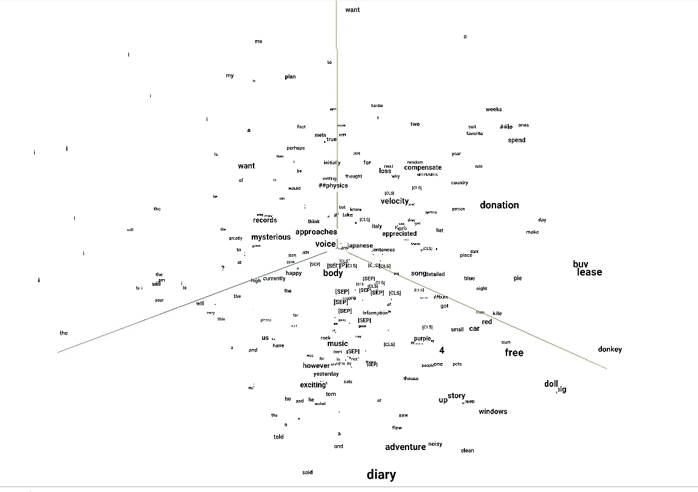
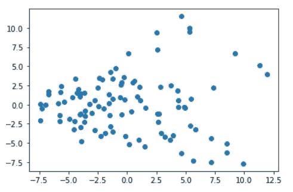
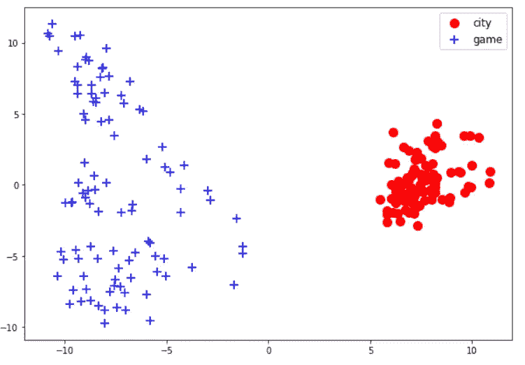
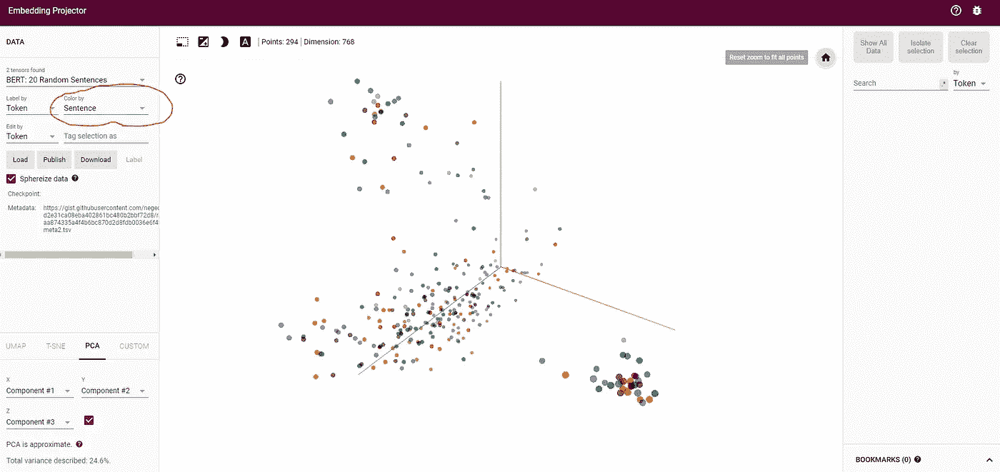
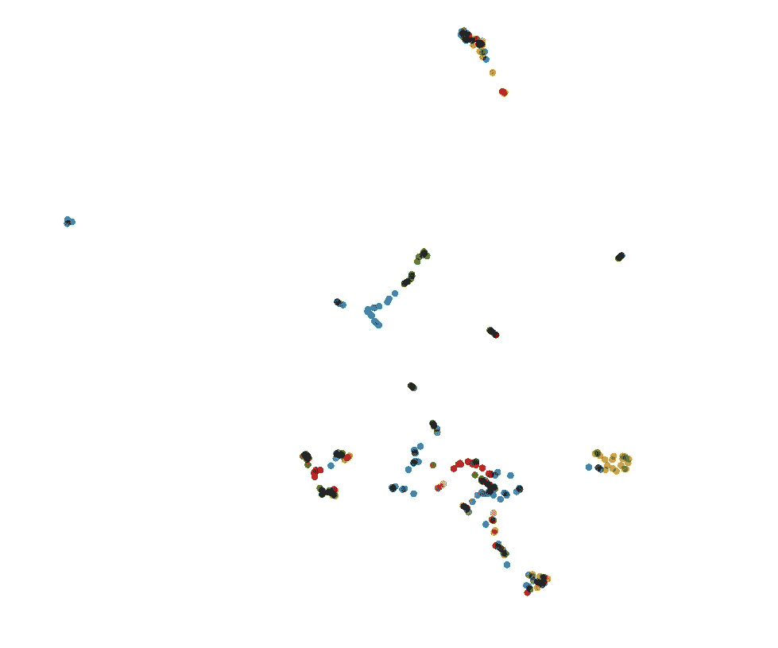
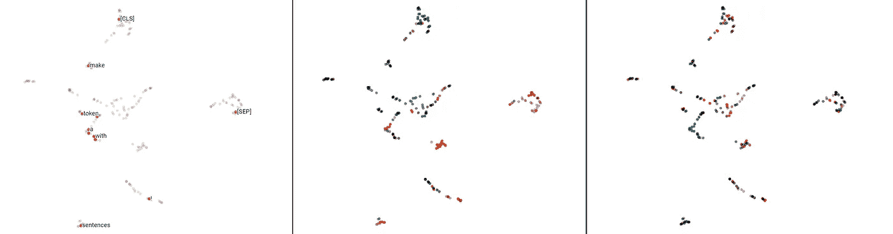

# 嵌入式投影仪中的 BERT 可视化

> 原文：<https://towardsdatascience.com/bert-visualization-in-embedding-projector-dfe4c9e18ca9?source=collection_archive---------14----------------------->

这个故事展示了如何在 Tensorflow 的 Tensorboard 嵌入投影仪中可视化预训练的 BERT 嵌入。该故事使用了大约 50 个独特的句子及其通过 TensorFlow Hub BERT 模型生成的 BERT 嵌入。

BERT visualization in Embedding Projector

# 创造历史

为了生成 BERT 嵌入[1]，我使用了模型为`BERT-base-uncased`的 BERT 的 TF Hub 实现。在我的[以前的故事](/simple-bert-using-tensorflow-2-0-132cb19e9b22)中看到一个简短的介绍，或者[在 Colab 上查看代码！](https://colab.research.google.com/drive/17eQhly4owuBIboFJYTCU9ow3yAqTDSsu)

交互式[嵌入式投影仪可视化](https://projector.tensorflow.org/?config=https://gist.githubusercontent.com/negedng/d2e31ca08eba402861bc480b2bbf72d8/raw/816196469c30a7ecae68d7a011057a97977dc123/config.json)包含两个数据集。第一个有 20 个随机句子，由这个随机句子生成器[生成。第二个包含 23 个自制的句子，只有 36 个独特的标记。该数据集具有一小组标记，因此嵌入投影仪可以通过标记给点着色。](https://randomwordgenerator.com/sentence.php)

# 使用主成分分析的数据可视化

高维数据的可视化并不总是容易的。为了用 2D 或 3D 来表示数据以便我们可以看到，我们必须将数据投影到一个更低的维度，而不会丢失太多的信息。

一种方法是使用 PCA(主成分分析)[2]。PCA 找到正交基，从而将数据投影到这些基上，点之间的总差异是最大的。如果你对 PCA 更感兴趣，我在[之前的一个故事](/identifying-the-right-meaning-of-the-words-using-bert-817eef2ac1f0)中描述过。下图显示了一个单词的 100 个嵌入向量到其前两个主要成分的 2D 投影。

PCA for the embeddings of the word ‘city.’

使用 PCA，我们可以直观地识别嵌入数据集中的聚类。分析单词' *city* 和' *game，'*的嵌入，我们可以看到基于嵌入，有两种不同类型的点。

PCA for the embeddings of the words ‘city’ and ‘game

# 嵌入式投影仪

用 PCA 说明越来越多的数据并不总是最好的选择。谷歌的 TensorBoard 提供了一个[嵌入式投影仪](https://projector.tensorflow.org/)来使用 PCA、UMAP [3]和 t-SNE [4]在 2D 或 3D 中可视化数据。不幸的是，嵌入式投影仪无法处理这么多样本的数据。它也不能显示超过 50 类的颜色。因此，这里使用的数据只包含几个句子。如果你想探索 TensorBoard 的可视化工具，我建议[这个教程](https://neptune.ai/blog/tensorboard-tutorial)。

我建议你激活颜色来获得单词/句子类别的感觉。下图显示了投影的视图。

Embedding Projector. Activate colors using the drop-down in the red circle!

让我们看看交互式投影仪中的 UMAP 投影、t-SNE 投影和主成分分析投影！我建议阅读这篇[介绍来了解 UMAP 和 t-SNE](/how-exactly-umap-works-13e3040e1668) 。或者看参考文献找原论文！

UMAP 和 t-SNE 都有同样的两个抽象步骤:

1.  基于最近邻，保留连接、相似性和数据集的结构。
2.  使用梯度下降优化低维表示。

# UMAP 嵌入群

让我们用 UMAP 来形象化令牌之间的关系！

如果我们对 20 个随机句子数据集使用具有 5 个邻居的 UMAP，我们可以看到 UMAP 投影对句子具有单独的记号组。在下图中，我们可以看到句子的标记彼此接近。一个句子的标记有相同的颜色。

UMAP 2D projection with sentence colorization

如果我们使用第二个数据集，有 36 个标记的 23 个句子，我们也可以看到标记的颜色。让我们再次使用有 5 个邻居的 2D UMAP！在这里，我们可以看到，UMAP 组点标记水平，但句子的标记也有一个主要领域。

2D UMAP visualization: a) tokens of a sentence, b) token colorization, c) sentence colorization

# 摘要

这个故事展示了 20 个双 BERT 嵌入表示数据集的可视化，每个数据集包含大约 20 个不同的句子。这个故事包含了生成数据集的 Colab 代码和一个带有预加载数据的交互式可视化工具。

# 参考

[1] Devlin，j .，Chang，M. W .，Lee，k .，& Toutanova，K. (2018 年)。 [Bert:用于语言理解的深度双向转换器的预训练。](https://arxiv.org/abs/1901.08746) *arXiv 预印本 arXiv:1810.04805* 。

[2]h .霍特林(1933 年)。[将复杂的统计变量分析成主要成分。](https://psycnet.apa.org/record/1934-00645-001) *《教育心理学杂志》*， *24* (6)，417 页。

[3]麦金尼斯、希利和梅尔维尔(2018 年)。 [Umap:一致流形逼近和投影降维。](https://arxiv.org/abs/1802.03426) *arXiv 预印本 arXiv:1802.03426* 。

[4]马滕博士和辛顿博士(2008 年)。[使用 t-SNE 可视化数据。](http://www.jmlr.org/papers/v9/vandermaaten08a.html) *机器学习研究杂志*，*9*(11 月)，2579–2605。