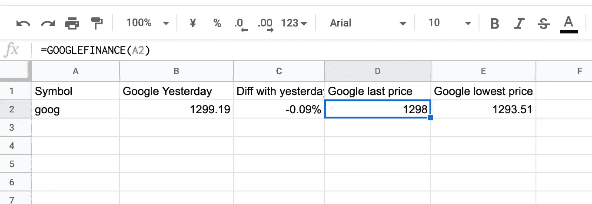
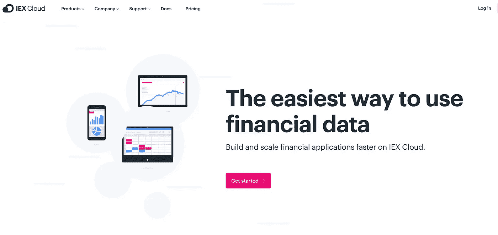
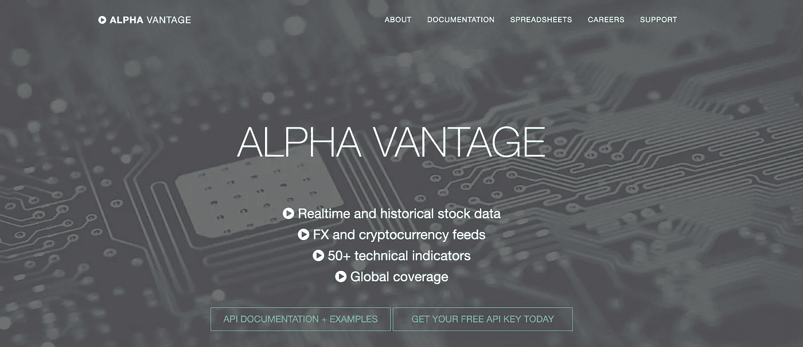
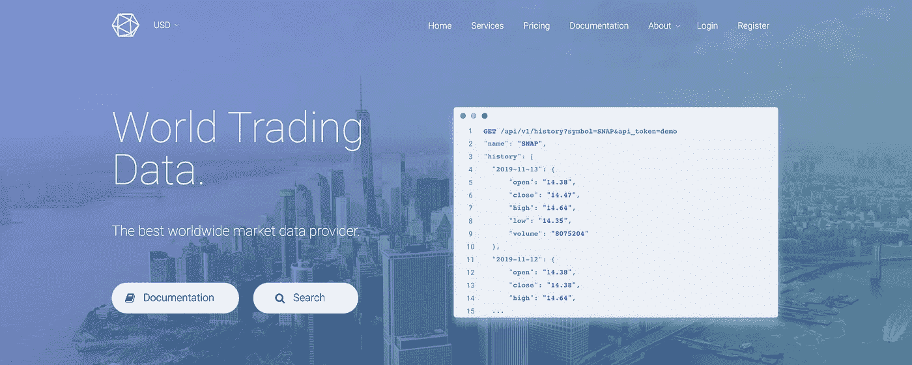
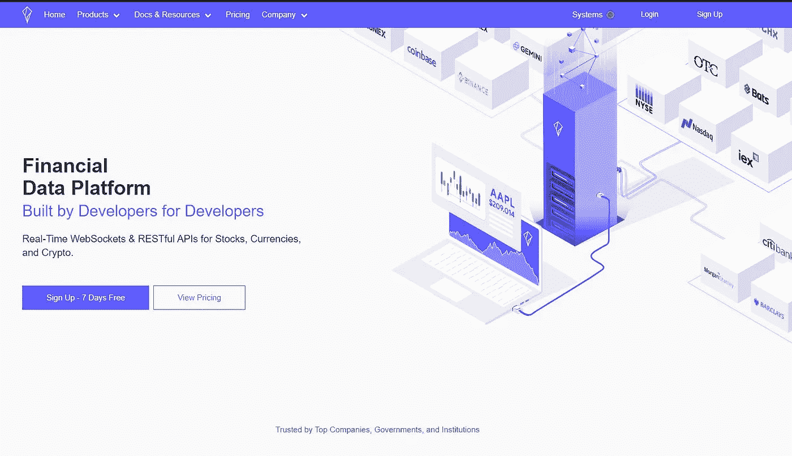
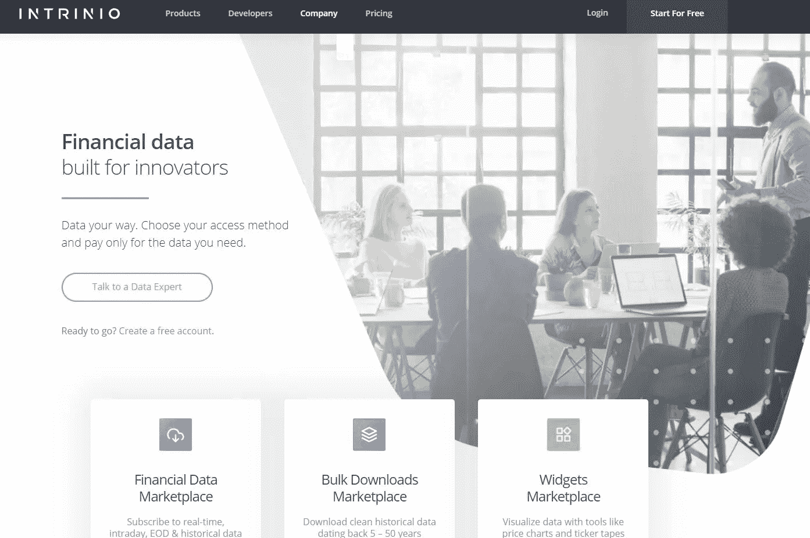
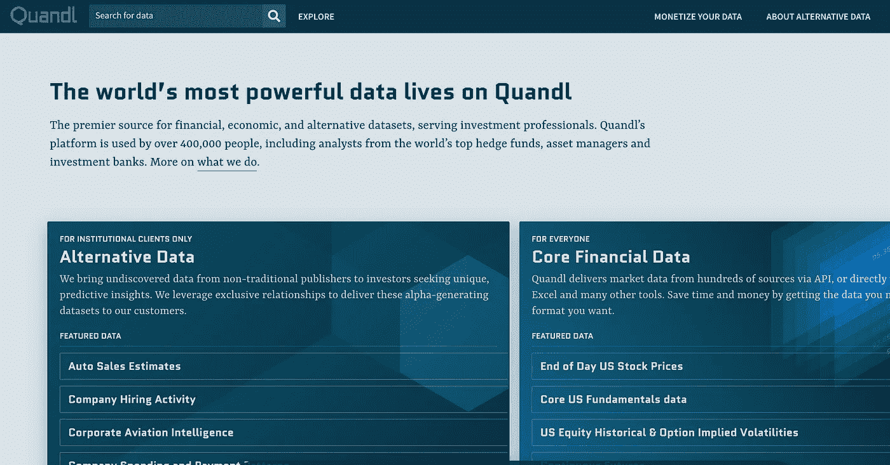

# 2020 年 5 大免费股市 API

> 原文：<https://towardsdatascience.com/best-5-free-stock-market-apis-in-2019-ad91dddec984?source=collection_archive---------0----------------------->


*Photo by* [Chris Li](https://unsplash.com/@chrisli) *on Unsplash*

金融 API 市场增长如此之快，去年的帖子或平台今年都不是一个好的选择。所以在这个故事里，我会给大家展示我在 2019 年用过的最好的 5 个股市 API。

# 什么是股市数据 API？

股票市场数据 API 提供当前在市场上交易的金融资产的实时或历史数据。这些 API 通常提供公共股票、ETF、etn 的价格。

这些数据可用于生成技术指标，这些指标是建立交易策略和监控市场的基础。

# 数据

在这个故事中，我主要关心价格信息。对于其他数据，有一些其他的 API 主要用于用例，这里不做介绍。

我将讨论以下 API 以及它们的使用场合:

*   雅虎财经
*   Google Sheets 中的 Google 金融
*   IEX 云
*   阿尔法优势
*   世界贸易数据
*   其他 API(polygon . io、Intrinio、Quandl)

# 1.雅虎财经

**Docs:**[y finance](https://github.com/ranaroussi/yfinance)

雅虎财经 API 于 2017 年被关闭。所以你可以看到很多关于雅虎财经替代方案的帖子。然而，它回到了 2019 年的某个时候。所以你仍然可以使用雅虎财经获得免费的股市数据。雅虎的 API 是个人和企业级用户使用的股票数据 API 的黄金标准。

雅虎财经提供了超过 5 年的每日 OHLC 价格数据。而且免费又可靠。

有一个新的 python 模块 [**yfinance**](https://github.com/ranaroussi/yfinance) 包装了新的雅虎金融 API，你可以直接使用它。

```
# To install yfinance before you use it.
> pip install yfinance
```

下面是一个如何使用 API 的例子。请点击上面的 Github 链接查看完整的文档，您可以开始了。

# 2.[谷歌金融](https://support.google.com/docs/answer/3093281?hl=en)

谷歌金融在 2012 年被弃用。然而，它并没有关闭所有的功能。Google Sheets 中有一个支持你获取股票营销数据的功能。在 Google Sheets 中它被称为 [GOOGLEFINANCE](https://support.google.com/docs/answer/3093281?hl=en) 。

它的工作方式是键入如下内容，您将获得最后的股票价格。

```
GOOGLEFINANCE("GOOG", "price")
```

语法是:

```
GOOGLEFINANCE(ticker, [attribute], [start_date], [end_date|num_days], [interval])
```

*   **股票代号:**证券要考虑的股票代号。
*   **属性**(可选，默认为`"price"`):从 Google Finance 中获取关于`ticker`的属性。
*   **start_date** (可选):取历史数据时的开始日期。
*   **end_date|num_days** (可选):取历史数据的结束日期，或者从`start_date`开始返回数据的天数。
*   **间隔**(可选):返回数据的频率；不是“每日”就是“每周”。

附上使用示例。



# 3.IEX 云

**网址:**[**https://iexcloud.io/**](https://iexcloud.io/)



IEX 云是今年刚刚发布的新金融服务。它是从 IEX 集团的旗舰证券交易所分离出来的独立业务，是一个连接开发者和金融数据创造者的高性能金融数据平台。

与其他订阅服务相比，它非常便宜。9 美元/月，你几乎可以得到所有你需要的数据。此外，基本免费试用，你已经得到 500，000 核心讯息免费为每个月。

有一个 python 模块来包装他们的 API。你可以很容易的查出来: [**iexfinance**](https://addisonlynch.github.io/iexfinance/stable/)

# 4.阿尔法优势

**网址:**[**https://www.alphavantage.co/**](https://www.alphavantage.co/)



Alpha Vantage Inc .是各种免费 API 的领先提供商。它提供 API 来访问历史和实时股票数据、外汇数据和加密货币数据。

使用 Alphavantage，您可以每分钟执行多达 5 个 API 请求，每天执行 500 个 API 请求。每分钟 30 个 API 请求，每月 29.9 美元。

# 5.世界贸易数据

【https://www.worldtradingdata.com/】网址:[](https://www.worldtradingdata.com/)

****

**此外，还提供了完整的日内数据 API 和货币 API 访问权限。对于那些需要更多数据点的人来说，从每月 8 美元到每月 32 美元的计划都是可用的。**

**目前有四种不同的计划可供选择。对于免费访问，每次请求最多可以获得 5 只股票(实时 API)。每天最多 250 个请求。订阅计划不是很贵，你可以得到一个**

**他们提供 URL，您的响应将是 JSON 格式。目前还没有可用的 python 模块来包装他们的 API。所以你得用 [**请求**](https://requests.readthedocs.io/en/master/) 或者其他 web 模块来包装自己的 API。**

# **6.其他 API**

****网址:**[**https://polygon . io**](https://polygon.io/pricing)**

****

**仅美国股市每月 199 美元。对于初学者来说，这可能不是一个好的选择。**

****网址:**[**【https://intrinio.com】**](https://intrinio.com/)**

****

**只有实时股票市场每月 75 美元。此外，对于 EOD 的价格数据，它是 40 美元/月。你可以从我推荐的其他 API 获得几乎免费的 EOD 价格数据。尽管他们有 206 个价格提要、10 个金融数据提要和大量其他数据要订阅。价格对独立交易者来说并不友好。**

****网址:**[**https://www.quandl.com/**](https://www.quandl.com/)**

****

**Quandl 是一个金融、经济和其他相关 API 的聚合市场。Quandl 将来自第三方市场的 API 聚合为服务，供用户购买他们想要使用的任何 API。**

**所以你需要订阅不同的市场来获得不同的财务数据。而且不同的 API 会有不同的价格体系。有些是免费的，有些是基于订阅或一次性购买的。**

**此外，Quandl 在其网站内有一个分析工具。**

**如果不在乎钱的话，Quandl 是个不错的平台。**

# **包裹**

**学习和建立一个交易系统并不容易。但是财务数据是一切的基础。如果你有任何问题，请在下面提问。**