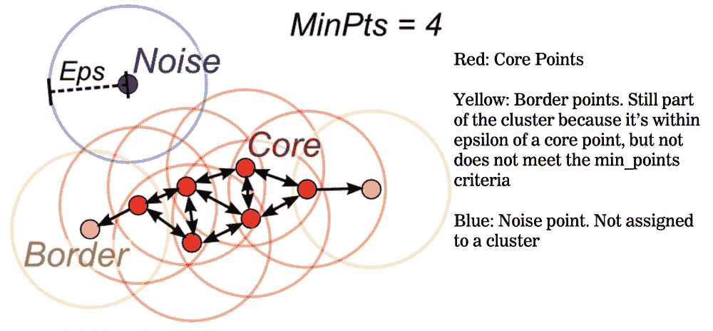
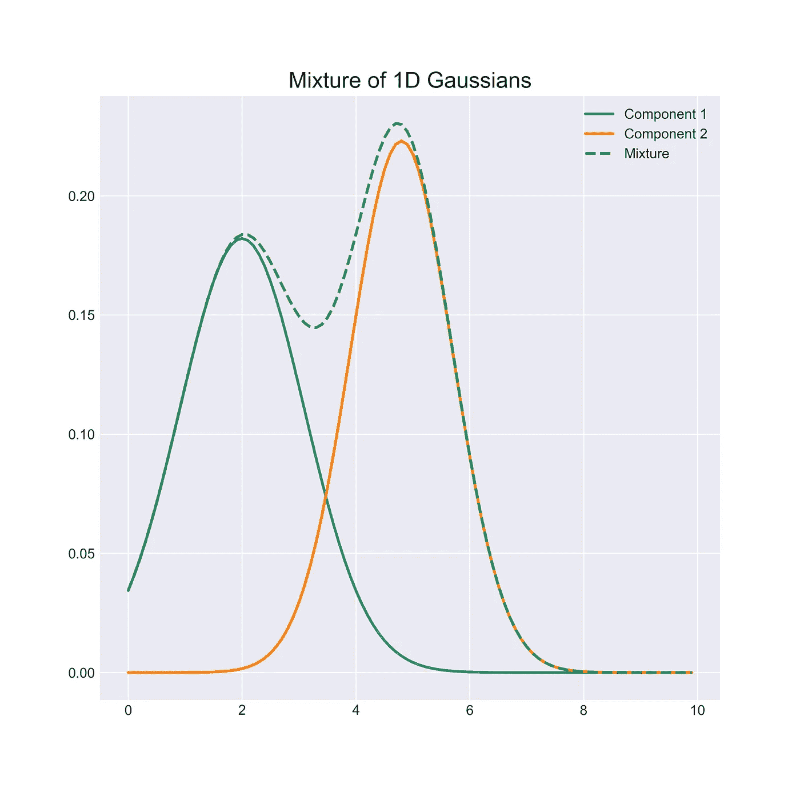

# 用于异常检测的最佳聚类算法

> 原文：<https://towardsdatascience.com/best-clustering-algorithms-for-anomaly-detection-d5b7412537c8?source=collection_archive---------3----------------------->

Photo by [Agence Olloweb](https://unsplash.com/@olloweb?utm_source=unsplash&utm_medium=referral&utm_content=creditCopyText) on [Unsplash](https://unsplash.com/search/photos/magnifying-glass?utm_source=unsplash&utm_medium=referral&utm_content=creditCopyText)

让我首先解释一下任何通用的聚类算法是如何用于异常检测的。

使用聚类进行异常检测背后的主要思想是学习已经可用的数据(训练)中的正常模式，然后在提供新数据(测试)时使用该信息来指出一个点是否异常。

一般步骤(一般预处理后):
1 —根据你的数据选择最佳模型。
2 —将模型拟合到训练数据，该步骤的复杂程度取决于所选的模型，此时应进行一些超参数调整。
3-一旦收到新数据，将其与模型的结果进行比较，并确定它是正常点还是异常点，执行这种分类的方式高度依赖于模型(我将讨论如何为解释的模型执行)，一些基于距离，而另一些使用概率。

4-如果随着时间的推移有任何类型的数据演变，则模型应在一段时间后重新训练，以便学习新的行为(否则这种新的行为可能总是被归类为异常)。

**注意**:当然聚类对于所有与异常检测相关的问题并不理想(就像任何其他方法一样，你知道，没有免费的午餐*)，但是将这种技术与其他类似智能特征提取的技术结合起来可以帮助你解决很多问题；例如，当你有时间序列，问题是一个值增加太快，但仍然在一个正常的范围内，会发生什么？将导数添加到聚类算法中可以帮助您找到异常。*

# *基于密度的噪声应用空间聚类*

*DBSCAN 是一种基于密度的聚类算法(实际上 DBSCAN 代表***D****en sity-****B****ased****S****patial****C****lustering of****A****应用程序实际上，这是我个人喜欢 DBSCAN 的主要原因之一，不仅我可以检测到测试中的异常，而且训练中的异常也会被检测到，不会影响我的结果。**

*在该模型中有两个关键参数:
— *eps:* 两点之间视为邻居的最大距离。如果这个距离太大，我们可能会将所有的点聚集在一个巨大的集群中，然而，如果这个距离太小，我们甚至可能不会形成一个集群。
— *min_points:* 形成一个聚类的最小点数。如果我们为这个参数设置一个较低的值，我们可能会得到很多非常小的聚类，但是，一个较大的值可能会停止创建任何聚类的算法，最终得到一个只有异常的数据集。*

*该算法创建聚类的方式是通过查看每个点有多少个邻居，考虑所有距离小于特定距离的邻居( *eps* )。如果多于*个 min_points* 是邻居，则创建一个聚类，并且该聚类用邻居的所有邻居来扩展。但是，由于一张照片比一千张照片更有价值，我从这个[媒体帖子中借用了这张照片来解释 DBSCAN](https://medium.com/@elutins/dbscan-what-is-it-when-to-use-it-how-to-use-it-8bd506293818) :*

**

*Image obtain from the post “[DBSCAN: What is it? When to use it? How to use it?](https://medium.com/@elutins/dbscan-what-is-it-when-to-use-it-how-to-use-it-8bd506293818)”*

*现在我们有了集群…*

****怎样才能检测出测试数据中的异常？****

*我所遵循的将点分类为异常或不异常的方法如下:
1-计算从新点到所有**核心**点的距离(仅计算核心点，因为它们实际上是定义聚类的点)并寻找最小值(到聚类内最近邻居的距离)。
2 —用 *eps* 比较到集群内最近邻居的距离，因为这是被认为是邻居的两个点之间的界限，这样，我们就可以用我们的测试数据发现是否有任何核心点实际上是邻居。
3-如果距离大于 *eps* 该点被标记为异常，因为它在聚类中没有邻居。*

# *高斯混合模型*

*假设所有数据点都是由有限数量的高斯分布混合生成的概率模型。该算法试图恢复生成该分布的原始高斯分布。为此，它使用期望最大化(EM)算法，该算法初始化一个随机的 *n* 初始高斯分布，然后调整参数，寻找一个组合，使该分布生成的点的可能性最大化。*

**

*Figure obtained from Angus Turner’s blog: “[Gaussian Mixture Models in PyTorch](https://angusturner.github.io/generative_models/2017/11/03/pytorch-gaussian-mixture-model.html)”*

*高斯混合模型的问题之一是需要指定聚类数，另一种可能性是使用变分贝叶斯高斯混合，以避免这个问题。*

*当然，就像 K-Means 一样，由于集群的初始化是随机的，我们可能会得到一个对我们的问题来说不是最优的局部最小值。这个问题可以通过多次执行来解决，然后计算出概率的平均值。然而，如果模型需要投入生产，这种解决方案并不是最佳的，当模型需要部署在流环境中时，我仍然在寻找解决这个问题的最佳方法。*

***变分贝叶斯高斯混合***

*我不想在这里讲太多细节，scikit-learn 页面有完整的解释。但这种变异值得一提。该模型背后的思想类似于高斯混合，然而，实现是不同的，这里，代替 EM，使用变分推理算法。*

*这里，只需要指定最大数量的聚类，然后算法可以找到实际数量的聚类，并将不相关的聚类的权重设置为非常接近零。*

*当然，这种选择也不是完美的，有许多超参数可供选择，实际上比高斯混合模型中的要多。其中最重要的是*权重 _ 浓度 _ 先验*，它将在很大程度上影响你最终得到的有效聚类数。*

****怎样才能检测出测试数据中的异常？****

*一旦算法被训练，我们得到新的数据，我们可以把它传递给模型，它会给我们这个点属于不同聚类的概率。这里，可以设置阈值，即如果概率低于该值，则该点应该被视为异常。在贝叶斯高斯混合的情况下，有一件重要的事情要记住:**不是所有的聚类都应该被考虑**，记住算法忽略了**不重要的聚类**，给它们一个接近于零的**权重**(它们没有被移除，但是你可以知道哪些应该被移除)，我过去所做的是检查点属于**仅**重要聚类的概率，为了做到这一点，我为聚类权重设置了一个阈值，以移除*

# *为什么不是 K-Means？*

*虽然 K-Means 可能是其他应用程序中最著名和最常用的聚类算法，但它不太适合这个应用程序。*

*这样做的主要原因是，它仅适用于预期聚类具有非常规则的形状的情况，一旦不满足这一点，该模型就不能成功地分离聚类。*

*另一个原因是所有点都适合聚类，因此如果训练数据中有异常，这些点将属于聚类，并可能影响它们的质心，特别是聚类的半径。由于阈值距离的增加，这可能导致您无法检测到测试集中的异常。*

*另一种可能性是，你甚至会形成一个异常的集群，因为集群中的点数没有下限。如果你没有标签(你可能没有，否则有比聚类更好的方法)，当新数据进来时，你可能认为它属于一个正常行为的聚类，而实际上它是一个完美定义的异常。*

*这种情况下的另一个缺点是需要事先指定聚类的数量，我们已经讨论过，在其他算法中有一些参数不容易调整，但我发现这一个特别棘手。由于我们的数据会随着时间而变化，所以聚类的数量也会变化，并且一旦我们将我们的模型部署到生产中，如果没有人的探索，就没有简单的方法来决定其他的。*

****怎样才能检测出测试数据中的异常？****

*对于 K-Means 来说，并非一切都是不好的，实际上这是测试阶段最简单的情况，因为我们有聚类的质心，形状预计会非常规则，我们只需要计算每个聚类的边界距离(通常最好不要选择到质心的最大距离，以防我们有异常值，根据您的数据，95%或 99%这样的值应该可以工作)。*

*然后，对于测试数据，计算到质心的距离。然后将该距离与每个聚类的边界进行比较，如果该点不属于任何聚类(距离>边界)，则该点被归类为异常。*

# *综上*

*我在这里介绍了一些聚类算法，并解释了如何使用它们进行异常检测(其中一些比其他方法更成功)，显然这些不是唯一的方法，根据我处理的数据，我可能会偏向其中一些方法。*

*我真的认为 DBSCAN 和(贝叶斯)高斯混合模型是这个应用程序最有用的聚类算法。如果你刚开始接触异常检测，了解更多关于它们的信息是值得的，如果它们现在对你没有用，至少是你学到的新东西。*

*一些有趣的链接:*

* [## DBSCAN:是什么？什么时候用？如何使用。

### DBSCAN(带噪声的基于密度的应用程序空间聚类)是一种流行的无监督学习方法

medium.com](https://medium.com/@elutins/dbscan-what-is-it-when-to-use-it-how-to-use-it-8bd506293818)  [## DBSCAN 如何工作，为什么要使用它？

### 首先，这是我在 medium 上的第一个故事，如果我做错了什么，我很抱歉。其次，我不太擅长…

towardsdatascience.com](/how-dbscan-works-and-why-should-i-use-it-443b4a191c80)  [## 2.1.高斯混合模型-sci kit-学习 0.21.2 文档

### 高斯混合模型是一个概率模型，它假设所有的数据点都是从一个混合的高斯混合模型中产生的

scikit-learn.org](https://scikit-learn.org/stable/modules/mixture.html) 

如果有更多的聚类算法，你发现有用的异常检测，我没有提到他们请让我知道，我很乐意扩大这个列表！

如果你想聊更多，请随时通过 LinkedIn 联系我！*