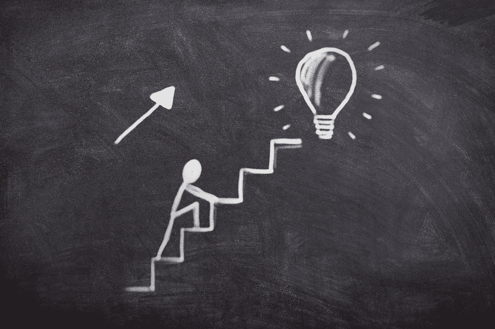
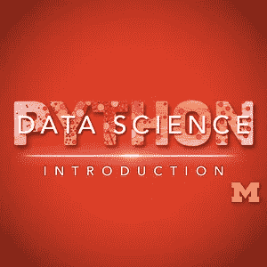
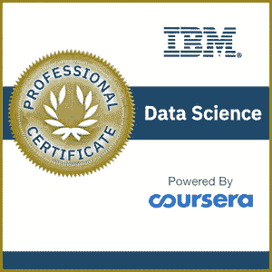
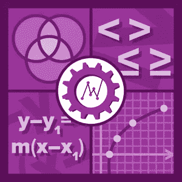
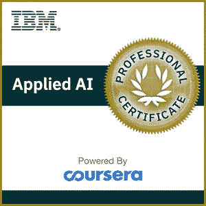
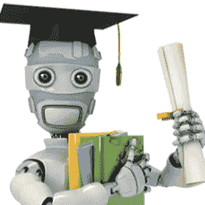

# 2020 年 Coursera 上的最佳数据科学课程

> 原文：<https://towardsdatascience.com/best-data-science-courses-on-coursera-in-2020-f7de4ab414ff?source=collection_archive---------5----------------------->

## 如果你想提升你的数据科学职业生涯，选择什么课程

在线学习成为最受欢迎的学习形式之一。有了像[数据营](https://medium.com/@pchojecki/learn-data-science-on-datacamp-b2dc514793f8)、 [Udemy](https://www.udemy.com/course/data-science-job-how-to-become-a-data-scientist/?referralCode=02884D90ADF9D63EE32E) 和 [Coursera](https://datasciencerush.com/top-10-courses-on-coursera-in-2020/) 这样的好平台，任何水平的人都能找到可以学习的东西。在这篇文章中，我想强调 Coursera 上目前提供的顶级数据科学课程。

Never stop learning! Increase your data science salary thanks to certification and new skills.

# 初级课程

你刚刚开始，你想学习 Python 的基础知识，以及如何编译你的第一个数据科学模型。你以前没有做过太多的数据科学或统计，你听说过一些术语，但这些对你来说只是时髦的词汇。你想从头开始积累你的知识。

密歇根大学的 Python 数据科学导论是目前最受欢迎的两门入门课程之一。它不做任何假设，你会从 Python 开始，然后遍历不同的数据结构(熊猫！)以及如何操纵它们。非常适合初学者。UMich 的另一门热门课程是 [Python 数据结构](https://click.linksynergy.com/link?id=w4iSOj*C2R4&offerid=467035.10188600498&type=2&murl=https%3A%2F%2Fwww.coursera.org%2Flearn%2Fpython-data)，也是推荐给初学者的。

[IBM 数据科学](https://click.linksynergy.com/link?id=w4iSOj*C2R4&offerid=467035.13292653453&type=2&murl=https%3A%2F%2Fwww.coursera.org%2Fspecializations%2Fibm-data-science)是由 9 门课程组成的专业证书。它从解释什么是数据科学，使用什么方法和工具开始，慢慢进入数据处理和数据可视化，最终达到机器学习。无论你是刚刚开始还是已经做了一点数据科学，这都是你简历上的一个很好的证明。

最后但同样重要的是，如果你想进入数据科学，你需要学习一些数学和统计学。不要担心，没有那么多，但你仍然应该对向量，矩阵的运算感到舒服，知道什么是均值，方差，偏差，并能够计算一些概率。这门课解释的就是:杜克大学的[数据科学数学技能](https://click.linksynergy.com/link?id=w4iSOj*C2R4&offerid=467035.9931479116&type=2&murl=https%3A%2F%2Fwww.coursera.org%2Flearn%2Fdatasciencemathskills)。

# 中级课程

你已经有了一些经验，你已经开始对 Python 充满信心，你已经做了一些实验，现在你希望扩展你的知识。在这一点上，机器学习可能是你应该学会的。

[华盛顿大学的机器学习专业](https://click.linksynergy.com/link?id=w4iSOj*C2R4&offerid=467035.1560499085&type=2&murl=https%3A%2F%2Fwww.coursera.org%2Fspecializations%2Fmachine-learning)是开始你的机器学习冒险的完美方式。本课程假设你精通 Python，了解数据结构，并带你了解机器学习的基本概念:分类和聚类算法。1 个专业的 4 门课程。

[IBM 的应用人工智能课程](https://click.linksynergy.com/link?id=w4iSOj*C2R4&offerid=467035.14447790282&type=2&murl=https%3A%2F%2Fwww.coursera.org%2Fspecializations%2Fapplied-artifical-intelligence-ibm-watson-ai)是对深度学习和在云上部署深度学习模型的一个很好的探索。你将了解到像 Keras 和 Tensorflow 这样的深度学习框架(如果你还不知道的话)。这实际上是部署的问题。

# 专家课程

你至少有几年的经验，你是 Python 和使用数据科学提取信息的专家。您希望巩固您的知识，将它们放在一起，并了解数据科学的最新发展。

吴恩达在斯坦福大学开设的机器学习课程现在已经成为经典。Coursera 由吴恩达共同创建，这是该平台上的第一批课程之一。还有更多最新的课程，但这一门仍然很好地向你展示了机器学习背后的理论。强烈推荐！

由吴恩达再次创立的 deeplearning.ai 提供的深度学习专业化是一个获取关于深度学习及其应用的最新知识的地方。无论你想进入卷积神经网络，调整你的超参数或只是玩 LSTMs 本课程有一切。这绝对是我目前为止看到的最好的关于数据科学/机器学习这个层面的在线课程。

暂时就这样吧！

我希望你已经找到了你感兴趣的东西。如果您正在寻找学习数据科学的其他材料，请查看我关于您可能想要阅读的书籍的其他文章:

*   [2020 年你应该读的数据科学书籍](https://datasciencerush.com/)
*   [2020 年你应该读的机器学习书籍](/machine-learning-books-you-should-read-in-2020-344b44d9a11e)

我也评论了一些适合数据科学家使用的笔记本电脑。

Data Science Job

最后，如果你想了解成为一名数据科学家意味着什么，那么看看我的书[数据科学工作:如何成为一名数据科学家](https://amzn.to/3aQVTjs)，它将指导你完成这个过程。

 [## 加入我的时事通讯

### 技术、人工智能和数据科学新闻](https://creative-producer-9423.ck.page/c3b56f080d)