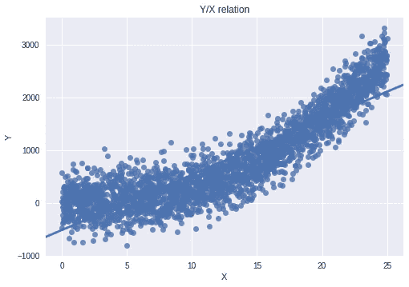
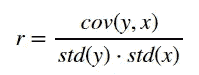
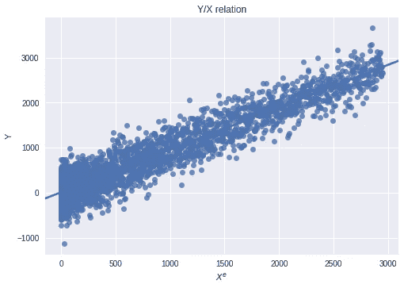
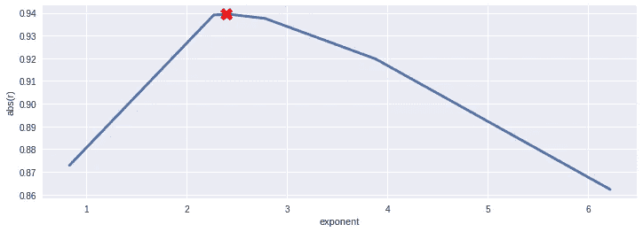
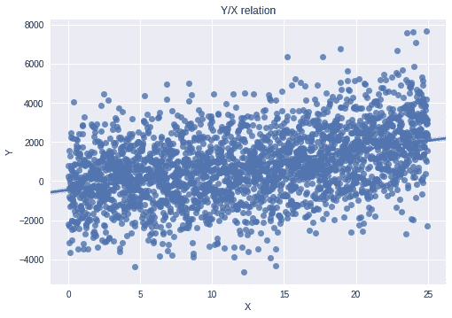

# 用 Scipy 线性化数据的最佳指数变换

> 原文：<https://towardsdatascience.com/best-exponential-transformation-to-linearize-your-data-with-scipy-cca6110313a6?source=collection_archive---------13----------------------->

## 如何用 scipy 优化包找到拟合线性关系的最佳指数？


对于我们希望找到最优解的任何应用来说，迭代搜索都是必要的，但是问题的解不能以显式的形式表达。例如，机器学习中有很多算法使用迭代方法来寻找最佳参数集，如 Lasso 线性回归、梯度推进机器等。
在本文中，我们将尝试在 ETL 过程中使用数值方法，通过最佳指数变换将两个变量之间的非线性关系转换为线性关系。

作为一名数据科学家，我经常要检查不同变量之间的关系，并用它们总结一些关键指标。我最近遇到了一个评估发动机效率的项目，我想表达一种运输寿命期间的燃料消耗/速度比。案例研究变量之间的关系是非线性和单调递增的，所以我开始在谷歌上搜索是否有一种统计测试可以利用我的数据进行转换，使其更加线性，就像正态性的 box-cox 一样。
在这一点上，我想做一个实验:一个迭代过程，通过最小化一个成本函数**线性化**我的数据。
在我平时的工作中，我经常利用`**scipy.optimize**`模块寻找函数极小值，为什么不把它用于其他用途呢？
你可以更好地阅读[官方文档](https://docs.scipy.org/doc/scipy/reference/tutorial/optimize.html)中的`**scipy.optimize**`，其中提供了有用的解释和示例。

## 开始设置

在我的搜索中，我将重点放在了**指数变换**上，因为我们可以轻松地将指数设置为一个参数，并提供一个连续的探索范围。尽管这种选择排除了一些强非线性的界限，但它通常会返回好的结果。

让我们准备测试数据并创建两个相关变量 *x，y* ，其中 *y* 等于 *x* 的幂 *e* ，加上一些高斯噪声。为了方便起见，我也设置了依赖于指数的高斯噪声方差。

```
#test data setting
e = 2.465 #exp
x = np.arange(0,25,0.01)
y = x**e + np.random.normal(0,10**e,x.shape)
```

如果我们用`**seaborn**`回归图绘制数据，我们可以很容易地发现非线性关系。



## **成本函数**

我们现在需要的是一个**成本函数**，一个我们想要最大化的线性关系的“好”的度量。一个很好的指标是**皮尔逊积差相关系数 r** ，它确定了两个变量之间线性相关的强度。
Pearson r 的取值在-1 和 1 之间，其中 1 为完全正线性相关，0 为无线性相关，1 揭示完全负线性相关；意思是 r = -1 和 r = 1 一样好。
因此，为了正确使用 Pearson r，我们将取其绝对**值**并**取反**值，因为`**scipy.optimize**`函数搜索最小值，而我们想要其最大值。

让我们定义成本函数:

```
#define cost function
def cost_function(e):
    #y and x are already defined
    r = np.corrcoef(y,x**e) #returns correlation matrix
    #print each iteration
    print('r value: {:0.4f} exp: {:.4f}'.format(r[0][1],e)) 
    return -abs(r[0][1])
```

## 优化功能

此时，我们必须调用其中一个 Scipy 方法。
合适的选择可能是`**minimize_scalar**`方法，因为我们的成本函数是标量函数。这个包背后的算法是 **Brent 的方法**，一个不需要梯度估计的求根算法。

我发现了一个非常详尽的视频，是奥斯卡·维利兹频道关于布伦特方法及其对德克尔和割线方法的依赖性的视频。检查出来，如果你想知道更多关于这一点，以及其他，优化功能。

让我们导入并调用`**minimize_scalar**`函数:

```
from scipy.optimize import minimize_scalarminimize_scalar(cost_function)
```

我们还可以设置一个**搜索范围**，避免指数的 0 值，这意味着 Pearson r 返回一个无效值，即使`**numpy.corrcoeff**` 可以处理它。

事实上，该系数定义为:



如果 x 被提升到 0，则标准偏差为 0，比率返回无效值。为了执行**有界**搜索，让我们调用:

```
minimize_scalar(cost_function,bounds=(0.1, 10), method='bounded')
```

结果列表如下:

```
r value: 0.9242 exp: 3.8815
r value: 0.8681 exp: 6.2185
r value: 0.9416 exp: 2.4371
r value: 0.9100 exp: 1.2663
r value: 0.9407 exp: 2.7565
r value: 0.9416 exp: 2.4255
r value: 0.9416 exp: 2.4861
r value: 0.9416 exp: 2.4815
r value: 0.9416 exp: 2.4819
r value: 0.9416 exp: 2.4819
r value: 0.9416 exp: 2.4819
r value: 0.9416 exp: 2.4819fun: -0.9416331392353501
 message: 'Solution found.'
    nfev: 12
  status: 0
 success: True
       x: 2.4818969221255713
```

在**仅仅 12 次迭代**中，得到的指数是 2.482，非常接近我们用来生成数据的指数 2.465。

声音`**fun**`显示皮尔逊 r 的负绝对值的值，好像挺高的。让我们应用在 *x、*上找到的指数再次绘制 *y* 和 *x* 我们将注意到一个**强线性关系**:



如果我们存储每个迭代指数和相关的皮尔逊系数，我们可以绘制 r-指数曲线。



## 其他测试

如果我们增加测试数据中噪音的影响会怎样？让我们在噪声发生器中增加高斯方差:

```
y = (x**e) + np.random.normal(0,20**e,x.shape)
```



优化函数的执行返回以下结果:

```
fun: -0.42597730774659237
 message: 'Solution found.'
    nfev: 13
  status: 0
 success: True
       x: 2.2958258442618553
```

找到的最佳指数不如以前的结果精确，但它仍然是一个很好的近似值。

噪声影响越大，由于噪声对岩心数据的影响越大，会导致错误的结果。

## 结论

优化方法是许多待开发应用的**金矿**。通过这篇文章，我不想教一种新技术，但我想促进这些有效方法在“不寻常”问题上的实验。