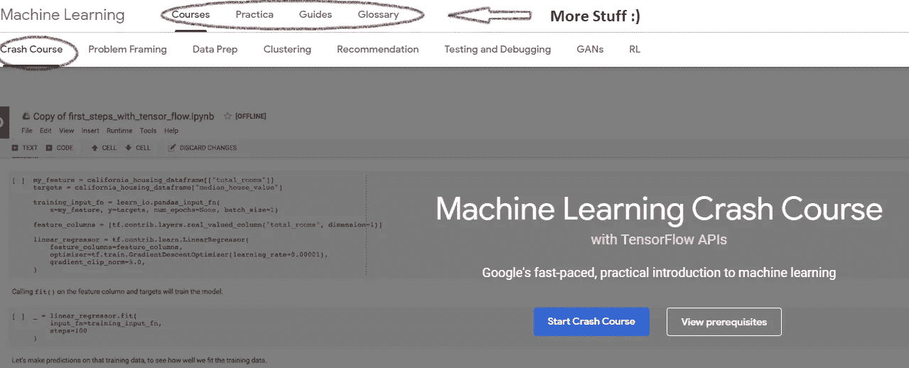

# 学习数据科学的最佳免费在线资源

> 原文：<https://towardsdatascience.com/best-free-online-resources-for-learning-data-science-6dadb555b0c9?source=collection_archive---------19----------------------->

## 面向初学者和专业人士的数据科学学习资源综述

在完成生物信息学硕士学位后，我用 ML 研究了肠道中的微生物群落，我知道我的目标是在行业中找到一份数据科学家的工作，但也觉得我必须学习一段时间来准备面试，原因有两个:

1)在攻读理学硕士期间，我主要使用 Matlab 和一点 R，所以我不得不转向 Python 及其基本库。

2)例如，我对标准 ML 管道的一些主题和阶段不够熟悉——非常方便的是，我总是在一个非常有组织的表中接收我的数据，这些表具有已经设计和标准化的特征。然而，在现实世界中，大量的工作是找出如何通过特征工程将原始数据转换成表格数据。

在准备面试的过程中，我在网上找到了许多好的免费资源，其中大多数都提供入门级课程以及高级材料，对于已经在该领域工作的人来说，这些材料对进一步学习非常有用。在这篇博文中，我将与你分享我找到的最好的学习资源，所以不再多说——让我们开始吧。

1.**谷歌的机器学习速成班** —这门课程彻底有效地将任何人——无论是初级 DS 还是完全的新手——带入机器和深度学习的世界，同时涵盖梯度下降和损失函数等重要概念，并介绍从线性回归到神经网络的主要算法。课程材料包括阅读材料、练习和笔记本，其中包含用 Tensorflow 实现并在 google Colab 上运行的真实代码，这意味着您无需安装即可运行它。

除了速成班之外，这个网站上还有大量关于数据科学和人工智能的材料，分为以下几类:

-课程-在这里，您可以找到对特定主题的深入探究，如聚类、推荐系统等。

- Practica —“谷歌如何在产品中使用机器学习”的例子。

-指南—逐步指导常见 ML 问题的解决方案。

-词汇表-我最喜欢的资源，我认为每个数据科学家都应该在自己的桌面上放上这个。

链接:【https://developers.google.com/machine-learning/crash-course 

**2。** **IBM 用 Python 实现的机器学习**

本课程首先介绍两种主要类型的学习算法——有监督的和无监督的——之间的区别，然后对机器学习中的所有基本算法进行了很好的回顾，包括关于推荐系统的一章(我认为很有趣)。每章都以学习者可以在浏览器上运行的代码结尾，此外，一旦你完成了所有要求，你将收到一个徽章，以后可以在 LinkedIn、Twitter 等网站上分享。

链接到课程-

[https://cognitive class . ai/courses/machine-learning-with-python](https://cognitiveclass.ai/courses/machine-learning-with-python)

这里也有许多其他课程，涉及与数据科学家相关的许多主题，但也涉及与该领域没有直接联系但仍然有趣的其他主题，如区块链、反应式架构、比特币等。

链接到其他材料–

https://cognitiveclass.ai/courses

**3。** **AWS 的《数据科学的要素》**

去年，亚马逊向其开发人员开放了在公司内运行的公共课程，结果是从 ML 基础知识到介绍其服务(例如 Neptune、ElastiCache)到使用 AWS 工具的特定应用程序(例如——使用 GluonCV 的计算机视觉、使用 QuickSight 的可视化)的各种主题的大量知识。

当我为 DS 面试做准备时，我发现他们的数据科学课程的*元素非常有用，主要有两个原因，首先，它涵盖了从数据准备到模型培训和评估的标准 ML 管道的实践阶段，这很有帮助。 第二，每个主题都用实际的代码示例进行了介绍和解释，这些示例让我们对该领域的实际情况有了很好的了解，同时也展示了我不熟悉的 Pandas 和 Scikit Learn 的强大功能(您知道 SKlearn 包中有内置的数据集，您可以加载并用于您的个人实践吗？ 我确实感谢这门课)。在这里，当你完成所有的要求时，你也会得到一个证书。*

课程链接:

[https://www.aws.training/Details/eLearning?id=26598](https://www.aws.training/Details/eLearning?id=26598)

链接到所有材料:

[https://www.aws.training/LearningLibrary?filters = language % 3a 1&search =&tab = digital _ courses](https://www.aws.training/LearningLibrary?filters=language%3A1&search=&tab=digital_courses)

**4。** **快。艾**

我必须承认，我从未完成这门课程，但我喜欢我做的部分，而且它非常受欢迎，所以我觉得有义务把它列入这个列表。在这里，您可以找到附有代码示例的长录音讲座(每次约 1.5 小时)。与列表中的其他课程相比，它们也有不同的课程，涵盖更高级的主题，包括计算机视觉和自然语言处理。我要说的是，当我第一次想开始这门课程时，我被它第一部分提到的技术要求吓住了，但后来我了解到所有笔记本都可以在 Google Colab 上运行，这意味着不需要安装和免费的 GPU。

课程链接–

[https://www.fast.ai/](https://www.fast.ai/)

**5。** **摇摇晃晃学**

Kaggle 是众所周知的获得数据科学实践经验的最佳场所，这要归功于它的大量有组织的数据集和许多竞赛，但它还有另一个很棒的部分，那就是他们的“学习”部分。你在这里会发现的并不完全是课程，而是如 Kaggle 自己所称的，带有许多互动练习的微型课程，旨在通过特定的库教授和提升从 Python for DS 到深度学习、SQL 和高级机器学习的所需技能。这可能是用最少的投入和时间扩展你的知识的最好方法。

[https://www.kaggle.com/learn/overview](https://www.kaggle.com/learn/overview)

# 底线—数据科学是一个巨大的领域，有很多东西需要学习和了解，我敢说这里最重要的技能之一是保持更新和不断学习新技能和熟悉新技术的能力。我希望这些资源能对你的工作有所帮助，也希望在评论中听到其他有用的资源。