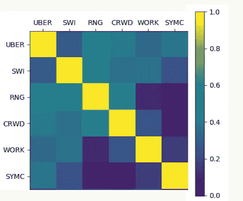
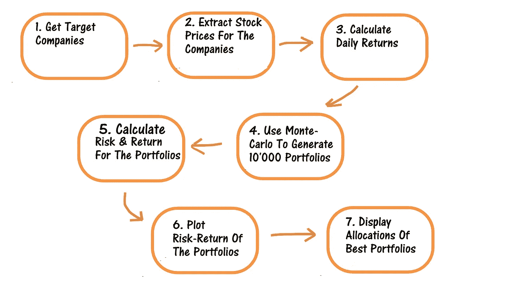

# 用 Python 进行蒙特卡罗模拟的最佳投资组合

> 原文：<https://towardsdatascience.com/best-investment-portfolio-via-monte-carlo-simulation-in-python-53286f3fe93?source=collection_archive---------1----------------------->

## 从头到尾使用 Python 中的蒙特卡罗模拟寻找最佳投资组合

本文着重于通过蒙特卡罗模拟生成最优投资组合。我已经用 Python 实现了一个端到端的应用程序，本文记录了该解决方案，以便更多的读者能够从中受益。

文章将以通俗易懂的方式讲解投资管理所需的金融、数学和编程知识。

因此，这篇文章对数据科学家、程序员、数学家和那些对金融感兴趣的人很有用。

*请阅读 fintech explained*[*isclaimer*](https://medium.com/p/87dba77241c7?source=your_stories_page---------------------------)*。这个应用程序是基于我的意见，他们可能是错误的。在投资之前，一定要向专业理财顾问寻求建议。*


# 1.我们想达到什么目的？

假设我想投资 1000 美元一年。我所在的当地商业街银行提供的一年定期存款利率很低。因此，我对它提供的年回报率并不满意。因此，我决定投资股票，用我的 1000 美元购买不同公司的股票。尽管它们相对来说风险更大，但它们可能会帮助我在承担风险后获得更多回报。**到目前为止，一切顺利。**

我想以这样一种方式投资，即我可以通过承担最少的风险来获得最高的回报。对我来说，这是最佳投资组合，我将在本文中演示的应用程序将解释我们如何实现它。

[代码上传到 Github 上，这里提供了链接](https://github.com/fintechexplained/PortfolioOptimisation)

# 2.高层次的概念

我已经选择了 7 家有潜力的公司，我想通过购买它们的股票找到投资的最佳方式。

简而言之，我将执行以下步骤:

*   我有兴趣将我的 1000 美元投资于以下 7 家公司的股票(资产):ZM、优步、SWI、RNG、CRWD、工作、SYMC。

*注意:在我以后的文章中，我将用 Python 实现一个解决方案，它将决定我们应该投资的合适公司。它将使用传统的分析概念以及先进的机器学习概念。*

*   现在我们来问这个问题。我应该从我的 1000 美元投资资金中拿出多少来购买这些股票？传统上，新的投资者会平等地投资于他们的目标公司，但是资产可以互相转移，一些资产可能互相负相关。

> 因此，我们需要找到最佳的投资组合。最佳投资组合是以最低风险产生最高回报的投资组合。

*   生成每一个可能的投资组合可能是压倒性的。因此，我将使用蒙特卡罗方法在 Python 中生成 10，000 多个不同的投资组合。

> 该方法围绕这样一个概念，即随着投资组合数量的增加，我们将更接近实际的最优投资组合。

*   对于每个投资组合，我将生成其回报和风险。因此，我需要获取投资组合中每项资产的股票价格。
*   最后，我将得出回报率/风险比，并从 10，000+个投资组合中选择回报率/风险比最高的投资组合。

这将是我们选择的最佳投资组合。


Photo by [Ben White](https://unsplash.com/@benwhitephotography?utm_source=medium&utm_medium=referral) on [Unsplash](https://unsplash.com?utm_source=medium&utm_medium=referral)

*注意:由于我对这个应用程序有很大的未来计划，我将以组件化的方式来架构和设计这个应用程序，以便这个应用程序在未来可以很容易地增强。我还将在本文中解释应用程序的架构和设计。*

# 3.让我们开始吧:戴上我的金融帽子

*   存在一种无风险利率，即投资者在不承担任何风险的情况下从其投资中获得的利率，例如购买政府国库券。
*   风险和回报之间有一个权衡。如果投资者期望投资于比无风险利率风险更高的投资选择，那么他/她期望获得更多回报。这是为了补偿投资者承担的风险。**到目前为止，这一切都说得通！**
*   投资者可以通过购买不同公司的股票开始他/她的投资之旅。让我从现在开始把这些交易称为 ***资产*** 。我们可以获得资产的历史股票价格，并计算它们的风险和回报。当我们开始在我们的投资组合中增加资产时，我们开始意识到这些资产中有一些是相互关联的。因此，资产可以彼此有关系，因此它们可以彼此一起移动。
*   一个 ***投资组合*** 将资产组合在一起。我们知道，当资产组合在一起时，它们的净风险不仅仅是它们各自风险的简单总和。这里的诀窍是将投资组合视为一种资产，并计算其集体风险和回报。

阅读这篇解释投资管理如何运作的文章

[](https://medium.com/fintechexplained/investment-management-and-factors-ee9eb5aa0a24) [## 投资管理和因素

### 了解如何明智地投资

medium.com](https://medium.com/fintechexplained/investment-management-and-factors-ee9eb5aa0a24) 

# 4.流程的 7 个步骤

概括地说，我们需要执行以下七个**步骤，如下图所示:**


这是我们的商业案例。我们需要实现的应用程序将以一种我们可以在未来轻松扩展和增强每个步骤的方式来执行这些步骤。我会在这篇文章中详细解释。

# 5.让我们专注于上述流程的第 5 步——风险和回报的衡量标准

对于每项资产，我们将生成以下衡量标准:

## 5.1.资产回报

第一步是计算你投资组合中资产的回报。

为了计算资产回报，我们需要执行以下两个步骤:

1.  我们需要获取资产的历史每日价格

2.然后，我们需要通过计算以下等式来计算它们的几何收益:


产生回报是为了让我们能够标准化股票价格，以便进行比较。

## 5.2.资产预期平均收益

上面计算的资产回报都是二维的，因为有一个时间轴。我们现在需要计算一个数字来表示资产的收益。最常见的方法之一是计算回报的平均值，即预期回报。

为了计算资产预期平均收益，我们需要每只股票收益的**均值**:


## 5.3.从资产到投资组合预期收益

现在准备计算投资组合的预期收益。投资组合将资产组合在一起。投资组合中的资产已被分配了总投资额的一部分。例如，投资组合可能持有 40%的资产 ABC 和 60%的资产 DEF。

从资产的预期收益，我们可以计算出投资组合的预期收益。它通过计算加权平均值来计算:


## 5.4.投资组合风险

资产的风险可以用许多风险度量来计算。其中一个指标是标准差，它可以告诉我们资产的价格是如何偏离其均值的。例如，一些资产可能彼此负相关，这意味着随着第一个资产的价值下降，负相关资产的价值增加。这向我们表明，投资组合的风险不是单个资产风险的简单总和。

投资组合的波动性就是投资组合的风险。波动率的计算方法是使用以下公式计算每只股票收益的标准差以及每对股票之间的协方差:


在这种情况下，波动率是标准差，即投资组合的总风险。

> 标准差衡量平均值周围的值的离差。

## 5.5 使用夏普比率寻找最佳投资组合

我们本可以把钱投资到一个储蓄账户(无风险)，在不承担任何风险的情况下获得回报。我们如何决定我们获得的回报是否值得我们承担的风险？因此，我们可以计算夏普比率。

最后一步是计算每个投资组合的夏普比率。夏普比率是相对于无风险利率的超额回报率，作为风险的相关衡量标准:


如果您想了解更多有关投资绩效衡量的信息，请阅读本文:

[](https://medium.com/fintechexplained/how-do-we-measure-investment-performance-7970042c6ae8) [## 我们如何衡量投资业绩？

### 解释我们如何评估和计算投资业绩

medium.com](https://medium.com/fintechexplained/how-do-we-measure-investment-performance-7970042c6ae8) 

# 6.端到端运行 7 个步骤

为了简单起见，在我记录技术细节之前，我想一步一步地展示最终结果。我将采用自下而上的方法，因为这有助于我们更好地理解概念。

在这一节中，我将使用应用程序为每个步骤生成的可视图表来演示这个概念，以便我们可以更好地理解这个概念。

*注意:我将在下面解释的所有数据都由代码自动保存在 Excel 电子表格中。*

## **6.1 最终结果:**展示最优组合

到目前为止，我们已经了解到，该应用程序将获取我们选择的 7 家公司的历史股票价格。然后，它将通过计算每个投资组合的回报、风险和夏普比率，生成 10，000+个投资组合。

在这些投资组合中，它将指明以下三个投资组合:

1.  **具有最大夏普比率的投资组合。**这是我们的最佳投资组合
2.  **风险最小的投资组合。这是为那些有风险意识但不想承担高风险的投资者准备的投资组合。**
3.  **对每项资产的投资平均分配的投资组合。如果我不使用这个应用程序，我会盲目地在资产中平均分配我的投资。因此，这个投资组合将表明，同等投资是否比我所有的其他选择表现更好。**

因此，总共将有 10，001 个投资组合:

1.  资产平均分配的投资组合
2.  10，000 个随机生成的投资组合

我执行应用程序后，显示了 10'001 个投资组合及其风险回报权衡:


**我们来回顾一下图表:**

> 每个圈都是一个独特的投资组合。x 轴是风险，y 轴是投资组合的回报。投资组合的颜色是夏普比率。

我们可以看到，这种关系并不是完全线性的。当投资者将资产组合在一个投资组合中时，资产的同步运动可以帮助我们分散风险，这就是所谓的风险回报权衡。图表上有三颗钻石:

1.  **绿钻组合:**这是我们选择的最优组合。对于每个投资组合，我们生成夏普比率。这是夏普比率最大的投资组合。它以最低的风险给了我们最高的回报。这个投资组合被命名为投资组合 2187。
2.  **黑钻石投资组合:**这是我们平均分配的投资组合。我们可以看到平均分配的投资组合处于中间位置。它不如标有绿钻的投资组合 2187。我们还可以看到，如果我们平等地投资，对于同样的风险，有许多投资组合会产生更高的回报。因此，这意味着应用程序为我们生成了优秀的投资组合。事实上，所有位于 y 轴黑钻石上方、x 轴价值相同的投资组合都是比平均分配投资组合更好的投资组合，因为对于相同的风险，它们会产生更高的回报。
3.  **红钻组合**:这是产生最低风险的组合。

**这些是投资组合 2187 的细节。**

需要注意的两个要点是:


1.  它建议我们不要在工作上投资。
2.  这也突显出，我们应该将大部分资金投资于 RNG 和 CRWD。

通过承担 41%的风险，投资组合的投资组合回报率为 130%。它的夏普比率大约是 316% (=130/41)。

## 6.2 第一步是获取股票价格

我们构建了一个获取过去 3 年历史股票价格的组件:


股票价格是时间序列数据。

这是代码存储在 excel 电子表格的 StockPrices 表中的数据快照，如下所示。


正如你所看到的，我们不能简单地比较 ZM 和 SYMC，因为它们的股票价格是不同的。因此，我们需要计算回报率来标准化股票价格。

## 6.3 然后我们需要产生回报

我们计算了每日几何收益:


返回的是时间序列数据。这是存储在 excel 电子表格的返回表中的数据的快照，如下所示。


注意:历史回报是正确的选择吗？我们是否应该制定不同的衡量标准？我将在未来实现一个优秀的应用程序，演示我们如何实现时间加权回报。

## 6.4 根据回报，我们需要生成协方差矩阵

然后，代码准备协方差矩阵:



协方差矩阵存储在 Excel 电子表格的协方差表中，如下所示:


## 6.5 下一步是生成 10001 个投资组合

代码生成 10'001 个投资组合，其中一个投资组合是我们在 7 项资产上平均分配投资的投资组合。对所有 10，000 个投资组合施加了一个约束，即它们的分配总和必须是 100%。这意味着我们只打算购买资产。

代码将投资组合绘制在风险回报图上，其中 y 轴是投资组合的回报，x 轴是投资组合的风险。

我们可以看到这三个投资组合都有标记。绿钻是我们的最佳投资组合。


投资组合存储在 Excel 电子表格的 MonteCarloPortfolios 表中，如下所示:


然后，我们可以找到投资组合 2187 的配置(我们的最佳投资组合如图所示)，然后对该投资组合进行投资。

所有生成的投资组合的风险、回报和夏普比率存储在 MonteCarloPortfolioRatios 表中，如下所示:


# 7.让我们来设计应用程序:戴上我的技术帽子

最后，我将记录我实现的代码。

我将从解释如何架构和设计应用程序开始这一部分。我将详细解释每个组件和代码。

该应用程序的设计核心仅围绕一个概念:


> 当应用程序运行时，它将产生大量的数据，如股票价格、回报、协方差矩阵、投资组合及其分配以及风险、回报和夏普比率。Python 代码还会将所有这些数据保存在 Excel 电子表格中。

# 7.1 应用程序结构

请点击[这里](https://github.com/fintechexplained/PortfolioOptimisation)访问 GitHub 上的全部代码

以下文件夹结构是在 C: drive 中创建的。


以下 Python 文件放在`code`文件夹中


*我们将在以后的文章中处理文档和测试文件夹。*

# 7.2 让我们了解每个 Python 文件

## **Python 包**

certify = = 2020 . 4 . 5 . 1
chardet = = 3 . 0 . 4
cycler = = 0 . 10 . 0
idna = = 2.9
kiwi solver = = 1 . 2 . 0
lxml = = 4 . 5 . 0
matplotlib = = 3 . 2 . 1
numpy = = 1 . 18 . 2
pandas = = 0 . 22 . 0
pandas-pandas

## 1.配置设置

目标是实现一个可配置的应用程序。未来的计划是实施更好的风险和回报指标。此外，我们希望代码自动获取正确的公司。

因此，我在代码中实现了一个存储可配置设置的区域:

**文件名:settings.py**

```
import numpy as np
import datetime as dt
from calculator import risk_return_calculatorclass settings:PriceEvent = 'Adj Close'
    ReturnType = 'Geometric'
    NumberOfPortfolios = 10000
    YearsToGoBack = 3
    RiskFreeRate = 0
    CompanyFetchMode = "PreFixed" #Auto
    MyCompanies = ['ZM','UBER','SWI','RNG','CRWD', 'WORK', 'SYMC']
    PortfolioOptimisationPath = 'C:\Temp\PortfolioOptimisation.xlsx'
    RiskFunction = risk_return_calculator.calculate_portfolio_risk
    ReturnFunction = risk_return_calculator.calculate_portfolio_expectedreturns
    AssetsExpectedReturnsFunction = risk_return_calculator.calculate_assets_expectedreturns
    AssetsCovarianceFunction = risk_return_calculator.calculate_assets_covariance
    DailyAssetsReturnsFunction = risk_return_calculator.calculate_daily_asset_returns[@staticmethod](http://twitter.com/staticmethod)
    def get_my_targets(min_risk):
        return np.arange(min_risk, 1.5, 0.05)[@staticmethod](http://twitter.com/staticmethod)
    def get_end_date():
        return dt.date.today()[@staticmethod](http://twitter.com/staticmethod)
    def get_start_date(end_date):
        return end_date - dt.timedelta(days=settings.YearsToGoBack*365)
```

需要注意的关键是，风险和回报函数，以及投资组合的数量和公司的符号都存储在这里。这将允许我们添加新的公司或生成新的投资组合，并改变风险函数，而不改变代码的其他部分。

当代码执行时，它将输出 excel 电子表格中的数据，这些数据将存储在`PortfolioOptimisationPath = ‘C:\Temp\PortfolioOptimisation.xlsx’`中

## 2.对象工厂

该应用程序大量使用面向对象的设计。因此，在应用程序中实例化了许多对象。我们想从对象的使用中提取对象的创建。因此，对象工厂的职责是为我们实例化所需的对象。

如果我们想改变实现，那么我们只需要改变那里的逻辑。这将允许我们在将来轻松扩展功能。

**文件名:object_factory.py**

```
from chart_plotter import chart_plotter
from file_repository import file_repository
from monte_carlo_simulator import monte_carlo_simulator
from companies_extractor import static_companies_extractor as static_companies_extractor
from price_extractor import price_extractor
from calculator import metrics_calculatorclass object_factory:
    def __init__(self, settings):
        self.__settings = settings 

    def get_price_extractor(self, companies):
        return price_extractor(self.__settings.API, companies)def get_metrics_calculator(self):
        return metrics_calculatordef get_charts_plotter(self):
        return chart_plotter(self.get_metrics_calculator())def get_companies_extractor(self):
        return static_companies_extractor(self.__settings.MyCompanies)def get_portfolio_generator(self):
        return monte_carlo_simulator(self.get_metrics_calculator(), self.__settings.RiskFunction, self.__settings.ReturnFunction, self.__settings.NumberOfPortfolios)def get_file_repository(self):
        return file_repository(self.__settings.PortfolioOptimisationPath)
```

作为一个例子，在下一阶段，我们可以实现一个`web_companies_extractor` 类，通过删除维基百科网页来获取纳斯达克 100 公司的名称。我们所需要做的就是从函数`get_companies_extractor()`中返回`web_companies_extractor`，而不改变其余的代码。

## 3.公司提取器获取目标公司

公司提取器的唯一目的是返回一个数据框，其中填充了所有必需的公司信息。

**文件名:companies_extractor.py**

```
import pandas as pd
class static_companies_extractor:
    def __init__(self, my_companies):
        self.__my_companies = my_companiesdef get_companies_list(self, current_portfolio=None):
        return pd.DataFrame({'Ticker':self.__my_companies})
```

在这个实例中，顾名思义，静态公司提取器返回在 settings.py 文件中配置的公司的静态列表。

## 4.提取资产价格的价格提取器

价格提取器的目的是获取目标开始和结束日期所需资产的股票价格。

**文件名:price_extractor.py**

```
import pandas as pd
import numpy as np
import pandas_datareader.data as web
import matplotlib.pyplot as plt
import scipy.optimize as solver
import datetime as dt
from functools import reduceclass price_extractor:def __init__(self, api, companies):
        print('Initialised Price Extractor')
        self.__api = api
        self.__companies = companies
        passdef get_prices(self,  event, start_date, end_date):
        prices = pd.DataFrame()
        symbols = self.__companies['Ticker']
        tmp={}
        for i in symbols:
            try:
                tmp = web.DataReader(i, self.__api, start_date, end_date)
                print('Fetched prices for: '+i)                
            except:
                print('Issue getting prices for: '+i)
            else:
                prices[i] = tmp[event]            
        return prices
```

## 5.度量计算器计算夏普比率，并给我们我们的目标投资组合

**文件名:calculator.py 第一类**

```
class metrics_calculator:[@staticmethod](http://twitter.com/staticmethod)
    def calculate_sharpe_ratio(risk, returns, risk_free_rate):
        return (returns-risk_free_rate)/risk[@staticmethod](http://twitter.com/staticmethod)
    def get_max_sharpe_ratio(df):
        return df.ix[df['SharpeRatio'].astype(float).idxmax()][@staticmethod](http://twitter.com/staticmethod)
    def get_min_risk(df):
        return df.ix[df['Risk'].astype(float).idxmin()]
```

## 6.风险回报计算器，用于计算风险和回报

计算风险和回报的代码位于`risk_return_calculator` 类中。

**文件名:calculator.py 第一类**

```
import numpy as np
from functools import reduce
import pandas as pdclass risk_return_calculator:
    [@staticmethod](http://twitter.com/staticmethod)
    def calculate_assets_expectedreturns(returns):        
            return returns.mean() * 252[@staticmethod](http://twitter.com/staticmethod)
    def calculate_assets_covariance(returns):        
            return returns.cov() * 252[@staticmethod](http://twitter.com/staticmethod)
    def calculate_portfolio_expectedreturns(returns, allocations):
        return sum(returns * allocations)[@staticmethod](http://twitter.com/staticmethod)    
    def calculate_portfolio_risk(allocations, cov):
        return np.sqrt(reduce(np.dot, [allocations, cov, allocations.T]))[@staticmethod](http://twitter.com/staticmethod)
    def calculate_daily_asset_returns(stock_prices, return_type):
        return np.log(stock_prices / stock_prices.shift(1))
```

当我们引入高级风险指标时，我们将在这里添加指标，并相应地更改配置文件。这将允许我们在将来轻松地维护和增强这些特性。作为一个实例，我计划实现 EWMA 来计算资产的预期收益。我所要做的就是实现`risk_return_calculator` 中的方法，并指向`settings.py` 文件中所需的方法。

## 7.生成投资组合的蒙特卡罗模拟器

这是为我们生成 10，001 个投资组合的主要类。

**文件名:monte_carlo_simulator.py**

```
import pandas as pd
import numpy as npclass monte_carlo_simulator:
    def __init__(self, mc, risk_function, return_function, numberOfPortfolios):
        self.__numberOfPortfolios = numberOfPortfolios
        self.__risk_function = risk_function
        self.__return_function = return_function
        self.__mc = mcdef generate_portfolios(self, returns, covariance, risk_free_rate):

        portfolios_allocations_df = pd.DataFrame({'Symbol':returns.index,'MeanReturn':returns.values})
        extra_data = pd.DataFrame({'Symbol':['Return','Risk','SharpeRatio'], 'MeanReturn':[0,0,0]})
        portfolios_allocations_df = portfolios_allocations_df.append(extra_data, ignore_index=True)portfolio_size = len(returns.index)
        np.random.seed(0)#Adding equal allocation so I can assess how good/bad it is
        equal_allocations = self.get_equal_allocations(portfolio_size)
        portfolio_id = 'EqualAllocationPortfolio'
        self.compute_portfolio_risk_return_sharpe_ratio(portfolio_id, equal_allocations, portfolios_allocations_df, returns, covariance, risk_free_rate)#Generating portfolios        
        for i in range(self.__numberOfPortfolios):
            portfolio_id = 'Portfolio_'+str(i)
            allocations = self.get_random_allocations(portfolio_size)
            self.compute_portfolio_risk_return_sharpe_ratio(portfolio_id, allocations, portfolios_allocations_df,returns, covariance, risk_free_rate)
        return portfolios_allocations_dfdef compute_portfolio_risk_return_sharpe_ratio(self, portfolio_id, allocations, portfolios_allocations_df, returns, covariance, risk_free_rate):

        #Calculate expected returns of portfolio
        expected_returns = self.__return_function(returns, allocations)
        #Calculate risk of portfolio
        risk = self.__risk_function(allocations,covariance)
        #Calculate Sharpe ratio of portfolio
        sharpe_ratio = self.__mc.calculate_sharpe_ratio(risk, expected_returns, risk_free_rate)

        portfolio_data = allocations
        portfolio_data = np.append(portfolio_data,expected_returns)
        portfolio_data = np.append(portfolio_data,risk)
        portfolio_data = np.append(portfolio_data,sharpe_ratio)
        #add data to the dataframe            
        portfolios_allocations_df[portfolio_id] = portfolio_datadef get_equal_allocations(self, portfolio_size):
        n = float(1/portfolio_size)
        allocations = np.repeat(n, portfolio_size)
        return allocationsdef get_random_allocations(self, portfolio_size):

        allocations = np.random.rand(portfolio_size)
        allocations /= sum(allocations)
        return allocations
```

需要注意的关键是，它是用风险和回报函数实例化的。它只是生成一个分配相等的投资组合和 10，000 个分配随机生成的投资组合。每个投资组合的分配总和是 100%，这意味着我们只对购买资产感兴趣。

然后计算每个投资组合的风险、回报和夏普比率。

## 8.图表绘图仪绘制投资组合并标记最佳投资组合

这个文件为我们准备了所需的图表。

**文件名:chart_plotter.py**

```
import matplotlib.pyplot as pltclass chart_plotter:def __init__(self, mc):
        self.__mc = mcdef show_plots(self):
        plt.show()def plot_single_point(self, x,y,title,colour):
        plt.scatter(x=x, y=y, c=colour, marker='D', s=200)
        plt.annotate(title, # this is the text
                 (x,y), # this is the point to label
                 textcoords="offset points", # how to position the text
                 xytext=(0,10), # distance from text to points (x,y)
                 ha='center') # horizontal alignment can be left, right or centerdef plot_portfolios(self, df):
        # find min Volatility & max sharpe values in the dataframe (df)

        max_sharpe_ratio = self.__mc.get_max_sharpe_ratio(df)
        min_risk = self.__mc.get_min_risk(df)plt.scatter(df['Risk'], df['Return'],c=df['SharpeRatio'],cmap='RdYlGn', edgecolors='black')
        x = max_sharpe_ratio['Risk']
        y = max_sharpe_ratio['Return']
        name = max_sharpe_ratio['Portfolio']

        plt.title(str(len(df))+" Portfolios Risk-Return")
        plt.xlabel("Risk")
        plt.ylabel("Return")self.plot_single_point(x,y,'Max Sharpe Ratio: '+name, 'green')
        x = min_risk['Risk']
        y = min_risk['Return']
        name = min_risk['Portfolio']
        self.plot_single_point(x,y,'Min Risk: '+name, 'red')equal_allocations_portfolio = df.loc[df['Portfolio'] == 'EqualAllocationPortfolio']
        x = equal_allocations_portfolio['Risk'].values[0]
        y = equal_allocations_portfolio['Return'].values[0]
        name = equal_allocations_portfolio['Portfolio'].values[0]
        self.plot_single_point(x,y,'Portfolio: '+name, 'black')def plot_prices(self, closing_prices):
        ax = plt.gca()
        columns = [c for c in closing_prices.columns if c not in 'Date']
        closing_prices.plot(kind='line',use_index=True,y=columns,ax=ax, title='Asset (Stock) Prices')
        plt.show()def plot_returns(self, returns):
        ax = plt.gca()
        columns = [c for c in returns.columns if c not in 'Date']
        returns.plot(kind='line',use_index=True, y=columns,ax=ax, title='Asset (Stock) Returns')
        plt.show()def plot_correlation_matrix(self, df):
        cols = df.columns.values
        fig = plt.figure()
        ax = fig.add_subplot(111)
        cax = ax.matshow(df.corr(), interpolation='nearest')
        fig.colorbar(cax)ax.set_xticklabels(cols)
        ax.set_yticklabels(cols)
        plt.show()
```

## 9.文件存储库将所有数据保存在一个文件中

中间数据和最终投资组合一起存储在一个 excel 文件中。数据的保存由文件存储库执行。

**文件名:file_repository.py**

```
import pandas as pdclass file_repository:def __init__(self, directory):
        self.__writer = pd.ExcelWriter(directory, engine='xlsxwriter')def save_to_file(self, data, sheet_name=None):        
        data.to_excel (self.__writer, sheet_name=sheet_name, header=True)def close(self):
        self.__writer.save()
```

## 10.地图绘制者

蒙特卡洛模拟器在具有以下形状的数据框架中为每个投资组合生成分配以及风险、回报和夏普比率:


然而，海图绘制者期望风险、回报和夏普比率的 3x1D 阵列:


映射器将蒙特卡洛模拟器输出的数据映射为海图绘图仪所需的输入格式。

> 这是单一责任模式的一个例子。每个组件/类都有自己明确的职责。这个特性允许我们在将来轻松地维护和扩展应用程序。

**文件名:mappers.py**

```
import pandas as pd
class portfolios_allocation_mapper:
    [@staticmethod](http://twitter.com/staticmethod)
    def map_to_risk_return_ratios(input):
        portfolios = input.columns.values[2:]
        returns = input.loc[input['Symbol'] == 'Return'].values[0][2:]
        risks = input.loc[input['Symbol'] == 'Risk'].values[0][2:]
        sharpe_ratios = input.loc[input['Symbol'] == 'SharpeRatio'].values[0][2:]
        df = pd.DataFrame(
            {'Portfolio': portfolios,
            'Return': returns,
            'Risk': risks, 
            'SharpeRatio': sharpe_ratios})
        return df
```

## 11.最后一部分——主文件——胶水

当我们开始这篇文章时，我们概述了这个过程的 7 个步骤。

主文件按照正确的顺序执行这些步骤



## 我们是如何实现的？

我们实现了一个 Main.py 文件，它运行上述所有步骤:

```
from settings import settings
from object_factory import object_factory
from mappers import portfolios_allocation_mapperdef generate_optimum_portfolio():#instantiate the objects with the settings
    obj_factory = object_factory(settings)
    ce = obj_factory.get_companies_extractor()
    cp = obj_factory.get_charts_plotter()
    mcs = obj_factory.get_portfolio_generator()
    fr = obj_factory.get_file_repository()
    mc = obj_factory.get_metrics_calculator()#1\. Get companies
    companies = ce.get_companies_list()#2\. Get company stock prices

    end_date = settings.get_end_date()
    start_date = settings.get_start_date(end_date)
    closing_prices = obj_factory.get_price_extractor(companies).get_prices(settings.PriceEvent, start_date, end_date)#plot stock prices & save data to a file
    cp.plot_prices(closing_prices)    
    fr.save_to_file(closing_prices, 'StockPrices')#3\. Calculate Daily Returns    
    returns = settings.DailyAssetsReturnsFunction(closing_prices, settings.ReturnType)
    #plot stock prices & save data to a file
    cp.plot_returns(returns)
    fr.save_to_file(returns, 'Returns')#4\. Calculate Expected Mean Return & Covariance
    expected_returns = settings.AssetsExpectedReturnsFunction(returns)
    covariance = settings.AssetsCovarianceFunction(returns)
    #Plot & Save covariance to file
    cp.plot_correlation_matrix(returns)
    fr.save_to_file(covariance, 'Covariances')#5\. Use Monte Carlo Simulation
    #Generate portfolios with allocations
    portfolios_allocations_df = mcs.generate_portfolios(expected_returns, covariance, settings.RiskFreeRate)
    portfolio_risk_return_ratio_df = portfolios_allocation_mapper.map_to_risk_return_ratios(portfolios_allocations_df)

    #Plot portfolios, print max sharpe portfolio & save data
    cp.plot_portfolios(portfolio_risk_return_ratio_df)
    max_sharpe_portfolio = mc.get_max_sharpe_ratio(portfolio_risk_return_ratio_df)['Portfolio']
    max_shape_ratio_allocations = portfolios_allocations_df[[ 'Symbol', max_sharpe_portfolio]]
    print(max_shape_ratio_allocations)
    fr.save_to_file(portfolios_allocations_df, 'MonteCarloPortfolios')
    fr.save_to_file(portfolio_risk_return_ratio_df, 'MonteCarloPortfolioRatios')   

  fr.close()
#This function will execute the steps abovegenerate_optimum_portfolio()
```

注意函数`generate_optimum_portfolio()` 按正确的顺序执行步骤:

1.  它首先实例化所需的对象
2.  获取公司提取器以获取所需的公司。
3.  获取价格提取器以检索资产价格
4.  计算资产的日收益和协方差
5.  调用蒙特卡洛模拟器生成投资组合及其回报、风险和夏普比率。
6.  然后，绘图仪绘制所需的数据，文件存储库保存数据以供分析。

此功能演示了我们如何实现一个解决方案，将任务委托给负责执行其职责的功能。然后它帮助我们构建一个可维护的应用程序。

## 7.3.GitHub 中的完整代码

请点击[此处](https://github.com/fintechexplained/PortfolioOptimisation)访问 GitHub 上的完整代码

# 8.后续步骤

这是一个可行的解决方案，可以让我们获得最佳的投资组合。现在框架已经构建好了，我们可以轻松地增强它。我将添加以下功能:

1.  使用优化器来建立一个有效的边界。这将通过先进的优化技术产生大量优秀的投资组合。
2.  扩展 companies extractor 以生成包含所有 NASDAQ 100 公司的投资组合。
3.  实施卓越的风险和回报措施，以及前瞻性协方差矩阵。
4.  使用数据科学和机器学习的概念来帮助我们获得卓越和最佳的投资组合。
5.  构建一个应用程序，为我们找到前 x 名，例如 10 家公司，然后运行最佳投资组合应用程序。

# 9.摘要

如果您希望看到这些后续步骤得以实施，请告诉我。此外，让我知道你如何喜欢这篇文章。

本文的重点是通过蒙特卡罗模拟生成最优投资组合。我已经用 Python 实现了一个端到端的应用程序，本文记录了该解决方案，以便更多的读者能够从中受益。

文章还深入浅出地解释了投资管理所需的金融、数学和编程知识。

希望有帮助。

***注来自《走向数据科学》的编辑:*** *虽然我们允许独立作者根据我们的* [*规则和指导方针*](/questions-96667b06af5) *发表文章，但我们不认可每个作者的贡献。你不应该在没有寻求专业建议的情况下依赖一个作者的作品。详见我们的* [*读者术语*](/readers-terms-b5d780a700a4) *。*