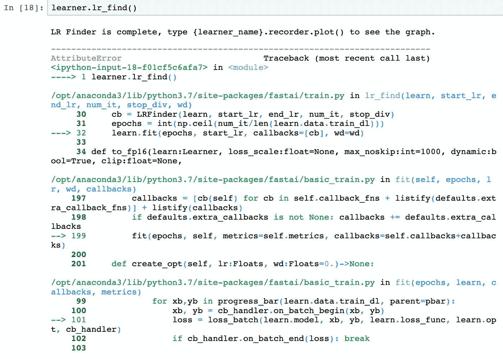

# 当 Pytorch-transformers 遇上 Fastai (w/ Google Colab)

> 原文：<https://towardsdatascience.com/best-of-two-worlds-pytorch-transformers-meets-fastai-5fd51ef34b0f?source=collection_archive---------19----------------------->


Photo from Kapa65 at [Pixabay](https://medium.com/u/a640208c527a?source=post_page-----5fd51ef34b0f--------------------------------)

# 更新:

在我发表这篇文章后，我有幸得到了 fastai 创始人之一杰瑞米·霍华德的回应，他建议我们可以使用 fastai 的回调系统来简化这里的工作，而无需调整 fastai 库中的基本训练循环。

这似乎是一个简单的解决办法，然而，我已经尝试了很长时间(在 [@waydegilli](https://twitter.com/waydegilliam) am 的帮助下)，但并不能完全正确(训练指标根本没有改善……)。我已经在 [fastai 论坛](https://forums.fast.ai/t/problem-with-the-metrics-unchanged-during-the-training-process/53622)上解决了这个问题，并且幸运地让 [Sylvain](https://sgugger.github.io/) 检查了代码。然而，度量仍然不动，训练循环无效。

为了您的方便，我已经用所有的结果编辑了一个 Google Colab，如果您对问题所在有任何想法，我将不胜感激:

[](https://colab.research.google.com/drive/1KFlyttLs7aAX35lMLiDw9Bb0s_74ILMy#scrollTo=NPgXRybJk2XN) [## 谷歌联合实验室

### 编辑描述

colab.research.google.com](https://colab.research.google.com/drive/1KFlyttLs7aAX35lMLiDw9Bb0s_74ILMy#scrollTo=NPgXRybJk2XN) 

鉴于我在使用回调系统时遇到的小缺陷，下面的解决方案，看似“愚蠢”的改变训练循环的方式，仍然是合并 fastai 和 Pytorch-transformers 的最佳方式。

# 介绍

如果你关注深度学习的趋势，尤其是 NLP，你不可能没有听说过 Fastai 或 [Pytorch-transformers](https://github.com/huggingface/pytorch-transformers) 。这两个库为 NLP 实践者提供了友好的 API 和灵活的定制能力来进行原型设计和实验。Fastai 是一个通用的深度学习库，具有精心配置的 API，以适应各种应用程序:例如，文本，视觉，表格和协同过滤。Pytorch-transformers 是一个用于自然语言处理(NLP)的最新预训练模型库，包括 SOTA 模型，如 BERT 和 GPT2。同样值得注意的是，它们都是建立在 Pytorch 之上的，因此在它们之间建立连接不会太困难。考虑到这两个库的优点，把它们结合起来，这样我们就可以通过同时使用这两个包来简化建模过程，这不是很好吗？

答案是肯定的，并且在这篇精彩的文章中有详细的记录。本文提供了将数据集转换为特殊形式的过程，这样它就可以适合 BERT 模型，而这又可以通过使用 fastai API 进行微调。这篇文章也激发了下面这篇文章的写作，这篇文章比较了伯特和乌尔菲特的表现。

[](https://medium.com/@abhikjha/fastai-integration-with-bert-a0a66b1cecbe) [## Fastai 与 BERT 的集成

### 序言

medium.com](https://medium.com/@abhikjha/fastai-integration-with-bert-a0a66b1cecbe) 

上述文章在解释实现中的所有必要细节方面做了令人惊讶的工作，因此这篇文章不会进一步讨论，而是主要通过解决 Pytorch-transformers 库(来自 pytorch-pretrained-bert)的更新引起的一个关键问题来做出贡献。

# 我们有一个问题

在 Pytorch-transformers 更新之前，上面提供的解决方案和代码都运行良好。如果您浏览了更新之前撰写的上述文章中的代码。您可能会遇到这样一个异常:



如果你像我一样，对 Pytorch-transformers 没有太多经验，你可能会感到非常困惑，想知道为什么它对其他人有效，但对我的机器无效！在没有深入探究异常回溯的情况下，我认为这是因为我的手电筒过时了。我将 Torch 更新到了最新版本，但是仍然收到了异常。

在阅读 Pytorch-transformers 文档后，我意识到这个异常是由 Pytorch-transformers 包中 API 的变化引起的。简而言之，在 Pytorch-transformers 更新之前的日子里，`model()`会在网络向前传递之后产生结果；更新之后，模型的 forward 方法生成一个元组，其第一个元素是原始模型输出。如果你想了解更多细节，请[阅读这里](https://github.com/huggingface/pytorch-transformers#models-always-output-tuples)。

```
# If you used to have this line in pytorch-pretrained-bert:
loss = model(input_ids, labels=labels)# Now just use this line in pytorch-transformers to extract the loss from the output tuple:
outputs = model(input_ids, labels=labels)
loss = outputs**[0]**
```

现在我们找到了代码中断的原因，让我们想出一个解决方案。

# 解决办法

解决方案是我们需要修改 Fastai 的代码，以适应 Pytorch-transformers 中`model()`行为的变化。

代码的关键部分是`basic_train.py`中的`loss_batch()`，我们可以看到`model()`输出不是一个元组，而是直接发送给损失函数。

```
def loss_batch(model:nn.Module, xb:Tensor, yb:Tensor, loss_func:OptLossFunc=None, opt:OptOptimizer=None,
cb_handler:Optional[CallbackHandler]=None)->Tuple[Union[Tensor,int,float,str]]:
    "Calculate loss and metrics for a batch, call out to callbacks as necessary."
    cb_handler = ifnone(cb_handler, CallbackHandler())
    if not is_listy(xb): xb = [xb]
    if not is_listy(yb): yb = [yb]
    out = model(*xb) **# Here the output is NOT a tuple**
    out = cb_handler.on_loss_begin(out)if not loss_func: return to_detach(out), yb[0].detach()
         loss = loss_func(out, *yb)if opt is not None:
        loss,skip_bwd = cb_handler.on_backward_begin(loss)
        if not skip_bwd:                     loss.backward()
        if not cb_handler.on_backward_end(): opt.step()
        if not cb_handler.on_step_end():     opt.zero_grad()return loss.detach().cpu()
```

一旦我们在库中找到了确切的位置，更改就变得轻而易举了:简单地选择如下所示的`model()`输出中的第一个元素，并为该函数提供一个新名称:

```
def loss_batch_bert(model:nn.Module, xb:Tensor, yb:Tensor, loss_func:OptLossFunc=None, opt:OptOptimizer=None,
               cb_handler:Optional[CallbackHandler]=None)->Tuple[Union[Tensor,int,float,str]]:
    "Calculate loss and metrics for a batch, call out to callbacks as necessary."
    cb_handler = ifnone(cb_handler, CallbackHandler())
    if not is_listy(xb): xb = [xb]
    if not is_listy(yb): yb = [yb]
    out = model(*xb)[0] **# we take the first element as the model output
**    out = cb_handler.on_loss_begin(out)if not loss_func: return to_detach(out), yb[0].detach()
         loss = loss_func(out, *yb)if opt is not None:
        loss,skip_bwd = cb_handler.on_backward_begin(loss)
        if not skip_bwd:                     loss.backward()
        if not cb_handler.on_backward_end(): opt.step()
        if not cb_handler.on_step_end():     opt.zero_grad()return loss.detach().cpu()
```

现在我们有了一个新的`loss_batch_bert()`函数，我们需要它来替换 Fastai 中加载到我们环境中的原始`loss_batch()`。我们可以通过以下方式做到这一点:

```
***# To change the loss_batch function in the loaded fastai module***import sys
module_basic_train = sys.modules['fastai.basic_train']
module_basic_train.loss_batch = loss_batch_bert
sys.modules['fastai.basic_train'] = module_basic_train
```

然后我们调整后的`loss_batch_bert()`被嵌入到 Fastai 库中，它应该可以满足 Pytorch-transformers 的需求。剩下的都是 Fastai 魔法:组装一个`Learner()`物体，进行试衣！

只需两个周期的训练，我们就可以在私人排行榜上取得 98.427%的成绩！考虑到我们的短期训练和非常“普通”的训练循环，这还不错。

如果您没有更新 Fastai 库，请注意。如果您想在训练过程中查看准确性，您可以传递一个准确性回调函数。但是，accuracy 函数可能已经过时，它的 return 语句中包含一个小错误:

((y_pred>thresh) == y_true.byte())。浮动()。**意思是()#缺乏。byte()**

它可以被固定如下

```
*# The more recent version fastai implemented exactly this version thus you could just directly call a partial funtion*
*# accuracy_thresh*
**def** accuracy_thresh2(y_pred:Tensor, y_true:Tensor, thresh:float=0.5, sigmoid:bool=**True**)->Rank0Tensor:
    "Computes accuracy when `y_pred` and `y_true` are the same size."
    **if** sigmoid: y_pred = y_pred.sigmoid()
    **return** ((y_pred>thresh)**.byte()**==y_true.byte()).float().mean()
```

我希望这篇文章是有帮助的，特别是对那些不熟悉 Fastai 或 Pytorch-transformers 的人。

代码可以在这里的[笔记本](https://github.com/DavidykZhao/Pytorch_transformers_Fastai/blob/master/Pytorch_transformers_Fastai.ipynb)中找到。

如果您在此过程中遇到其他问题，请随时告诉我。

编码快乐！