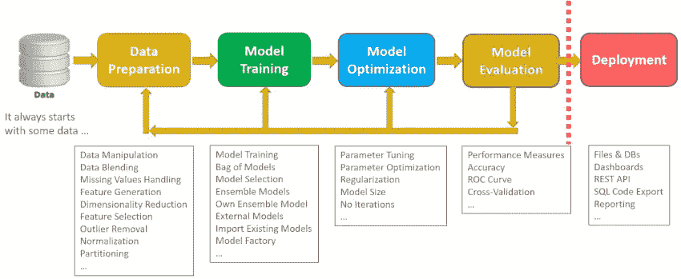

# 数据科学项目的最佳实践

> 原文：<https://towardsdatascience.com/best-practice-for-data-science-projects-d91193fbd0ff?source=collection_archive---------9----------------------->

[https://www.knime.com/blog/analytics-and-beyond](https://www.knime.com/blog/analytics-and-beyond)

由于计算机处理能力的提高，以及处理器和内存成本的降低，现在使用数据科学技术来分析大量数据是可行的。这种增长变成了工业上的严重需求。这导致了对数据科学家的严重需求。为了满足这种就业需求，来自不同背景的人已经开始将他们的职业道路转向数据科学。人们渴望进入这个领域，不幸的是，其中包括许多缺乏适当技能和对数据科学生命周期了解的人。这一缺点已经开始在行业中引发问题。

数据科学项目需要遵循几个步骤，为了保持连续性，这些步骤应该一起进行。没有一个系统的工作流程，很容易迷失在其中的一个步骤中。在工业中，当人们认为他们完成了一个项目时，他们经常努力使项目得到全面的运营支持，因为他们没有考虑到这些生命周期步骤。这是一个常见但严重的问题，原因是人们不知道或不理解术语“生产就绪”的含义。

在我的工作中，我遇到过声称准确率为 92%的工程师，而测试的准确率为 83%。此外，我还看到一些已部署的项目省略了一些关键步骤，而这些步骤仍然在工程师的笔记本中。一个月后，产品经理要求每两周进行一次模型培训，这给工程师们带来了震惊。本文的目标是更好地理解进行数据科学项目时所需的生命周期和工作流。

数据科学项目的性质要求在项目的每一步都进行许多测试。出于这个原因，数据科学项目的一个非常常见的做法是使用笔记本。在项目结束时，很可能会有跨多个笔记本的多余代码不会用于生产。当工程师完成一个步骤时，他们会频繁地将完成的步骤输出，让笔记本上的所有内容都变得杂乱无章，然后立即继续下一步。当代码运行到最后一步时，假设代码已经准备好投入生产，项目已经完成是错误的。这种误解会造成时间和金钱的损失。

**什么是生产就绪？**生产就绪包含多项检查:

1.它跑吗？

2.是否满足项目要求？

3.系统稳定吗？

4.是否可维护？

5.是否可扩展？

6.有记录吗？

让我们深入研究其中的每一个。

它跑吗？意思是代码运行正常吗？代码应该能够平稳运行，任何步骤都不需要任何干预或修改。如果你有一个好的理由，你可以做一些手动的步骤，但是好的实践是从数据采集到预测有一个连续的流程，这是生产中最可能需要的。一种非常常见但不好的做法是写下每一步的输出，然后再次读取前一步的输出。您希望避免每一步都从磁盘中写入和读取。将信息保存在内存中，并将信息传递给下一步，而不将其写入文件，这将提高软件的性能。如果分析数据也超出了内存容量，则成批接收和传递数据。

软件应该满足项目的需求。当工程师完成项目的最后一步时，他们经常跑到项目经理那里演示模型的度量标准(大部分是根据准确性定义的)。产品经理认为项目需求得到满足是错误的。此时，如果产品经理不具备理解和评估模型的技术知识，工程师应该鼓励经理指派另一名主题专家来询问这些问题:

1.数据是如何收集/采样的？工程师可以有意或无意地引入数据偏差。数据科学家可以采用相同的数据，并显示相同的结果为有利或不利。模型评估应该基于您正在查看的那些指标。

2.如何将数据分成训练/验证/测试组？数据的不适当分割可能导致生产结果的显著差异。对任意大小的数据集应用 80-20%的分割，并且不对倾斜的数据集进行分层是工程师经常犯的错误。如果数据集很小，以 80-20%的比例分割数据是可以的，但是如果数据集很大，比如 1000 万。在这种情况下，以 80–20 的比例分割将产生 800 万个训练集大小和 200 万个测试集大小。你真的想让你的测试集那么大吗？因此，正确率应该在 95–05%左右，这将产生 950 万个训练集和 50 万个测试集。如果你的数据量越来越大，你需要增加这个比率。对于大数据集，我的意思是超过 2000 万，使用 99–01%的分割率将为训练和测试提供合理的大小。

3.测试数据是否代表了模型将要使用的数据？工程师和产品经理应该始终考虑数据流动的速度，以及数据可能会随着时间的推移而变化。在一定时间内，有多少百分比的数据在变化？一项基本检查是确保项目完成后收到的数据仍然代表业务需求。

在得到这些问题的满意答案后，工程师和产品经理就可以说软件满足了项目的需求。

一个健壮的架构师并在项目开发之初最小化软件缺陷，将有助于工程师开发出一个稳定的系统，在开发过程中不需要剧烈的变化。

工程师可以理解项目的每一部分和每一行代码，因为他们创建了代码。然而，好的文档可以让新员工快速上手。新人应该不会花太多时间去理解现有的工作。好的可维护软件不应该太复杂而难以理解。工程师应该记住，运行代码的是计算机，而阅读和支持代码的是人。创造一个复杂的代码不是一种天赋，让它简单、易读和易懂。

数据科学家必须确保软件能够处理增加的工作量。可伸缩性将减少未来花费在项目上的总时间。如果该模型有效，它是否会随着数据增加 1，000，000 倍而扩展？

文档是项目的关键部分，缺少了它，项目就不完整。大多数情况下，文档是在项目结束时创建的。这是一种不良做法，因为在数据科学项目中，每一步都需要记录详细信息，以便进行充分的文档记录，而在项目结束时从记忆中回忆这些细节并不是一种可靠的做法。在开发项目的同时开始文档构建。确保记下每个步骤的要点，以避免遗漏关键步骤。

遵循这些步骤，增加了拥有健壮项目的机会。在建立一个项目结构之后，创建一个 Docker 映像并从这个映像开始工作是开发软件项目的一种安全而有效的方式。由于 Docker 镜像已经包含了一个操作系统和编程语言的所有依赖项，所以即使在开发过程中也很容易向不同的方向移动。这将避免为每次代码更改创建新映像的需要，因为只需要在更新 docker 文件时创建一个新映像。此外，docker 文件将提供一个独立于操作系统的产品。您可以在任何操作系统上部署这个 Docker 映像。

确保在项目结束时你有以下东西:

1.一切都已编写好脚本，笔记本上的所有代码都已实现。

2.上述六项检查中描述的产品就绪项目。

3.该系统展示了从开始(第一步)到结束(最后一步)的平稳流程。

4.docker 图像已生成。