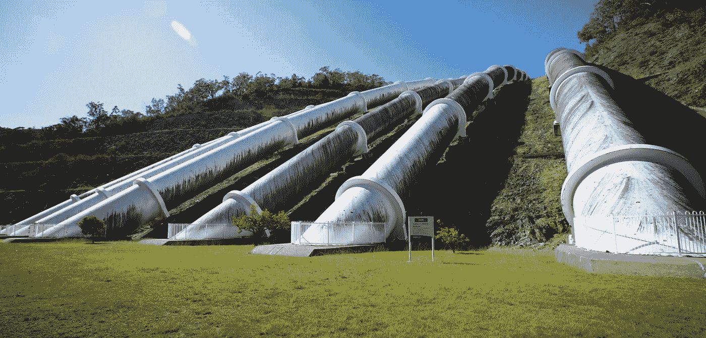
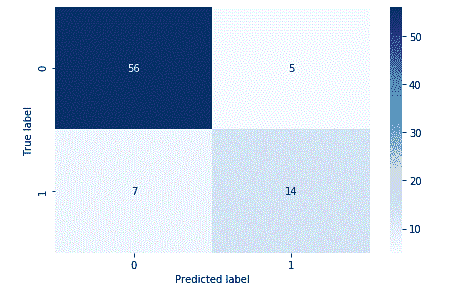

# TensorFlow 2.0 中 NLP 分类的最佳实践

> 原文：<https://towardsdatascience.com/best-practices-for-nlp-classification-in-tensorflow-2-0-a5a3d43b7b73?source=collection_archive---------7----------------------->

## 使用数据管道、迁移学习和 BERT 实现 85%的情感分析准确率

Photo by [Jirsak](https://www.shutterstock.com/g/jirsak), courtesy of [Shutterstock](https://www.shutterstock.com/image-photo/best-practice-concept-manager-businessman-coach-389578870?src=6771d7ae-169b-49d0-b929-1e0e91347c57-1-30)

当我刚开始从事深度学习工作时，我参加了 Coursera 和 [fast.ai](https://www.fast.ai/) 课程，但后来我想知道接下来该何去何从。我开始问类似“我如何为一个模型开发一个数据管道？”以及“我如何实施最先进的研究？”。

这篇博文回答了这些问题。这篇文章涵盖了 TensorFlow 2.0 中深度学习模型的开发，从数据的摄取一直到深度学习决定 Yelp 评论的情绪(积极或消极)。读完这篇文章后，你也将能够使用 [Huggingface 的变形金刚库](https://github.com/huggingface/transformers) [1]来使用一种叫做迁移学习的新技术，并使用谷歌的“模型骨干”( [BERT](https://arxiv.org/abs/1810.04805) [2])在维基百科上预先训练，来创建最先进的模型。

# 此示例的完整代码

完整的代码位于我在 https://github.com/ralphbrooks/tensorflow-tutorials 的 GitHub 上

# 模型构建的最佳实践

**深度学习成功的关键之一是快速迭代**。如果我们要建立一个预测模型，存储一次数据并基于该数据编写多个实验模型是有意义的。如果我们要建立一个预测模型，我们希望建立一个数据管道，在那里我们可以查看信息行，但在我们训练模型之前，我们不必处理所有的信息。

为了说明这些最佳实践，我将介绍创建一个模型的步骤，该模型基于手机商店的 Yelp 评论来预测情绪(“负面”或“正面”情绪)。我将使用 Yelp API 提取与关键字“美国电话电报公司”相关的商店的随机评论。以及相关联的评级(“情绪”)。我们的目标是看看我们是否可以创建一个深度学习模型，仅基于文本就可以确定情感。

# 步骤 1:高效地存储原始、干净的数据

我们的目标是预测情绪。理解标签(Yelp 评级)和特征(评论)之间关系的 TensorFlow 抽象通常被称为模型。

该过程的第一步是考虑将输入到该模型中的必要输入。在这个阶段，将评论和情感评分作为一个逻辑分组来考虑是有帮助的。TensorFlow 将这种逻辑分组称为`tf.train.Example.`

对于我们的用例，我们应该从定义示例开始。该定义如下:

接下来，我们将把这些例子高效地存储在名为 TFRecords 的文件中。

写出此信息的示例代码如下所示:

总之，使用 TFRecords 进行存储允许您对数据进行初步清理，并有效地存储这些数据以供多个模型使用。

# 步骤 2:为特定于模型的数据转换构建管道

We create pipelines to transform our raw, clean data into something that is gradually ingested by a model. Photo by [Neale Cousland](https://www.shutterstock.com/g/nifty)- — Courtesy of [Shutterstock](https://www.shutterstock.com/image-photo/water-pipelines-hydroelectric-power-station-australias-489908086?src=efd217dd-e435-4544-b5b3-fc39eeffb747-1-15)

第二步是创建一个数据管道，将你的特征(评论)和标签(情感评分)从保存的文件(TFRecord)输入到某种类型的神经网络中。在 TensorFlow 中，可以使用`tf.data.Dataset`实现数据管道。

`tf.data.Dataset`在您的模型开始训练之前，设置您的转换，而不实际处理它们。如果您正在测试您的管道，这是至关重要的。换句话说，在数据转换的不同步骤中，您最不想做的事情就是等待 3-4 分钟，因为前一个转换步骤仍在所有可用数据上运行。最好让转换管道的每一步都在少量数据(单批数据)上操作，这样可以更快地调试管道。

以下代码将有助于使这一概念更加具体:

如下所示，管道也可以用来清理数据。

# **第三步:使用迁移学习法建立模型**

在我们的例子中，我们试图理解人类语言和句子中包含的情感。第一个挑战是我们的数据有限；我们的模型将只检查 738 条评论，以确定情绪。

如果我们预测维基百科所有页面的缺失单词，深度学习模型将有足够的数据来检测基本的语言模式，但我没有足够的计算能力来处理这些信息。

由于这些限制，我们将查看另一家公司预先训练的模型，并使用我们有限的训练数据对该模型进行微调(这一概念通常称为迁移学习)。具体来说，我们将使用来自 Google 的 BERT 模型，它已经在 Wikipedia 信息上进行了训练。

**另一个最佳实践是尽可能使用成熟的框架。**一家名为 Hugging Face 的初创公司有一个名为 Transformers 的框架，可以更容易地使用预先训练的模型，下面的代码显示了如何将单词转换为数字(标记化)以及如何使用 BERT 模型(`TFBertForSequenceClassification`)

拥抱脸变压器框架也使我们的数据管道转换成 BERT 模型可以理解的东西变得容易。

# 步骤 4:训练和评估 NLP 模型

现在，我们准备训练模型。如果我们运行模型 3 次迭代(历元)，我们看到**的准确率为 85 %。**

考虑到 Yelp 评级捕捉了用户的全部情绪，这仍然是好的，但在许多情况下，Yelp API 只给你实际文本评论的一部分。

85%准确度的可视化如下所示:

上面的矩阵显示了以下内容:

如果这个人表达的是负面情绪，那么分类器的准确率为 91%。

如果客户表达了积极的情绪，我们的模型在大约 66%的情况下是正确的。

**祝贺你！**您已经完成了博文的结尾，现在您有了一个从构建数据管道到拥有精确模型的过程。

# 参考资料:

1) T. Wolf、l .处女作、V. Sanh、J. Chaumond、C. Delangue 和 A. Moi。拥抱脸的变形金刚:最先进的自然语言处理。arXiv 电子版，2019 年 10 月。

2)德夫林、张、李和图塔诺瓦。BERT:用于语言理解的深度双向转换器的预训练。arXiv 电子版，2018 年 10 月。

# 关于白猫头鹰教育

你想跟上当前人工智能的趋势吗？您是希望实时处理流数据，还是希望将模型部署到生产中？

如果是这样的话，我的公司可以提供帮助——请联系我们 https://www.whiteowleducation.com 分部