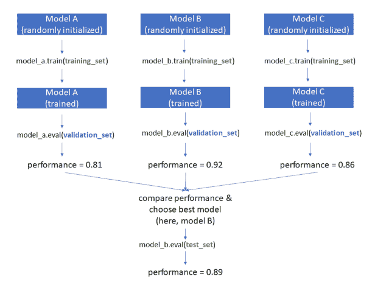
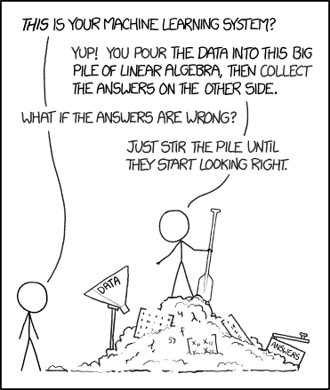

# 医疗数据培训/评估/测试拆分的最佳用途

> 原文：<https://towardsdatascience.com/best-use-of-train-val-test-splits-with-tips-for-medical-data-b9026ad7e4a4?source=collection_archive---------22----------------------->

这篇文章介绍了将数据分成训练集、验证集和测试集的适当方法，以及如何最大限度地利用这些集合。它还讨论了特定于医疗数据的概念，其动机是医疗数据的基本单位是患者，而不是实例。

# **基础知识**

如果您已经熟悉将数据集分为训练集、验证集和测试集背后的原理，可以跳过这一部分。否则，以下是我们在机器学习中拆分数据的方式和原因。

用于监督学习的数据集由示例组成。根据任务的不同，一个例子可以是一幅图像、一段视频、一句话、一段文本或一段录音。每个示例都配有一个标签，例如，像“猫”或“狗”这样的类别

在项目开始时，数据科学家将所有示例分成三个子集:训练集、验证集和测试集。常用的比率有:

*   70%培训，15% val，15%测试
*   80%培训，10%评估，10%测试
*   60%培训，20%评估，20%测试

(有关这些比率的更多说明，请参见下文。)。)

这三个集合的用法如下:

如图所示，让我们假设您有三个模型要考虑:模型 A、模型 B 和模型 c。这些可能是不同的架构(如 ResNet vs VGG vs AlexNet)，也可能是同一模型的不同变体(如具有三种不同学习速率的 ResNet)。)步骤如下:

1.  随机初始化每个模型
2.  在训练集上训练每个模型
3.  评估每个已训练模型在验证集上的性能
4.  选择具有最佳验证集性能的模型
5.  在测试集上评估这个选择的模型

为什么不能只用一个数据集呢？让我们想象一下，如果我们将所有的数据作为“训练集”，会发生什么当我们想要评估性能时，我们只需查看训练集的性能。现在，如果我们幸运的话，训练集的性能可能会反映出该模型在它从未见过的数据上的表现。但是如果我们运气不好，模型只是简单地记住了训练数据的例子，当我们给它一个从未见过的例子时，它就完全失败了(“[过度拟合](https://glassboxmedicine.com/2019/06/08/regularization-for-neural-networks-with-framingham-case-study/)”)。我们没有办法弄清楚我们是幸运还是不幸——这就是为什么我们需要一个验证集。验证集由模型在训练中从未见过的示例组成，因此如果我们获得了良好的验证集性能，我们可以感到鼓舞的是，我们的模型已经学习了有用的可概括原则。

但是，如果我们有训练集和验证集，为什么我们还需要测试集呢？测试集很重要，因为“选择最佳模型”(基于验证性能)的步骤会导致某种形式的过度拟合。请这样想:假设您对数据尝试了一千种不同的模型或模型变体，并且您对所有这些模型都有验证集性能。选择具有最佳验证集性能的模型的行为本身就意味着您，人类，已经为验证集“调整”了模型细节。您在“验证集上的最佳模型”上看到的验证集的性能值本质上是夸大的。为了对这个“最佳模型”在它以前从未见过的数据上的表现获得一个非夸大且更可靠的估计，我们需要使用更多它以前从未见过的数据！这是测试集。测试集性能通常会略低于验证集性能。

现在让我们回过头来解决为训练、验证和测试分配多少数据的选择问题。许多人想知道什么是“正确的比率”——但不幸的是，没有关于使用什么比率的明确规则。我个人喜欢 70-15-15，但这是一个主观的选择。权衡如下:

*   更多的训练数据是好事，因为这意味着你的模型看到更多的例子，从而有希望找到更好的解决方案。如果你有一个很小的训练数据集，你的模型将无法学习一般的原则，并将有很差的验证/测试集性能(换句话说，它不会工作。)
*   更多的验证数据是好事，因为它可以帮助您更好地决定哪个模型是“最好的”如果您没有足够的验证数据，那么在您对哪个模型是“最好的”的估计中会有很多噪音，您可能不会做出好的选择。
*   更多的测试数据是好的，因为它让你更好地感觉到你的模型对看不见的数据有多好。如果没有足够的测试数据，您对模型泛化能力的最终评估可能不准确。

不幸的是，您添加到一个集合中的任何数据都必须从另一个集合中移除。这就是为什么对于非常小的数据集，你可能想要使用像交叉验证这样的技术(这不在本文中讨论，但是如果你想了解更多，你可以查看本文。)

# **适当使用培训/验证/测试数据**

本节的要点如下:YOTO ( **Y** ou **O** 仅使用 **T** est set **O** NCE。)

我不会拐弯抹角……如果一个数据科学家想要开发一个新模型来解决一个问题，他们检查了一吨不同模型的测试集性能，然后报告了最好的一个模型的测试集性能，这就是作弊。通过反复检查测试集的性能，他们使测试集过拟合。测试集性能度量不再是模型泛化能力的可靠指标。

现在，使用测试集的好方法是什么？在此之前，我们将首先讨论一个使用验证集的好方法。

验证集是您应该在*关于模型架构和超参数的每个*决策中使用的。例如，如果您使用的是神经网络模型，则使用验证集进行以下操作是合适的:

*   选择层数(深度)；
*   选择每层神经元的数量(宽度)；
*   在每一层的 [CNN](https://glassboxmedicine.com/2019/05/05/how-computers-see-intro-to-convolutional-neural-networks/) 中选择内核的数量/形状；
*   选择是否使用[剩余连接](/residual-blocks-building-blocks-of-resnet-fd90ca15d6ec)以及在哪里；
*   选择是否使用[预训练特征提取器](https://pytorch.org/docs/stable/torchvision/models.html)；选择要使用的特征提取器；选择是固定还是调整该特征提取器的权重；
*   选择一个[激活功能](https://en.wikipedia.org/wiki/Activation_function) : ReLU、Leaky ReLU、eLU 等。；
*   选择是否使用[退出](https://medium.com/@amarbudhiraja/https-medium-com-amarbudhiraja-learning-less-to-learn-better-dropout-in-deep-machine-learning-74334da4bfc5)；选择在模型中使用 dropout 的位置；选择退出概率；
*   选择是否使用归一化，在哪里:[批量归一化，权重归一化，图层归一化](https://mlexplained.com/2018/11/30/an-overview-of-normalization-methods-in-deep-learning/)等。；
*   选择一个[优化器](https://pytorch.org/docs/stable/optim.html) : Adam、Adagrad、SGD 等。；
*   选择一个学习率；
*   选择一个[损失函数](https://ml-cheatsheet.readthedocs.io/en/latest/loss_functions.html):交叉熵、MSE、应用的定制损失等。；
*   选择批量大小；
*   选择是否使用[规则化](https://glassboxmedicine.com/2019/06/08/regularization-for-neural-networks-with-framingham-case-study/)；选择正则化强度。

换句话说，你在机器学习项目上做的几乎所有工作都应该只使用训练集和验证集。您应该假装测试集不存在。

关于架构/超参数优化的补充说明:假设您拥有优化上面列表中每个模型特征的每个可能组合所需的计算资源是不现实的。然而，很有可能你至少会深入探究其中的一些。如果你对超参数优化策略的讨论感兴趣，可以看看[这篇文章](https://blog.floydhub.com/guide-to-hyperparameters-search-for-deep-learning-models/)。如果您有 100 个 GPU 供您使用，您显然可以比只使用 1 个 GPU 进行更多的超参数优化。

一旦你决定了一个最好的模型——有史以来最棒的模型——基于你的验证数据集的无数次实验，是时候使用测试集了。你应该在测试集上运行你最棒的模型来看看它的性能。这就是你应该报告的模型的性能。

在许多论文中，经常将您最棒的模型的测试集性能与其他一些不太棒的模型的测试集性能进行比较。实际上，在这种情况下，您必须在其他一些不太好的模型上获得测试集性能…这是当前“train-val-test”分割方法的一个限制。你的论文的读者会在心理上使用测试集来选择模型。(但是，这仍然比你用测试集*开发*你最棒的模型要好，那是作弊。)

# **医疗数据注意事项**

如果您正在处理一个医疗数据集，那么只使用一次测试集来测量您最棒的模型的性能是非常重要的，因为医疗数据几乎总是难以获取和清理。您不太可能轻易获得“另一个测试集”，因此您希望测试集必须使用一次，以便它提供模型泛化能力的最佳估计。如果您计划在真实环境中部署您的模型，这就变得更加重要。你不想声称你的“心脏病风险模型”在测试集上有 0.95 的 [AUROC，而实际上你对测试集进行了过度拟合，真实的性能更像是 0.62……因为那样你将使用一个糟糕的模型，并给真正的患者提供对其心脏病风险的误导性估计。](https://glassboxmedicine.com/2019/02/23/measuring-performance-auc-auroc/)

由于偶尔滥用测试集，一些描述医学数据的机器学习模型的作者已经开始明确强调他们恰当地使用了他们的测试集。例如，在[“一种用于从小数据集检测急性颅内出血的可解释深度学习算法”](https://www.nature.com/articles/s41551-018-0324-9) Lee 等人注意到，

> *为了评估模型的性能，在模型开发过程完成后，我们收集了两个独立的测试数据集，一个是回顾性的，另一个是前瞻性的。*

换句话说，李等人甚至没有*创建*测试集，直到他们使用训练和验证数据集开发了一个模型。

这是另一个例子。在[“基于低剂量胸部计算机断层扫描的三维深度学习的端到端肺癌筛查”中，](https://www.nature.com/articles/s41591-019-0447-x) Ardila 等人使用了不止一个测试集，他们指出，

> *两个测试集只运行一次，以避免影响模型开发。此外，所有从事建模和图像分析的个人对测试集中的诊断是盲的。*

# **为医疗数据创建训练/验证/测试分割**

医疗数据不同于其他类型的数据，因为分割必须由患者决定，而不是由个别例子决定。无论您处理的是医学图像、医学文本还是医学表格数据，这一点都适用。示例:

*   影像任务:[对胸片中的疾病进行分类](https://glassboxmedicine.com/2019/05/11/automated-chest-x-ray-interpretation/)。在大多数胸部 x 射线数据集中，同一患者贡献了多个胸部 x 射线。数据必须基于患者标识符而不是单个胸部 x 射线来分割，因为来自同一患者的胸部 x 射线高度相关。
*   文本任务:根据描述的疾病对医疗记录进行分类。这里，同样，数据必须基于患者标识符进行分割，因为关于同一患者的病历高度相关。今天患有糖尿病和囊性纤维化的患者明天也会患有糖尿病和囊性纤维化。
*   表格数据任务:根据从电子病历中收集的[表格数据](https://glassboxmedicine.com/2019/06/01/everything-you-need-to-know-about-preparing-tabular-data-for-machine-learning-code-included/)预测住院风险，包括诊断、程序、药物、人口统计和实验室值。假设您正在考虑一家大型医院五年内的数据。基本上可以保证，在此期间至少有一名病人不止一次入院。如果 Smith 先生已经入院 3 次，那么这 3 个入院实例中的每一个都应该被分配到同一个集合。

通常，患者标识符是病历号或 MRN。这是一种受保护的健康信息，因此，如果您使用去识别数据集，将会有一个随机生成的患者标识符来替换原来的 MRN。

# **总结**

*   要训练和评估机器学习模型，请将您的数据分成三组，分别用于训练、验证和测试。
*   如果您正在开发一个新的机器学习模型，您应该使用验证集来最终确定模型和超参数。那么您应该只使用测试集一次，以评估您选择的模型的泛化能力。
*   如果您正在处理一个医疗数据集，那么分割应该基于患者标识符，而不是基于单个的例子。

Credit: [xkcd “machine learning”](https://xkcd.com/1838/)

## **关于特色图片**

特色图片由维基百科上俄勒冈州三姐妹的图片修改而来，这三个相邻的火山被称为南姐妹火山、中姐妹火山和北姐妹火山。

*原载于 2019 年 9 月 15 日*[*http://glassboxmedicine.com*](https://glassboxmedicine.com/2019/09/15/best-use-of-train-val-test-splits-with-tips-for-medical-data/)*。*