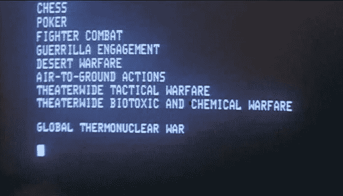
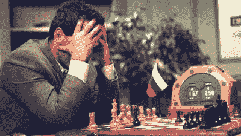
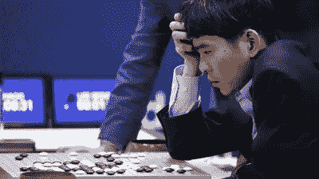

# 被人工智能打败:当人工智能赢了会发生什么？

> 原文：<https://towardsdatascience.com/bested-by-ai-what-happens-when-ai-wins-22388706482d?source=collection_archive---------19----------------------->

## 在某些任务上，人工智能已经比你强了。这里有一些如何应对的想法。

Photo by [JESHOOTS.COM](https://unsplash.com/@jeshoots?utm_source=unsplash&utm_medium=referral&utm_content=creditCopyText) on [Unsplash](https://unsplash.com/search/photos/chess?utm_source=unsplash&utm_medium=referral&utm_content=creditCopyText)

几个月前，我给我爸发了一篇文章 [20 名顶级律师在一项受控研究中被法律人工智能击败](https://techstartups.com/2018/10/29/20-top-lawyers-were-beaten-by-legal-ai-in-a-controlled-study/)，这篇文章(如标题所示)讨论了一项关于人工智能如何应用于法律领域的研究，以及它如何与专业律师对抗。这篇文章的一个含义是，在许多常见的法律需求方面，如合同审查或写遗嘱，人工智能可能会取代律师。

这是一篇关于 AI 的有趣文章和应用，我花了很多时间思考。我和我爸爸分享它可能看起来很无辜，事实也的确如此，只不过我爸爸是个律师。

是的，我有点想激怒他(我保证，这是充满感情的)。

现在，似乎几乎没有一个星期不会遇到一篇声称人工智能将夺走我们所有工作的文章(然后变成天网并杀死我们所有人)。人工智能正被应用到许多不同的应用中，它经常让人感觉任何人工智能项目的最终目标都是超越人类。

在游戏世界中经常可以看到人工智能与人类的明确版本，在这里，高级人工智能与专业游戏玩家进行对抗，作为人工智能能力和复杂性的基准。

# 为什么我们要教 AI 玩游戏？

似乎自从研究人员在[探索和开发人工智能](https://en.wikipedia.org/wiki/Timeline_of_machine_learning)以来，他们也一直在教他们的 [AI 玩游戏](https://bdtechtalks.com/2018/07/02/ai-plays-chess-go-poker-video-games/)。

不管你怎么想，教人工智能玩游戏绝对不是浪费时间和金钱。

War Games — 1983

在游戏中，有内在的规则和奖励。这使得游戏很容易教人工智能作为复杂任务的“可评分”代理。游戏帮助开发者[追踪 AI](https://www.pcmag.com/commentary/362654/why-teaching-ai-to-play-games-is-important) 的进展。游戏提供了一种安全(没有真正的生命受到威胁)但强大的方式来测试人工智能的性能，因为人工智能的性能可以通过分数来量化。

通常测试一个游戏人工智能的巅峰是让它与一个人类冠军比赛。

# 人类对机器

人类冠军和人工智能之间最引人注目的早期对决之一发生在 1996 年的[和 1997 年的](https://en.wikipedia.org/wiki/Deep_Blue_versus_Garry_Kasparov)，在那场比赛中， [IBM 的深蓝](https://en.wikipedia.org/wiki/Deep_Blue_(chess_computer))扮演世界冠军棋手，[加里·卡斯帕罗夫](https://en.wikipedia.org/wiki/Garry_Kasparov)。虽然卡斯帕罗夫在 1996 年的第一场比赛中输掉了第一局，但他能够适应深蓝的下棋方式，并赢得了六局中的三局，赢得了比赛。

卡斯帕罗夫同意在 1997 年与深蓝复赛。这场比赛包括六场比赛。深蓝在第二场比赛中做出了一个意想不到的举动——它放弃了抓住一个暴露的棋子的机会，以做出一个从长期来看更有好处的举动。卡斯帕罗夫被这个看起来很像人类的举动迷惑了，这让卡斯帕罗夫无法继续比赛(有趣的是，这个举动可能是一个 bug 的[结果)。不管是什么引发了这一举动，卡斯帕罗夫最终输掉了这场比赛。](https://www.wired.com/2012/09/deep-blue-computer-bug/)

按照现代标准，深蓝的人工智能相当初级。为了下棋，深蓝被编码为使用蛮力方法，在下一步棋之前分析许多不同的序列。当深蓝击败卡斯帕罗夫时，人们猜测人工智能在游戏中的下一个基准将是中国的[围棋](https://en.wikipedia.org/wiki/Go_(game))，这将很难使用相同的方法编写计算机代码，因为围棋中可能的走法和序列数量要多得多。人们推测人类可能要过 100 年才能被围棋人工智能打败。

AI 击败人类围棋冠军，堪比深蓝 vs 卡斯帕罗夫，2015 年随着 DeepMind 的 [AlphaGo](https://deepmind.com/research/alphago/) 开始成为主流。先是 AlphaGo 击败欧洲围棋冠军[范辉](https://en.wikipedia.org/wiki/Fan_Hui) (2015)，然后 2016 年 [AlphaGo 迎战韩国冠军](https://en.wikipedia.org/wiki/AlphaGo_versus_Lee_Sedol)(当时国际头衔排名第二) [Lee Sedol](https://en.wikipedia.org/wiki/Lee_Sedol) ，然后在 [2017 面对中国冠军](https://en.wikipedia.org/wiki/AlphaGo_versus_Ke_Jie) [柯洁](https://en.wikipedia.org/wiki/Ke_Jie)(比赛时柯洁被多个围棋协会评为世界第一)。

AlphaGo 基于一个比它的精神前身深蓝复杂得多的框架。AlphaGo 利用[深度学习](https://en.wikipedia.org/wiki/Deep_learning)学习如何下围棋。AlphaGo 的一个更新版本 AlphaGo Zero 完全是通过给它规则，然后[和自己对弈](https://www.nature.com/articles/nature24270.%20)来训练的。这个新的框架已经被应用到国际象棋和日本兵棋的游戏中，以及最新版本 AlphaZero 的围棋中。

国际象棋和围棋是人工智能战胜人类的两个流行例子，但还有更多人工智能在回合制游戏中击败人类的例子(如 [Jeopardy](https://www.pcmag.com/news/259434/ibms-watson-1-human-jeopardy-contestants-0) ),人工智能一次只需要处理一件事，并有足够的时间来完成。

最近，研究人员已经将视频游戏作为人工智能的下一个伟大舞台。视频游戏是一个挑战，因为玩家需要实时响应，并且经常需要在游戏的许多不同方面之间分配注意力。OpenAI 和 DeepMind 今年分别因其 AI 玩 Dota 2 和星际争霸 2 而出现在新闻中。

尽管这些玩视频游戏的人工智能系统已经取得了一些相当大的成功，但是它们还没有像它们的回合制兄弟一样统治各自的游戏平台。要更深入地了解游戏人工智能的过去和现在，请阅读 Engadget 的 Jamie Rigg 的文章[人工智能是比我们更好的游戏玩家，没关系](https://www.engadget.com/2019/03/20/ais-are-better-gamers/)。

# 从败在艾手里恢复过来

在 AI 和人类冠军的每一次交锋中，在某种程度上，为人类而战的冠军是在捍卫我们物种的荣誉。失败是痛苦的。输给一个不是人类的对手更难。

1996 年和 1997 年，卡斯帕罗夫压力很大，他是备受尊敬和钦佩的国际象棋世界冠军。比赛之前，出版物被冠以“大脑的最后阵地”这样的标题。尽管卡斯帕罗夫自信地参加了比赛，但他明显感到沮丧，甚至对深蓝的意外举动感到慌乱。

我的父母经常告诉我，当你和一个两岁的孩子开始争论时，你已经输了。同样，当你面对人工智能时情绪激动，你已经输了。许多人把卡斯帕罗夫的失败归因于深蓝是如何进入他的头脑的。

Kasparov vs. Deep Blue 1997 Credit: Stand Honda, AFP, Getty Images

在他输了之后，卡斯帕罗夫实际上指责 IBM 作弊，在比赛中制造了一些阴谋论。当然，人工智能还没有发展到足以做出这种动作或开发新的策略，对吗？唯一的解释是人为干扰。至少在这种情况下，卡斯帕罗夫会输给另一个(狡猾的)人，而不是一台存在威胁的计算机。

一个人会感受到压力和情境。当人工智能进行这些比赛时，它并没有真正意识到它不仅仅是与另一个人工智能进行另一场训练比赛。对于人类来说，这些对抗的风险总是更高。

在与 AlphaGo 的第三局比赛后，Lee Sedol 实际上为输给 T1 道歉:

> *我不知道今天该如何开始或说些什么，但我想我必须先表达我的歉意。我本应该展示一个更好的结果，一个更好的结局，以及更好的比赛内容，我为不能满足很多人的期望而道歉。我有点无能为力。如果我回顾这三场比赛，第一场，即使我回去重做第一场比赛，我认为我也不可能赢，因为我当时误判了 AlphaGo 的能力。*

Lee Sedol vs. AlphaGo 2016 Credit: AP

Lee Sedol 最终在与 AlphaGo 的五场比赛中赢了一场。在比赛结束时，尽管输掉了五场比赛中的四场，[他说:](https://gizmodo.com/lee-sedol-loses-final-go-match-making-it-a-4-1-victory-1764954190)

> 就我个人而言，我对这个结果感到遗憾，但我想对在比赛中支持和鼓励我的所有人表示感谢……在我人生的某些时刻，我曾质疑自己是否真正喜欢围棋，但我承认，我喜欢与 AlphaGo 的所有五场比赛。在我使用 AlphaGo 的经历之后，我开始对经典的信念产生了一点质疑，所以我有更多的研究要做。

在输给 AlphaGo 之后，冠军柯洁与李·塞多尔(Lee Sedol)有着类似的情绪，他花时间学习 AlphaGo 的打法。他从比赛中得到的启示是，人们对围棋的了解并不像他们认为的那样多，还有很多东西需要学习。他继续写关于从 AlphaGo 中学到的经验的书。

AlphaGo 和 AlphaZero 已经影响了国际象棋、日本兵棋和围棋等游戏的玩法。人们正在意识到，尽管传统智慧会告诉我们，但围棋大师对这项运动还有很多不了解的地方。拥有这种游戏的外部视野正在改变游戏的玩法。AI 不受惯例约束。

比赛 20 年后，卡斯帕罗夫能够更加冷静地反思他的经历。他已经撤销了对 IBM 深蓝团队的许多指控，并为此道歉。他还写了一本关于他面对人工智能的经历的书。他现在是一个乐观的倡导者，与人工智能合作，以实现更美好的未来。

# 作为学者输给艾

每两年，蛋白质结构建模领域的研究人员都会举行一次全球性的实验/竞赛，名为[结构预测的关键评估(CASP)](https://en.wikipedia.org/wiki/CASP) 。这项活动的目标是给研究人员一个在全球舞台上测试结构预测方法的客观方法。正如 Vox 的 Sigal Samuel 所说，CASP 很大程度上是一场[“成年人的奇特科学竞赛。”](https://www.vox.com/future-perfect/2019/2/15/18226493/deepmind-alphafold-artificial-intelligence-protein-folding)

去年举行的 CASP13 大会的获奖作品是 DeepMind 的 AlphaFold。

这种类型的研究是许多生物学家毕生的工作，包括 Mohammed AlQuraishi 博士(哈佛大学)，他在他的个人博客上写了一篇非常有趣的[帖子，讲述了被 AI 击败的经历。在他的博客中，他写道担心自己被人工智能超越，当他意识到 AlphaFold 的见解与该领域的研究方向一致时，他感到如释重负，然后将 AlphaFold 的成功归功于其母公司 Alphabet 的雄厚资金。](https://moalquraishi.wordpress.com/2018/12/09/alphafold-casp13-what-just-happened/#comment-26005)

他还反映出，DeepMind 以局外人的身份进入一个领域并取得重大进展的能力，多少表明了学术界和大型制药公司的结构性低效。学术界的竞争性质阻止了信息的公开共享(导致每个研究小组不得不自己重新发现东西，浪费时间和精力)，制药公司往往专注于销售而不是新颖的研究。

最终，AlQuraishi 得出结论，AlphaFold 的发现是一件好事——在生物化学最重要的问题之一上取得了重大进展。这导致了该领域更高的可见度和所有相关研究人员的智力进步。谁(或什么)做了这个发现并不重要。他对研究人员适应人工智能的建议包括专注于需要更多概念突破的问题，并将更多工程化的问题留给人工智能研究小组。

# 当 AI 为我们和我们的工作而来时，我们该怎么办？

AI 未来很可能会淘汰一些工作岗位。哪些工作和什么时候做还不清楚。正如 Mohammed AlQuraishi 在 Vox 的 Sigal Samuel 采访中解释的那样(是的，我已经链接了这篇文章两次，它真的很好，我希望是我写的):

> *曾经有一段时间，很多人认为工作是有等级的——智力工作是最后被取代的，机械工作是第一位的。但那其实不清楚。很可能机械性的工作需要很长时间才能被取代，因为制造能做出特定手势的机器人实际上很难。智力较高层次的东西可能会更快地被取代。*

正如我们从每个不得不直接面对人工智能淘汰前景的人类冠军那里学到的那样，我们可以选择将此视为学习和做一些不同事情的机会。人工智能为新的激动人心的工作提供了机会。随着人工智能在某些任务上变得比我们更好，我们只需要找到新的任务来承担。我们还需要在决定开发什么样的人工智能方面发挥积极作用，并确保交给人工智能的工作以道德的方式进行。

Real Genius — 1985

我爸爸十年前就告诉我不要去法学院，可能是在人工智能在法律中的应用被探索之前。人工智能在法律工作中的应用正在被探索，因为有机会让一些事情变得更加高效和有效，而不仅仅是为了好玩或刁难律师(嗯，可能有一点)。

我父亲在我年轻时告诉我的另一件事是，我成年后最终从事的工作还没有被发明出来。从某种意义上说，他是对的。我不认为在 90 年代，为软件公司写关于数据科学和分析的专业博客已经成为主流。从不太字面的意义上来说，我认为他的意思是今天的需求不会与明天的需求相同，如果你适应性强、开放，你最终可以做一些人们以前没有做过的新事情。

每当我们发明一项新技术，工作就会被打乱。想想今天的农场和工厂与 100 年前相比是什么样子。准备引入人工智能的行业是人工智能可以提高效率的行业，有可能使最终消费者的生活变得更好，希望整个社会也是如此。

[原文](https://community.alteryx.com/t5/Data-Science-Blog/Bested-by-AI-What-Happens-When-AI-Wins/ba-p/394095)。经允许重新发布。