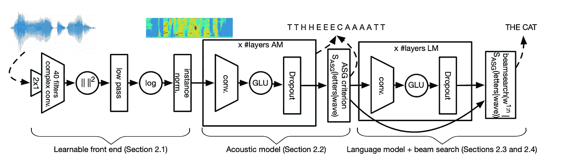
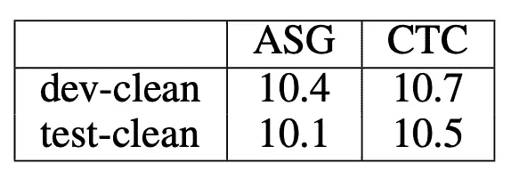

# 使用 Wav2Letter 的自动分段标准实现更好、更快的语音识别

> 原文：<https://towardsdatascience.com/better-faster-speech-recognition-with-wav2letters-auto-segmentation-criterion-765efd55449?source=collection_archive---------6----------------------->

## 脸书·艾的新损失函数改进了 ASR 中一项已有十年历史的技术

2016 年，脸书人工智能研究院(FAIR)凭借 [Wav2Letter](https://arxiv.org/pdf/1609.03193.pdf) 这款全卷积语音识别系统开辟了新天地。

在 Wav2Letter 中，FAIR 展示了基于[卷积神经网络](/what-is-a-neural-network-6010edabde2b)(CNN)的系统可以与传统的[基于递归神经网络](https://en.wikipedia.org/wiki/Recurrent_neural_network)的方法表现一样好。

在本文中，我们将重点关注 Wav2Letter 的核心模块:自动分段(ASG)标准。

Architecture of the wav2letter model

在上面显示的 Wav2Letter 架构中，我们会发现 ASG 位于声学模型的右侧。

ASG in the wav2letter architecture diagram

使用 ASG 卷积方法，FAIR 报告了应用于 [TIMIT](https://catalog.ldc.upenn.edu/LDC93S1) 数据集时字母错误率(LER)的显著改善。

TIMIT Letter Error Rate

…以及短序列和长序列的速度提升，尽管 Wav2Letter 使用了纯 CPU 版本的模型进行基准测试。

*Short sequence timing in ms*

*Long sequence timing in ms*

从根本上说，ASG 准则是一种特殊类型的损失函数。

ASG 建立在像连接主义时间分类(CTC)这样的老算法上，这些算法长期以来一直是语音识别模型的支柱。

要理解 ASG，我们首先需要理解像 CTC 这样的算法所解决的具体问题。然后，我们将简要了解一下 CTC，这样我们就可以最终了解 ASG 与它的不同之处以及它的改进之处。

# 从声音到文字

Wav2Letter 的核心是一个声学模型，你可能已经猜到了，它从*声波*中预测*字母*。

Wav2Letter’s acoustic model

具体来说，Wav2Letter 将音频处理成切片，通过各种卷积层，并输出每个音频切片的一组概率。每个概率集包含模型的字母字典中每个字母的估计值。

这意味着，对于一段音频，我们可以估计出当时说出的字母是“e”或“t”或“s”，或者任何其他可能的字母。

声学模型吐出了这些概率的链，其中链中的每一个环节都代表了特定字母在该时刻出现的估计。

这个链包含了我们声学模型的假设。为了达到我们的最终预测，我们需要将这个概率链转换成在音频片段中出现的最有可能的*字母序列*。

# 对齐问题

记住 Wav2Letter 的声学模型基本上是一个声波到字母的*分类器*。该模型“看到”了一点声波输入，并说，“好的，这看起来像一个‘H’或者可能是一个‘S’。

但与静态图像不同，声波在时间中流动。如果我们的短语是“猫”，我们怎么知道说话者什么时候停止说“T”而转到“H”呢？

为了学习“这就是‘T’的样子”，Wav2Letter 需要理解口语话语*如何随时间在字母之间过渡*。

只有理解了这些转换，模型才能开始将其声音的表示映射到正确的字母标签。

但是我们有一个问题。语音识别的训练数据通常只带有音频和文字记录，没有用于两者之间对齐的数据。我们可以输入一个三秒钟的`.wav`文件，其中有人说“猫”，旁边是一个`.txt`文件，其中有字母:“猫”。

我们知道在‘The’中‘T’在‘H’之前，但是抄本没有告诉我们*何时*。

*Example letter alignments from CTC (top) and ASG (bottom) over an audio segment*

手动将每个字母与音频中的匹配时刻对齐非常耗时，而且在大规模应用中几乎不可能。我们也不能依赖像“一个字母持续 500 毫秒”这样肤浅的一般规则，因为人们说话的速度不同。

我们该怎么办？输入 CTC。

# CTC 如何解决对齐问题

传统上，实践者用[连接主义时态分类(CTC)算法](http://www.cs.toronto.edu/~graves/icml_2006.pdf)解决了这种对齐数据的缺乏(难道你不喜欢这些名字吗？).

在这一节中，我们将只触及 CTC 的要点，这样我们就可以看到 ASG 的不同之处。你可以在[这篇关于 distilt](https://distill.pub/2017/ctc/)的伟大文章中读到关于 CTC 的更深入的解释。

对于每一段音频，CTC 预计所有可能字母的一组概率*加上一个关键的特殊“空白”标记*。

Wav2Letter 的声学模型将其概率集的输出链输入 CTC，CTC 开始寻找最高概率输出。并且它在没有任何定时数据的情况下完成它。

怎么会？

让我们举一个简单的例子，一个说话者说“你好”的音频文件。

正如我们已经看到的，我们的输入是由我们的声学模型转换成每个音频片段上每个字母的一组概率的音频。

A chain of probabilities generated by the acoustic model

在这个例子中，我们假设我们的字母字典只包含' h' 'e' 'l' 'o '和之前提到的特殊空白标记，我将用它的正式学名来称呼它: *squiggly e* 。

每个时间片都有对每个字母的估计。较暗的单元格表示该字母的概率较高。信不信由你，这就是我们推断声音和字母之间可能的排列所需要的一切。

把这个字母网格想象成一个图形。

CTC 一列接一列地研究每一种可能的组合:

*A graph of every valid CTC alignment for the word ‘cat’*

这个图表给了我们*音频中字母*的每一种可能排列。(实际上，CTC 使用了[动态编程技术](https://en.wikipedia.org/wiki/Viterbi_algorithm)，使得这个过程比听起来更有效率)。

CTC 对每个可能比对的概率求和。完成后，CTC 会显示片段的最可能比对。

> *更正式地说，CTC 的目标是通过这个可能的比对图最大化路径的总得分。*

对于我们的“hello”示例，有两种可能性很高的对齐方式:

原始排列会从合理走向荒谬。

请注意，我们的第二次比对，虽然在技术上是有效的，但甚至没有包括一个“H”！其他的对齐方式可能是“HHHHHELLOO”或“HEELLLLLOO ”,以及不太可能的“oooooooooooo”和“LLLLLOOOOO”。

为了生成其最终输出，CTC 删除了**个重复的字母** …

…并移除特殊的空白令牌，即**弯曲的 e** 。

随着重复和**弯曲的 e** 被移除，我们最终得到:“hello”作为我们最有可能的输出。

这个输出可以与我们音频的文字记录进行比较。我们可以计算我们的模型的损失对我们的副本的地面真相。不错！

让我们回顾一下。

CTC 完成了两件重要的事情:

首先，通过在可能的比对中蜿蜒前进，并链接极有可能的单个字母猜测，我们最终得到了对没有任何比对数据的音频*的转录本的有效预测*。

这也允许 CTC 处理音频中的变化，例如当说话者停留在字母“h”上时，因为 CTC 可以在校准中多次包括“h”。当我们删除重复的，我们仍然以“你好”结束。

第二，我们的特殊**波形 e** 具有双重功能，既可以作为垃圾帧的分隔符(例如字母之间可能出现的无声或喘息)，也可以作为重复字母的分隔符。

这使得模型可以处理噪声帧，因为它对任何字母都没有信心。此外，它让模型生成像“hello”这样的单词，即使“l”是一个重复的字母，CTC 会删除重复的字母。

# 好吧，那么 WTF 是 ASG？

自动分段标准(ASG)在两个方面不同于 CTC:

1.  没有特别的空白标签(**歪歪 e** )。
2.  ASG 避免某种类型的正常化。

就是这样。

让我们来看看每一个。

# 没有空白令牌会让事情变得更简单、更快速

Wav2Letter FAIR 报告称，在实践中，使用特殊的空白令牌来处理字母之间的垃圾音频帧“没有任何优势”。

所以 ASG 拿走了这个令牌。对于重复的字母，ASG 用“2”代替空白符号。在我们的示例中，“hello”将变成“hel2o”。

*A CTC graph the acceptable sequences of letters for ‘CAT’*

*An ASG graph of the acceptable sequences of letters for ‘CAT’. Notice that there’s no special token for junk frames.*

通过去除特殊记号，ASG 大大简化了算法在生成比对时必须搜索的图形。这可能会导致报告的一些性能提升。

# ASG 允许声学模型学习字母之间的关系

CTC 期望其输入在*帧级别*被标准化。对于由我们的声学模型创建的链中的每个概率集，每个字母的概率用该*帧*中其他字母的概率来归一化。

对于 CTC 来说，每一帧都是自己的小世界。重要的是找到跨帧的字母到字母预测的最高总和。

*A CTC graph for all valid alignments for ‘CAT’ across five frames. Nodes connect to each other, but the lines don’t indicate a greater or lesser probability of a given connection.*

由于[各种技术原因](https://nlp.cs.nyu.edu/nycnlp/lafferty01conditional.pdf)，ASG 不做帧归一化。规范化的细节没有它所暗示的那么重要:

> ASG 赋予了 Wav2Letter 的声学模型通常为语言模型保留的功能:学习字母之间转换可能性的能力。

在现实语言中，某些字母组合比其他字母组合更有可能出现。这种字母组合的可能性称为“转换”，可以提高模型的准确性。

有些转变显然比其他转变更有可能。例如，在英语中,“TH”比“TS”更有可能出现(如“tsar”或“采采蝇”等晦涩难懂的词)。

ASG 包含自己的权重矩阵，用于模拟每个字母之间可能的转换。像任何其他标准权重矩阵一样，这些权重通过反向传播来训练。

使用这个矩阵，ASG 允许声学模型学习*转换分数*——一个字母跟随另一个字母的可能性——并将它们烘焙到我们用来为我们的字母到字母预测生成最可能对齐的图形的边缘。

*An ASG graph for ‘CAT’ unfolded over five frames. Edges (lines) between graph nodes contain learned scores for transitions between letters.*

FAIR 的结果表明，声学模型的这种增强提高了 CNN 的准确性。

由于声学模型包含对字母序列的有用理解，Wav2Letter 的解码器在对其最终抄本评分时，实际上使用了来自声学模型的过渡数据以及来自其真实语言模型的输出。

ASG connected to beam-search in Wav2Letter decoder

# 结论

我们总结一下。

像 Wav2Letter 这样的语音识别系统面临一个令人烦恼的问题:很少有关于声音和转录如何在时间上对齐的数据。

但是为了生成准确的逐字母预测，我们需要知道一个字母何时开始，另一个字母何时结束，因为我们的*声学模型*学习将声波与某些字母相关联。

传统上，深度学习实践者用一种叫做 CTC 的算法来解决这个问题。尽管 CTC 在许多情况下工作得很好，但它包含了一个额外的令牌，这会增加复杂性并可能降低速度。它还包括一种限制声学模型可以学习多少的标准化形式。

ASG 是一种特殊类型的损失函数，它通过移除 CTC 的额外标记来改进 CTC，并允许声学模型使用其自己的权重矩阵来学习字母之间的过渡。

如果你想了解更多关于 Wav2Letter 或 ASG 的信息，请参考下面的参考资料。

## 参考

A.Hannun，[用 CTC](https://distill.pub/2017/ctc/) 进行序列建模(2017)，Distill.pub

A.Graves，S Fernández，F. Gomez，J. Schmidhuber，[连接主义时间分类:用递归神经网络标记未分段序列数据](http://www.cs.toronto.edu/~graves/icml_2006.pdf) (2006)，第 23 届机器学习国际会议论文集

R.Collobert，C. Puhrsch，G Synnaeve， [Wav2Letter:一个基于 ConvNet 的端到端语音识别系统](https://arxiv.org/pdf/1609.03193.pdf) (2016)，脸书人工智能研究

动词 （verb 的缩写）Pratap，A. Hannun，Q. Xu，J. Cai，J. Kahn，G. Synnaeve，V. Liptchinsky，R. Collobert， [Wav2Letter++:最快的开源语音识别系统](https://arxiv.org/pdf/1812.07625.pdf) (2018)，人工智能研究

名词（noun 的缩写）Zeghidour，Q. Xu，V. Liptchinsky，N. Usunier，G. Synnaeve，R. Collobert，[全卷积语音识别](https://arxiv.org/pdf/1812.06864.pdf) (2018)

动词 （verb 的缩写）Liptchinsky，G. Synnaeve，R. Collobert，[基于字母的语音识别与门控神经网络](https://arxiv.org/pdf/1712.09444.pdf) (2019)，脸书人工智能研究

J.拉弗蒂，a .麦卡勒姆，f .佩雷拉，[条件随机场:分割和标记序列数据的概率模型](https://nlp.cs.nyu.edu/nycnlp/lafferty01conditional.pdf) (2001)