# Python 中更好的热图和相关矩阵图

> 原文：<https://towardsdatascience.com/better-heatmaps-and-correlation-matrix-plots-in-python-41445d0f2bec?source=collection_archive---------1----------------------->

[更新 2020–04–12:下面描述的代码现在以 pip 包的形式提供—[https://pypi.org/project/heatmapz/](https://pypi.org/project/heatmapz/)。这里还有一个 Google Colab 笔记本，你可以在那里看到几个例子，并且可以玩玩这个库

# 相关矩阵图

您已经知道，如果您有一个包含许多列的数据集，快速检查列间相关性的一个好方法是将相关性矩阵可视化为热图。

但是简单的热图是最好的方法吗？

为了便于说明，我将使用[汽车数据集](http://archive.ics.uci.edu/ml/datasets/automobile)，其中包含许多汽车的各种特征。你也可以在这里找到带有标题列[的数据的干净版本](https://github.com/drazenz/heatmap/blob/master/autos.clean.csv)。

让我们从制作数据集的关联矩阵热图开始。

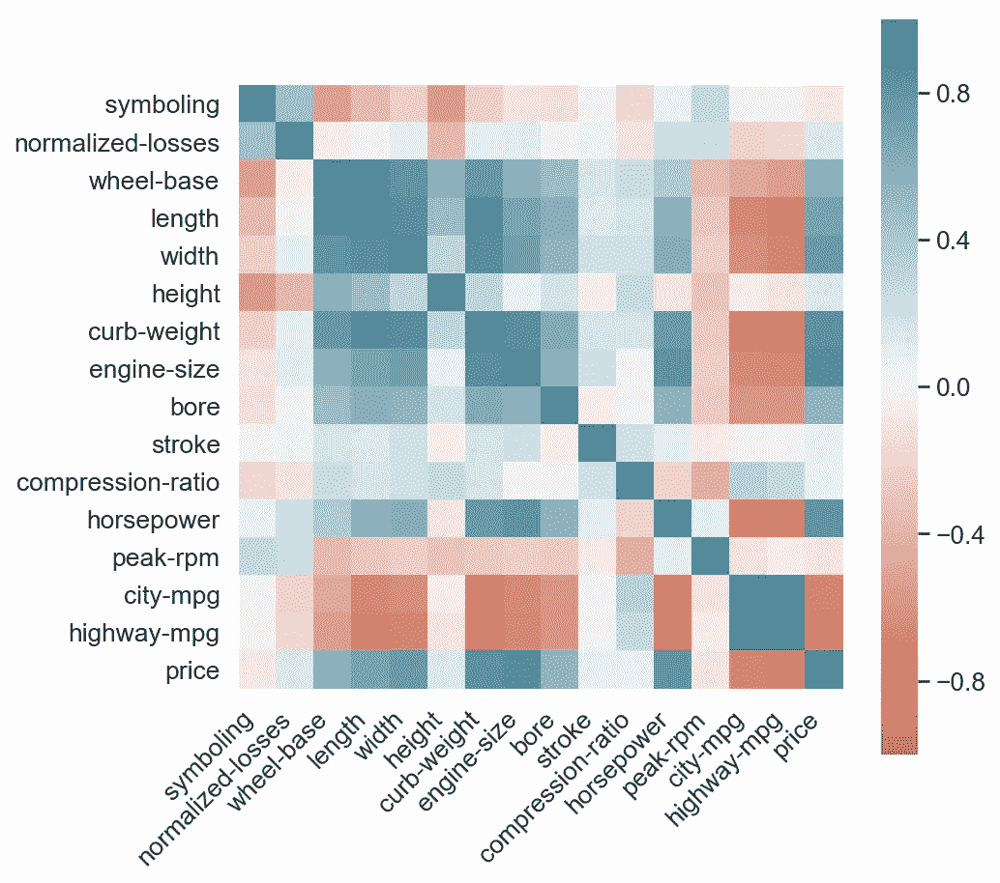

太好了！绿色代表积极，红色代表消极。颜色越强，相关幅度越大。现在看上面的图表，思考以下问题:

*   当你看图表时，你的眼睛首先跳到哪里？
*   最强和最弱的相关对是什么(除了主对角线)？
*   与*价格*最相关的三个变量是什么？

如果你和大多数人一样，你会发现很难将色阶和数字对应起来，反之亦然。

区分积极和消极很容易，区分 0 和 1 也很容易。但是第二个问题呢？找到最高的负相关性和正相关性意味着找到最强的红色和绿色。为此，我需要仔细扫描整个网格。试着再回答一遍，注意你的眼睛是如何在剧情中跳跃的，有时还会去看图例。

现在考虑下面的情节:

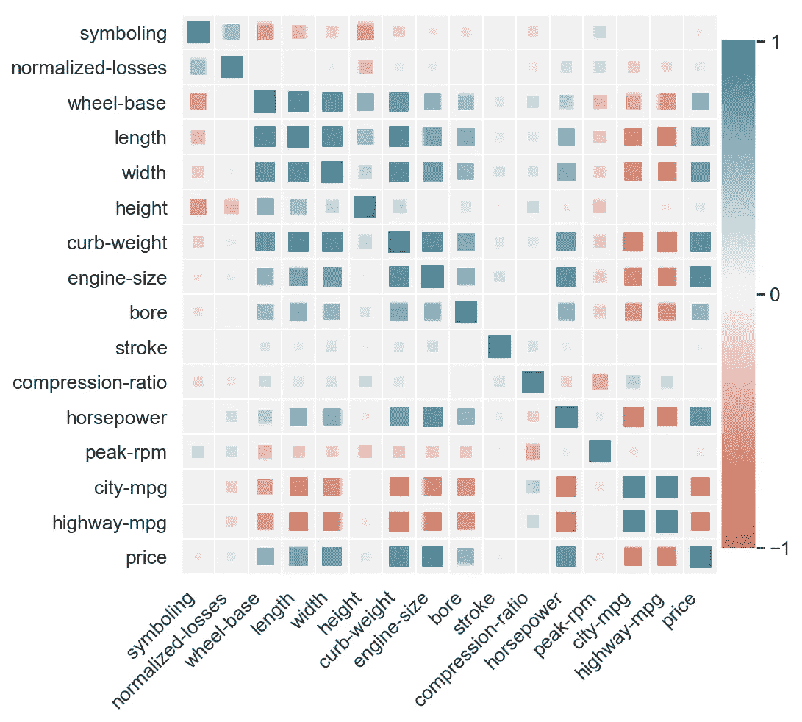

除了颜色，我们还在热图中添加了尺寸参数。每个方块的大小对应于它所代表的相关性的大小，也就是说

***(C1，c2) ~ abs(corr(c1，c2))***

现在试着用后一个情节来回答问题。注意弱相关性是如何在视觉上消失的，你的眼睛会立即被吸引到高相关性的区域。还要注意，现在比较负值和正值(浅红色和浅绿色)更容易了，我们还可以比较相距更远的值。

如果我们在绘制数量级，将它们与代表物体的大小联系起来比与它的颜色联系起来要自然得多。这就是为什么在条形图上你会用高度来显示度量，用颜色来显示类别，而不是相反。

# 离散联合分布

让我们看看数据集中的汽车是如何根据马力和传动系统布局分布的。也就是说，我们希望将下表可视化

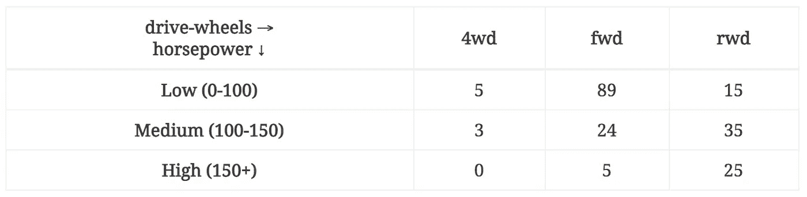

考虑以下两种方法

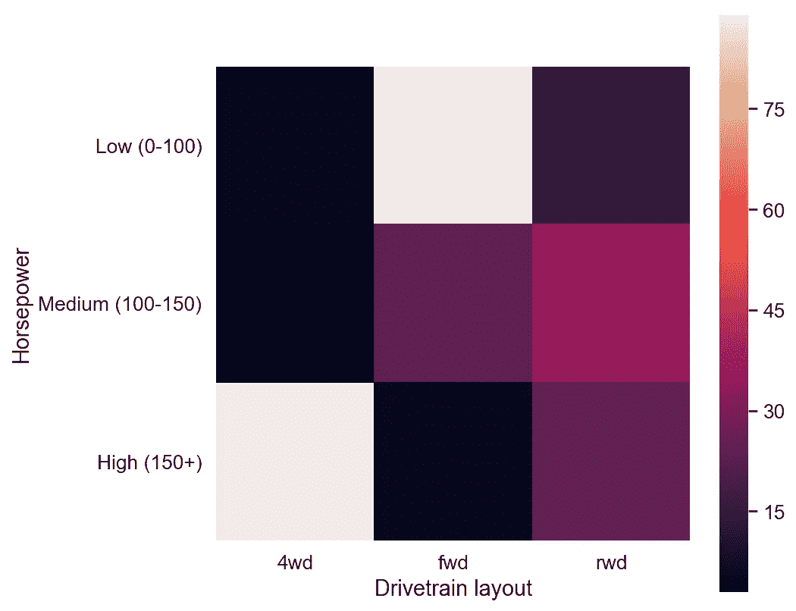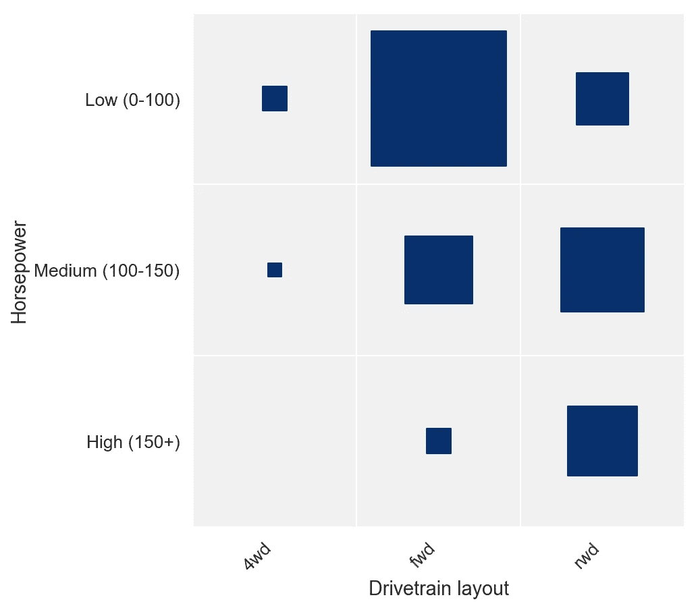

在第二个版本中，我们使用正方形大小来显示计数，这使得很容易确定哪个组是最大/最小的。它也给出了一些关于边缘分布的直觉，完全不需要参考颜色图例。

# 太好了。那么我是如何制作这些情节的呢？

为了制作一个常规的热图，我们简单地使用了 Seaborn *热图*函数，并添加了一些额外的样式。

对于第二种，使用 Matplotlib 或 Seaborn 没有简单的方法。我们可以使用 biokit 的 [*corrplot* ，但是它只对相关性有帮助，对二维分布不是很有用。](https://nbviewer.jupyter.org/github/biokit/biokit/blob/master/notebooks/viz/corrplot.ipynb)

在 Matplotlib 中，构建一个健壮的参数化函数来制作带有大小标记的热图是一个很好的练习，所以我将一步一步地向您展示如何做。

我们首先使用一个简单的散点图，用正方形作为标记。然后，我们将修复一些问题，添加颜色和大小作为参数，使其对各种类型的输入更加通用和健壮，最后制作一个包装函数 *corrplot* ，它接受 *DataFrame.corr* 方法的结果并绘制一个相关矩阵，为更通用的 *heatmap* 函数提供所有必要的参数。

# 这只是一个散点图

如果我们想在由两个分类轴组成的网格上绘制元素，我们可以使用散点图。

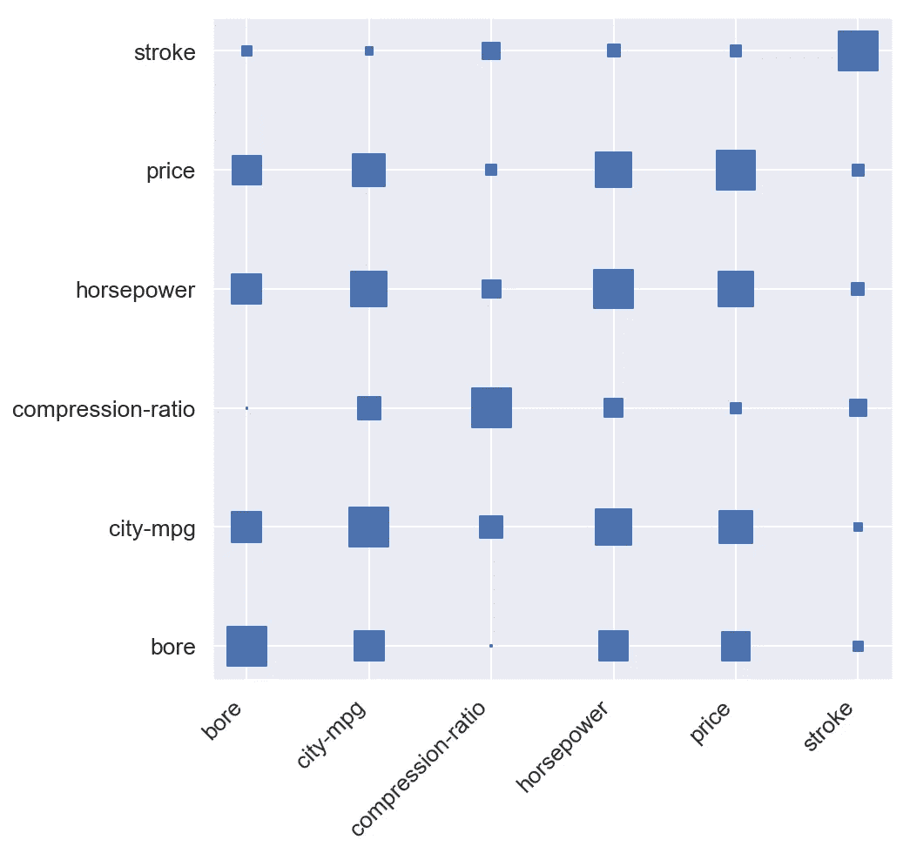

看来我们有所发现了。但我说这只是一个散点图，在前面的代码片段中发生了很多事情。

由于散点图要求 *x* 和 *y* 是数字数组，我们需要将列名映射到数字。由于我们希望轴刻度显示列名而不是那些数字，我们需要设置自定义的*刻度*和*刻度标签*。最后是加载数据集的代码，选择列的子集，计算所有的相关性，*融化*数据框(与创建数据透视表相反)并将其列提供给我们的*热图*函数。

你注意到我们的正方形被放置在网格线交叉的地方，而不是在它们的单元格中居中。为了将方块移动到单元格中心，我们实际上将移动网格。为了移动网格，我们实际上将关闭主要的网格线，并将次要的网格线设置为正好在轴刻度之间。

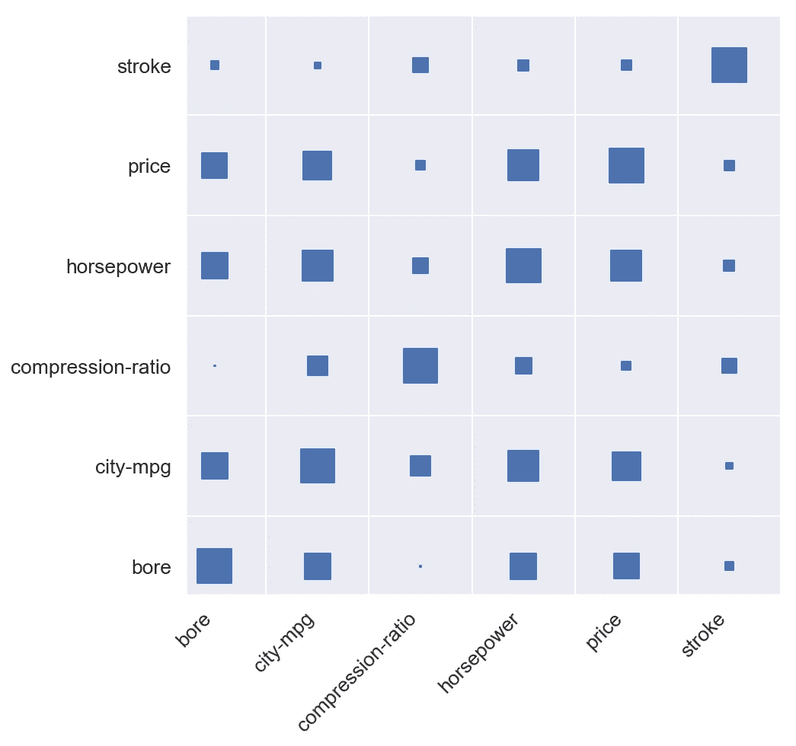

那更好。但是现在左侧和底部看起来被裁剪了。这是因为我们的轴下限被设置为 0。我们将通过将两个轴的下限设置为-0.5 来解决这个问题。记住，我们的点是以整数坐标显示的，所以网格线是 0.5 坐标。

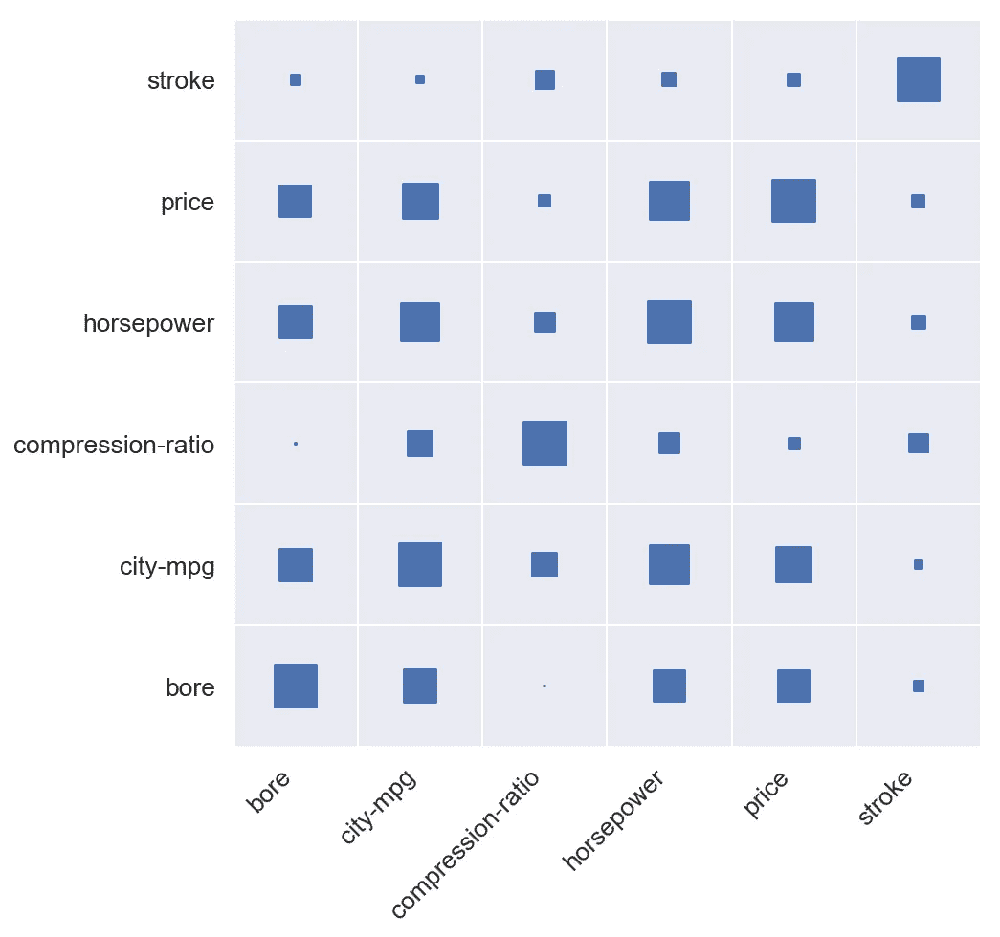

# 给它点颜色

现在有趣的部分来了。我们需要将相关系数的可能值范围 *[-1，1]* 映射到调色板。我们将使用*发散*调色板，从-1 的红色一直到 1 的绿色。看着[Seaborn](https://seaborn.pydata.org/tutorial/color_palettes.html)[color](https://seaborn.pydata.org/tutorial/color_palettes.html#diverging-color-palettes)[palettes](https://seaborn.pydata.org/tutorial/color_palettes.html)，似乎我们会做得很好

```
sns.palplot(sns.diverging_palette(220, 20, n=7))
```


但是，让我们首先翻转颜色的顺序，通过在红色和绿色之间添加更多的步骤使其更加平滑:

```
palette = sns.diverging_palette(20, 220, n=256)
```


Seaborn 调色板只是颜色组件的数组，因此为了将相关值映射到适当的颜色，我们需要最终将其映射到调色板数组中的索引。就是一个区间到另一个区间的简单映射:[-1，1]**→**【0，1】**→**(0，255)。更准确地说，这是该映射将采取的一系列步骤:

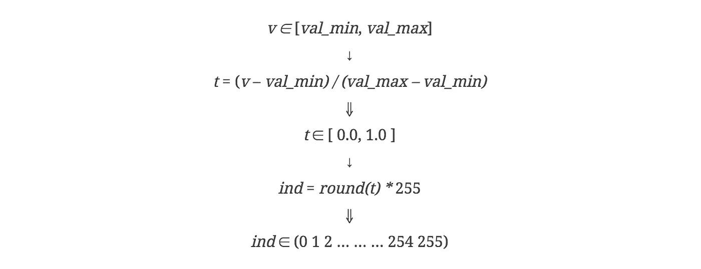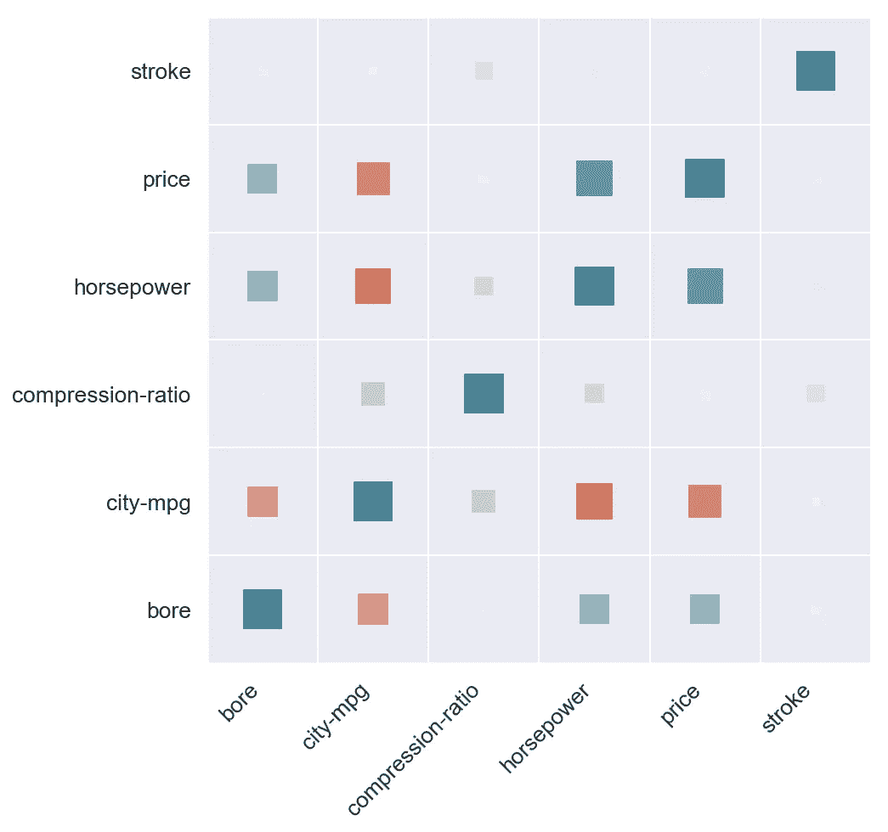

正是我们想要的。现在让我们在图表的右侧添加一个颜色条。我们将使用 GridSpec 建立一个 1 行和 n 列的绘图网格。然后，我们将使用该图最右边的列来显示颜色条，其余的列来显示热图。

有多种方法来显示一个颜色条，这里我们将使用一个非常密集的条形图来欺骗我们的眼睛。我们将绘制 *n_colors* 水平条，每一条都用调色板中各自的颜色来着色。

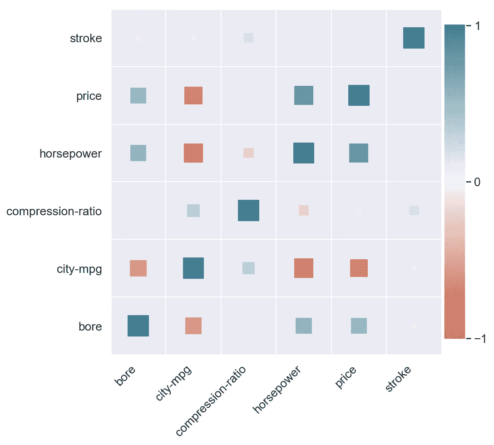

我们有自己的颜色条。

我们快完成了。现在，我们应该翻转垂直轴，这样我们就可以在主对角线上显示每个变量与其自身的相关性，使正方形稍微大一点，并使背景稍微亮一点，这样 0 附近的值就更容易看到。

但是让我们首先使整个代码更有用。

# 更多参数！

如果我们能让函数不仅仅接受一个相关矩阵，那就太好了。为此，我们将进行以下更改:

*   能够将 *color_min，color_max* 和 *size_min，size_max* 作为参数传递，以便我们可以将不同于[-1，1]的范围映射到颜色和大小。这将使我们能够在相关性之外使用热图
*   如果没有指定调色板，使用连续调色板；如果没有提供*颜色*矢量，使用单一颜色
*   如果没有提供*大小*向量，则使用恒定大小。避免将最小值映射到 0 大小。
*   使 *x* 和 *y* 成为唯一必需的参数，并将 *size、color、size_scale、size_range、color_range、palette、marker* 作为 kwargs 传递。为每个参数提供合理的默认值
*   使用列表理解代替 pandas *应用*和 *map* 方法，这样我们可以传递任何类型的数组作为 *x，y，color，size* 而不仅仅是 *pandas。系列*
*   将任何其他 kwargs 传递给 pyplot.scatterplot 函数
*   创建一个包装函数 *corrplot* ，它接受一个 *corr()* dataframe，*熔化*它，调用带有红绿发散调色板的*热图*，并将大小/颜色最小-最大值设置为[-1，1]

这有相当多的样板文件要一步一步地介绍，所以[下面是](https://github.com/drazenz/heatmap/blob/master/heatmap.py)完成后的样子。也可以在[这个 Kaggle 内核中查看。](https://www.kaggle.com/drazen/heatmap-with-sized-markers)

# 最后

现在我们已经有了 *corrplot* 和 *heatmap* 函数，为了创建大小为正方形的关联图，就像本文开头的那样，我们只需做以下事情:

为了好玩，让我们制作一个图表，显示发动机功率在我们的数据集中的汽车品牌之间是如何分布的:

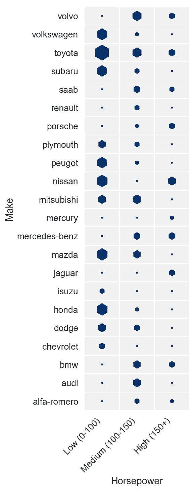

这就结束了关于改进热图可视化的这个简单想法的故事。

**好奇更多？**

有意见或问题吗？我在 [@drazenxyz](https://twitter.com/drazenxyz) 发关于数据科学和构建软件产品的推文，所以请关注我，在那里见。

我还在 Blogboard Journal 上总结了这个行业的经验，你可以在那里找到一些文章，比如《营销优化的数据科学》Airbnb、Lyft、Doordash 的案例研究: