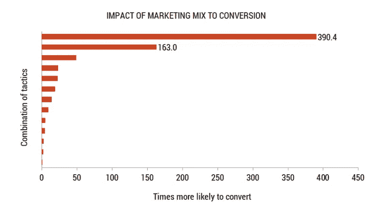
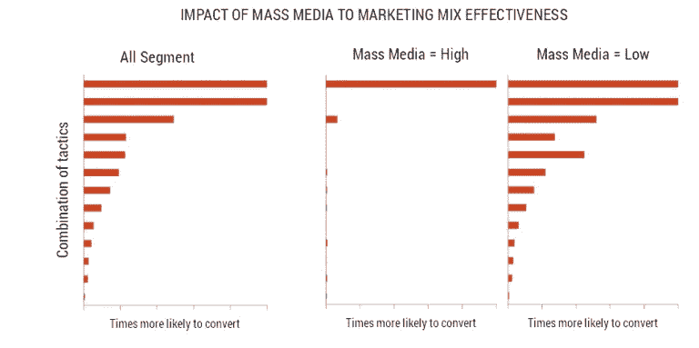
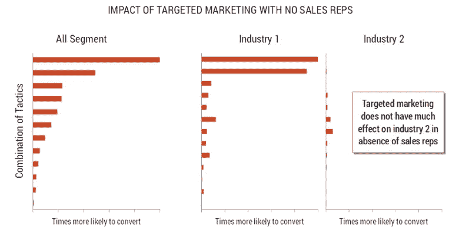

# 更好的目标营销:超越明显的营销组合模式

> 原文：<https://towardsdatascience.com/better-target-marketing-going-beyond-the-obvious-with-marketing-mix-models-140d70f6844c?source=collection_archive---------29----------------------->

## [现实世界中的数据科学](https://medium.com/towards-data-science/data-science-in-the-real-world/home)

## 数据科学如何创造更精确的跨渠道营销

Photo by [Anastase Maragos](https://unsplash.com/@visualsbyroyalz?utm_source=medium&utm_medium=referral) on [Unsplash](https://unsplash.com?utm_source=medium&utm_medium=referral)

我最近开始和一个新客户合作。他们在营销工作中非常努力地进行测试和学习。他们积累了许多经验教训，可以分享。

其中一个教训是，数字广告放大了他们的无地址直邮广告(即地理定位直邮广告)的结果。

*【关于直邮和数字之间的共生关系，已经有很多研究。例如，* [*《加拿大邮报》发表了一项研究*](https://www.canadapost.ca/web/en/blogs/business/details.page?article=2017/01/12/the_brain_doesnt_li&cattype=business&cat=directmail) *显示，先直接邮寄，再进行广告前宣传，可以提高 3%的积极性。尽管这种提升听起来很小，但它确实推动了行为上有意义的变化。】*

# 使用数据科学超越表面现象

基于这一认识，他们的分析团队建议市场营销应该始终将他们的无地址邮件活动与数字广告结合起来。虽然这个结论似乎合乎逻辑，但它只是触及了更丰富洞察力的表面。

## 如果营销人员提出正确的问题，数据科学可以帮助他们得出更明智的结论。

我一直记得我从超级鼓舞人心的莱斯利·厄姆那里学到的一个技巧——5 个“为什么”。她告诉我们要找到新的想法，当有人回答一个问题时，要问 5 次“为什么”。它挖掘了看似显而易见的东西。每当我做分析的时候，我都是这么做的。

因此，如果我们知道数字广告放大了地理定位邮件的结果，下一个为什么可以探索宇宙中的细分市场——特定的地理区域在那里工作得更好还是更差？广告的时机有影响吗？重定目标是否能进一步提升放大效果？

但是怎么做呢？下面是我如何使用营销组合分析来帮助客户回答这些为什么。

# 营销组合分析的一个例子——数据科学如何使定位更有效

## 背景:我们为什么要做这个分析？

这个客户不直接向消费者销售。他们依靠其他专业人士向个人消费者销售。在大多数企业对企业(B2B)环境中，他们有销售代表定期与这些专业人士会面。销售代表在销售/营销组合中起着核心作用。营销人员用一些常见的方式来补充这些销售代表——早餐会、网络研讨会、电子邮件、杂志广告等等。

这种销售模式有 3 个潜在问题:

*   让销售代表走遍全国与每个专业人员会面是非常昂贵的。
*   随着我们忙碌的生活，安排销售会议变得越来越困难。
*   营销部门分析了每种策略的投资回报率，但希望他们的努力更有针对性。

与我的新客户相似，他们知道不同的营销活动可以放大更昂贵的销售代表活动的结果。但是，他们不只是在这些活动上分层，而是希望更聪明地知道他们想在哪些活动上分层。这就是我和我的团队进行营销组合分析的地方。

## 过程:我们做了什么分析？

营销组合分析是在 r。

我们假设销售漏斗不同阶段的专业人士对营销和销售活动的反应可能不同。例如，新进入该行业的人可能需要更多的帮助，而熟悉产品的人可能需要更多的自助服务选项。所以我们为每个阶段建立了一个独立的回归模型。

我们研究了过去一年的营销活动如何影响这些专业人士的行为。我们感兴趣的是将合适的专业人员与最有效的营销活动组合配对。

这个模型后来变成了一个“计算器”。媒体团队用它来确定针对特定群体的活动是否值得投资。

虽然我不能透露所有的秘密，但我将分享我们从分析中获得的一些见解以及它们是如何有用的。

## 洞察力#1:一些策略的组合可以产生指数效应

模型的主要输出是专业人员根据营销和销售活动采取行动的可能性。这是我们编制的图表之一。它显示了某一部分专业人士“转换”的可能性，即从销售漏斗的一个阶段进入下一个阶段，通过针对他们的营销策略和销售活动的组合进行分组。这都是与没有针对他们的活动的基础相比较的。

对我们来说，看到前两个小节的巨大差异是令人惊讶的。顶部转换策略组合和第二个之间的区别是一组电子邮件。换句话说，如果我们针对一位专业人士，采用不包括电子邮件在内的多种策略，他们转向下一阶段的可能性是普通人的 163 倍。如果我们也通过电子邮件系列瞄准这些专业人士，他们转化的可能性会增加 390 倍！然而，电子邮件本身是图表底部的一小部分因素之一。组合的力量！

## 洞察力#2:无针对性的策略会对针对性产生很大的影响

数据营销人员必须面对的一个现实是，存在无法锁定的大众影响力。例如，在 B2B 中，我们可能会投放非个性化或无针对性的杂志广告。在 B2C(企业对消费者)中，我们可能会有电视、广播、广告牌等。不是一对一的。

当我们看大众媒体的影响时，我们可以看到，接触大众媒体较多的专业人士较少受到针对性战术的影响。这意味着，如果我们知道我们在某些地区或行业投放了大量的大众媒体，我们可以减少更多的个性化营销策略，尤其是成本更高的营销策略，如早餐会。

## 见解 3:某些行业不能便宜行事

我们了解到的另一件事是，某些行业对销售代表以外的任何人都不敏感。这意味着优先考虑这些行业的专业销售代表会产生更大的影响。同样，这意味着我们可以通过优先考虑更具可扩展性和更便宜的营销策略来节省资金，这些策略适用于接受目标营销的行业中的专业人士。

我希望这能启发你进一步思考，当数据分析突破了最明显的观察界限时，它是如何对营销人员更有帮助的。下次当你查看分析结果时，问 5 个“为什么”,看看你是否能找到一个更聪明的问题来问你的数据模型。