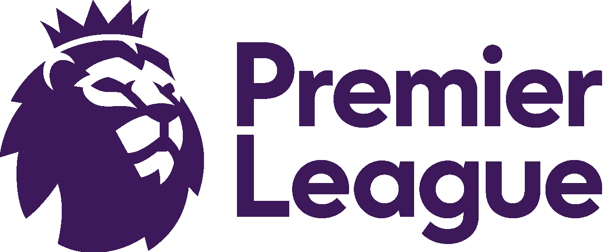
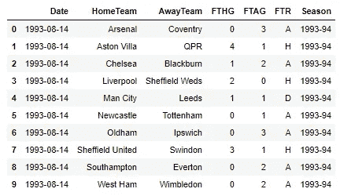
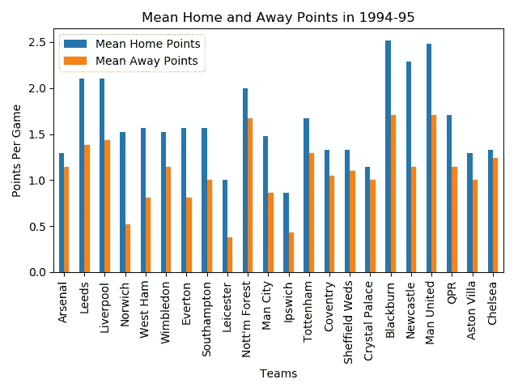
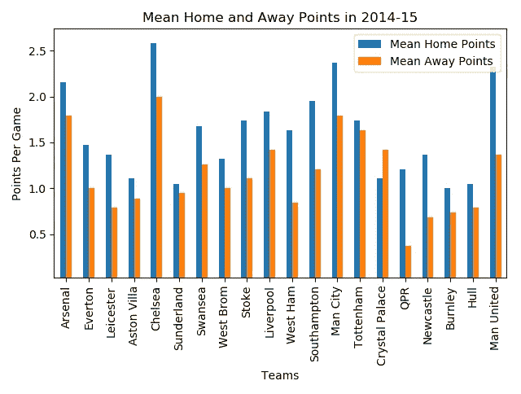
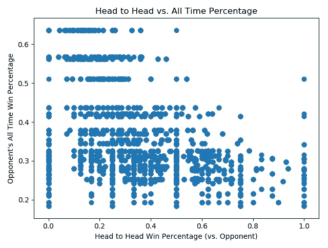
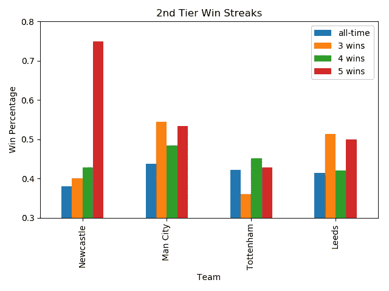

# 押注英格兰超级联赛

> 原文：<https://towardsdatascience.com/betting-on-the-english-premier-league-making-money-with-machine-learning-fb6938760c64?source=collection_archive---------7----------------------->

## 用机器学习赚钱

足球是世界上最受欢迎的运动。全球数以百万计的人收看电视，为分数、结果和冠军进行庆祝、痛苦和打赌。专家认为，全世界的体育博彩产业价值高达 1 万亿美元。由于足球比赛的结果关系到如此多的金钱，能够利用过去的数据准确预测一支球队的结果是一个诱人的前景。利用世界上最赚钱的联赛——英格兰超级联赛过去的结果，让我们看看我们是否可以建立一个模型，正确预测足够的结果，以击败博彩公司，并在整个博彩季节中记录利润。

具体来说，这意味着什么？

1.  找到、清理和组织一个(或三个)数据集。
2.  使用个人领域知识产生几个预测特征。
3.  训练、调整和测试高精度分类器。
4.  使用最佳模型，使用真实赔率对一个赛季的足球比赛进行下注。
5.  利润？也许，我们会看到！

# **1。查找数据和清理**

首先，我们需要找到一些数据。粗略的谷歌搜索会导向 kaggle.com，一个充满了(相对)干净数据集的美妙的数据科学资源。由山姆·劳森编制的 1993-2018 年 EPL 结果似乎正是我们所需要的。英超历史上的每一场比赛都记录了主队、客场、全职进球(主客场)、结果和赛季，我们应该能够找出一些对预测结果有用的特征。我们将下载 CSV 文件，并使用 pandas 的 read_csv 函数将数据加载到 pandas 数据帧中。结果如下:

EPL Results 1993–2018 — First 10 rows. Date has been pushed to a datetime object for ease of indexing.

CSV 文件可以很好地加载到数据帧中，并且没有丢失值。然而，因为我们感兴趣的是能够预测某个*特定的*队是否会赢得、输掉或打平下一场比赛(而不仅仅是比赛的结果)，我们需要改变数据帧的格式。具体来说，我们需要创建四个新列，一个“团队”列包含我们有兴趣下注的团队，一个“对手”列包含他们正在比赛的团队，“主场/客场”列表示“团队”列中的团队正在比赛，一个“积分”列表示感兴趣的团队是赢了、输了还是平了(这将是我们的目标变量)。要做到这一点，必须复制数据帧并将两者按行连接在一起。每个游戏将被表示两次，但是“队”和“对手”列中的值将被颠倒。

事实证明，填写“团队”和“对手”栏相当简单。在原始数据帧中，我们将“主场球队”列中的所有球队设置为新的“球队”列，将“客场球队”列中的所有球队设置为新的“对手”列。对复制的数据帧进行相反的操作，瞧！每个匹配现在被表示两次。

填写“主场/客场”一栏也相对简单。通过使用布尔索引，我们可以提取在主场比赛的球队的每个实例，并使用它来更新“HomeAway”列。计算“结果”列稍微复杂一些，但是通过一个循环和一些链式条件逻辑，我们可以完成它。如果您对实现这一点所需的代码感兴趣，请随时查看我的 [GitHub](https://github.com/nhcamp/EPL-Betting) 获取完整的脚本！

# **2。产生预测特征**

## 主场还是客场

潜在预测兴趣的第一个特征已经被创建。一个球队打主场还是客场，应该对一个球队的成绩有影响。这几乎不需要太多的领域知识，因为这是所有团队运动中重复的格言。在主场比赛有一种不言而喻的优势，对于最好的球队来说，这种优势尤其明显。然而，为了证实我们的直觉，让我们看看球队在两个不同的赛季中是否在主场比在客场获得更多的积分。为此，我们将迭代一个球队列表，提取该赛季所有主客场比赛中收集的平均分数，并绘制每个球队两个平均分数的直方图。

上面的情节不言自明。两个赛季的每支球队在主场的得分都比客场多。因此，主场或客场似乎将是一个预测特征。

## 面对面获胜百分比

我想到的第二个预测功能是与每个对手的正面交锋的胜率。利用个人领域的知识，我意识到在英超联赛中有几场一边倒的竞争。比如维根竞技和曼联，英超交手过 16 次。曼联以 50 比 5 的总比分赢得了其中的 15 场比赛。这是曼联 94%的直接胜率。如果他们再次比赛，我认为维根会输。由于抽签的原因，计算这个百分比有点复杂。仅仅因为曼联有 94%的胜率，并不一定意味着维冈有 6%的胜率(尽管在这种情况下他们实际上有)。因此，我们必须单独计算每支球队，而不仅仅是一系列的对等比赛。

为了构造这个特性，我们必须用一个外部和一个内部 for 循环遍历两个列表。外部循环将包括每个团队，内部循环将包括每个对手。在内部循环的每一次完整迭代中构建一个从头到尾成功百分比的字典允许我们将字典映射到连接的数据帧中的一个新列。同样，如果你对代码感兴趣，请查看我的 [GitHub](https://github.com/nhcamp/EPL-Betting) ！

## 空前的胜率

直觉上，这似乎也是预测比赛的一个有用的特性。特别是在加强顶级球队和只参加过几次英超联赛的球队之间的差距方面。与上面的方式非常相似，我们将不得不迭代所有团队的列表，并构建一个包含每个团队的历史胜率的字典。将此映射到“对手”列，我们将得到一个新列，其中显示了我们感兴趣的团队所对阵的每个对手的历史胜率。

鉴于空前胜率和直接胜率之间的相似性，我们可能有理由担心两者之间的共线性。如果这两个特征高度相关，我们可以丢弃其中一个特征，而不会丢失任何由我们的模型解释的方差。此外，越简单越好！为了检查这两个变量是否有高度的相关性，我们将把它们彼此对照，并检查 r 的值。

下面的情节很直观。当球队与胜率较低的对手比赛时，他们的胜率会上升。然而，这并不是一个完美的相关性。当我们忽略四支历史胜率超过 50%的球队时，分数相差很大。因此，在这种情况下，我们不应该担心共线性，并且可以放心地在我们的模型中包含这两个特性。

R value of -0.51

## 连胜

这是一个旨在将心态和团队信心融入模型的特性。我们可能会认为，当一支球队赢得一场比赛时，他们赢得下一场比赛的几率会增加，因为这支球队处于“良好的状态”。当然，这也可能是纯粹的观察或确认偏差。特别是，这可能与一直被[否定的](https://www.nbastuffer.com/analytics101/the-hot-hand-myth/)NBA 热手假说有关。实现这个特性应该不会太难。

与上面的方式非常相似，我们必须遍历所有球队的列表，取出他们所有比赛的一部分，更新“连胜”列，并将所有更新的部分连接在一起。使用内部 for 循环和 dataframe 方法。iterrows()将允许我们初始化 streak 计数器，检查我们团队的结果，将该值附加到一个列表中，并更新计数器。在遍历了切片中的每一行之后，我们将得到一个列表，其中包含我们感兴趣的团队的连胜记录(如果团队输了或打平，则重置为 0)。该列表可以直接转换为“条纹”列，因为它具有相同的长度。

让我们也做一个快速检查，看看这个特性是否有任何数量的预测强度。在下面的图中，我观察了 8 支球队以及他们在连胜期间和所有时间里各自的胜率。第一张图显示了英超历史上最成功的 4 支球队，第二张图显示了 4 支不太成功的球队。我们注意到的是连胜的次数可能对胜率没有任何影响。也就是说，一个球队在 3 连胜之后不会比 5 连胜之后赢得更多的比赛。然而，与他们的历史百分比相比，大多数球队在连胜期间的胜率更高。这一特征看起来具有一定的预测性。

## 去年对手的联赛成绩

在 38 场比赛(1 个英超赛季)的过程中，每支球队在联赛中的成绩应该能够很好地表明他们的实力。这可能会在几个赛季中发生显著变化，但不太可能在一个赛季到下一个赛季之间发生很大变化。因此，如果我们有一个团队去年完成的信息，我们可能期望从信息中获得一些预测能力。不幸的是，我们的原始数据源没有关于联赛排名的信息，所以我们必须去搜索更多的数据。用户再次提交 Kaggle 进行救援，[这是一个包含我们需要的所有信息的数据集。](https://www.kaggle.com/birdogd/english-football-premier-league-tables-19682019)

由于符号和季节可用性方面的一些差异，从这个来源获取信息并将其加入到我们模型的功能中涉及到相当多的数据管理。团队名称不匹配，年份注释不同等等。幸运的是，Python 内置的字符串模块使得这些改变非常简单。如果你对发生的所有操作感兴趣，请查看 [GitHub](https://github.com/nhcamp/EPL-Betting) 。

联盟排名数据还包括其他潜在有用的信息，如每场比赛的进球，每场比赛的射门和其他统计数据。为了提高模型性能，这些可以作为特征添加。现在，我们将它们放在一边，开始建模！

# **3。训练/测试/调整高精度分类器**

## **多项逻辑回归**

虽然不总是像一些更新更先进的监督学习算法那样有趣，但回归模型仍然有很多优点。在将比赛分类为多个离散目标之一(赢、平或输)的情况下，逻辑回归是一个很好的起点。至少，它会给我们一个基线来与更复杂的模型进行比较。

因为我们的用例试图预测一个赛季的比赛，测试和训练集将被手动分配。从 1994-1995 年到 2015-16 年，每一季都会有训练集。测试集将是一个单一的赛季，即 2016-17 英超赛季。同样，模型中的 5 个特征是头对头胜率(对给定对手)、主场或客场、对手去年的联赛成绩、对手的历史胜率和连胜。目标是一个有三类的变量，赢、输或平。

将模型拟合到训练集，并对优化的 C (=0.1)运行网格搜索交叉验证，得到 0.595 的模型分数。因为这不是很清楚，我们可以查看分类报告进行更深入的分析。

Classification Report for Multinomial Logistic Regression

正如我们在上面的报告中看到的，赢和输有相当的精确度和回忆，但平局似乎更难预测。当考虑这个项目的总体目标时，我们必须考虑什么样的分类元素是最重要的。因为我们希望使用我们的模型来下注，所以我们希望相对确定模型预测的结果是正确的。因此，为了实现最佳性能，我们需要针对高精度进行优化，并且必然会忘记召回。

也就是说，我们的第一个模型精度相当差。或许，如果我们在数量上下注，我们就可以在输赢上赚钱，但精确度的提高会有很大帮助。因此，随机森林分类器似乎是一个很好的下一步。然而，在不涉及太多细节的情况下，随机森林分类器的表现比逻辑回归模型差。对于增加的复杂性来说，这是一个糟糕的折衷。还尝试了具有类似结果的支持向量机。由于它的表现最好，我们将坚持使用逻辑回归，看看我们是否能以另一种方式提高精度。

## 二元逻辑回归

回顾来自多项逻辑回归模型的分类报告，我们注意到抽奖相对难以预测。如果我们可以将两个类别合并为一个，改变模型来解决二分类问题，并提高精度，我们就可以增加我们的潜在利润。将平局类别合并为输或赢是很简单的，我们只需要决定我们最终想要赌哪个结果。相当随意地，我们将选择合并损失和平局，留下胜利作为单一类别(我们将打赌的结果)。使用上面详述的相同程序，训练和评估新模型导致下面的分类报告。

Classification report for two class logistic regression

正如所料，现在无用的损失/平局类别具有相当高的精确度和召回率。对我们的用例来说，更重要的是，预测获胜的算法精度已经提高到 0.67。这代表了与具有多项式分类的原始模型中的 0.60 相比的相当大的改进。这种精度的提高是值得的，代价是复杂性的损失。如果我们的模型预测一个队将赢得一场比赛是正确的(几乎)7/10 倍，那么作为一个投注者，我们可以只赌赢，并保证在数量上获利。再说一遍，回忆并不重要。当我们的模型预测成功时，我们希望相对确信它预测正确。

由于预测胜率的模型精度为 0.67，我们可以谨慎乐观地认为，当我们对整个赛季的游戏价值下注时，我们会赚钱。让我们看看我们是否能把这种信心直接带到银行！

# 4.模拟赌注

## 获得赔率

首先，我们需要博彩公司为我们的测试集(2016/17 英超赛季)中的每场比赛提供的赔率。谢天谢地，football-data.co.uk 为我们提供了保障。他们从数百个不同的来源收集和维护每个英超赛季每场比赛的投注赔率的大规模数据集。这是一个令人难以置信的资源，是专门为练习和通知投注策略。完美。

理想情况下，我们会为我们的模型预测会赢的每场比赛找到最佳的个人赔率，并只向该公司下注。然而，由于数据集中列出了如此多不同的公司和赔率，这是一项非常复杂的任务。相反，我们将使用 Bet365.com 网站提供的赔率，该网站是世界领先的在线赌博公司之一。在不涉及太多细节的情况下，我们将拿出 Bet365 以十进制格式提供的英超每支球队的全职比赛结果的赔率。每次我们的模型预测一个给定的团队获胜，我们将模拟一个 100 美元的赌注。如果我们的模型预测失败/平局，我们将放弃下注。

## 利润或损失

为了计算正确预测和下注情况下的利润，我们采用特定结果的十进制赔率，乘以我们的 100 美元赌注，然后减去纯利润的原始赌注。例如，如果主队获胜的给定赔率为 1.65，并且我们的模型正确预测了结果，我们将获得 165 美元。其中 100 美元是原始赌注，因此我们在这个赌注上的利润是 65 美元。如果我们赌输了(也就是说我们的模型预测主队会赢，但是他们没有赢)，我们就输了 100 美元。在这种投注策略和利润评估下，让我们对 2016/17 赛季英超联赛的所有 20 支球队进行模拟投注。

我们总共下了 191 次 100 美元的赌注。这是一笔 19100 美元的财政支出。没有小的变化。模特表现如何？我们总共拿走了 20，124 美元。这是 1024 美元的纯利润。在完成一个英超赛季的 9 个月里，我们的投资产生了 5%的回报！请参见下表，了解按团队划分的下注和盈利/亏损明细。

Total bets placed and profit/loss recorded for every team in the EPL 2016/17

# 5.结论(和利润？)

所以我们的模型导致了 5%的模拟投资回报率！这是否意味着我们将采取我们的模式，去改变体育赌博的世界？大概不会。预测足球时，不可预测性实在太多了。也许 2016/17 赛季是有记录以来最容易预测的赛季之一？或者也许随着更多的电视收入流入这项运动，过去的结果在预测未来的比赛时将不再有用。然而，有了足够的资本投入，这种赌博策略和模式似乎会取得一些成功。

此外，进一步改善下注策略可能会带来更多收益。例如，在我们的模拟赛季中，我们在曼联身上下注接近 500 美元。领域知识告诉我们，曼联正处于历史的低谷，因此可能不会像历史预测的那样表现良好。就曼联而言，调整将他们的结果归类为胜利的概率阈值可以增加我们预测的精确度。

如果没有别的，这提供了一个有趣的案例研究，使用领域知识来构建一个相对简单和可解释的模型，该模型可以在一个狭窄定义的用例中表现很好。

如果您有任何问题或意见，请随时给我发消息；我很想听听！最后一次，检查 [GitHub](https://github.com/nhcamp/EPL-Betting) 如果你有兴趣阅读或重用我的任何代码。感谢阅读！